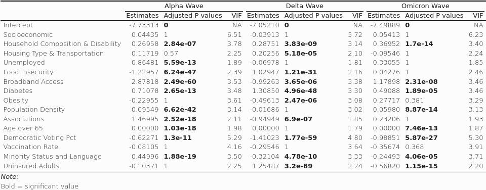
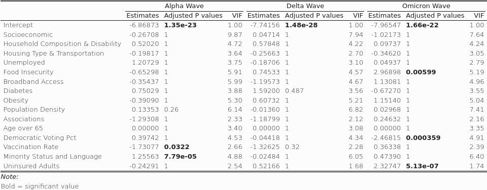
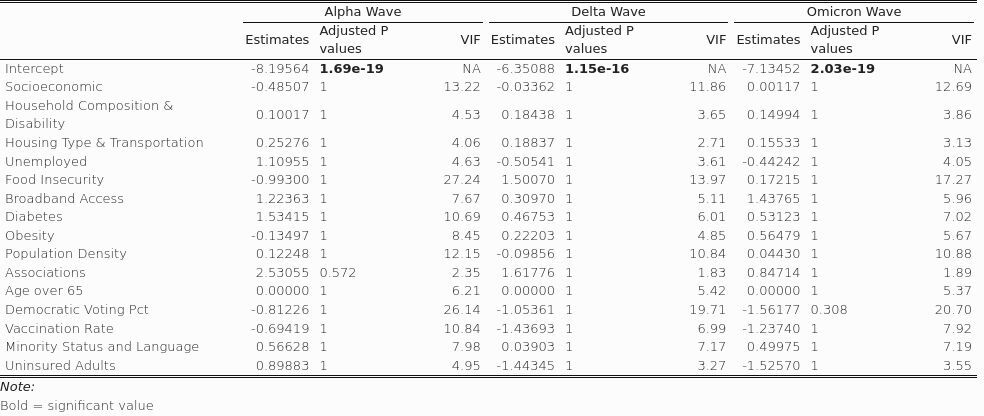
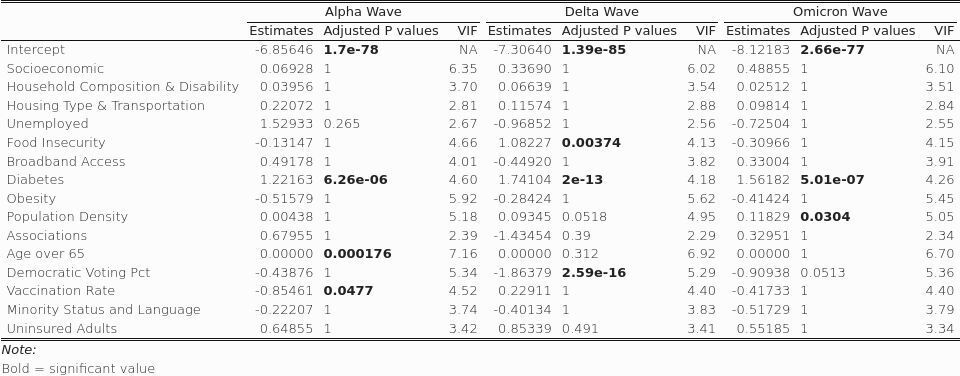
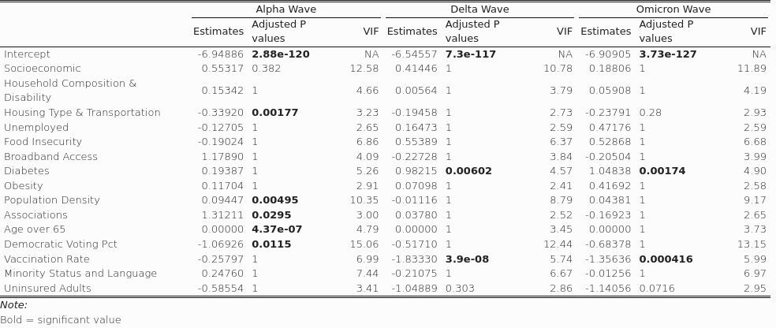
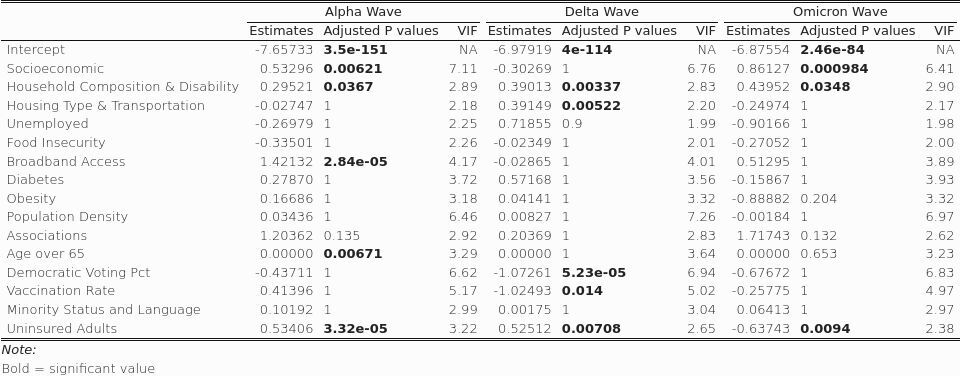
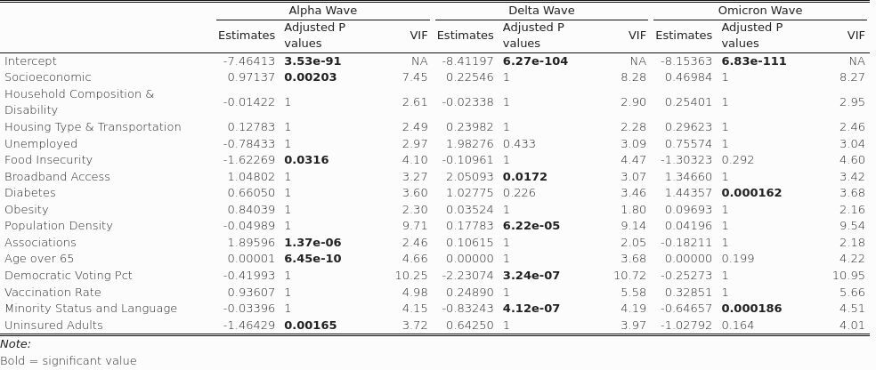
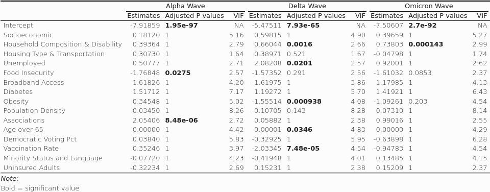
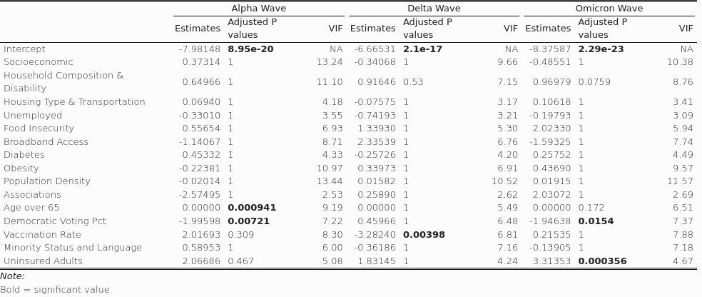
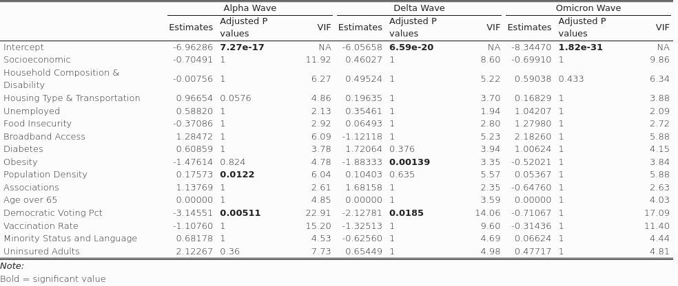

```{r setup, include=FALSE}
knitr::opts_chunk$set(echo = TRUE, fig.width=15, fig.height=8.5)
#knitr::opts_knit$set(root.dir = "/mnt/ceph/erichs/git/COVIDriskpaper/")  # with something else than `getwd()`
#knitr::opts_knit$set(root.dir = "/Users/erichseamon/Dropbox/Mac/Documents/GitHub/COVIDriskpaper/")
#Sys.setenv(CHROMOTE_CHROME = "/mnt/ceph/erichs/chrome-bin/chrome-linux64/chrome")
```
\newpage
# Appendix Overview

## Summary

Below are supplemental materials associated with the submitted manuscript.  

## Part 1: Study Area and Regionalization

Regionalization is based on United States(US) Health and Human Services (HHS) health regions.

* Region 1 and 2 (combined): NorthEast: Connecticut, Maine, Massachusetts, New Hampshire, Rhode Island, Vermont, New York and New Jersey
* Region 3: MidEast: Pennsylvania, West Virginia, Maryland, Delaware, Virginia and the District of Columbia
* Region 4: SouthEast: Florida, Georgia, South Carolina, and North Carolina, Alabama, Mississippi, Tennessee, and Kentucky
* Region 5: Midwest: Ohio, Indiana, Illinois, Michigan, Wisconsin, and Minnesota
* Region 6: MidSouth: Texas, Louisiana, Arkansas, and New Mexico, Oklahoma
* Region 7: Middle West: Iowa, Missouri, Nebraska, and Kansas
* Region 8: MidNorth: Montana, Wyoming, Utah, Colorado, North Dakota, and South Dakota
* Region 9: West: California, Nevada, and Arizona
* Region 10: Pacific Northwest: Idaho, Oregon, and Washington

## Part 2: Datasets and Modeling Framework

Part 2 of our analysis documents the datasets and modeling methodology employed as part of this effort.

## Part 3: Exploratory Data Analysis and Regression Modeling

Our regional analysis examines COVID-19 parameters for the entire United States, as well as for each of the nine (9) regions listed above.

* The first plot (1) shows fatality rates vs. logarithmic population density, categorized by voting ideology summarized by the 2020 Presidential Election.  100-75% vote for Biden = very liberal, 75-50% for Biden = moderately liberal, 100-75% for Trump = very conservative, and 75-50% for Trump = moderately conservative.  Each observation represents one county.

* The second plot (2) shows cumulative cases, adjusted for population, vs. cumulative deaths, adjusted for population, categorized by voting ideology - as noted above.

* The third (3) and fourth (4) plots show the relationship of the four ideology groupings across the specified region, over time - examining deaths for a rolling window, as well as cumulative deaths.  These plots provide a summary view of the change in ideological and regional associations with cases and deaths.

For each region, we have outputs for three quasi-Poisson models, with population adjusted deaths (by county) as the dependent variable, for each of the three time windows (alpha, delta, and omicron variants). In addition, we have standardized coefficients graphs that summarize the coefficient estimate for each variable, for each model.

\newpage

## Part 4: Spatial Autocorrelation

The second portion of this analysis evaluates the spatial autocorrelation of population adjusted county deaths, for all three time periods examined.

## Part 5: Geographically Weighted Random Forest (GWRF) Modeling

The third portion of this analysis attempts to model spatial variation for the entire United States, using geographically weighted random forest modeling (GWRF).  Our model incorporates the same independent variables that are used as part of our regionalized quasi-Poisson regression models.

Geographical Weighted Random Forest (GWRF) is a spatial analysis method using a local version of the Random Forest Regression Model. It allows for the investigation of spatial non-stationarity, and the relationship between a dependent and a set of independent variables. The latter is possible by fitting a sub-model for each observation in space, taking into account the neighboring observations. This technique adopts the idea of the Geographically Weighted Regression Kalogirou (2003). The main difference between a tradition (linear) GWR and GRF is that we can model non-stationarity coupled with a flexible non-linear model which is very hard to overfit due to its bootstrapping nature, thus relaxing the assumptions of traditional Gaussian statistics. Essentially, it was designed to bridge machine learning and geographical models within a spatially explicit predictive framework. Additionally, it is suited for datasets with numerous predictors, due to the robust nature of the random forest algorithm with regards to high dimensionality.

For this analysis, We generate GWRF localized model fits and feature importances (IncMSE).  The feature importance algorithmic process is:

1. Compute model MSE
2. For each variable in the model:
   a. Permute variable
   b. Calculate new model MSE according to variable permutation
   c. Take the difference between model MSE and new model MSE
3. Collect the results in a list

\newpage 

# Part 1: Study Area and Regionalization

For the initial portion of our analysis, we examine COVID-19 cases and deaths for the entire United States, as well as by U.S. Human Health Services (HHS) regions, as noted in Figure S1 below.  

## Figure S1: Study Area

<center>

{#id .class width=90%}  

</center>


```{r, echo=FALSE, results='hide',message=FALSE, warning=FALSE}
library(stringr)
library(dplyr)
library(lmerTest)
library(parallel)
library(doSNOW)
library(plyr)
library(ggplot2)
library(sjPlot)
library(RcppRoll)

options(timeout=200)

#This section loads covid data and creates the core data file that is used in the modeling analysis.


risk_model_latter <- function(date_entry, date_entry_latter) {

mc <- parallel::makeCluster(20, outfile="")
registerDoSNOW(mc)

unzip("./data/sevenday_combined_1.zip",exdir="./data/")
unzip("./data/sevenday_combined_2.zip",exdir="./data/")
combined_1 <- read.csv("./data/sevenday_combined_1.csv")
combined_2 <- read.csv("./data/sevenday_combined_2.csv")
combined <- rbind(combined_1, combined_2)

#combined <- read.csv("https://folders.hpc.uidaho.edu/index.php/s/9E5I1nbq4Tlrlyb/download")


#age65 and over
age65 <- read.csv("./data/age65_over.csv")
age65$FIPS <- str_pad(age65$FIPS, 5, pad = "0")

combined_refined <- combined[,c(5, 6, 7,23, 9,10,30)]
SVI_refined <- read.csv("./data/svi.csv")

#broadband
broadband <- read.csv("./data/broadband.csv")
broadband$FIPS <- str_pad(broadband$FIPS, 5, pad = "0")

#SVI_refined <- SVI_refined[,c(5,79,85,89,96)]
SVI_refined$FIPS <- str_pad(SVI_refined$FIPS, 5, pad = "0")


#unzip("./data/deaths_nationwide_cumulative.zip",exdir="./data/")
daily_deaths <- read.csv("./data/deaths_nationwide_cumulative.csv")

#daily_deaths <- read.csv("https://folders.hpc.uidaho.edu/index.php/s/SXhOfqn5ZypMKfz/download")

#daily_deaths <- daily_deaths[,c(3,4,5,6)]

colnames(combined_refined) <- c("population", "FIPS", "cuml.cases", "freq.trans", "new.cases", "daily_cases", "date")
colnames(daily_deaths) <- c("date", "FIPS", "deaths", "daily_deaths")
daily_deaths$FIPS <- str_pad(daily_deaths$FIPS, 5, pad = "0")
combined_refined$FIPS <- str_pad(combined_refined$FIPS, 5, pad = "0")


daily_combined <- merge(combined_refined, daily_deaths, by=c("FIPS", "date"))
daily_combined <- merge(daily_combined, SVI_refined, by="FIPS" )

new_voting <- read.csv("./data/voting_nationwide_liberal.csv")
new_voting$FIPS <- str_pad(new_voting$FIPS, 5, pad = "0")

density <- read.csv("./data/population_density.csv")
#density <- density[5:7]
#colnames(density) <- c("FIPS", "name", "density")
density$FIPS <- str_pad(density$FIPS, 5, pad = "0")

fulldata <- merge(daily_combined, new_voting, by="FIPS")

fulldata <- merge(fulldata, density, by="FIPS")

fulldata <- merge(fulldata, broadband, by="FIPS")


data <- subset(fulldata, date == date_entry)

data_latter <- subset(fulldata, date == date_entry_latter)
data$cuml.cases <- data$cuml.cases - data_latter$cuml.cases
data$deaths <- data$deaths - data_latter$deaths

data[data$cuml.cases < 0,] <- 0
data[data$deaths < 0,] <- 0

data$deaths_adjusted <- data$deaths/data$population
data$cuml.cases_adjusted <- data$cuml.cases/data$population
data$cases_to_deaths <- data$deaths/data$cuml.cases

data$vote_discrete = cut(data$pct,c(0,.25, .5, .75, 1))
data$vote_discrete <- revalue(data$vote_discrete, c("(0,0.25]"="Very Conservative", "(0.25,0.5]"="Moderately Conservative", "(0.5,0.75]"="Moderately Liberal", "(0.75,1]" = "Very Liberal"))

data <- merge(data, age65, by="FIPS", all.x = TRUE)
data$Age_over_65 <- as.numeric(data$Age_over_65)
data$deaths_age65_ratio <- data$deaths/data$Age_over_65
data$age65_ratio <- data$Age_over_65/data$population

data <- merge(data, broadband, by="FIPS")


data
}

unzip("./data/sevenday_combined_1.zip",exdir="./data/")
unzip("./data/sevenday_combined_2.zip",exdir="./data/")
combined_1 <- read.csv("./data/sevenday_combined_1.csv")
combined_2 <- read.csv("./data/sevenday_combined_2.csv")
combined <- rbind(combined_1, combined_2)

#combined <- read.csv("https://folders.hpc.uidaho.edu/index.php/s/9E5I1nbq4Tlrlyb/download")

combined_refined <- combined[,c(5, 6, 7,23, 9,10,30)]
SVI_refined <- read.csv("./data/svi.csv")

#age65 and over
age65 <- read.csv("./data/age65_over.csv")
age65$FIPS <- str_pad(age65$FIPS, 5, pad = "0")

#broadband
broadband <- read.csv("./data/broadband.csv")
broadband$FIPS <- str_pad(broadband$FIPS, 5, pad = "0")

#SVI
#SVI_refined <- SVI_refined[,c(5,79,85,89,96)]
SVI_refined$FIPS <- str_pad(SVI_refined$FIPS, 5, pad = "0")

daily_deaths <- read.csv("./data/deaths_nationwide_cumulative.csv")

#daily_deaths <- read.csv("https://folders.hpc.uidaho.edu/index.php/s/SXhOfqn5ZypMKfz/download")

#daily_deaths <- daily_deaths[,c(3,4,5,6)]

colnames(combined_refined) <- c("population", "FIPS", "cuml.cases", "freq.trans", "new.cases", "daily_cases", "date")
colnames(daily_deaths) <- c("date", "FIPS", "deaths", "daily_deaths")
daily_deaths$FIPS <- str_pad(daily_deaths$FIPS, 5, pad = "0")
combined_refined$FIPS <- str_pad(combined_refined$FIPS, 5, pad = "0")

daily_combined <- merge(combined_refined, daily_deaths, by=c("FIPS", "date"))
daily_combined <- merge(daily_combined, SVI_refined, by="FIPS" )

new_voting <- read.csv("./data/voting_nationwide_liberal.csv")
new_voting$FIPS <- str_pad(new_voting$FIPS, 5, pad = "0")

density <- read.csv("./data/population_density.csv")
#density <- density[5:7]
#colnames(density) <- c("FIPS", "name", "density")
density$FIPS <- str_pad(density$FIPS, 5, pad = "0")

fulldata <- merge(daily_combined, new_voting, by="FIPS")

fulldata <- merge(fulldata, density, by="FIPS")

fulldata[fulldata$cuml.cases < 0,] <- 0
fulldata[fulldata$deaths < 0,] <- 0

fulldata$deaths_adjusted <- fulldata$deaths/fulldata$population
fulldata$cuml.cases_adjusted <- fulldata$cuml.cases/fulldata$population
fulldata$cases_to_deaths <- fulldata$deaths/fulldata$cuml.cases

fulldata$vote_discrete = cut(fulldata$pct,c(0,.25, .5, .75, 1))
fulldata$vote_discrete <- revalue(fulldata$vote_discrete, c("(0,0.25]"="Very Conservative", "(0.25,0.5]"="Moderately Conservative", "(0.5,0.75]"="Moderately Liberal", "(0.75,1]" = "Very Liberal"))

# #rolling 7 day sum for deaths
fulldata_revised <- fulldata %>%
      arrange(FIPS, date) %>%
      group_by(FIPS, date) %>%
      mutate(new.deaths = roll_sum(daily_deaths, 7, align = "right", fill = NA)) 
fulldata_revised <- as.data.frame(fulldata_revised)


fulldata_revised <- merge(fulldata_revised, age65, by="FIPS", all.x=TRUE)
fulldata_revised$Age_over_65 <- as.numeric(fulldata_revised$Age_over_65)
fulldata_revised$deaths_age65_ratio <- fulldata_revised$deaths/fulldata_revised$Age_over_65
fulldata_revised$age65_ratio <- fulldata_revised$Age_over_65/fulldata_revised$population

fulldata_revised <- merge(fulldata_revised, broadband, by="FIPS")

maxdate <- "2022-04-01"

```

\newpage


# Part 2: Datasets and Modeling Framework

We utilize fifteen (15) independent variables and one (1) dependent variable for our analysis.


## Table T1: Variable Descriptions

```{r, echo=FALSE, message=FALSE, warning=FALSE}
library(knitr)
library(kableExtra)
df <- data.frame(Variables = c("Socioeconomic Status", "Household Composition and Disability", "Minority Status", "Housing Type and Transportation", "Obesity", "Unemployment", "Uninsured Adults", "Social Associations", "Diabetes", "Food Insecurity", "Broadband Access", "Population Density", "Population Age 65+", "Democratic Voting Percentage", "Vaccination Rate", "Population adjusted COVID-19 deaths*"), Description = linebreak(c("Index which represents income, poverty, employment, and education.", "Index with represents age, single parenting, and disability.", "Index which represents race and ethnicity.","Index which represents housing structure, crowding and vehicle access.", "Number of people who are obese, at a county level.","Number of unemployed adults per county.", "Number of uninsured adults per county.", "Number of people who are members of a social organization (churches, clubs, etc).","Number of people with diabetes at a county level.", "Index indicating the relative level of food insecurity in a county.", "Number of people without broadband access.", "Population density at a county level.", "Number of people age 65 or older in a county.", "Represents voting outcomes from the 2020 presidential general election.","CDC data for two dose vaccination rates at a county level, ending in April 1, 2022.", "Population-adjusted COVID-19 deaths per county.")), Source = linebreak(c("Social Vulnerability Indices (SVI) taken from the US Census agency for toxic substances and disease registry (ATSDR)", "Social Vulnerability Indices (SVI) taken from the US Census agency for toxic substances and disease registry (ATSDR)", "Social Vulnerability Indices (SVI) taken from the US Census agency for toxic substances and disease registry (ATSDR)", "Social Vulnerability Indices (SVI) taken from the US Census agency for toxic substances and disease registry (ATSDR)", "University of Wisconsin's Population Health Institute", "University of Wisconsin's Population Health Institute","University of Wisconsin's Population Health Institute", "University of Wisconsin's Population Health Institute","University of Wisconsin's Population Health Institute", "University of Wisconsin's Population Health Institute","University of Wisconsin's Population Health Institute","2020 US Census", "2020 US Census","Massachusettes Institute of Technology's (MIT) Election Lab","US Centers for Disease Control (CDC)", "US Centers for Disease Control (CDC)")))
kable(df, col.names = c("Variables", "Description", "Data Source"), escape = F, caption = "Table T1: Variable Descriptions. * = dependent variable") %>% column_spec(3, width = "3in") %>% column_spec(c(1:2), width = "1.75in") %>% kable_styling(full_width = FALSE,latex_options = c("hold_position", "scale_down"), font_size = 8) %>% collapse_rows(columns = 3) %>% kable_classic_2(full_width = F)

```


Using this framework, we constructed three (3) temporal model time frames:

1. Alpha variant time window (deaths calculated from December 1, 2019 to May 1, 2021)
2. Delta variant time window (deaths calculated from May 1, 2021, to December 1, 2021)
3. Omicron variant time window (deaths calculated from December 1, 2021 to April 1, 2022)

\newpage

## Figure S2: Model Framework

<center>

{#id .class width=90%}  

</center>
\newpage

```{r Linear_models, echo=FALSE, results='hide',message=FALSE, warning=FALSE, fig.cap = "State Categorization by Legislative and Governorship Alignment."}


#library(rgdal)
#library(rgeos)
#library(maptools)
library(spdep)
library(sp)
library(sf)
library(car)

states <- sf::read_sf("./data/states/states.shp")
states <- as_Spatial(states)

  # states <- readShapePoly('./data/states/states.shp',
  #                         proj4string=CRS
  #                         ("+proj=longlat +datum=WGS84 +ellps=WGS84 +towgs84=0,0,0"))
  # projection = CRS("+proj=longlat +datum=WGS84 +ellps=WGS84 +towgs84=0,0,0")

states <- subset(states, STATE_NAME != "Alaska")
states <- subset(states, STATE_NAME != "Hawaii")
states <- subset(states, STATE_NAME != "District of Columbia")
 
policy <- c(1,3,1,2,2,2,3,2,3,3,1,3,2,3,2,1,3,1,1,1,2,1,2,1,2,1,1,2,3,1,3,3,1,2,2,2,3,2,2,1,2,2,2,2,2,3,2,3)


states$policy <- policy
states$policy <- as.factor(states$policy)
col=c("red","blue","green")

counties <- sf::read_sf("./data/counties/UScounties_conus.shp")
counties <- as_Spatial(counties)

  # counties <- readShapePoly('./data/counties/UScounties_conus.shp',
  #                           proj4string=CRS
  #                           ("+proj=longlat +datum=WGS84 +ellps=WGS84 +towgs84=0,0,0"))
  # projection = CRS("+proj=longlat +datum=WGS84 +ellps=WGS84 +towgs84=0,0,0")
  
  new_voting_removed_na <- new_voting[!(is.na(new_voting$pct)), ]

  counties_merged <- merge(counties, new_voting, by="FIPS", duplicateGeoms = TRUE)
  
  naIndex <- which(is.na(counties_merged$pct))
  counties_merged[naIndex, "pct"] <- 0
  
sf::sf_use_s2(FALSE)
nb <- poly2nb(counties_merged, queen = TRUE)
lw <- nb2listw(nb, style="W", zero.policy=TRUE)

Inc.lag <- lag.listw(lw, counties_merged$pct)
divergence <- counties_merged$pct/Inc.lag
divergence[which(!is.finite(divergence))] <- 0

counties_merged <- cbind(counties_merged, Inc.lag, divergence)

colnames(counties_merged@data)[13] <- c("adjacent_ideology")
colnames(counties_merged@data)[14] <- c("divergence")
  
#unzip("./data/deaths_nationwide_cumulative.zip",exdir="./data/")
vac <- read.csv("./data/vaccinationrate.csv")


#vac <- read.csv("https://folders.hpc.uidaho.edu/index.php/s/DtXpb1dXAgVY4Ei/download")


risk <- risk_model_latter("2021-05-01", "2020-02-01")
risk_latter <- risk_model_latter("2022-04-01", "2021-05-01")

risk_omicron <- risk_model_latter("2022-04-01", "2021-12-01")
risk_delta <- risk_model_latter("2021-12-01", "2021-05-01")

#prevac
vac_04_01_2021 <- subset(vac, Date == "04/01/2022")
vac_04_01_2021$Date <- as.Date(vac_04_01_2021$Date, "%m/%d/%Y" )
colnames(vac_04_01_2021)[1] <- "date"
#vac_04_01_2021 <- vac_04_01_2021[,c(1:5,18)]
risk_vac <- merge(risk, vac_04_01_2021, by="FIPS")

#postvac
vac_04_01_2021 <- subset(vac, Date == "04/01/2022")
vac_04_01_2021$Date <- as.Date(vac_04_01_2021$Date, "%m/%d/%Y" )
colnames(vac_04_01_2021)[1] <- "date"
#vac_04_01_2021 <- vac_04_01_2021[,c(1:5,18)]
risk_vac_latter <- merge(risk_latter, vac_04_01_2021, by="FIPS")

#delta
vac_04_01_2021 <- subset(vac, Date == "04/01/2022")
vac_04_01_2021$Date <- as.Date(vac_04_01_2021$Date, "%m/%d/%Y" )
colnames(vac_04_01_2021)[1] <- "date"
#vac_04_01_2021 <- vac_04_01_2021[,c(1:5,18)]
risk_vac_delta <- merge(risk_delta, vac_04_01_2021, by="FIPS")

#omicron
vac_04_01_2021 <- subset(vac, Date == "04/01/2022")
vac_04_01_2021$Date <- as.Date(vac_04_01_2021$Date, "%m/%d/%Y" )
colnames(vac_04_01_2021)[1] <- "date"
#vac_04_01_2021 <- vac_04_01_2021[,c(1:5,18)]
risk_vac_omicron <- merge(risk_omicron, vac_04_01_2021, by="FIPS")


risk_vac_divergence_delta <- merge(risk_vac_delta, counties_merged, by="FIPS")
risk_vac_divergence_omicron <- merge(risk_vac_omicron, counties_merged, by="FIPS")

#remove for broadband add
risk_vac_divergence_delta <- risk_vac_divergence_delta[-c(23:25,33,34)]
risk_vac_divergence_omicron <- risk_vac_divergence_omicron[-c(23:25,33,34)]

risk_final_delta <- risk_vac_divergence_delta[c(1,3,4,8,10:13,18,19,20,22,23:25,27,28,29,30,35,47:48)]
risk_final_omicron <- risk_vac_divergence_omicron[c(1,3,4,8,10:13,18,19,20,22,23:25,27,28,29,30,35,47:48)]


risk_vac_divergence <- merge(risk_vac, counties_merged, by="FIPS")
risk_vac_divergence_latter <- merge(risk_vac_latter, counties_merged, by="FIPS")

risk_vac_divergence <- risk_vac_divergence[-c(23:25,33,34)]
risk_vac_divergence_latter <- risk_vac_divergence_latter[-c(23:25,33,34)]

risk_final <- risk_vac_divergence[c(1,3,4,8,10:13,18,19,20,22,23:25,27,28,29,30,35,47:48)]
risk_final_latter <- risk_vac_divergence_latter[c(1,3,4,8,10:13,18,19,20,22,23:25,27,28,29,30,35,47:48)]

rankings <- read.csv("./data/countyrankings_refined.csv")

rankings$FIPS <- str_pad(rankings$FIPS, 5, pad = "0")


linear_risk_final <- merge(risk_final, rankings, by="FIPS")
linear_risk_final_latter <- merge(risk_final_latter, rankings, by="FIPS")

linear_risk_final_delta <- merge(risk_final_delta, rankings, by="FIPS")
linear_risk_final_omicron <- merge(risk_final_omicron, rankings, by="FIPS")

states$STATE_NAME <- tolower(states$STATE_NAME)
names(states)[names(states)=="STATE_NAME"] <- "state.x"
states <- states[,-c(2:5)]

linear_risk_final <- merge(linear_risk_final, states, by = "state.x")
linear_risk_final_latter <- merge(linear_risk_final_latter, states, by = "state.x")

linear_risk_final_delta <- merge(linear_risk_final_delta, states, by = "state.x")
linear_risk_final_omicron <- merge(linear_risk_final_omicron, states, by = "state.x")

linear_risk_final$adjacent_ideology[is.na(linear_risk_final$adjacent_ideology)] = .5
linear_risk_final_latter$adjacent_ideology[is.na(linear_risk_final_latter$adjacent_ideology)] = .5
linear_risk_final_delta$adjacent_ideology[is.na(linear_risk_final_delta$adjacent_ideology)] = .5
linear_risk_final_omicron$adjacent_ideology[is.na(linear_risk_final_omicron$adjacent_ideology)] = .5


#risk_final
#divergence scaled

linear_risk_final$divergence_scaled <- linear_risk_final$divergence

 linear_risk_final$divergence_scaled[linear_risk_final$divergence_scaled<1] <- 
                      linear_risk_final$divergence_scaled[linear_risk_final$divergence_scaled<1]+ (1-linear_risk_final$divergence_scaled[linear_risk_final$divergence_scaled<1])

 linear_risk_final$divergence_scaled <- (linear_risk_final$divergence_scaled - min(linear_risk_final$divergence_scaled)) / (max(linear_risk_final$divergence_scaled) - min(linear_risk_final$divergence_scaled)) 
 
 
 #fix broadband and scale
 
 linear_risk_final$broadband_access.y <-  (100 - linear_risk_final$broadband_access.y)/100

linear_risk_final_map <- linear_risk_final

 #density scaled

linear_risk_final$density <- log(linear_risk_final$density)
linear_risk_final$density_scaled <- linear_risk_final$density
linear_risk_final$density_scaled <- (linear_risk_final$density_scaled - min(linear_risk_final$density_scaled)) / (max(linear_risk_final$density_scaled) - min(linear_risk_final$density_scaled))

 #density scaled map

linear_risk_final_map$density <- log(linear_risk_final_map$density)
linear_risk_final_map$density_scaled <- linear_risk_final_map$density
linear_risk_final_map$density_scaled <- (linear_risk_final_map$density_scaled - min(linear_risk_final_map$density_scaled)) / (max(linear_risk_final_map$density_scaled) - min(linear_risk_final_map$density_scaled))

#other remaining variables to scale for map

linear_risk_final$Obesity <- (linear_risk_final$Obesity - min(linear_risk_final$Obesity)) / (max(linear_risk_final$Obesity) - min(linear_risk_final$Obesity))
linear_risk_final$Diabetes <- (linear_risk_final$Diabetes - min(linear_risk_final$Diabetes)) / (max(linear_risk_final$Diabetes) - min(linear_risk_final$Diabetes))
linear_risk_final$Food_Insecurity <- (linear_risk_final$Food_Insecurity - min(linear_risk_final$Food_Insecurity)) / (max(linear_risk_final$Food_Insecurity) - min(linear_risk_final$Food_Insecurity))
linear_risk_final$Uninsured_Adults <- (linear_risk_final$Uninsured_Adults - min(linear_risk_final$Uninsured_Adults)) / (max(linear_risk_final$Uninsured_Adults) - min(linear_risk_final$Uninsured_Adults))
linear_risk_final$Unemployed <- (linear_risk_final$Unemployed - min(linear_risk_final$Unemployed)) / (max(linear_risk_final$Unemployed) - min(linear_risk_final$Unemployed))
linear_risk_final$Associations <- (linear_risk_final$Associations - min(linear_risk_final$Associations)) / (max(linear_risk_final$Associations) - min(linear_risk_final$Associations))
linear_risk_final$adjacent_ideology <- (linear_risk_final$adjacent_ideology - min(linear_risk_final$adjacent_ideology)) / (max(linear_risk_final$adjacent_ideology) - min(linear_risk_final$adjacent_ideology))

#vaccination scaled

linear_risk_final$Series_Complete_Pop_Pct[is.na(linear_risk_final$Series_Complete_Pop_Pct)] <- 50.0
linear_risk_final$Series_Complete_Pop_Pct_scaled <- linear_risk_final$Series_Complete_Pop_Pct
linear_risk_final$Series_Complete_Pop_Pct_scaled <- linear_risk_final$Series_Complete_Pop_Pct_scaled/100


#vaccination scaled map

linear_risk_final_map$Series_Complete_Pop_Pct[is.na(linear_risk_final_map$Series_Complete_Pop_Pct)] <- 50.0
linear_risk_final_map$Series_Complete_Pop_Pct_scaled <- linear_risk_final_map$Series_Complete_Pop_Pct
linear_risk_final_map$Series_Complete_Pop_Pct_scaled <- linear_risk_final_map$Series_Complete_Pop_Pct_scaled/100


#latter
#divergence scaled

linear_risk_final_latter$divergence_scaled <- linear_risk_final_latter$divergence

 linear_risk_final_latter$divergence_scaled[linear_risk_final_latter$divergence_scaled<1] <- 
                      linear_risk_final_latter$divergence_scaled[linear_risk_final_latter$divergence_scaled<1]+ (1-linear_risk_final_latter$divergence_scaled[linear_risk_final_latter$divergence_scaled<1])

 linear_risk_final_latter$divergence_scaled <- (linear_risk_final_latter$divergence_scaled - min(linear_risk_final_latter$divergence_scaled)) / (max(linear_risk_final_latter$divergence_scaled) - min(linear_risk_final_latter$divergence_scaled)) 
 
 
 # #fix broadband and scale
 # 
linear_risk_final_latter$broadband_access.y <-  (100 - linear_risk_final_latter$broadband_access.y)/100
 
 
 #scaling
 
 #density scale
 
linear_risk_final_latter$density <- log(linear_risk_final_latter$density)
linear_risk_final_latter$density_scaled <- linear_risk_final_latter$density

 linear_risk_final_latter$density_scaled <- (linear_risk_final_latter$density_scaled - min(linear_risk_final_latter$density_scaled)) / (max(linear_risk_final_latter$density_scaled) - min(linear_risk_final_latter$density_scaled))
 
 #other remaining variables to scale

linear_risk_final_latter$Obesity <- (linear_risk_final_latter$Obesity - min(linear_risk_final_latter$Obesity)) / (max(linear_risk_final_latter$Obesity) - min(linear_risk_final_latter$Obesity))
linear_risk_final_latter$Diabetes <- (linear_risk_final_latter$Diabetes - min(linear_risk_final_latter$Diabetes)) / (max(linear_risk_final_latter$Diabetes) - min(linear_risk_final_latter$Diabetes))
linear_risk_final_latter$Food_Insecurity <- (linear_risk_final_latter$Food_Insecurity - min(linear_risk_final_latter$Food_Insecurity)) / (max(linear_risk_final_latter$Food_Insecurity) - min(linear_risk_final_latter$Food_Insecurity))
linear_risk_final_latter$Uninsured_Adults <- (linear_risk_final_latter$Uninsured_Adults - min(linear_risk_final_latter$Uninsured_Adults)) / (max(linear_risk_final_latter$Uninsured_Adults) - min(linear_risk_final_latter$Uninsured_Adults))
linear_risk_final_latter$Unemployed <- (linear_risk_final_latter$Unemployed - min(linear_risk_final_latter$Unemployed)) / (max(linear_risk_final_latter$Unemployed) - min(linear_risk_final_latter$Unemployed))
linear_risk_final_latter$Associations <- (linear_risk_final_latter$Associations - min(linear_risk_final_latter$Associations)) / (max(linear_risk_final_latter$Associations) - min(linear_risk_final_latter$Associations))
linear_risk_final_latter$adjacent_ideology <- (linear_risk_final_latter$adjacent_ideology - min(linear_risk_final_latter$adjacent_ideology)) / (max(linear_risk_final_latter$adjacent_ideology) - min(linear_risk_final_latter$adjacent_ideology))
 
 

  #vaccination scaled

  linear_risk_final_latter$Series_Complete_Pop_Pct[is.na(linear_risk_final_latter$Series_Complete_Pop_Pct)] <- 50.0

linear_risk_final_latter$Series_Complete_Pop_Pct_scaled <- linear_risk_final_latter$Series_Complete_Pop_Pct

linear_risk_final_latter$Series_Complete_Pop_Pct_scaled <- linear_risk_final_latter$Series_Complete_Pop_Pct_scaled/100


 #delta
#divergence scaled

linear_risk_final_delta$divergence_scaled <- linear_risk_final_delta$divergence

 linear_risk_final_delta$divergence_scaled[linear_risk_final_delta$divergence_scaled<1] <- 
                      linear_risk_final_delta$divergence_scaled[linear_risk_final_delta$divergence_scaled<1]+ (1-linear_risk_final_delta$divergence_scaled[linear_risk_final_delta$divergence_scaled<1])

 linear_risk_final_delta$divergence_scaled <- (linear_risk_final_delta$divergence_scaled - min(linear_risk_final_delta$divergence_scaled)) / (max(linear_risk_final_delta$divergence_scaled) - min(linear_risk_final_delta$divergence_scaled)) 

 
 # #fix broadband and scale
 # 
linear_risk_final_delta$broadband_access.y <-  (100 - linear_risk_final_delta$broadband_access.y)/100

 #scaling
 
 #density scaled

 linear_risk_final_delta$density <- log(linear_risk_final_delta$density)
linear_risk_final_delta$density_scaled <- linear_risk_final_delta$density

 linear_risk_final_delta$density_scaled <- (linear_risk_final_delta$density_scaled - min(linear_risk_final_delta$density_scaled)) / (max(linear_risk_final_delta$density_scaled) - min(linear_risk_final_delta$density_scaled))

#other remaining variables to scale

linear_risk_final_delta$Obesity <- (linear_risk_final_delta$Obesity - min(linear_risk_final_delta$Obesity)) / (max(linear_risk_final_delta$Obesity) - min(linear_risk_final_delta$Obesity))
linear_risk_final_delta$Diabetes <- (linear_risk_final_delta$Diabetes - min(linear_risk_final_delta$Diabetes)) / (max(linear_risk_final_delta$Diabetes) - min(linear_risk_final_delta$Diabetes))
linear_risk_final_delta$Food_Insecurity <- (linear_risk_final_delta$Food_Insecurity - min(linear_risk_final_delta$Food_Insecurity)) / (max(linear_risk_final_delta$Food_Insecurity) - min(linear_risk_final_delta$Food_Insecurity))
linear_risk_final_delta$Uninsured_Adults <- (linear_risk_final_delta$Uninsured_Adults - min(linear_risk_final_delta$Uninsured_Adults)) / (max(linear_risk_final_delta$Uninsured_Adults) - min(linear_risk_final_delta$Uninsured_Adults))
linear_risk_final_delta$Unemployed <- (linear_risk_final_delta$Unemployed - min(linear_risk_final_delta$Unemployed)) / (max(linear_risk_final_delta$Unemployed) - min(linear_risk_final_delta$Unemployed))
linear_risk_final_delta$Associations <- (linear_risk_final_delta$Associations - min(linear_risk_final_delta$Associations)) / (max(linear_risk_final_delta$Associations) - min(linear_risk_final_delta$Associations))
linear_risk_final_delta$adjacent_ideology <- (linear_risk_final_delta$adjacent_ideology - min(linear_risk_final_delta$adjacent_ideology)) / (max(linear_risk_final_delta$adjacent_ideology) - min(linear_risk_final_delta$adjacent_ideology)) 
 
 
 
  #vaccination scaled
 linear_risk_final_delta$Series_Complete_Pop_Pct[is.na(linear_risk_final_delta$Series_Complete_Pop_Pct)] <- 50.0

linear_risk_final_delta$Series_Complete_Pop_Pct_scaled <- linear_risk_final_delta$Series_Complete_Pop_Pct

linear_risk_final_delta$Series_Complete_Pop_Pct_scaled <- linear_risk_final_delta$Series_Complete_Pop_Pct_scaled/100

 
 #omicron
#divergence scaled

linear_risk_final_omicron$divergence_scaled <- linear_risk_final_omicron$divergence

 linear_risk_final_omicron$divergence_scaled[linear_risk_final_omicron$divergence_scaled<1] <- 
                      linear_risk_final_omicron$divergence_scaled[linear_risk_final_omicron$divergence_scaled<1]+ (1-linear_risk_final_omicron$divergence_scaled[linear_risk_final_omicron$divergence_scaled<1])

 linear_risk_final_omicron$divergence_scaled <- (linear_risk_final_omicron$divergence_scaled - min(linear_risk_final_omicron$divergence_scaled)) / (max(linear_risk_final_omicron$divergence_scaled) - min(linear_risk_final_omicron$divergence_scaled)) 

 
 # #fix broadband and scale
 # 
 linear_risk_final_omicron$broadband_access.y <-  (100 - linear_risk_final_omicron$broadband_access.y)/100
 
 #scaling
 
 #density scaled

linear_risk_final_omicron$density <- log(linear_risk_final_omicron$density)
linear_risk_final_omicron$density_scaled <- linear_risk_final_omicron$density

 linear_risk_final_omicron$density_scaled <- (linear_risk_final_omicron$density_scaled - min(linear_risk_final_omicron$density_scaled)) / (max(linear_risk_final_omicron$density_scaled) - min(linear_risk_final_omicron$density_scaled))
 
 #other remaining variables to scale

linear_risk_final_omicron$Obesity <- (linear_risk_final_omicron$Obesity - min(linear_risk_final_omicron$Obesity)) / (max(linear_risk_final_omicron$Obesity) - min(linear_risk_final_omicron$Obesity))
linear_risk_final_omicron$Diabetes <- (linear_risk_final_omicron$Diabetes - min(linear_risk_final_omicron$Diabetes)) / (max(linear_risk_final_omicron$Diabetes) - min(linear_risk_final_omicron$Diabetes))
linear_risk_final_omicron$Food_Insecurity <- (linear_risk_final_omicron$Food_Insecurity - min(linear_risk_final_omicron$Food_Insecurity)) / (max(linear_risk_final_omicron$Food_Insecurity) - min(linear_risk_final_omicron$Food_Insecurity))
linear_risk_final_omicron$Uninsured_Adults <- (linear_risk_final_omicron$Uninsured_Adults - min(linear_risk_final_omicron$Uninsured_Adults)) / (max(linear_risk_final_omicron$Uninsured_Adults) - min(linear_risk_final_omicron$Uninsured_Adults))
linear_risk_final_omicron$Unemployed <- (linear_risk_final_omicron$Unemployed - min(linear_risk_final_omicron$Unemployed)) / (max(linear_risk_final_omicron$Unemployed) - min(linear_risk_final_omicron$Unemployed))
linear_risk_final_omicron$Associations <- (linear_risk_final_omicron$Associations - min(linear_risk_final_omicron$Associations)) / (max(linear_risk_final_omicron$Associations) - min(linear_risk_final_omicron$Associations))
linear_risk_final_omicron$adjacent_ideology <- (linear_risk_final_omicron$adjacent_ideology - min(linear_risk_final_omicron$adjacent_ideology)) / (max(linear_risk_final_omicron$adjacent_ideology) - min(linear_risk_final_omicron$adjacent_ideology))
 
  #vaccination scaled

  linear_risk_final_omicron$Series_Complete_Pop_Pct[is.na(linear_risk_final_omicron$Series_Complete_Pop_Pct)] <- 50.0

linear_risk_final_omicron$Series_Complete_Pop_Pct_scaled <- linear_risk_final_omicron$Series_Complete_Pop_Pct

linear_risk_final_omicron$Series_Complete_Pop_Pct_scaled <- linear_risk_final_omicron$Series_Complete_Pop_Pct_scaled/100

linear_risk_final <- subset(linear_risk_final, population > 500)
linear_risk_final_delta <- subset(linear_risk_final_delta, population > 500)
linear_risk_final_omicron <- subset(linear_risk_final_omicron, population > 500)

#address lea county NM as an extremely high leverage observation

linear_risk_final <- subset(linear_risk_final, FIPS != c(35039))
linear_risk_final_delta <- subset(linear_risk_final_delta, FIPS != c(35039))
linear_risk_final_omicron <- subset(linear_risk_final_omicron, FIPS != c(35039))


linear_risk_final_map <- subset(linear_risk_final_map, population > 500)


#address lea county NM as an extremely high leverage observation fo

linear_risk_final_map <- subset(linear_risk_final_map, FIPS != c(35039))


risk_final_north_latter <- subset(linear_risk_final_latter, state.x == "new york" | state.x == "new jersey")
risk_final_midwest_latter <- subset(linear_risk_final_latter, state.x == "minnesota" | state.x == "wisconsin" | state.x == "illinois" | state.x == "indiana" | state.x == "ohio" | state.x == "michigan")
risk_final_PNW_latter <- subset(linear_risk_final_latter, state.x == "idaho" | state.x == "washington" | state.x == "oregon")
risk_final_midsouth_latter <- subset(linear_risk_final_latter, state.x == "louisiana" | state.x == "arkansas" | state.x == "texas" | state.x == "new mexico")
risk_final_middlewest_latter <- subset(linear_risk_final_latter, state.x == "iowa" | state.x == "missouri" | state.x == "nebraska" | state.x == "kansas")
risk_final_southeast_latter <- subset(linear_risk_final_latter, state.x == "florida" | state.x == "georgia" | state.x == "south carolina" | state.x == "north carolina")
risk_final_northeast_latter <- subset(linear_risk_final_latter, state.x == "connecticut" | state.x == "maine" | state.x == "massachusetts" | state.x == "new hampshire" | state.x == "rhode island" | state.x == "vermont" | state.x == "new york" | state.x == "new jersey")
risk_final_midnorth_latter <- subset(linear_risk_final_latter, state.x == "montana" | state.x == "wyoming" | state.x == "utah" | state.x == "colorado" | state.x == "north dakota" | state.x == "south dakota")
risk_final_mideast_latter <- subset(linear_risk_final_latter, state.x == "pennsylania" | state.x == "west virginia" | state.x == "maryland" | state.x == "delaware")
risk_final_west_latter <- subset(linear_risk_final_latter, state.x == "california" | state.x == "nevada" | state.x == "arizona")


risk_final_north <- subset(linear_risk_final, state.x == "new york" | state.x == "new jersey")
risk_final_midwest <- subset(linear_risk_final, state.x == "minnesota" | state.x == "wisconsin" | state.x == "illinois" | state.x == "indiana" | state.x == "ohio" | state.x == "michigan")
risk_final_PNW <- subset(linear_risk_final, state.x == "idaho" | state.x == "washington" | state.x == "oregon")
risk_final_midsouth <- subset(linear_risk_final, state.x == "louisiana" | state.x == "arkansas" | state.x == "texas" | state.x == "new mexico")
risk_final_middlewest <- subset(linear_risk_final, state.x == "iowa" | state.x == "missouri" | state.x == "nebraska" | state.x == "kansas")
risk_final_southeast <- subset(linear_risk_final, state.x == "florida" | state.x == "georgia" | state.x == "south carolina" | state.x == "north carolina")
risk_final_northeast <- subset(linear_risk_final, state.x == "connecticut" | state.x == "maine" | state.x == "massachusetts" | state.x == "new hampshire" | state.x == "rhode island" | state.x == "vermont" | state.x == "new york" | state.x == "new jersey")
risk_final_midnorth <- subset(linear_risk_final, state.x == "montana" | state.x == "wyoming" | state.x == "utah" | state.x == "colorado" | state.x == "north dakota" | state.x == "south dakota")
risk_final_mideast <- subset(linear_risk_final, state.x == "pennsylania" | state.x == "west virginia" | state.x == "maryland" | state.x == "delaware")
risk_final_west <- subset(linear_risk_final, state.x == "california" | state.x == "nevada" | state.x == "arizona")


risk_final_north_delta <- subset(linear_risk_final_delta, state.x == "new york" | state.x == "new jersey")
risk_final_midwest_delta <- subset(linear_risk_final_delta, state.x == "minnesota" | state.x == "wisconsin" | state.x == "illinois" | state.x == "indiana" | state.x == "ohio" | state.x == "michigan")
risk_final_PNW_delta <- subset(linear_risk_final_delta, state.x == "idaho" | state.x == "washington" | state.x == "oregon")
risk_final_midsouth_delta <- subset(linear_risk_final_delta, state.x == "louisiana" | state.x == "arkansas" | state.x == "texas" | state.x == "new mexico")
risk_final_middlewest_delta <- subset(linear_risk_final_delta, state.x == "iowa" | state.x == "missouri" | state.x == "nebraska" | state.x == "kansas")
risk_final_southeast_delta <- subset(linear_risk_final_latter, state.x == "florida" | state.x == "georgia" | state.x == "south carolina" | state.x == "north carolina")
risk_final_northeast_delta <- subset(linear_risk_final_delta, state.x == "connecticut" | state.x == "maine" | state.x == "massachusetts" | state.x == "new hampshire" | state.x == "rhode island" | state.x == "vermont" | state.x == "new york" | state.x == "new jersey")
risk_final_midnorth_delta <- subset(linear_risk_final_delta, state.x == "montana" | state.x == "wyoming" | state.x == "utah" | state.x == "colorado" | state.x == "north dakota" | state.x == "south dakota")
risk_final_mideast_delta <- subset(linear_risk_final_delta, state.x == "pennsylania" | state.x == "west virginia" | state.x == "maryland" | state.x == "delaware")
risk_final_west_delta <- subset(linear_risk_final_delta, state.x == "california" | state.x == "nevada" | state.x == "arizona")


risk_final_north_omicron <- subset(linear_risk_final_omicron, state.x == "new york" | state.x == "new jersey")
risk_final_midwest_omicron <- subset(linear_risk_final_omicron, state.x == "minnesota" | state.x == "wisconsin" | state.x == "illinois" | state.x == "indiana" | state.x == "ohio" | state.x == "michigan")
risk_final_PNW_omicron<- subset(linear_risk_final_omicron, state.x == "idaho" | state.x == "washington" | state.x == "oregon")
risk_final_midsouth_omicron <- subset(linear_risk_final_omicron, state.x == "louisiana" | state.x == "arkansas" | state.x == "texas" | state.x == "new mexico")
risk_final_middlewest_omicron <- subset(linear_risk_final_omicron, state.x == "iowa" | state.x == "missouri" | state.x == "nebraska" | state.x == "kansas")
risk_final_southeast_omicron <- subset(linear_risk_final_omicron, state.x == "florida" | state.x == "georgia" | state.x == "south carolina" | state.x == "north carolina")
risk_final_northeast_omicron <- subset(linear_risk_final_omicron, state.x == "connecticut" | state.x == "maine" | state.x == "massachusetts" | state.x == "new hampshire" | state.x == "rhode island" | state.x == "vermont" | state.x == "new york" | state.x == "new jersey")
risk_final_midnorth_omicron <- subset(linear_risk_final_omicron, state.x == "montana" | state.x == "wyoming" | state.x == "utah" | state.x == "colorado" | state.x == "north dakota" | state.x == "south dakota")
risk_final_mideast_omicron <- subset(linear_risk_final_omicron, state.x == "pennsylania" | state.x == "west virginia" | state.x == "maryland" | state.x == "delaware")
risk_final_west_omicron <- subset(linear_risk_final_omicron, state.x == "california" | state.x == "nevada" | state.x == "arizona")


regionlist1 <- c("linear_risk_final", "risk_final_northeast", "risk_final_mideast", "risk_final_southeast", "risk_final_midwest", "risk_final_midsouth", "risk_final_middlewest", "risk_final_midnorth", "risk_final_west", "risk_final_PNW")
regionlist2 <- c("linear_risk_final_latter", "risk_final_northeast_latter", "risk_final_mideast_latter", "risk_final_southeast_latter", "risk_final_midwest_latter", "risk_final_midsouth_latter", "risk_final_middlewest_latter", "risk_final_midnorth_latter", "risk_final_west_latter", "risk_final_PNW_latter")
regionlist3 <- c("linear_risk_final_delta", "risk_final_northeast_delta", "risk_final_mideast_delta", "risk_final_southeast_delta", "risk_final_midwest_delta", "risk_final_midsouth_delta", "risk_final_middlewest_delta", "risk_final_midnorth_delta", "risk_final_west_delta", "risk_final_PNW_delta")
regionlist4 <- c("linear_risk_final_omicron", "risk_final_northeast_omicron", "risk_final_mideast_omicron", "risk_final_southeast_omicron", "risk_final_midwest_omicron", "risk_final_midsouth_omicron", "risk_final_middlewest_omicron", "risk_final_midnorth_omicron", "risk_final_west_omicron", "risk_final_PNW_omicron")


for (j in regionlist1) {
name <- paste("fit_", j, "_ideology_cases", sep="")
name2 <- paste("fit_", j, "_noideology_cases", sep="")
name3 <- paste("fit_", j, "_ideology_deaths", sep="")
name4 <- paste("fit_", j, "_noideology_deaths", sep="")
name5 <- paste("fit_", j, "_ideology_deaths65", sep="")
name6 <- paste("fit_", j, "_noideology_deaths65", sep="")


assign(name, glm(cuml.cases ~ RPL_THEME1 + RPL_THEME2 + RPL_THEME4 + Unemployed + Food_Insecurity + broadband_access.y + Diabetes + Obesity + 
density + Associations + pct.x + Series_Complete_Pop_Pct_scaled + RPL_THEME3 + Uninsured_Adults + offset(log(population)), data = eval(parse(text=j)), family=quasipoisson))
assign(name2, glm(cuml.cases ~ RPL_THEME1 + RPL_THEME2 + RPL_THEME4 + Unemployed + Food_Insecurity + broadband_access.y + Diabetes + Obesity + 
density + Associations + pct.x + Series_Complete_Pop_Pct_scaled + RPL_THEME3 + Uninsured_Adults + offset(log(population)), data = eval(parse(text=j)), family=quasipoisson))
assign(name3, glm(deaths ~ RPL_THEME1 + RPL_THEME2 + RPL_THEME4 + Unemployed + Food_Insecurity + broadband_access.y + Diabetes + Obesity + 
density + Associations  + Age_over_65 + pct.x + Series_Complete_Pop_Pct_scaled + RPL_THEME3 + Uninsured_Adults + offset(log(population)), data = eval(parse(text=j)), family=quasipoisson))
assign(name4, glm(deaths ~ RPL_THEME1 + RPL_THEME2 + RPL_THEME4 + Unemployed + Food_Insecurity + broadband_access.y + Diabetes + Obesity + 
density + Associations  + Age_over_65 + pct.x + Series_Complete_Pop_Pct_scaled + RPL_THEME3 + Uninsured_Adults + offset(log(population)), data = eval(parse(text=j)), family=quasipoisson))
assign(name5, glm(deaths_age65_ratio ~ RPL_THEME1 + RPL_THEME2 + RPL_THEME4 + Unemployed + Food_Insecurity + broadband_access.y + Diabetes + Obesity + 
density + Associations + pct.x + Series_Complete_Pop_Pct_scaled + RPL_THEME3 + Uninsured_Adults + offset(log(population)), data = eval(parse(text=j)), family=quasipoisson))
assign(name6, glm(deaths_age65_ratio ~ RPL_THEME1 + RPL_THEME2 + RPL_THEME4 + Unemployed + Food_Insecurity + broadband_access.y + Diabetes + Obesity + 
density + Associations + pct.x + Series_Complete_Pop_Pct_scaled + RPL_THEME3 + Uninsured_Adults + offset(log(population)), data = eval(parse(text=j)), family=quasipoisson))


}


k <- 0
regionlist1_list_ideology_cases<- NA
regionlist1_list_noideology_cases<- NA
regionlist1_list_ideology_deaths<- NA
regionlist1_list_noideology_deaths<- NA
regionlist1_list_ideology_deaths65<- NA
regionlist1_list_noideology_deaths65<- NA
for (j in regionlist1) {
  k <- k+1
name <- paste("fit_", j, "_ideology_cases", sep="")
name2 <- paste("fit_", j, "_noideology_cases", sep="")
name3 <- paste("fit_", j, "_ideology_deaths", sep="")
name4 <- paste("fit_", j, "_noideology_deaths", sep="")
name5 <- paste("fit_", j, "_ideology_deaths65", sep="")
name6 <- paste("fit_", j, "_noideology_deaths65", sep="")
regionlist1_list_ideology_cases[k] <- name
regionlist1_list_noideology_cases[k] <- name2
regionlist1_list_ideology_deaths[k] <- name3
regionlist1_list_noideology_deaths[k] <- name4
regionlist1_list_ideology_deaths65[k] <- name5
regionlist1_list_noideology_deaths65[k] <- name6
}

list_models_ideology_cases_prevac = lapply(regionlist1_list_ideology_cases, get)
list_models_noideology_cases_prevac = lapply(regionlist1_list_noideology_cases, get)
list_models_ideology_deaths_prevac = lapply(regionlist1_list_ideology_deaths, get)
list_models_noideology_deaths_prevac = lapply(regionlist1_list_noideology_deaths, get)
list_models_ideology_deaths65_prevac = lapply(regionlist1_list_ideology_deaths65, get)
list_models_noideology_deaths65_prevac = lapply(regionlist1_list_noideology_deaths65, get)

for (j in regionlist2) {
name <- paste("fit_", j, "_ideology_cases", sep="")
name2 <- paste("fit_", j, "_noideology_cases", sep="")
name3 <- paste("fit_", j, "_ideology_deaths", sep="")
name4 <- paste("fit_", j, "_noideology_deaths", sep="")
name5 <- paste("fit_", j, "_ideology_deaths65", sep="")
name6 <- paste("fit_", j, "_noideology_deaths65", sep="")


assign(name, glm(cuml.cases ~ RPL_THEME1 + RPL_THEME2 + RPL_THEME4 + Unemployed + Food_Insecurity + broadband_access.y + Diabetes + Obesity + 
density + Associations + pct.x + Series_Complete_Pop_Pct_scaled + RPL_THEME3 + Uninsured_Adults + offset(log(population)), data = eval(parse(text=j)), family=quasipoisson(link="log")))
assign(name2, glm(cuml.cases ~ RPL_THEME1 + RPL_THEME2 + RPL_THEME4 + Unemployed + Food_Insecurity + broadband_access.y + Diabetes + Obesity + 
density + Associations + pct.x + Series_Complete_Pop_Pct_scaled + RPL_THEME3 + Uninsured_Adults + offset(log(population)), data = eval(parse(text=j)), family=quasipoisson(link="log")))
assign(name3, glm(deaths ~ RPL_THEME1 + RPL_THEME2 + RPL_THEME4 + Unemployed + Food_Insecurity + broadband_access.y + Diabetes + Obesity + 
density + Associations  + Age_over_65 + pct.x + Series_Complete_Pop_Pct_scaled + RPL_THEME3 + Uninsured_Adults + offset(log(population)), data = eval(parse(text=j)), family=quasipoisson(link="log")))
assign(name4, glm(deaths ~ RPL_THEME1 + RPL_THEME2 + RPL_THEME4 + Unemployed + Food_Insecurity + broadband_access.y + Diabetes + Obesity + 
density + Associations  + Age_over_65 + pct.x + Series_Complete_Pop_Pct_scaled + RPL_THEME3 + Uninsured_Adults + offset(log(population)), data = eval(parse(text=j)), family=quasipoisson(link="log")))
assign(name5, glm(deaths_age65_ratio ~ RPL_THEME1 + RPL_THEME2 + RPL_THEME4 + Unemployed + Food_Insecurity + broadband_access.y + Diabetes + Obesity + 
density + Associations + pct.x + Series_Complete_Pop_Pct_scaled + RPL_THEME3 + Uninsured_Adults + offset(log(population)), data = eval(parse(text=j)), family=quasipoisson(link="log")))
assign(name6, glm(deaths_age65_ratio ~ RPL_THEME1 + RPL_THEME2 + RPL_THEME4 + Unemployed + Food_Insecurity + broadband_access.y + Diabetes + Obesity + 
density + Associations + pct.x + Series_Complete_Pop_Pct_scaled + RPL_THEME3 + Uninsured_Adults + offset(log(population)), data = eval(parse(text=j)), family=quasipoisson(link="log")))
}


k <- 0
regionlist2_list_ideology_cases<- NA
regionlist2_list_noideology_cases<- NA
regionlist2_list_ideology_deaths<- NA
regionlist2_list_noideology_deaths<- NA
regionlist2_list_ideology_deaths65<- NA
regionlist2_list_noideology_deaths65<- NA
for (j in regionlist2) {
  k <- k+1
name <- paste("fit_", j, "_ideology_cases", sep="")
name2 <- paste("fit_", j, "_noideology_cases", sep="")
name3 <- paste("fit_", j, "_ideology_deaths", sep="")
name4 <- paste("fit_", j, "_noideology_deaths", sep="")
name5 <- paste("fit_", j, "_ideology_deaths65", sep="")
name6 <- paste("fit_", j, "_noideology_deaths65", sep="")
regionlist2_list_ideology_cases[k] <- name
regionlist2_list_noideology_cases[k] <- name2
regionlist2_list_ideology_deaths[k] <- name3
regionlist2_list_noideology_deaths[k] <- name4
regionlist2_list_ideology_deaths65[k] <- name5
regionlist2_list_noideology_deaths65[k] <- name6
}

list_models_ideology_cases_postvac = lapply(regionlist2_list_ideology_cases, get)
list_models_noideology_cases_postvac = lapply(regionlist2_list_noideology_cases, get)
list_models_ideology_deaths_postvac = lapply(regionlist2_list_ideology_deaths, get)
list_models_noideology_deaths_postvac = lapply(regionlist2_list_noideology_deaths, get)
list_models_ideology_deaths65_postvac = lapply(regionlist2_list_ideology_deaths65, get)
list_models_noideology_deaths65_postvac = lapply(regionlist2_list_noideology_deaths65, get)

for (j in regionlist3) {
name <- paste("fit_", j, "_ideology_cases", sep="")
name2 <- paste("fit_", j, "_noideology_cases", sep="")
name3 <- paste("fit_", j, "_ideology_deaths", sep="")
name4 <- paste("fit_", j, "_noideology_deaths", sep="")
name5 <- paste("fit_", j, "_ideology_deaths65", sep="")
name6 <- paste("fit_", j, "_noideology_deaths65", sep="")


assign(name, glm(cuml.cases ~ RPL_THEME1 + RPL_THEME2 + RPL_THEME4 + Unemployed + Food_Insecurity + broadband_access.y + Diabetes + Obesity + 
density + Associations + pct.x + Series_Complete_Pop_Pct_scaled + RPL_THEME3 + Uninsured_Adults + offset(log(population)), data = eval(parse(text=j)), family=quasipoisson(link="log")))
assign(name2, glm(cuml.cases ~ RPL_THEME1 + RPL_THEME2 + RPL_THEME4 + Unemployed + Food_Insecurity + broadband_access.y + Diabetes + Obesity + 
density + Associations + pct.x + Series_Complete_Pop_Pct_scaled + RPL_THEME3 + Uninsured_Adults + offset(log(population)), data = eval(parse(text=j)), family=quasipoisson(link="log")))
assign(name3, glm(deaths ~ RPL_THEME1 + RPL_THEME2 + RPL_THEME4 + Unemployed + Food_Insecurity + broadband_access.y + Diabetes + Obesity + 
density + Associations  + Age_over_65 + pct.x + Series_Complete_Pop_Pct_scaled + RPL_THEME3 + Uninsured_Adults + offset(log(population)), data = eval(parse(text=j)), family=quasipoisson(link="log")))
assign(name4, glm(deaths ~ RPL_THEME1 + RPL_THEME2 + RPL_THEME4 + Unemployed + Food_Insecurity + broadband_access.y + Diabetes + Obesity + 
density + Associations  + Age_over_65 + pct.x + Series_Complete_Pop_Pct_scaled + RPL_THEME3 + Uninsured_Adults + offset(log(population)), data = eval(parse(text=j)), family=quasipoisson(link="log")))
assign(name5, glm(deaths_age65_ratio ~ RPL_THEME1 + RPL_THEME2 + RPL_THEME4 + Unemployed + Food_Insecurity + broadband_access.y + Diabetes + Obesity + 
density + Associations + pct.x + Series_Complete_Pop_Pct_scaled + RPL_THEME3 + Uninsured_Adults + offset(log(population)), data = eval(parse(text=j)), family=quasipoisson(link="log")))
assign(name6, glm(deaths_age65_ratio ~ RPL_THEME1 + RPL_THEME2 + RPL_THEME4 + Unemployed + Food_Insecurity + broadband_access.y + Diabetes + Obesity + 
density + Associations + pct.x + Series_Complete_Pop_Pct_scaled + RPL_THEME3 + Uninsured_Adults + offset(log(population)), data = eval(parse(text=j)), family=quasipoisson(link="log")))
}


k <- 0
regionlist3_list_ideology_cases<- NA
regionlist3_list_noideology_cases<- NA
regionlist3_list_ideology_deaths<- NA
regionlist3_list_noideology_deaths<- NA
regionlist3_list_ideology_deaths65<- NA
regionlist3_list_noideology_deaths65<- NA
for (j in regionlist3) {
  k <- k+1
name <- paste("fit_", j, "_ideology_cases", sep="")
name2 <- paste("fit_", j, "_noideology_cases", sep="")
name3 <- paste("fit_", j, "_ideology_deaths", sep="")
name4 <- paste("fit_", j, "_noideology_deaths", sep="")
name5 <- paste("fit_", j, "_ideology_deaths65", sep="")
name6 <- paste("fit_", j, "_noideology_deaths65", sep="")
regionlist3_list_ideology_cases[k] <- name
regionlist3_list_noideology_cases[k] <- name2
regionlist3_list_ideology_deaths[k] <- name3
regionlist3_list_noideology_deaths[k] <- name4
regionlist3_list_ideology_deaths65[k] <- name5
regionlist3_list_noideology_deaths65[k] <- name6
}

list_models_ideology_cases_delta = lapply(regionlist3_list_ideology_cases, get)
list_models_noideology_cases_delta = lapply(regionlist3_list_noideology_cases, get)
list_models_ideology_deaths_delta = lapply(regionlist3_list_ideology_deaths, get)
list_models_noideology_deaths_delta = lapply(regionlist3_list_noideology_deaths, get)
list_models_ideology_deaths65_delta = lapply(regionlist3_list_ideology_deaths65, get)
list_models_noideology_deaths65_delta = lapply(regionlist3_list_noideology_deaths65, get)

for (j in regionlist4) {
name <- paste("fit_", j, "_ideology_cases", sep="")
name2 <- paste("fit_", j, "_noideology_cases", sep="")
name3 <- paste("fit_", j, "_ideology_deaths", sep="")
name4 <- paste("fit_", j, "_noideology_deaths", sep="")
name5 <- paste("fit_", j, "_ideology_deaths65", sep="")
name6 <- paste("fit_", j, "_noideology_deaths65", sep="")


assign(name, glm(cuml.cases ~ RPL_THEME1 + RPL_THEME2 + RPL_THEME4 + Unemployed + Food_Insecurity + broadband_access.y + Diabetes + Obesity + 
density + Associations + pct.x + Series_Complete_Pop_Pct_scaled + RPL_THEME3 + Uninsured_Adults + offset(log(population)), data = eval(parse(text=j)), family=quasipoisson(link="log")))
assign(name2, glm(cuml.cases ~ RPL_THEME1 + RPL_THEME2 + RPL_THEME4 + Unemployed + Food_Insecurity + broadband_access.y + Diabetes + Obesity + 
density + Associations + pct.x + Series_Complete_Pop_Pct_scaled + RPL_THEME3 + Uninsured_Adults + offset(log(population)), data = eval(parse(text=j)), family=quasipoisson(link="log")))
assign(name3, glm(deaths ~ RPL_THEME1 + RPL_THEME2 + RPL_THEME4 + Unemployed + Food_Insecurity + broadband_access.y + Diabetes + Obesity + 
density + Associations  + Age_over_65 + pct.x + Series_Complete_Pop_Pct_scaled + RPL_THEME3 + Uninsured_Adults + offset(log(population)), data = eval(parse(text=j)), family=quasipoisson(link="log")))
assign(name4, glm(deaths ~ RPL_THEME1 + RPL_THEME2 + RPL_THEME4 + Unemployed + Food_Insecurity + broadband_access.y + Diabetes + Obesity + 
density + Associations  + Age_over_65 + pct.x + Series_Complete_Pop_Pct_scaled + RPL_THEME3 + Uninsured_Adults + offset(log(population)), data = eval(parse(text=j)), family=quasipoisson(link="log")))
assign(name5, glm(deaths_age65_ratio ~ RPL_THEME1 + RPL_THEME2 + RPL_THEME4 + Unemployed + Food_Insecurity + broadband_access.y + Diabetes + Obesity + 
density + Associations + pct.x + Series_Complete_Pop_Pct_scaled + RPL_THEME3 + Uninsured_Adults + offset(log(population)), data = eval(parse(text=j)), family=quasipoisson(link="log")))
assign(name6, glm(deaths_age65_ratio ~ RPL_THEME1 + RPL_THEME2 + RPL_THEME4 + Unemployed + Food_Insecurity + broadband_access.y + Diabetes + Obesity + 
density + Associations + pct.x + Series_Complete_Pop_Pct_scaled + RPL_THEME3 + Uninsured_Adults + offset(log(population)), data = eval(parse(text=j)), family=quasipoisson(link="log")))
}

k <- 0
regionlist4_list_ideology_cases<- NA
regionlist4_list_noideology_cases<- NA
regionlist4_list_ideology_deaths<- NA
regionlist4_list_noideology_deaths<- NA
regionlist4_list_ideology_deaths65<- NA
regionlist4_list_noideology_deaths65<- NA
for (j in regionlist4) {
  k <- k+1
name <- paste("fit_", j, "_ideology_cases", sep="")
name2 <- paste("fit_", j, "_noideology_cases", sep="")
name3 <- paste("fit_", j, "_ideology_deaths", sep="")
name4 <- paste("fit_", j, "_noideology_deaths", sep="")
name5 <- paste("fit_", j, "_ideology_deaths65", sep="")
name6 <- paste("fit_", j, "_noideology_deaths65", sep="")
regionlist4_list_ideology_cases[k] <- name
regionlist4_list_noideology_cases[k] <- name2
regionlist4_list_ideology_deaths[k] <- name3
regionlist4_list_noideology_deaths[k] <- name4
regionlist4_list_ideology_deaths65[k] <- name5
regionlist4_list_noideology_deaths65[k] <- name6
}

list_models_ideology_cases_omicron = lapply(regionlist4_list_ideology_cases, get)
list_models_noideology_cases_omicron = lapply(regionlist4_list_noideology_cases, get)
list_models_ideology_deaths_omicron = lapply(regionlist4_list_ideology_deaths, get)
list_models_noideology_deaths_omicron = lapply(regionlist4_list_noideology_deaths, get)
list_models_ideology_deaths65_omicron = lapply(regionlist4_list_ideology_deaths65, get)
list_models_noideology_deaths65_omicron = lapply(regionlist4_list_noideology_deaths65, get)


#save models - ideology deaths
model_names <- regionlist1_list_ideology_deaths
model_ideology_deaths = lapply(model_names, get)
#saveRDS(model_ideology_deaths, file="./linear_models/model_ideology_deaths.RDS")

model_names <- regionlist2_list_ideology_deaths
model_ideology_deaths_latter = lapply(model_names, get)
#saveRDS(model_ideology_deaths_latter, file="./linear_models/model_ideology_deaths_latter.RDS")

model_names <- regionlist3_list_ideology_deaths
model_ideology_deaths_delta = lapply(model_names, get)
#saveRDS(model_ideology_deaths_delta, file="./linear_models/model_ideology_deaths_delta.RDS")

model_names <- regionlist4_list_ideology_deaths
model_ideology_deaths_omicron = lapply(model_names, get)
#saveRDS(model_ideology_deaths_omicron, file="./linear_models/model_ideology_deaths_omicron.RDS")

#save models - no ideology deaths
model_names <- regionlist1_list_noideology_deaths
model_noideology_deaths = lapply(model_names, get)
#saveRDS(model_noideology_deaths, file="./linear_models/model_noideology_deaths.RDS")

model_names <- regionlist2_list_noideology_deaths
model_noideology_deaths_latter = lapply(model_names, get)
#saveRDS(model_noideology_deaths_latter, file="./linear_models/model_noideology_deaths_latter.RDS")

model_names <- regionlist3_list_noideology_deaths
model_noideology_deaths_delta = lapply(model_names, get)
#saveRDS(model_noideology_deaths_delta, file="./linear_models/model_noideology_deaths_delta.RDS")

model_names <- regionlist4_list_noideology_deaths
model_noideology_deaths_omicron = lapply(model_names, get)
#saveRDS(model_noideology_deaths_omicron, file="./linear_models/model_noideology_deaths_omicron.RDS")

#save models - ideology deaths 65+
model_names <- regionlist1_list_ideology_deaths65
model_ideology_deaths65 = lapply(model_names, get)
#saveRDS(model_ideology_deaths65, file="./linear_models/model_ideology_deaths65.RDS")

model_names <- regionlist2_list_noideology_deaths65
model_ideology_deaths65_latter = lapply(model_names, get)
#saveRDS(model_ideology_deaths65_latter, file="./linear_models/model_ideology_deaths65_latter.RDS")

model_names <- regionlist3_list_noideology_deaths65
model_ideology_deaths65_delta = lapply(model_names, get)
#saveRDS(model_ideology_deaths65_delta, file="./linear_models/model_ideology_deaths65_delta.RDS")

model_names <- regionlist4_list_noideology_deaths65
model_ideology_deaths65_omicron = lapply(model_names, get)
#saveRDS(model_ideology_deaths65_omicron, file="./linear_models/model_ideology_deaths65_omicron.RDS")

#save models - no ideology deaths 65+
model_names <- regionlist1_list_ideology_deaths65
model_noideology_deaths65 = lapply(model_names, get)
#saveRDS(model_noideology_deaths65, file="./linear_models/model_noideology_deaths65.RDS")

model_names <- regionlist2_list_noideology_deaths65
model_noideology_deaths65_latter = lapply(model_names, get)
#saveRDS(model_noideology_deaths65_latter, file="./linear_models/model_noideology_deaths65_latter.RDS")

model_names <- regionlist3_list_noideology_deaths65
model_noideology_deaths65_delta = lapply(model_names, get)
#saveRDS(model_noideology_deaths65_delta, file="./linear_models/model_noideology_deaths65_delta.RDS")

model_names <- regionlist4_list_noideology_deaths65
model_noideology_deaths65_omicron = lapply(model_names, get)
#saveRDS(model_noideology_deaths65_omicron, file="./linear_models/model_noideology_deaths65_omicron.RDS")


#write csvs

# write.csv(linear_risk_final, file="./data/results/linear_risk_final.csv", row.names=FALSE)
# write.csv(linear_risk_final_latter, file="./data/results/linear_risk_final_latter.csv", row.names=FALSE)
# write.csv(linear_risk_final_delta, file="./data/results/linear_risk_final_delta.csv", row.names=FALSE)
# write.csv(linear_risk_final_omicron, file="./data/results/linear_risk_final_omicron.csv", row.names=FALSE)


#adjust Pvalues

#creates heatmap for significance table.  commented out as not inserted into supplemental.  ES 06.30.2023

library(gplots)

cf1 <- coef(summary(model_ideology_deaths[[1]]))
cf2 <- coef(summary(model_ideology_deaths[[2]]))
cf3 <- coef(summary(model_ideology_deaths[[3]]))
cf4 <- coef(summary(model_ideology_deaths[[4]]))
cf5 <- coef(summary(model_ideology_deaths[[5]]))
cf6 <- coef(summary(model_ideology_deaths[[6]]))
cf7 <- coef(summary(model_ideology_deaths[[7]]))
cf8 <- coef(summary(model_ideology_deaths[[8]]))
cf9 <- coef(summary(model_ideology_deaths[[9]]))
cf10 <- coef(summary(model_ideology_deaths[[10]]))

cf1_delta <- coef(summary(model_ideology_deaths_delta[[1]]))
cf2_delta <- coef(summary(model_ideology_deaths_delta[[2]]))
cf3_delta <- coef(summary(model_ideology_deaths_delta[[3]]))
cf4_delta <- coef(summary(model_ideology_deaths_delta[[4]]))
cf5_delta <- coef(summary(model_ideology_deaths_delta[[5]]))
cf6_delta <- coef(summary(model_ideology_deaths_delta[[6]]))
cf7_delta <- coef(summary(model_ideology_deaths_delta[[7]]))
cf8_delta <- coef(summary(model_ideology_deaths_delta[[8]]))
cf9_delta <- coef(summary(model_ideology_deaths_delta[[9]]))
cf10_delta <- coef(summary(model_ideology_deaths_delta[[10]]))

cf1_omicron <- coef(summary(model_ideology_deaths_omicron[[1]]))
cf2_omicron <- coef(summary(model_ideology_deaths_omicron[[2]]))
cf3_omicron <- coef(summary(model_ideology_deaths_omicron[[3]]))
cf4_omicron <- coef(summary(model_ideology_deaths_omicron[[4]]))
cf5_omicron <- coef(summary(model_ideology_deaths_omicron[[5]]))
cf6_omicron <- coef(summary(model_ideology_deaths_omicron[[6]]))
cf7_omicron <- coef(summary(model_ideology_deaths_omicron[[7]]))
cf8_omicron <- coef(summary(model_ideology_deaths_omicron[[8]]))
cf9_omicron <- coef(summary(model_ideology_deaths_omicron[[9]]))
cf10_omicron <- coef(summary(model_ideology_deaths_omicron[[10]]))


#continue on for all 30 models...
library(dplyr)

newpvals_coef <- cbind.data.frame(cf1[,1], cf1_delta[,1], cf1_omicron[,1],cf2[,1], cf2_delta[,2], cf2_omicron[,2],cf3[,1], cf3_delta[,1], cf3_omicron[,3],cf4[,1], cf4_delta[,1], cf4_omicron[,1],cf5[,1], cf5_delta[,1], cf5_omicron[,1],cf6[,1], cf6_delta[,1], cf6_omicron[,1],cf7[,1], cf7_delta[,1], cf7_omicron[,1],cf8[,1], cf8_delta[,1], cf8_omicron[,1],cf9[,1], cf9_delta[,1], cf9_omicron[,1],cf10[,1], cf10_delta[,1], cf10_omicron[,1])


newpvals_coef_test <- cbind.data.frame(cf1[,1],cf2[,1], cf3[,1], cf4[,1], cf5[,1], cf6[,1], cf7[,1], cf8[,1], cf9[,1], cf10[,1], cf1_delta[,1], cf2_delta[,1], cf3_delta[,1], cf4_delta[,1], cf5_delta[,1], cf6_delta[,1], cf7_delta[,1], cf8_delta[,1], cf9_delta[,1], cf10_delta[,1], cf1_omicron[,1], cf2_omicron[,1], cf3_omicron[,1], cf4_omicron[,1], cf5_omicron[,1], cf6_omicron[,1], cf7_omicron[,1], cf8_omicron[,1], cf9_omicron[,1], cf10_omicron[,1])

newpvals_coef_matrix <- as.matrix(newpvals_coef)

newpvals_p <- p.adjust(c(cf1[,4], cf2[,4], cf3[,4], cf4[,4], cf5[,4], cf6[,4], cf7[,4], cf8[,4], cf9[,4], cf10[,4], cf1_delta[,4], cf2_delta[,4], cf3_delta[,4], cf4_delta[,4], cf5_delta[,4], cf6_delta[,4], cf7_delta[,4], cf8_delta[,4], cf9_delta[,4], cf10_delta[,4], cf1_omicron[,4], cf2_omicron[,4], cf3_omicron[,4], cf4_omicron[,4], cf5_omicron[,4], cf6_omicron[,4], cf7_omicron[,4], cf8_omicron[,4], cf9_omicron[,4], cf10_omicron[,4]))

m1 <- matrix(newpvals_p, ncol=16, byrow=TRUE)

newpvals_coef_matrix[m1 > .05] <- NA

newpvals_coef_refined <- as.matrix(newpvals_coef)

newpvals_coef_refined2 <- newpvals_coef_refined


colnames(newpvals_coef_refined2) <- c("US_Alpha", "US_Delta", "US_Omicron", "Alpha", "Delta", "Omicron", "Alpha", "Delta", "Omicron", "Alpha", "Delta", "Omicron", "Alpha", "Delta", "Region5_Omicron", "Alpha", "Delta", "Omicron", "Alpha", "Delta", "Omicron", "Alpha", "Delta", "Omicron", "Alpha", "Delta", "Omicron", "Alpha", "Delta", "Omicron")

newpvals_coef_refined3 <- newpvals_coef_refined2[c(1,2,3,15,4,13,14,10,9,16,5,11,8,6,12,7),]

rownames(newpvals_coef_refined3) <- c("Intercept", "Socioeconomics", "Housing Composition", "Minority Status", "Housing Type", "Voting", "Vaccination Rate", "Population Density", "Obesity", "Uninsured Adults", "Unemployed", "Social Associations", "Diabetes", "Food Insecurity", "Age over 65", "Broadband Access")


my_palette <- colorRampPalette(c("blue", "white", "red"))(n = 5)

# heatmap.2(newpvals_coef_refined3[-1,-c(1:3)], scale = "none", col = my_palette,
#           trace = "none", density.info = "none", dendrogram = 'none', Colv = FALSE, Rowv = FALSE, cexCol = 1, cexRow = 1, colsep=c(1:30), rowsep=c(1:15), key=FALSE, margins=c(5,3),tracecol="#303030", lwid=c(0.1,4), lhei=c(0.1,4))


newpvals <- p.adjust(c(cf1[,4], cf2[,4], cf3[,4], cf4[,4], cf5[,4], cf6[,4], cf7[,4], cf8[,4], cf9[,4], cf10[,4], cf1_delta[,4], cf2_delta[,4], cf3_delta[,4], cf4_delta[,4], cf5_delta[,4], cf6_delta[,4], cf7_delta[,4], cf8_delta[,4], cf9_delta[,4], cf10_delta[,4], cf1_omicron[,4], cf2_omicron[,4], cf3_omicron[,4], cf4_omicron[,4], cf5_omicron[,4], cf6_omicron[,4], cf7_omicron[,4], cf8_omicron[,4], cf9_omicron[,4], cf10_omicron[,4]))

#newpvals[newpvals > .05] <- NA

cf1[,4] <- newpvals[1:16]
cf2[,4] <- newpvals[17:32]
cf3[,4] <- newpvals[33:48]
cf4[,4] <- newpvals[49:64]
cf5[,4] <- newpvals[65:80]
cf6[,4] <- newpvals[81:96]
cf7[,4] <- newpvals[97:112]
cf8[,4] <- newpvals[113:128]
cf9[,4] <- newpvals[129:144]
cf10[,4] <- newpvals[145:160]

cf1 <- cbind(cf1,setNames(as.data.frame(c(NA, as.numeric(vif(model_ideology_deaths[[1]])))),"VIF"))
cf2 <- cbind(cf2,setNames(as.data.frame(c(NA, as.numeric(vif(model_ideology_deaths[[2]])))),"VIF"))
cf3 <- cbind(cf3,setNames(as.data.frame(c(NA, as.numeric(vif(model_ideology_deaths[[3]])))),"VIF"))
cf4 <- cbind(cf4,setNames(as.data.frame(c(NA, as.numeric(vif(model_ideology_deaths[[4]])))),"VIF"))
cf5 <- cbind(cf5,setNames(as.data.frame(c(NA, as.numeric(vif(model_ideology_deaths[[5]])))),"VIF"))
cf6 <- cbind(cf6,setNames(as.data.frame(c(NA, as.numeric(vif(model_ideology_deaths[[6]])))),"VIF"))
cf7 <- cbind(cf7,setNames(as.data.frame(c(NA, as.numeric(vif(model_ideology_deaths[[7]])))),"VIF"))
cf8 <- cbind(cf8,setNames(as.data.frame(c(NA, as.numeric(vif(model_ideology_deaths[[8]])))),"VIF"))
cf9 <- cbind(cf9,setNames(as.data.frame(c(NA, as.numeric(vif(model_ideology_deaths[[9]])))),"VIF"))
cf10 <- cbind(cf10,setNames(as.data.frame(c(NA, as.numeric(vif(model_ideology_deaths[[10]])))),"VIF"))

cf1_delta[,4] <- newpvals[161:176]
cf2_delta[,4] <- newpvals[177:192]
cf3_delta[,4] <- newpvals[193:208]
cf4_delta[,4] <- newpvals[209:224]
cf5_delta[,4] <- newpvals[225:240]
cf6_delta[,4] <- newpvals[241:256]
cf7_delta[,4] <- newpvals[257:272]
cf8_delta[,4] <- newpvals[273:288]
cf9_delta[,4] <- newpvals[289:304]
cf10_delta[,4] <- newpvals[305:320]

cf1_delta <- cbind(cf1_delta,setNames(as.data.frame(c(NA, as.numeric(vif(model_ideology_deaths_delta[[1]])))),"VIF"))
cf2_delta <- cbind(cf2_delta,setNames(as.data.frame(c(NA, as.numeric(vif(model_ideology_deaths_delta[[2]])))),"VIF"))
cf3_delta <- cbind(cf3_delta,setNames(as.data.frame(c(NA, as.numeric(vif(model_ideology_deaths_delta[[3]])))),"VIF"))
cf4_delta <- cbind(cf4_delta,setNames(as.data.frame(c(NA, as.numeric(vif(model_ideology_deaths_delta[[4]])))),"VIF"))
cf5_delta <- cbind(cf5_delta,setNames(as.data.frame(c(NA, as.numeric(vif(model_ideology_deaths_delta[[5]])))),"VIF"))
cf6_delta <- cbind(cf6_delta,setNames(as.data.frame(c(NA, as.numeric(vif(model_ideology_deaths_delta[[6]])))),"VIF"))
cf7_delta <- cbind(cf7_delta,setNames(as.data.frame(c(NA, as.numeric(vif(model_ideology_deaths_delta[[7]])))),"VIF"))
cf8_delta <- cbind(cf8_delta,setNames(as.data.frame(c(NA, as.numeric(vif(model_ideology_deaths_delta[[8]])))),"VIF"))
cf9_delta <- cbind(cf9_delta,setNames(as.data.frame(c(NA, as.numeric(vif(model_ideology_deaths_delta[[9]])))),"VIF"))
cf10_delta <- cbind(cf10_delta,setNames(as.data.frame(c(NA, as.numeric(vif(model_ideology_deaths_delta[[10]])))),"VIF"))

cf1_omicron[,4] <- newpvals[321:336]
cf2_omicron[,4] <- newpvals[337:352]
cf3_omicron[,4] <- newpvals[353:368]
cf4_omicron[,4] <- newpvals[369:384]
cf5_omicron[,4] <- newpvals[385:400]
cf6_omicron[,4] <- newpvals[401:416]
cf7_omicron[,4] <- newpvals[417:432]
cf8_omicron[,4] <- newpvals[433:448]
cf9_omicron[,4] <- newpvals[449:464]
cf10_omicron[,4] <- newpvals[465:480]

cf1_omicron <- cbind(cf1_omicron,setNames(as.data.frame(c(NA, as.numeric(vif(model_ideology_deaths_omicron[[1]])))),"VIF"))
cf2_omicron <- cbind(cf2_omicron,setNames(as.data.frame(c(NA, as.numeric(vif(model_ideology_deaths_omicron[[2]])))),"VIF"))
cf3_omicron <- cbind(cf3_omicron,setNames(as.data.frame(c(NA, as.numeric(vif(model_ideology_deaths_omicron[[3]])))),"VIF"))
cf4_omicron <- cbind(cf4_omicron,setNames(as.data.frame(c(NA, as.numeric(vif(model_ideology_deaths_omicron[[4]])))),"VIF"))
cf5_omicron <- cbind(cf5_omicron,setNames(as.data.frame(c(NA, as.numeric(vif(model_ideology_deaths_omicron[[5]])))),"VIF"))
cf6_omicron <- cbind(cf6_omicron,setNames(as.data.frame(c(NA, as.numeric(vif(model_ideology_deaths_omicron[[6]])))),"VIF"))
cf7_omicron <- cbind(cf7_omicron,setNames(as.data.frame(c(NA, as.numeric(vif(model_ideology_deaths_omicron[[7]])))),"VIF"))
cf8_omicron <- cbind(cf8_omicron,setNames(as.data.frame(c(NA, as.numeric(vif(model_ideology_deaths_omicron[[8]])))),"VIF"))
cf9_omicron <- cbind(cf9_omicron,setNames(as.data.frame(c(NA, as.numeric(vif(model_ideology_deaths_omicron[[9]])))),"VIF"))
cf10_omicron <- cbind(cf10_omicron,setNames(as.data.frame(c(NA, as.numeric(vif(model_ideology_deaths_omicron[[10]])))),"VIF"))


coef_list <- list(cf1, cf2, cf3, cf4, cf5, cf6, cf7, cf8, cf9, cf10, cf1_delta, cf2_delta, cf3_delta, cf4_delta, cf5_delta, cf6_delta, cf7_delta, cf8_delta, cf9_delta, cf10_delta, cf1_omicron, cf2_omicron, cf3_omicron, cf4_omicron, cf5_omicron, cf6_omicron, cf7_omicron, cf8_omicron, cf9_omicron, cf10_omicron)

#--coefficents
# 
# cf1[,4] <- newpvals_coef[1:16]
# cf2[,4] <- newpvals_coef[17:32]
# cf3[,4] <- newpvals_coef[33:48]
# cf4[,4] <- newpvals_coef[49:64]
# cf5[,4] <- newpvals_coef[65:80]
# cf6[,4] <- newpvals_coef[81:96]
# cf7[,4] <- newpvals_coef[97:112]
# cf8[,4] <- newpvals_coef[113:128]
# cf9[,4] <- newpvals_coef[129:144]
# cf10[,4] <- newpvals_coef[145:160]
# 
# cf1_delta[,4] <- newpvals_coef[161:176]
# cf2_delta[,4] <- newpvals_coef[177:192]
# cf3_delta[,4] <- newpvals_coef[193:208]
# cf4_delta[,4] <- newpvals_coef[209:224]
# cf5_delta[,4] <- newpvals_coef[225:240]
# cf6_delta[,4] <- newpvals_coef[241:256]
# cf7_delta[,4] <- newpvals_coef[257:272]
# cf8_delta[,4] <- newpvals_coef[273:288]
# cf9_delta[,4] <- newpvals_coef[289:304]
# cf10_delta[,4] <- newpvals_coef[305:320]
# 
# cf1_omicron[,4] <- newpvals_coef[321:336]
# cf2_omicron[,4] <- newpvals_coef[337:352]
# cf3_omicron[,4] <- newpvals_coef[353:368]
# cf4_omicron[,4] <- newpvals_coef[369:384]
# cf5_omicron[,4] <- newpvals_coef[385:400]
# cf6_omicron[,4] <- newpvals_coef[401:416]
# cf7_omicron[,4] <- newpvals_coef[417:432]
# cf8_omicron[,4] <- newpvals_coef[433:448]
# cf9_omicron[,4] <- newpvals_coef[449:464]
# cf10_omicron[,4] <- newpvals_coef[465:480]
# 
# coef_list_coef <- list(cf1, cf2, cf3, cf4, cf5, cf6, cf7, cf8, cf9, cf10, cf1_delta, cf2_delta, cf3_delta, cf4_delta, cf5_delta, cf6_delta, cf7_delta, cf8_delta, cf9_delta, cf10_delta, cf1_omicron, cf2_omicron, cf3_omicron, cf4_omicron, cf5_omicron, cf6_omicron, cf7_omicron, cf8_omicron, cf9_omicron, cf10_omicron)

#--overdispersion calculation

#--overdispersion ratio calculation

overdispersion_ratio <- function(model) {
     sum(residuals(model, type = "pearson")^2) / df.residual(model)
}

USlist1_dispersion <- overdispersion_ratio(eval(parse(text=regionlist1_list_ideology_deaths[1])))
Region1_dispersion <- overdispersion_ratio(eval(parse(text=regionlist1_list_ideology_deaths[2])))
Region2_dispersion <- overdispersion_ratio(eval(parse(text=regionlist1_list_ideology_deaths[3])))
Region3_dispersion <- overdispersion_ratio(eval(parse(text=regionlist1_list_ideology_deaths[4])))
Region4_dispersion <- overdispersion_ratio(eval(parse(text=regionlist1_list_ideology_deaths[5])))
Region5_dispersion <- overdispersion_ratio(eval(parse(text=regionlist1_list_ideology_deaths[6])))
Region6_dispersion <- overdispersion_ratio(eval(parse(text=regionlist1_list_ideology_deaths[7])))
Region7_dispersion <- overdispersion_ratio(eval(parse(text=regionlist1_list_ideology_deaths[8])))
Region8_dispersion <- overdispersion_ratio(eval(parse(text=regionlist1_list_ideology_deaths[9])))
Region9_dispersion <- overdispersion_ratio(eval(parse(text=regionlist1_list_ideology_deaths[10])))

USlist1_dispersion_delta <- overdispersion_ratio(eval(parse(text=regionlist3_list_ideology_deaths[1])))
Region1_dispersion_delta <- overdispersion_ratio(eval(parse(text=regionlist3_list_ideology_deaths[2])))
Region2_dispersion_delta <- overdispersion_ratio(eval(parse(text=regionlist3_list_ideology_deaths[3])))
Region3_dispersion_delta <- overdispersion_ratio(eval(parse(text=regionlist3_list_ideology_deaths[4])))
Region4_dispersion_delta <- overdispersion_ratio(eval(parse(text=regionlist3_list_ideology_deaths[5])))
Region5_dispersion_delta <- overdispersion_ratio(eval(parse(text=regionlist3_list_ideology_deaths[6])))
Region6_dispersion_delta <- overdispersion_ratio(eval(parse(text=regionlist3_list_ideology_deaths[7])))
Region7_dispersion_delta <- overdispersion_ratio(eval(parse(text=regionlist3_list_ideology_deaths[8])))
Region8_dispersion_delta <- overdispersion_ratio(eval(parse(text=regionlist3_list_ideology_deaths[9])))
Region9_dispersion_delta <- overdispersion_ratio(eval(parse(text=regionlist3_list_ideology_deaths[10])))

USlist1_dispersion_omicron <- overdispersion_ratio(eval(parse(text=regionlist4_list_ideology_deaths[1])))
Region1_dispersion_omicron <- overdispersion_ratio(eval(parse(text=regionlist4_list_ideology_deaths[2])))
Region2_dispersion_omicron <- overdispersion_ratio(eval(parse(text=regionlist4_list_ideology_deaths[3])))
Region3_dispersion_omicron <- overdispersion_ratio(eval(parse(text=regionlist4_list_ideology_deaths[4])))
Region4_dispersion_omicron <- overdispersion_ratio(eval(parse(text=regionlist4_list_ideology_deaths[5])))
Region5_dispersion_omicron <- overdispersion_ratio(eval(parse(text=regionlist4_list_ideology_deaths[6])))
Region6_dispersion_omicron <- overdispersion_ratio(eval(parse(text=regionlist4_list_ideology_deaths[7])))
Region7_dispersion_omicron <- overdispersion_ratio(eval(parse(text=regionlist4_list_ideology_deaths[8])))
Region8_dispersion_omicron <- overdispersion_ratio(eval(parse(text=regionlist4_list_ideology_deaths[9])))
Region9_dispersion_omicron <- overdispersion_ratio(eval(parse(text=regionlist4_list_ideology_deaths[10])))


overdispersion_list_alpha <- cbind(USlist1_dispersion, Region1_dispersion,Region2_dispersion,Region3_dispersion,Region4_dispersion,Region5_dispersion,Region6_dispersion,Region7_dispersion,Region8_dispersion,Region9_dispersion)

overdispersion_list_delta <- cbind(USlist1_dispersion_delta, Region1_dispersion_delta,Region2_dispersion_delta,Region3_dispersion_delta,Region4_dispersion_delta,Region5_dispersion_delta,Region6_dispersion_delta,Region7_dispersion_delta,Region8_dispersion_delta,Region9_dispersion_delta)

overdispersion_list_omicron <- cbind(USlist1_dispersion_omicron, Region1_dispersion_omicron,Region2_dispersion_omicron,Region3_dispersion_omicron,Region4_dispersion_omicron,Region5_dispersion_omicron,Region6_dispersion_omicron,Region7_dispersion_omicron,Region8_dispersion_omicron,Region9_dispersion_omicron)

overdispersion_list <- rbind(overdispersion_list_alpha, overdispersion_list_delta, overdispersion_list_omicron)
rownames(overdispersion_list) <- c("Alpha", "Delta", "Omicron")


#VIF

alpha_VIF <- as.data.frame(c(cf1[5],cf2[5],cf3[5],cf4[5],cf5[5],cf6[5],cf7[5],cf8[5],cf9[5],cf10[5]))
delta_VIF <- as.data.frame(c(cf1_delta[5],cf2_delta[5],cf3_delta[5],cf4_delta[5],cf5_delta[5],cf6_delta[5],cf7_delta[5],cf8_delta[5],cf9_delta[5],cf10_delta[5]))
omicron_VIF <- as.data.frame(c(cf1_omicron[5],cf2_omicron[5],cf3_omicron[5],cf4_omicron[5],cf5_omicron[5],cf6_omicron[5],cf7_omicron[5],cf8_omicron[5],cf9_omicron[5],cf10_omicron[5]))
colnames(alpha_VIF) <- c("US", "Region1&2", "Region3", "Region4", "Region5", "Region6", "Region7", "Region8", "Region9", "Region10")
colnames(delta_VIF) <- c("US", "Region1&2", "Region3", "Region4", "Region5", "Region6", "Region7", "Region8", "Region9", "Region10")
colnames(omicron_VIF) <- c("US", "Region1&2", "Region3", "Region4", "Region5", "Region6", "Region7", "Region8", "Region9", "Region10")
alpha_VIF <- alpha_VIF[-1, , drop = FALSE] 
delta_VIF <- delta_VIF[-1, , drop = FALSE] 
omicron_VIF<- omicron_VIF[-1, , drop = FALSE] 
rownames(alpha_VIF) <- c("Socioeconomic", "Household Composition & Disability", "Housing Type & Transportation", "Unemployed", "Food Insecurity", "Broadband Access", "Diabetes", "Obesity", "Population Density", "Associations", "65+", "Democratic Voting Pct", "Vaccination Rate", "Minority Status and Language", "Uninsured Adults")
rownames(delta_VIF) <- c("Socioeconomic", "Household Composition & Disability", "Housing Type & Transportation", "Unemployed", "Food Insecurity", "Broadband Access", "Diabetes", "Obesity", "Population Density", "Associations", "65+", "Democratic Voting Pct", "Vaccination Rate", "Minority Status and Language", "Uninsured Adults")
rownames(omicron_VIF) <- c("Socioeconomic", "Household Composition & Disability", "Housing Type & Transportation", "Unemployed", "Food Insecurity", "Broadband Access", "Diabetes", "Obesity", "Population Density", "Associations", "65+", "Democratic Voting Pct", "Vaccination Rate", "Minority Status and Language", "Uninsured Adults")

alpha_VIF$Variant <- "Alpha"
delta_VIF$Variant <- "Delta"
omicron_VIF$Variant <- "Omicron"

allVIF <- rbind(alpha_VIF, delta_VIF, omicron_VIF)
allVIF$variable <- rownames(allVIF)
rownames(allVIF) <- NULL


```

## Figure S3: Dataset Visualizations

```{r datapanel, echo=FALSE, message=FALSE, warning=FALSE}

library(grid)
library(gridExtra)

data_counties <- merge(counties_merged, linear_risk_final_map, by="FIPS", duplicateGeoms = TRUE)

data_counties$RPL_THEME1[data_counties$NAME == "Rio Arriba"] <- .8424
data_counties <- data_counties[order(-data_counties$cuml.cases_adjusted), ]
data_counties@data[1,27] <- .25
data_counties@data[2,27] <- .25
data_counties@data[3,27] <- .25
data_counties@data[4,27] <- .25

data_counties@data$density <- log(data_counties@data$density)
data_counties@data$divergence.x <- log(data_counties@data$divergence.x)

data_counties_deaths_age65_ratio <- data_counties[order(-data_counties$deaths_age65_ratio), ]
data_counties_deaths_age65_ratio@data[1,30] <- .055

data_counties$FIPS <- as.numeric(data_counties$FIPS)
data_counties <- data_counties[order(-data_counties$FIPS), ]

levels(data_counties$policy) <- c("D", "R", "Split")

data_counties2 <- merge(counties_merged, linear_risk_final_latter, by="FIPS", duplicateGeoms = TRUE)


data_counties2$RPL_THEME1[data_counties2$NAME == "Rio Arriba"] <- .8424
data_counties2 <- data_counties2[order(-data_counties2$cuml.cases_adjusted), ]
data_counties2@data[1,27] <- .25
data_counties2@data[2,27] <- .25
data_counties2@data[3,27] <- .25
data_counties2@data[4,27] <- .25

data_counties2@data$density <- log(data_counties2@data$density)
data_counties2@data$divergence.x <- log(data_counties2@data$divergence.x)

data_counties2 <- data_counties2[order(-data_counties2$deaths_adjusted), ]
data_counties2@data[1,26] <- .007
data_counties2@data[2,26] <- .007

data_counties2$FIPS <- as.numeric(data_counties2$FIPS)
data_counties2 <- data_counties2[order(-data_counties2$FIPS), ]

data_counties3 <- merge(counties_merged, linear_risk_final_delta, by="FIPS", duplicateGeoms = TRUE)


data_counties3$RPL_THEME1[data_counties3$NAME == "Rio Arriba"] <- .8424
data_counties3 <- data_counties3[order(-data_counties3$cuml.cases_adjusted), ]
data_counties3@data[1,27] <- .25
data_counties3@data[2,27] <- .25
data_counties3@data[3,27] <- .25
data_counties3@data[4,27] <- .25

data_counties3@data$density <- log(data_counties3@data$density)
data_counties3@data$divergence.x <- log(data_counties3@data$divergence.x)


data_counties4 <- merge(counties_merged, linear_risk_final_omicron, by="FIPS", duplicateGeoms = TRUE)


data_counties4$RPL_THEME1[data_counties4$NAME == "Rio Arriba"] <- .8424
data_counties4 <- data_counties4[order(-data_counties4$cuml.cases_adjusted), ]
data_counties4@data[1,27] <- .25
data_counties4@data[2,27] <- .25
data_counties4@data[3,27] <- .25
data_counties4@data[4,27] <- .25

data_counties4@data$density <- log(data_counties4@data$density)
data_counties4@data$divergence.x <- log(data_counties4@data$divergence.x)


data_counties_deaths_age65_ratio2 <- data_counties3[order(-data_counties3$deaths_age65_ratio), ]
data_counties_deaths_age65_ratio2@data[1,30] <- .03
data_counties_deaths_age65_ratio2@data[2,30] <- .03


data_counties_deaths_age65_ratio3 <- data_counties4[order(-data_counties4$deaths_age65_ratio), ]
data_counties_deaths_age65_ratio3@data[1,30] <- .03
data_counties_deaths_age65_ratio3@data[2,30] <- .03


col.palette.t<-colorRampPalette(c("lightseagreen","lightsteelblue1", "moccasin","hotpink", "red"),space="rgb",interpolate = "linear") 
spState <- list("sp.polygons", states, first=FALSE)


#divergence colors for map

data_counties_divergence <- data_counties[order(data_counties$divergence_scaled),]


data_counties_divergence@data$divergence_scaled[is.na(data_counties_divergence@data$divergence_scaled)] <- 1
rc1 <- colorRampPalette(colors = c("lightseagreen","lightsteelblue1", "white"))(length(data_counties_divergence@data$divergence.y[data_counties_divergence@data$divergence.y < 1]))    
rc2 <- colorRampPalette(colors = c("hotpink", "red", "darkred"))(length(data_counties_divergence@data$divergence.y[data_counties_divergence@data$divergence.y >= 1]))
rampcols <- c(rc1,rc2)

rc1 <- colorRampPalette(colors = c("lightseagreen","lightsteelblue1"))    
rc2 <- colorRampPalette(colors = c("hotpink", "red", "darkred"))
rampcols <- c(rc1(700),rc2(2503))

#fix extreme unemployment counties for map
data_counties@data$Unemployed[data_counties@data$Unemployed > .12 ] <- NA


breaks <- (1.0 - 0)/5
lab    <- round(seq(0.0, 1.0, by = breaks), 1)

socioeconomic <- spplot(data_counties, zcol="RPL_THEME1", col='transparent', main='Socioeconomic', col.regions=col.palette.t(100), sp.layout=spState,  colorkey = list(at = seq(0, 1.0, by=.010), labels = list(at=lab, labels = format(lab, nsmall=2), width = 2, cex = 2)))

socioeconomic_png <- spplot(data_counties, zcol="RPL_THEME1", col='transparent', col.regions=col.palette.t(100), sp.layout=spState,  colorkey = list(at = seq(0, 1.0, by=.010), labels = list(at=lab, labels = format(lab, nsmall=2), width = 2, cex = 4, family="arial")))

household_composition  <- spplot(data_counties, zcol="RPL_THEME2", col='transparent', main='Household Composition', col.regions=col.palette.t(100), sp.layout=spState,  colorkey = list(at = seq(0, 1.0, by=.010), labels = list(at=lab, labels = format(lab, nsmall=2), width = 2, cex = 2)))

household_composition_png  <- spplot(data_counties, zcol="RPL_THEME2", col='transparent',  col.regions=col.palette.t(100), sp.layout=spState,  colorkey = list(at = seq(0, 1.0, by=.010), labels = list(at=lab, labels = format(lab, nsmall=2), width = 2, cex = 4, family="arial")))

minority_status <- spplot(data_counties, zcol="RPL_THEME3", col='transparent', main='Minority Status', col.regions=col.palette.t(100), sp.layout=spState,  colorkey = list(at = seq(0, 1.0, by=.010), labels = list(at=lab, labels = format(lab, nsmall=2), width = 2, cex = 2)))

minority_status_png <- spplot(data_counties, zcol="RPL_THEME3", col='transparent',  col.regions=col.palette.t(100), sp.layout=spState,  colorkey = list(at = seq(0, 1.0, by=.010), labels = list(at=lab, labels = format(lab, nsmall=2), width = 2, cex = 4, family="arial")))


housing_type <- spplot(data_counties, zcol="RPL_THEME4", col='transparent', main='Housing Type', col.regions=col.palette.t(100), sp.layout=spState,  colorkey = list(at = seq(0, 1.0, by=.010), labels = list(at=lab, labels = format(lab, nsmall=2), width = 2, cex = 2)))

housing_type_png <- spplot(data_counties, zcol="RPL_THEME4", col='transparent',  col.regions=col.palette.t(100), sp.layout=spState,  colorkey = list(at = seq(0, 1.0, by=.010), labels = list(at=lab, labels = format(lab, nsmall=2), width = 2, cex = 4, family="arial")))


political_divergence <- spplot(data_counties, zcol="adjacent_ideology.x", col='transparent', main='Political Divergence', col.regions=col.palette.t(100), sp.layout=spState,  colorkey = list(labels = list( labels = c("0.1", "0.2", "0.3", "0.4", "0.5", "0.6", "0.7", "0.8"), width = 2, cex = 2)))

political_divergence_png <- spplot(data_counties, zcol="adjacent_ideology.x", col='transparent',  col.regions=col.palette.t(100), sp.layout=spState,  colorkey = list(labels = list( labels = c("0.1", "0.2", "0.3", "0.4", "0.5", "0.6", "0.7", "0.8"), width = 2, cex = 4, family="arial")))


breaks <- (1.0 - 0)/5
lab    <- round(seq(0.0, 1.0, by = breaks), 1)

democratic_vote_pct <- spplot(data_counties, zcol="pct.x", col='transparent', main='Democratic Vote Pct', col.regions=col.palette.t(100), sp.layout=spState,  colorkey = list(at = seq(0, 1.0, by=.010), labels = list(at=lab, labels = format(lab, nsmall=2), width = 2, cex = 2)))

democratic_vote_pct_png <- spplot(data_counties, zcol="pct.x", col='transparent',  col.regions=col.palette.t(100), sp.layout=spState,  colorkey = list(at = seq(0, 1.0, by=.010), labels = list(at=lab, labels = format(lab, nsmall=2), width = 2, cex = 4, family="arial")))

policy <- spplot(data_counties, zcol="policy", col='transparent', main='Policy', col.regions=col.palette.t(100), sp.layout=spState)

policy_png <- spplot(data_counties, zcol="policy", col='transparent', main='Policy', col.regions=col.palette.t(100), sp.layout=spState)

vaccination_rate_prevac <- spplot(data_counties, zcol="Series_Complete_Pop_Pct_scaled", col='transparent', main='Vaccination Rate as of 05.01.02021', col.regions=col.palette.t(100), at=seq(0, 1.0, length.out=100), sp.layout=spState,  colorkey = list(labels = list( labels = c("0.0", "0.2", "0.4", "0.6",  "0.8",  "1.0"), width = 2, cex = 2)))

vaccination_rate_prevac_png <- spplot(data_counties, zcol="Series_Complete_Pop_Pct_scaled", col='transparent',  col.regions=col.palette.t(100), at=seq(0, 1.0, length.out=100), sp.layout=spState,  colorkey = list(labels = list( labels = c("0.0", "0.2", "0.4", "0.6",  "0.8",  "1.0"), width = 2, cex = 4, family="arial")))


breaks <- (max(na.omit(data_counties@data$Series_Complete_Pop_Pct_scaled)+.03) - min(na.omit(data_counties@data$Series_Complete_Pop_Pct_scaled)+.03))/6 
lab    <- round(seq(min(na.omit(data_counties@data$Series_Complete_Pop_Pct_scaled)+.03), max(na.omit(data_counties@data$Series_Complete_Pop_Pct_scaled)+.03), by = breaks), 2)

vaccination_rate_postvac <- spplot(data_counties, zcol="Series_Complete_Pop_Pct_scaled", col='transparent', main='Vaccination Rate as of 04.01.2022', col.regions=col.palette.t(100), sp.layout=spState,  colorkey = list(at = seq(0, .9, by=.010), labels = list(at=lab, labels = format(lab, nsmall=2), width = 2, cex = 2)))

vaccination_rate_postvac_png <- spplot(data_counties, zcol="Series_Complete_Pop_Pct_scaled", col='transparent',  col.regions=col.palette.t(100), sp.layout=spState,  colorkey = list(at = seq(0, .9, by=.010), labels = list(at=lab, labels = format(lab, nsmall=2), width = 2, cex = 4, family="arial")))


breaks <- (1.0 - 0)/5
lab    <- round(seq(0.0, 1.0, by = breaks), 1)

population_density <- spplot(data_counties, zcol="density_scaled", col='transparent', main='Population Density', col.regions=col.palette.t(100), sp.layout=spState, colorkey = list(at = seq(0, 1.0, by=.010), labels = list(at=lab, labels = format(lab, nsmall=2), width = 2, cex = 2)))

population_density_png <- spplot(data_counties, zcol="density_scaled", col='transparent',  col.regions=col.palette.t(100), sp.layout=spState, colorkey = list(at = seq(0, 1.0, by=.010), labels = list(at=lab, labels = format(lab, nsmall=2), width = 2, cex = 4, family="arial")))


breaks <- (max(na.omit(data_counties@data$age65_ratio)+.02) - min(na.omit(data_counties@data$age65_ratio)+.02))/5 
lab    <- round(seq(min(na.omit(data_counties@data$age65_ratio)+.02), max(na.omit(data_counties@data$age65_ratio)+.02), by = breaks), 2)

population_age65 <- spplot(data_counties, zcol="age65_ratio", col='transparent', main='Population Over 65', col.regions=col.palette.t(100), sp.layout=spState,  colorkey = list(at = seq(0, .65, by=.010), labels = list(at=lab, labels = format(lab, nsmall=2), width = 2, cex = 2)))

population_age65_png <- spplot(data_counties, zcol="age65_ratio", col='transparent',  col.regions=col.palette.t(100), sp.layout=spState,  colorkey = list(at = seq(0, .65, by=.010), labels = list(at=lab, labels = format(lab, nsmall=2), width = 2, cex = 4, family="arial")))


population_age65_ratio <- spplot(data_counties_deaths_age65_ratio, zcol="deaths_age65_ratio", col='transparent', main='Deaths per Age65+ - 12.01.2019 - 05.01.2021', col.regions=col.palette.t(100), sp.layout=spState)

population_age65_ratio_delta <- spplot(data_counties_deaths_age65_ratio2, zcol="deaths_age65_ratio", col='transparent', main='Deaths per Age65+ - 05.01.2021 - 12.01.2022', col.regions=col.palette.t(100), sp.layout=spState)

population_age65_ratio_omicron <- spplot(data_counties_deaths_age65_ratio3, zcol="deaths_age65_ratio", col='transparent', main='Deaths per Age65+ - 12.01.2021 - 04.01.2022', col.regions=col.palette.t(100), sp.layout=spState)

breaks <- (max(na.omit(data_counties@data$Obesity)) - min(na.omit(data_counties@data$Obesity)))/6 
lab    <- round(seq(min(na.omit(data_counties@data$Obesity)), max(na.omit(data_counties@data$Obesity)), by = breaks), 2)

obesity <- spplot(data_counties, zcol="Obesity", col='transparent', main='Obesity', col.regions=col.palette.t(100), sp.layout=spState,  colorkey = list(at = seq(.14, .50, by=.010), labels = list(at=lab, labels = format(lab, nsmall=2), width = 2, cex = 2)))

breaks <- (max(na.omit(data_counties@data$Uninsured_Adults)+.01) - min(na.omit(data_counties@data$Uninsured_Adults)+.01))/6 
lab    <- round(seq(min(na.omit(data_counties@data$Uninsured_Adults)+.01), max(na.omit(data_counties@data$Uninsured_Adults)+.01), by = breaks), 2)

uninsured_adults <- spplot(data_counties, zcol="Uninsured_Adults", col='transparent', main='Uninsured', col.regions=col.palette.t(100), sp.layout=spState,  colorkey = list(at = seq(0, .42, by=.010), labels = list(at=lab, labels = format(lab, nsmall=2), width = 2, cex = 2)))

uninsured_adults_png <- spplot(data_counties, zcol="Uninsured_Adults", col='transparent',  col.regions=col.palette.t(100), sp.layout=spState,  colorkey = list(at = seq(0, .42, by=.010), labels = list(at=lab, labels = format(lab, nsmall=2), width = 2, cex = 4, family="arial")))


smoking <- spplot(data_counties, zcol="Smoking", col='transparent', main='Smoking', col.regions=col.palette.t(100), sp.layout=spState,  colorkey = list(labels = list( labels = c("0.05", "0.10", "0.15", "0.20", "0.25", "0.30", "0.35", "0.40"), width = 2, cex = 2)))


some_college <- spplot(data_counties, zcol="Some_College", col='transparent', main='Some_College', col.regions=col.palette.t(100), sp.layout=spState,  colorkey = list(labels = list( labels = c("0.2", "0.3", "0.4", "0.5", "0.6", "0.7", "0.8", "0.9"), width = 2, cex = 2)))

breaks <- (max(na.omit(data_counties@data$Unemployed)) - min(na.omit(data_counties@data$Unemployed)))/5
lab    <- round(seq(min(na.omit(data_counties@data$Unemployed)), max(na.omit(data_counties@data$Unemployed)), by = breaks), 2)

unemployed <- spplot(data_counties, zcol="Unemployed", col='transparent', main='Unemployed', col.regions=col.palette.t(100), sp.layout=spState,  colorkey = list(at = seq(0, .12, by=.005), labels = list(at=lab, labels = format(lab, nsmall=2), width = 2, cex = 2)))


breaks <- (max(na.omit(data_counties@data$Diabetes)) - min(na.omit(data_counties@data$Diabetes)))/6
lab    <- round(seq(min(na.omit(data_counties@data$Diabetes)), max(na.omit(data_counties@data$Diabetes)), by = breaks), 2)

diabetes <- spplot(data_counties, zcol="Diabetes", col='transparent', main='Diabetes', col.regions=col.palette.t(100), sp.layout=spState,  colorkey = list(at = seq(0, .21, by=.010), labels = list(at=lab, labels = format(lab, nsmall=2), width = 2, cex = 2)))

diabetes_png <- spplot(data_counties, zcol="Diabetes", col='transparent',  col.regions=col.palette.t(100), sp.layout=spState,  colorkey = list(at = seq(0, .21, by=.010), labels = list(at=lab, labels = format(lab, nsmall=2), width = 2, cex = 4, family="arial")))

breaks <- (max(na.omit(data_counties@data$Food_Insecurity)+.02) - min(na.omit(data_counties@data$Food_Insecurity)+.02))/5 
lab    <- round(seq(min(na.omit(data_counties@data$Food_Insecurity)+.02), max(na.omit(data_counties@data$Food_Insecurity)+.02), by = breaks), 2)

food_insecurity <- spplot(data_counties, zcol="Food_Insecurity", col='transparent', main='Food Insecurity', col.regions=col.palette.t(100), sp.layout=spState,  colorkey = list(at = seq(0, .40, by=.010), labels = list(at=lab, labels = format(lab, nsmall=2), width = 2, cex = 2)))

food_insecurity_png <- spplot(data_counties, zcol="Food_Insecurity", col='transparent',  col.regions=col.palette.t(100), sp.layout=spState,  colorkey = list(at = seq(0, .40, by=.010), labels = list(at=lab, labels = format(lab, nsmall=2), width = 2, cex = 4, family="arial")))


breaks <- (max(na.omit(data_counties@data$Associations)+.01) - min(na.omit(data_counties@data$Associations)))/6 
lab    <- round(seq(min(na.omit(data_counties@data$Associations)), max(na.omit(data_counties@data$Associations)+.01), by = breaks), 2)

associations <- spplot(data_counties, zcol="Associations", col='transparent', main='Associations', col.regions=col.palette.t(100), sp.layout=spState,  colorkey = list(at = seq(0, .72, by=.010), labels = list(at=lab, labels = format(lab, nsmall=2), width = 2, cex = 2)))


breaks <- (max(na.omit(data_counties@data$broadband_access.y)+.005) - min(na.omit(data_counties@data$broadband_access.y)+.005))/5 
lab    <- round(seq(min(na.omit(data_counties@data$broadband_access.y)+.005), max(na.omit(data_counties@data$broadband_access.y)+.005), by = breaks), 2)

broadband <- spplot(data_counties, zcol="broadband_access.y", col='transparent', main='Broadband Access', col.regions=col.palette.t(100), sp.layout=spState,  colorkey = list(at = seq(0, .68, by=.010), labels = list(at=lab, labels = format(lab, nsmall=2), width = 2, cex = 2)))


breaks <- (max(na.omit(data_counties@data$deaths_adjusted)) - min(na.omit(data_counties@data$deaths_adjusted)))/4 
lab    <- round(seq(min(na.omit(data_counties@data$deaths_adjusted)), max(na.omit(data_counties@data$deaths_adjusted)), by = breaks), 3)

cumulative_deaths_adjusted <- spplot(data_counties, zcol="deaths_adjusted", col='transparent', main='Cumulative Deaths Adjusted - 12.01.2019 - 04.30.2021', col.regions=col.palette.t(100), sp.layout=spState,  colorkey = list(at = seq(0, .008, length.out=100), labels = list(at=lab, labels = format(lab, nsmall=2), width = 2, cex = 2)))


breaks <- (max(na.omit(data_counties3@data$deaths_adjusted)) - 0)/5 
lab    <- round(seq(0, max(na.omit(data_counties3@data$deaths_adjusted)), by = breaks), 3)

cumulative_deaths_adjusted_delta <- spplot(data_counties3, zcol="deaths_adjusted", col='transparent', main='Cumulative Deaths Adjusted - 05.01.2021 - 11.30.2022', col.regions=col.palette.t(100), sp.layout=spState,  colorkey = list(at = seq(0, .005, length.out=100), labels = list(at=lab, labels = format(lab, nsmall=2), width = 2, cex = 2)))


breaks <- (.004 - 0)/4
lab    <- round(seq(0, .004, by = breaks), 3)

cumulative_deaths_adjusted_omicron <- spplot(data_counties4, zcol="deaths_adjusted", col='transparent', main='Cumulative Deaths Adjusted - 12.01.2021 - 04.01.2022', col.regions=col.palette.t(100), sp.layout=spState,  colorkey = list(at = seq(0, .004, length.out=100), labels = list(at=lab, labels = format(lab, nsmall=2), width = 2, cex = 2)))


```

```{r datapanel_images, include=FALSE, echo=FALSE, message=FALSE, warning=FALSE}

#produce high res images for manuscript

png("figures/Fig2a_Socio.png", width = 465, height = 225, units='mm', res = 300)
socioeconomic_png
dev.off()
png("figures/minority_status.png", width = 465, height = 225, units='mm', res = 300)
minority_status_png
dev.off()
png("figures/Fig2b_Household_Composition.png", width = 465, height = 225, units='mm', res = 300)
household_composition_png
dev.off()
png("figures/Fig2c_Democratic_Vote.png", width = 465, height = 225, units='mm', res = 300)
democratic_vote_pct_png
dev.off()
png("figures/Fig2d_Vaccination_Rate.png", width = 465, height = 225, units='mm', res = 300)
vaccination_rate_postvac_png
dev.off()
png("figures/population_density.png", width = 465, height = 225, units='mm', res = 300)
population_density_png
dev.off()
png("figures/unemployed.png", width = 465, height = 225, units='mm', res = 300)
unemployed
dev.off()
png("figures/Fig2f_Uninsured.png", width = 465, height = 225, units='mm', res = 300)
uninsured_adults_png
dev.off()
png("figures/associations.png", width = 465, height = 225, units='mm', res = 300)
associations
dev.off()
png("figures/Fig2h_Diabetes.png", width = 465, height = 225, units='mm', res = 300)
diabetes_png
dev.off()
png("figures/Fig2e_Food_Insecurity.png", width = 465, height = 225, units='mm', res = 300)
food_insecurity_png
dev.off()
png("figures/broadband.png", width = 465, height = 225, units='mm', res = 300)
broadband
dev.off()
png("figures/Fig2g_Age65+.png", width = 465, height = 225, units='mm', res = 300)
population_age65_png
dev.off()
png("figures/cumulative_deaths_adjusted.png", width = 465, height = 225, units='mm', res = 300)
cumulative_deaths_adjusted
dev.off()
png("figures/cumulative_deaths_adjusted_delta.png", width = 465, height = 225, units='mm', res = 300)
cumulative_deaths_adjusted_delta
dev.off()
png("figures/cumulative_deaths_adjusted_omicron.png", width = 465, height = 225, units='mm', res = 300)
cumulative_deaths_adjusted_omicron
dev.off()

```


```{r datapanel2, echo=FALSE, message=FALSE, warning=FALSE}

plotrf <- grid.arrange(socioeconomic, minority_status,household_composition,housing_type, nrow = 2, ncol=2, heights = c(1000,1000),  top = textGrob("Predictor Variable Dataset Visualizations",gp=gpar(fontsize=25)))

```


```{r datapanel3, echo=FALSE, message=FALSE, warning=FALSE}

plotrf <- grid.arrange(democratic_vote_pct,vaccination_rate_postvac,population_density,obesity, nrow = 2, ncol=2, heights = c(1000,1000))
```

```{r datapanel4, echo=FALSE, message=FALSE, warning=FALSE}

plotrf <- grid.arrange(unemployed,uninsured_adults,associations,diabetes, nrow = 2, ncol=2, heights = c(1000,1000))


plotrf <- grid.arrange(food_insecurity, broadband,population_age65, nrow = 2, ncol=2, heights = c(1000,1000))

```

\newpage

```{r datapanel5, echo=FALSE, message=FALSE, warning=FALSE}

plotrf <- grid.arrange(cumulative_deaths_adjusted,cumulative_deaths_adjusted_delta, cumulative_deaths_adjusted_omicron, nrow = 2, ncol=2, heights = c(1000,1000),  top = textGrob("Response Variable Dataset Visualizations",gp=gpar(fontsize=25)))

```

\newpage

## Figure S4: Correlation HeatMap

```{r datapanel_correlation, echo=FALSE, message=FALSE, warning=FALSE}

library(reshape2)
 
# creating correlation matrix
risk_final_ind <- linear_risk_final
risk_final_ind <- na.omit(risk_final_ind)

risk_final_ind$policy <- as.numeric(risk_final_ind$policy)
risk_final_ind <- risk_final_ind[c(6:9, 11,20,12,26,29,33,37,40,41,16,19)]
colnames(risk_final_ind) <- c("Socioeconomic", "Household Composition & Disability", "Minority Status & Language", "Housing Type & Transportation", "Democratic Voting Pct","Vaccination Rate","Population Density",  "Obesity", "Uninsured Adults", "Unemployed", "Associations", "Diabetes", "Food Insecurity", "Age over 65","Broadband Access")


corr_mat <- round(cor(risk_final_ind),2)
 
# reduce the size of correlation matrix
melted_corr_mat <- melt(corr_mat)

# plotting the correlation heatmap
library(ggplot2)
ggplot(data = melted_corr_mat, aes(x=Var1, y=Var2,
                                   fill=value)) +
geom_tile(color = "white",
            lwd = 1.5,
            linetype = 1) +
geom_text(aes(Var2, Var1, label = value),
          color = "black", size = 4) +
  scale_fill_gradient2(low = "#075AFF",
                       mid = "#FFFFCC",
                       high = "#FF0000") +
  theme(axis.text.x = element_text(angle = 90, size=20, family="serif"))  + theme(text = element_text(size = 20, family="serif")) + labs(x = "Predictors", y = "Predictors")


```

\newpage

# Part 3: Data Analysis and Regression: United States

```{r datapanel_regressionUS, echo=FALSE, results='hide',message=FALSE, warning=FALSE}

#All states 
risk <- subset(risk, county != "dona ana")
pa <- ggplot(risk, aes(x=log10(density), y = deaths_adjusted/cuml.cases_adjusted, color = vote_discrete)) + geom_point() + theme_minimal() +
scale_colour_brewer(palette = "RdBu") + ggtitle("United States: Fatality Rate vs. Logarithmic Population Density", subtitle = paste("Cumulative Deaths and Cases by County, as of ", maxdate, sep="")) +ylab("Fatality Rate") + xlab("Logarithmic Population Density") + theme(text = element_text(size = 20, family="serif"))

risk_noloving <- subset(risk, FIPS != "48301") 

pb <- ggplot(risk_noloving, aes(x=cuml.cases_adjusted, y = deaths_adjusted, color = vote_discrete)) + geom_point() + theme_minimal() +
  scale_colour_brewer(palette = "RdBu") + ggtitle("United States: County level Cumulative Cases vs. Cumulative Population Deaths", subtitle = paste("Cumulative Population Adjusted Cases Vs. Cumulative Population Adjusted Deaths, as of ",  maxdate, sep="")) +ylab("Cumulative Population Adjusted Deaths") + xlab("Cumulative Population Adjusted Cases")+ theme(text = element_text(size = 20, family="serif"))

```

## Figure S5: Fatality Rate vs. Population Density

```{r datapanel_fatalityUS, echo=FALSE, results='hide',message=FALSE, warning=FALSE}

pa

```

## Figure S6: County Level Cumulative Cases vs. Cumulative Deaths

```{r datapanel_cases_deathsUS, echo=FALSE, results='hide',message=FALSE, warning=FALSE}

pb

```


```{r datapanel_cases_deathsUS_2, echo=FALSE, results='hide',message=FALSE, warning=FALSE}

fulldata1 <- subset(fulldata, vote_discrete == c("Very Conservative", "Moderately Conservative"))

p2 <- ggplot(fulldata1, aes(x=cuml.cases_adjusted, y = deaths_adjusted, color = vote_discrete, group = FIPS)) + geom_line() + theme_minimal() +
  scale_colour_discrete(type = c("pink", "darkred")) + xlim(0,.4) + ylim(0,.01) + ggtitle("United States: Conservative Counties", subtitle = paste("County Level Cases Vs. Deaths: ", maxdate, sep="")) +ylab("Population Adjusted Deaths") + xlab("Population Adjusted Cases")+ theme(text = element_text(size = 20, family="serif"))

fulldata2 <- subset(fulldata, vote_discrete == c("Very Liberal", "Moderately Liberal"))

p3 <- ggplot(fulldata2, aes(x=cuml.cases_adjusted, y = deaths_adjusted, color = vote_discrete, group = FIPS)) + geom_line() + theme_minimal() +
  scale_colour_discrete(type = c("lightblue", "darkblue")) + xlim(0,.4) + ylim(0,.01)+ ggtitle("United States: Liberal Counties", subtitle = paste("County Level Cases Vs. Deaths: ", maxdate, sep="")) +ylab("Population Adjusted Deaths") + xlab("Population Adjusted Cases")+ theme(text = element_text(size = 20, family="serif"))

```


```{r datapanel_cases_deathsUS_3, echo=FALSE, results='hide',message=FALSE, warning=FALSE}

#p2

```


```{r datapanel_cases_deathsUS_4, echo=FALSE, results='hide',message=FALSE, warning=FALSE}

#p3

```


```{r datapanel_cases_deathsUS_5, echo=FALSE, results='hide',message=FALSE, warning=FALSE}

fulldata_agg <- fulldata_revised
fulldata_agg$vote_discrete <- as.factor(fulldata_agg$vote_discrete)

fulldata_agg_pop <- aggregate(fulldata_agg$population, by=list(fulldata_agg$vote_discrete, fulldata_agg$date), FUN = "sum")
fulldata_agg_cases <- aggregate(fulldata_agg$new.cases, by=list(fulldata_agg$vote_discrete, fulldata_agg$date), FUN = "sum")
fulldata_agg_combined <- cbind(fulldata_agg_pop, fulldata_agg_cases[3])
colnames(fulldata_agg_combined) <- c("vote_discrete", "date", "population", "new.cases")
fulldata_agg_combined$date <- as.Date(fulldata_agg_combined$date)


p5 <- ggplot(fulldata_agg_combined, aes(x=date, y = new.cases/population, color = vote_discrete, group = vote_discrete)) + geom_line()+ theme_classic() +
  theme(axis.text.x = element_text(angle = 90))  +
    scale_x_date(date_breaks = "1 month", expand = c(0,0)) + ggtitle("United States", subtitle = paste("Population Adjusted Cases vs. Ideology over time, as of: ", maxdate, sep="" )) + theme(text = element_text(size = 20, family="serif"))

fulldata_agg_deaths <- aggregate(fulldata_agg$new.deaths, by=list(fulldata_agg$vote_discrete, fulldata_agg$date), FUN = "sum")
fulldata_agg_combined_deaths <- cbind(fulldata_agg_pop, fulldata_agg_deaths[3])
colnames(fulldata_agg_combined_deaths) <- c("vote_discrete", "date", "population", "deaths")
fulldata_agg_combined_deaths$date <- as.Date(fulldata_agg_combined_deaths$date)


p6a <- ggplot(fulldata_agg_combined_deaths, aes(x=date, y = deaths/population, color = vote_discrete, group = vote_discrete)) + geom_line()+ theme_classic() +
  theme(axis.text.x = element_text(angle = 90))  +
    scale_x_date(date_breaks = "1 month", expand = c(0,0)) + ggtitle("United States", subtitle = paste("Population Adjusted Deaths vs. Ideology over time, as of: ", maxdate, sep="" ))+ theme(text = element_text(size = 20, family="serif"))

```


```{r datapanel_cases_deathsUS_6, echo=FALSE, results='hide',message=FALSE, warning=FALSE}

#p5

```

<!-- ## Figure S7: Population Adjusted Deaths vs Ideology over time -->

```{r datapanel_cases_deathsUS_7, echo=FALSE, results='hide',message=FALSE, warning=FALSE}

#p6a

```


```{r datapanel_cases_deathsUS_8, echo=FALSE, results='hide',message=FALSE, warning=FALSE}

fulldata_agg2 <- fulldata_agg
fulldata_agg2$daily_deaths[fulldata_agg2$daily_deaths < 0] <- 0

fulldata_agg_deaths <- aggregate(fulldata_agg2$deaths, by=list(fulldata_agg2$vote_discrete, fulldata_agg2$date), FUN = "sum")
fulldata_agg_combined_deaths <- cbind(fulldata_agg_pop, fulldata_agg_deaths[3])
colnames(fulldata_agg_combined_deaths) <- c("vote_discrete", "date", "population", "deaths")
fulldata_agg_combined_deaths$date <- as.Date(fulldata_agg_combined_deaths$date)


p6 <- ggplot(fulldata_agg_combined_deaths, aes(x=date, y = deaths/population, color = vote_discrete, group = vote_discrete)) + geom_line()+ theme_classic() +
  theme(axis.text.x = element_text(angle = 90))  +
    scale_x_date(date_breaks = "1 month", expand = c(0,0))  + ggtitle("United States", subtitle = paste("Population Adjusted Cumulative Deaths vs. Ideology over time, as of: ", maxdate, sep=""))+ theme(text = element_text(size = 20, family="serif"))


fulldata_agg_cuml_cases <- aggregate(fulldata_agg$cuml.cases, by=list(fulldata_agg$vote_discrete, fulldata_agg$date), FUN = "sum")
fulldata_agg_combined_cuml_cases <- cbind(fulldata_agg_pop, fulldata_agg_cuml_cases[3])
colnames(fulldata_agg_combined_cuml_cases) <- c("vote_discrete", "date", "population", "cuml.cases")
fulldata_agg_combined_cuml_cases$date <- as.Date(fulldata_agg_combined_cuml_cases$date)

p7 <- ggplot(fulldata_agg_combined_cuml_cases, aes(x=date, y = cuml.cases/population, color = vote_discrete, group = vote_discrete)) + geom_line()+ theme_classic() +
  theme(axis.text.x = element_text(angle = 90)) +
    scale_x_date(date_breaks = "1 month", expand = c(0,0))  + ggtitle("United States", subtitle = paste("Population Adjusted Cumulative Cases vs. Ideology over time, as of: ", maxdate, sep=""))+ theme(text = element_text(size = 20, family="serif"))

```

```{r datapanel_cases_deathsUS_9, echo=FALSE, results='hide',message=FALSE, warning=FALSE}

#p7

```

## Figure S7: Population Adjusted Cumulative Deaths vs Ideology over time

```{r datapanel_cases_deathsUS_10, echo=FALSE, results='hide',message=FALSE, warning=FALSE}

p6

```


```{r datapanel_cases_deathsUS_11, echo=FALSE, results='hide',message=FALSE, warning=FALSE}

#LM including cumulative cases (as of 4/11), SVI, and voting percentage for Biden
withmodel <- lm(cuml.cases_adjusted ~ RPL_THEME1 + RPL_THEME2 + RPL_THEME3 + RPL_THEME4 + divergence + pct.x + Series_Complete_Pop_Pct + density + policy, REML=FALSE, data = linear_risk_final)
#LM without the voting percentage to compare fit
withoutmodel <- lm(cuml.cases_adjusted ~ RPL_THEME1 + RPL_THEME2 + RPL_THEME3 + RPL_THEME4 + divergence + Series_Complete_Pop_Pct + density + policy, REML=FALSE, data = linear_risk_final)


#LM including cumulative cases (as of 4/11), SVI, and voting percentage for Biden
withmodel_deaths <- lm(deaths_adjusted ~ RPL_THEME1 + RPL_THEME2 + RPL_THEME3 + RPL_THEME4 + divergence + pct.x + Series_Complete_Pop_Pct + density + policy, REML=FALSE, data = linear_risk_final)
#LM without the voting percentage to compare fit
withoutmodel_deaths <- lm(deaths_adjusted ~ RPL_THEME1 + RPL_THEME2 + RPL_THEME3 + RPL_THEME4 + divergence + Series_Complete_Pop_Pct + density + policy, REML=FALSE, data = linear_risk_final)


```

```{r, datapanel_cases_deathsUS_12, echo=FALSE, message=FALSE, warning=FALSE}

```

## Table T2: United States: Regression Model Results


```{r, datapanel_cases_deathsUS_table, echo=FALSE, message=FALSE, warning=FALSE}
library(dplyr)
library(knitr)
library(kableExtra)


alpha_list <- cbind(coef(summary(eval(parse(text=regionlist1_list_ideology_deaths[1]))))[,c(1)], coef_list[[1]][,4], coef_list[[1]][,5])
delta_list <- cbind(coef(summary(eval(parse(text=regionlist3_list_ideology_deaths[1]))))[,c(1)], coef_list[[11]][,4], coef_list[[11]][,5])
omicron_list <- cbind(coef(summary(eval(parse(text=regionlist4_list_ideology_deaths[1]))))[,c(1)], coef_list[[21]][,4], coef_list[[21]][,5])

alpha_pseudoR <- 1 - (summary(eval(parse(text=regionlist1_list_ideology_deaths[1])))$deviance/summary(eval(parse(text=regionlist1_list_ideology_deaths[1])))$null)
delta_pseudoR <- 1 - (summary(eval(parse(text=regionlist3_list_ideology_deaths[1])))$deviance/summary(eval(parse(text=regionlist3_list_ideology_deaths[1])))$null)
omicron_pseudoR <- 1 - (summary(eval(parse(text=regionlist4_list_ideology_deaths[1])))$deviance/summary(eval(parse(text=regionlist4_list_ideology_deaths[1])))$null)

USlist_R <- cbind(alpha_pseudoR, delta_pseudoR, omicron_pseudoR)
USlist_R <- round(USlist_R, 3)
alpha_dispersion <- overdispersion_ratio(eval(parse(text=regionlist1_list_ideology_deaths[1])))
delta_dispersion <- overdispersion_ratio(eval(parse(text=regionlist3_list_ideology_deaths[1])))
omicron_dispersion <- overdispersion_ratio(eval(parse(text=regionlist4_list_ideology_deaths[1])))
USlist_R_dispersion <- cbind(alpha_dispersion,delta_dispersion,omicron_dispersion)
USlist_R <- rbind(USlist_R, USlist_R_dispersion)
colnames(USlist_R) <- c("Alpha Wave", "Delta Wave", "Omicron Wave" )
rownames(USlist_R) <- c("Pseudo R2", "Overdispersion Ratio")

USlist <- cbind(alpha_list, delta_list, omicron_list)
USlist[,c(1,4,7)] <- round(USlist[,c(1,4,7)], 5)
USlist[,c(3,6,9)] <- round(USlist[,c(3,6,9)], 2)
rownames(USlist) <- c("Intercept", "Socioeconomic", "Household Composition & Disability", "Housing Type & Transportation", "Unemployed", "Food Insecurity", "Broadband Access", "Diabetes", "Obesity", "Population Density", "Associations", "Age over 65", "Democratic Voting Pct", "Vaccination Rate", "Minority Status and Language", "Uninsured Adults")


USlist[,c(2,5,8)] <- signif(USlist[,c(2,5,8)], digits=3)


USlist <- as.data.frame(USlist)

USlist1 <- USlist %>% dplyr::mutate(across(.cols = c(2,5,8), ~ cell_spec(., bold = . < .05))) 
colnames(USlist1) <- c("Estimates", "Adjusted P values", "VIF",  "Estimates", "Adjusted P values", "VIF", "Estimates", "Adjusted P values", "VIF")

#USlist1 %>%  kable(format = "html", escape = FALSE, booktabs = TRUE)  %>% kable_classic_2(full_width = F) %>% footnote(general = "Bold = significant value") %>% add_header_above(c(" " = 1,"Alpha Wave" = 3, "Delta Wave" = 3, "Omicron Wave" = 3)) %>% save_kable("/mnt/ceph/erichs/git/COVIDriskpaper/html/USlist1.jpeg")
 
#USlist_R %>% kable(format = "html", escape = FALSE, booktabs = TRUE)  %>% kable_classic_2(full_width = F) %>% save_kable("/mnt/ceph/erichs/git/COVIDriskpaper/html/USlist1_R.jpeg")


```

{#id .class width=90%}

{#id .class width=35%}

```{r, echo=FALSE, message=FALSE, warning=FALSE}

# modeloutput_US <- sjPlot::tab_model(eval(parse(text=regionlist1_list_ideology_deaths[1])), eval(parse(text=regionlist3_list_ideology_deaths[1])),  eval(parse(text=regionlist4_list_ideology_deaths[1])), dv.labels = c("Alpha Wave Deaths", "Delta Wave Deaths", "Omicron Wave Deaths"), pred.labels =  c("Intercept", "Socioeconomic", "Household Composition & Disability", "Minority Status & Language", "Housing Type & Transportation", "Political Divergence", "Democratic Voting Pct","Vaccination Rate","Population Density",  "Obesity",  "Uninsured Adults",   "Unemployed",  "Diabetes", "Food Insecurity",  "Social Associations", "Age over 65", "Broadband Access"), show.ci = FALSE, file="/mnt/ceph/erichs/git/COVIDriskpaper/html/modeloutput_US.html")

# modeloutput_US <- sjPlot::tab_model(eval(parse(text=regionlist1_list_ideology_deaths[1])), eval(parse(text=regionlist3_list_ideology_deaths[1])),  eval(parse(text=regionlist4_list_ideology_deaths[1])), digits = 5, dv.labels = c("Alpha Wave Deaths", "Delta Wave Deaths", "Omicron Wave Deaths"), pred.labels =  c("Intercept", "Socioeconomic", "Household Composition & Disability", "Minority Status & Language", "Housing Type & Transportation", "Democratic Voting Pct","Vaccination Rate","Population Density",  "Obesity",  "Uninsured Adults",   "Unemployed",  "Diabetes", "Food Insecurity",  "Social Associations", "Age over 65", "Broadband Access"), show.ci = FALSE, file="/mnt/ceph/erichs/git/COVIDriskpaper/html/modeloutput_US.html") 


#commented out for manual table

# modeloutput_US <- sjPlot::tab_model(eval(parse(text=regionlist1_list_ideology_deaths[1])), eval(parse(text=regionlist3_list_ideology_deaths[1])),  eval(parse(text=regionlist4_list_ideology_deaths[1])), digits = 5, dv.labels = c("Alpha Wave Deaths", "Delta Wave Deaths", "Omicron Wave Deaths"), pred.labels =  c("Intercept", "Socioeconomic", "Household Composition & Disability", "Housing Type & Transportation", "Unemployed", "Food Insecurity", "Broadband Access", "Diabetes", "Obesity", "Population Density", "Associations", "Age over 65", "Democratic Voting Pct", "Vaccination Rate", "Minority Status and Language", "Uninsured Adults"), show.ci = FALSE, file="./html/modeloutput_US.html") 

#commented out for manual table


#+ theme_blank(base_size = 12, base_family = "")

#modeloutput_US

#webshot::webshot(url = "/mnt/ceph/erichs/git/COVIDriskpaper/html/modeloutput_US.html", file = "/mnt/ceph/erichs/git/COVIDriskpaper/png/modeloutput_US.png")

```


```{r, echo=FALSE, message=FALSE, warning=FALSE}

# webshot::webshot(url = "./html/modeloutput_US.html", file = "./png/modeloutput_US.png")

```


```{r, echo=FALSE, message=FALSE, warning=FALSE}
# 
# modeloutput_US <- sjPlot::tab_model(eval(parse(text=regionlist2_list_ideology_deaths[1])), eval(parse(text=regionlist2_list_ideology_deaths65[1])),  dv.labels = c("Post-Vaccination Deaths", "Post-Vaccination Deaths65"), pred.labels =  c("Intercept", "Socioeconomic", "Household Composition & Disability", "Minority Status & Language", "Housing Type & Transportation", "Political Divergence", "Democratic Voting Pct","Vaccination Rate","Population Density",  "Obesity",  "Uninsured Adults",   "Unemployed",  "Diabetes", "Food Insecurity",  "Social Associations", "Age over 65", "Broadband Access"), show.ci = FALSE)
# modeloutput_US
```

```{r, echo=FALSE, message=FALSE, warning=FALSE}
# 
# modeloutput_US <- sjPlot::tab_model(eval(parse(text=regionlist3_list_ideology_deaths[1])),  eval(parse(text=regionlist3_list_ideology_deaths65[1])),  dv.labels = c("Delta Wave Deaths", "Delta Wave Deaths65"), pred.labels =  c("Intercept", "Socioeconomic", "Household Composition & Disability", "Minority Status & Language", "Housing Type & Transportation", "Political Divergence", "Democratic Voting Pct","Vaccination Rate","Population Density",  "Obesity",  "Uninsured Adults",   "Unemployed",  "Diabetes", "Food Insecurity",  "Social Associations", "Age over 65", "Broadband Access"), show.ci = FALSE)
# modeloutput_US
```

```{r, echo=FALSE, message=FALSE, warning=FALSE}
# 
# modeloutput_US <- sjPlot::tab_model(eval(parse(text=regionlist4_list_ideology_deaths[1])),  eval(parse(text=regionlist4_list_ideology_deaths65[1])), dv.labels = c("Omicron Wave Deaths",  "Omicron Wave Deaths65"), pred.labels =  c("Intercept", "Socioeconomic", "Household Composition & Disability", "Minority Status & Language", "Housing Type & Transportation", "Political Divergence", "Democratic Voting Pct","Vaccination Rate","Population Density",  "Obesity",  "Uninsured Adults",   "Unemployed",  "Diabetes", "Food Insecurity",  "Social Associations", "Age over 65", "Broadband Access"), show.ci = FALSE)
# modeloutput_US
```


\newpage

```{r, echo=FALSE, results='hide',message=FALSE, warning=FALSE}


```


\newpage

# Part 3: Data Analysis and Regression: Regions 1 and 2 (Northeast)


```{r, echo=FALSE, results='hide',message=FALSE, warning=FALSE}

options(scipen = 999) 

data_northeast <- subset(risk, state == "connecticut" | state == "maine" | state == "massachusetts" | state == "new hampshire" | state == "rhode island" | state == "vermont")

pa <- ggplot(data_northeast, aes(x=log10(density), y = deaths_adjusted/cuml.cases_adjusted, color = vote_discrete)) + geom_point() + theme_minimal() +
scale_colour_brewer(palette = "RdBu", drop=F) + ggtitle("Northeast: Fatality Rate vs. Logarithmic Population Density", subtitle = paste("Cumulative Deaths and Cases by County, as of ", maxdate, sep="")) +ylab("Fatality Rate") + xlab("Logarithmic Population Density")+ theme(text = element_text(size = 20, family="serif"))

pb <- ggplot(data_northeast, aes(x=cuml.cases_adjusted, y = deaths_adjusted, color = vote_discrete)) + geom_point() + theme_minimal() +
  scale_colour_brewer(palette = "RdBu", drop=F) + ggtitle("Northeast: County level Cumulative Cases vs. Cumulative Population Deaths", subtitle = paste("Cumulative Population Adjusted Cases Vs. Cumulative Population Adjusted Deaths, as of ",  maxdate, sep="")) +ylab("Cumulative Population Adjusted Deaths") + xlab("Cumulative Population Adjusted Cases")+ theme(text = element_text(size = 20, family="serif"))

```


```{r, echo=FALSE, results='hide',message=FALSE, warning=FALSE}

#pa

```


```{r, echo=FALSE, results='hide',message=FALSE, warning=FALSE}

#pb

```


```{r, echo=FALSE, results='hide',message=FALSE, warning=FALSE}

fulldata_northeast <- subset(fulldata_revised, state == "connecticut" | state == "maine" | state == "massachusetts" | state == "new hampshire" | state == "rhode island" | state == "vermont")

p <- ggplot(fulldata_northeast, aes(x=cuml.cases_adjusted, y = deaths_adjusted, color = vote_discrete, group = FIPS)) + geom_line() + theme_minimal() +
  scale_colour_brewer(palette = "RdBu") 


fulldata_northeast2 <- subset(fulldata_northeast, vote_discrete == c("Very Conservative", "Moderately Conservative"))

p2 <- ggplot(fulldata_northeast2, aes(x=cuml.cases_adjusted, y = deaths_adjusted, color = vote_discrete, group = FIPS)) + geom_line() + theme_minimal() +
  scale_colour_discrete(type = c("pink", "darkred")) + ylim(0,.008) + xlim(0, .22) + ggtitle("Northeast: Conservative Counties", subtitle = paste("County Level Cases Vs. Deaths: ", maxdate, sep="")) +ylab("Population Adjusted Deaths") + xlab("Population Adjusted Cases")+ theme(text = element_text(size = 20, family="serif"))

fulldata_northeast3 <- subset(fulldata_northeast, vote_discrete == c("Very Liberal", "Moderately Liberal"))

p3 <- ggplot(fulldata_northeast3, aes(x=cuml.cases_adjusted, y = deaths_adjusted, color = vote_discrete, group = FIPS)) + geom_line() + theme_minimal() + scale_colour_discrete(type = c("lightblue", "darkblue")) + ylim(0,.008) + xlim(0, .22)+ ggtitle("Northeast: Liberal Counties", subtitle = paste("County Level Cases Vs. Deaths: ", maxdate, sep="")) +ylab("Population Adjusted Deaths") + xlab("Population Adjusted Cases")+ theme(text = element_text(size = 20, family="serif"))

```


```{r, echo=FALSE, results='hide',message=FALSE, warning=FALSE}

#p2

```


```{r, echo=FALSE, results='hide',message=FALSE, warning=FALSE}

#p3

```


```{r, echo=FALSE, results='hide',message=FALSE, warning=FALSE}


fulldata_agg <- fulldata_northeast
fulldata_agg$vote_discrete <- as.factor(fulldata_agg$vote_discrete)

fulldata_agg_pop <- aggregate(fulldata_agg$population, by=list(fulldata_agg$vote_discrete, fulldata_agg$date), FUN = "sum")
fulldata_agg_cases <- aggregate(fulldata_agg$new.cases, by=list(fulldata_agg$vote_discrete, fulldata_agg$date), FUN = "sum")
fulldata_agg_combined <- cbind(fulldata_agg_pop, fulldata_agg_cases[3])
colnames(fulldata_agg_combined) <- c("vote_discrete", "date", "population", "new.cases")
fulldata_agg_combined$date <- as.Date(fulldata_agg_combined$date)


p5 <- ggplot(fulldata_agg_combined, aes(x=date, y = new.cases/population, color = vote_discrete, group = vote_discrete)) + geom_line()+ theme_classic() +
  theme(axis.text.x = element_text(angle = 90))  +
    scale_x_date(date_breaks = "1 month", expand = c(0,0)) + ggtitle("North East", subtitle = paste("Population Adjusted Cases vs. Ideology over time, as of: ", maxdate, sep="" ))+ theme(text = element_text(size = 20, family="serif"))

fulldata_agg_deaths <- aggregate(fulldata_agg$new.deaths, by=list(fulldata_agg$vote_discrete, fulldata_agg$date), FUN = "sum")
fulldata_agg_combined_deaths <- cbind(fulldata_agg_pop, fulldata_agg_deaths[3])
colnames(fulldata_agg_combined_deaths) <- c("vote_discrete", "date", "population", "deaths")
fulldata_agg_combined_deaths$date <- as.Date(fulldata_agg_combined_deaths$date)


p6a <- ggplot(fulldata_agg_combined_deaths, aes(x=date, y = deaths/population, color = vote_discrete, group = vote_discrete)) + geom_line()+ theme_classic() +
  theme(axis.text.x = element_text(angle = 90))  +
    scale_x_date(date_breaks = "1 month", expand = c(0,0)) + ggtitle("North East", subtitle = paste("Population Adjusted Deaths vs. Ideology over time, as of: ", maxdate, sep="" ))+ theme(text = element_text(size = 20, family="serif"))

```

```{r, echo=FALSE, results='hide',message=FALSE, warning=FALSE}


#p5

```


```{r, echo=FALSE, results='hide',message=FALSE, warning=FALSE}

#p6a

```


```{r, echo=FALSE, results='hide',message=FALSE, warning=FALSE}

fulldata_agg2 <- fulldata_agg
fulldata_agg2$daily_deaths[fulldata_agg2$daily_deaths < 0] <- 0

fulldata_agg_deaths <- aggregate(fulldata_agg2$deaths, by=list(fulldata_agg2$vote_discrete, fulldata_agg2$date), FUN = "sum")
fulldata_agg_combined_deaths <- cbind(fulldata_agg_pop, fulldata_agg_deaths[3])
colnames(fulldata_agg_combined_deaths) <- c("vote_discrete", "date", "population", "deaths")
fulldata_agg_combined_deaths$date <- as.Date(fulldata_agg_combined_deaths$date)


p6 <- ggplot(fulldata_agg_combined_deaths, aes(x=date, y = deaths/population, color = vote_discrete, group = vote_discrete)) + geom_line()+ theme_classic() +
  theme(axis.text.x = element_text(angle = 90))  +
    scale_x_date(date_breaks = "1 month", expand = c(0,0)) + ggtitle("North East", subtitle = paste("Population Adjusted Cumulative Deaths vs. Ideology over time, as of: ", maxdate, sep=""))+ theme(text = element_text(size = 20, family="serif"))


fulldata_agg_cuml_cases <- aggregate(fulldata_agg$cuml.cases, by=list(fulldata_agg$vote_discrete, fulldata_agg$date), FUN = "sum")
fulldata_agg_combined_cuml_cases <- cbind(fulldata_agg_pop, fulldata_agg_cuml_cases[3])
colnames(fulldata_agg_combined_cuml_cases) <- c("vote_discrete", "date", "population", "cuml.cases")
fulldata_agg_combined_cuml_cases$date <- as.Date(fulldata_agg_combined_cuml_cases$date)

p7 <- ggplot(fulldata_agg_combined_cuml_cases, aes(x=date, y = cuml.cases/population, color = vote_discrete, group = vote_discrete)) + geom_line()+ theme_classic() +
  theme(axis.text.x = element_text(angle = 90)) +
    scale_x_date(date_breaks = "1 month", expand = c(0,0)) + ggtitle("North East", subtitle = paste("Population Adjusted Cumulative Cases vs. Ideology over time, as of: ", maxdate, sep=""))+ theme(text = element_text(size = 20, family="serif"))

```


```{r, echo=FALSE, results='hide',message=FALSE, warning=FALSE}

#p7

```

## Figure S8: Population Adjusted Cumulative Deaths vs Ideology over time 

```{r, echo=FALSE, results='hide',message=FALSE, warning=FALSE}

p6

```


```{r, echo=FALSE, results='hide',message=FALSE, warning=FALSE}


```

```{r, echo=FALSE, message=FALSE, warning=FALSE}

```

## Table T3: Region 1 & 2 (Northeast): Regression Model Results

```{r, echo=FALSE, message=FALSE, warning=FALSE}
library(dplyr)
library(knitr)
library(kableExtra)


alpha_list <- cbind(coef(summary(eval(parse(text=regionlist1_list_ideology_deaths[2]))))[,c(1)], coef_list[[2]][,4], coef_list[[2]][,5])
delta_list <- cbind(coef(summary(eval(parse(text=regionlist3_list_ideology_deaths[2]))))[,c(1)], coef_list[[12]][,4], coef_list[[12]][,5])
omicron_list <- cbind(coef(summary(eval(parse(text=regionlist4_list_ideology_deaths[2]))))[,c(1)], coef_list[[22]][,4], coef_list[[22]][,5])

alpha_pseudoR <- 1 - (summary(eval(parse(text=regionlist1_list_ideology_deaths[2])))$deviance/summary(eval(parse(text=regionlist1_list_ideology_deaths[2])))$null)
delta_pseudoR <- 1 - (summary(eval(parse(text=regionlist3_list_ideology_deaths[2])))$deviance/summary(eval(parse(text=regionlist3_list_ideology_deaths[2])))$null)
omicron_pseudoR <- 1 - (summary(eval(parse(text=regionlist4_list_ideology_deaths[2])))$deviance/summary(eval(parse(text=regionlist4_list_ideology_deaths[2])))$null)

USlist_R <- cbind(alpha_pseudoR, delta_pseudoR, omicron_pseudoR)
USlist_R <- round(USlist_R, 3)
alpha_dispersion <- overdispersion_ratio(eval(parse(text=regionlist1_list_ideology_deaths[2])))
delta_dispersion <- overdispersion_ratio(eval(parse(text=regionlist3_list_ideology_deaths[2])))
omicron_dispersion <- overdispersion_ratio(eval(parse(text=regionlist4_list_ideology_deaths[2])))
USlist_R_dispersion <- cbind(alpha_dispersion,delta_dispersion,omicron_dispersion)
USlist_R <- rbind(USlist_R, USlist_R_dispersion)
colnames(USlist_R) <- c("Alpha Wave", "Delta Wave", "Omicron Wave" )
rownames(USlist_R) <- c("Pseudo R2", "Overdispersion Ratio")

USlist <- cbind(alpha_list, delta_list, omicron_list)
USlist[,c(1,4,7)] <- round(USlist[,c(1,4,7)], 5)
USlist[,c(3,6,9)] <- round(USlist[,c(3,6,9)], 2)
USlist[is.na(USlist)] <- 1


rownames(USlist) <- c("Intercept", "Socioeconomic", "Household Composition & Disability", "Housing Type & Transportation", "Unemployed", "Food Insecurity", "Broadband Access", "Diabetes", "Obesity", "Population Density", "Associations", "Age over 65", "Democratic Voting Pct", "Vaccination Rate", "Minority Status and Language", "Uninsured Adults")


USlist[,c(2,5,8)] <- signif(USlist[,c(2,5,8)], digits=3)

USlist <- as.data.frame(USlist)

USlist1 <- USlist %>% dplyr::mutate(across(.cols = c(2,5,8), ~ cell_spec(., bold = . < .05))) 
colnames(USlist1) <- c("Estimates", "Adjusted P values", "VIF",  "Estimates", "Adjusted P values", "VIF", "Estimates", "Adjusted P values", "VIF")

#USlist1 %>%  kable(format = "html", escape = FALSE, booktabs = TRUE)  %>% kable_classic_2(full_width = F) %>% footnote(general = "Bold = significant value") %>% add_header_above(c(" " = 1,"Alpha Wave" = 3, "Delta Wave" = 3, "Omicron Wave" = 3)) %>% save_kable("/mnt/ceph/erichs/git/COVIDriskpaper/html/USlist2.jpeg")
 
#USlist_R %>% kable(format = "html", escape = FALSE, booktabs = TRUE)  %>% kable_classic_2(full_width = F) %>% save_kable("/mnt/ceph/erichs/git/COVIDriskpaper/html/USlist2_R.jpeg")

```

{#id .class width=90%}

{#id .class width=35%}

```{r, echo=FALSE, message=FALSE, warning=FALSE}

# modeloutput_US <- sjPlot::tab_model(eval(parse(text=regionlist1_list_ideology_deaths[2])), eval(parse(text=regionlist3_list_ideology_deaths[2])),  eval(parse(text=regionlist4_list_ideology_deaths[2])), dv.labels = c("Alpha Wave Deaths", "Delta Wave Deaths", "Omicron Wave Deaths"), pred.labels =  c("Intercept", "Socioeconomic", "Household Composition & Disability", "Minority Status & Language", "Housing Type & Transportation", "Political Divergence", "Democratic Voting Pct","Vaccination Rate","Population Density",  "Obesity",  "Uninsured Adults",   "Unemployed",  "Diabetes", "Food Insecurity",  "Social Associations", "Age over 65", "Broadband Access"), show.ci = FALSE, file="/mnt/ceph/erichs/git/COVIDriskpaper/html/modeloutput_NE.html")

# modeloutput_NE <- sjPlot::tab_model(eval(parse(text=regionlist1_list_ideology_deaths[2])), eval(parse(text=regionlist3_list_ideology_deaths[2])),  eval(parse(text=regionlist4_list_ideology_deaths[2])), digits = 5, dv.labels = c("Alpha Wave Deaths", "Delta Wave Deaths", "Omicron Wave Deaths"), pred.labels =  c("Intercept", "Socioeconomic", "Household Composition & Disability", "Minority Status & Language", "Housing Type & Transportation", "Democratic Voting Pct","Vaccination Rate","Population Density",  "Obesity",  "Uninsured Adults",   "Unemployed",  "Diabetes", "Food Insecurity",  "Social Associations", "Age over 65", "Broadband Access"), show.ci = FALSE, file="/mnt/ceph/erichs/git/COVIDriskpaper/html/modeloutput_NE.html")


# modeloutput_NE <- sjPlot::tab_model(eval(parse(text=regionlist1_list_ideology_deaths[2])), eval(parse(text=regionlist3_list_ideology_deaths[2])),  eval(parse(text=regionlist4_list_ideology_deaths[2])), digits = 5, dv.labels = c("Alpha Wave Deaths", "Delta Wave Deaths", "Omicron Wave Deaths"), pred.labels =  c("Intercept", "Socioeconomic", "Household Composition & Disability", "Housing Type & Transportation", "Unemployed", "Food Insecurity", "Broadband Access", "Diabetes", "Obesity", "Population Density", "Associations", "Age over 65", "Democratic Voting Pct", "Vaccination Rate", "Minority Status and Language", "Uninsured Adults"), show.ci = FALSE, file="./html/modeloutput_NE.html")

#modeloutput_NE

#webshot::webshot(url = "/mnt/ceph/erichs/git/COVIDriskpaper/html/modeloutput_NE.html", file = "/mnt/ceph/erichs/git/COVIDriskpaper/png/modeloutput_NE.png" )
```


```{r, echo=FALSE, message=FALSE, warning=FALSE}

# webshot::webshot(url = "./html/modeloutput_NE.html", file = "./png/modeloutput_NE.png" )

```


\newpage 


# Part 3: Data Analysis and Regression: Region 3 (Mideast)


```{r, echo=FALSE, results='hide',message=FALSE, warning=FALSE}

options(scipen = 999) 

data_mideast <- subset(risk, state == "pennsylvania" | state == "west virginia" | state == "maryland" | state == "delaware")

pa <- ggplot(data_mideast, aes(x=log10(density), y = deaths_adjusted/cuml.cases_adjusted, color = vote_discrete)) + geom_point() + theme_minimal() +
scale_colour_brewer(palette = "RdBu", drop=F)+ ggtitle("Mideast: Fatality Rate vs. Logarithmic Population Density", subtitle = paste("Cumulative Deaths and Cases by County, as of ", maxdate, sep="")) +ylab("Fatality Rate") + xlab("Logarithmic Population Density")+ theme(text = element_text(size = 20, family="serif"))
pb <- ggplot(data_mideast, aes(x=cuml.cases_adjusted, y = deaths_adjusted, color = vote_discrete)) + geom_point() + theme_minimal() +
  scale_colour_brewer(palette = "RdBu", drop=F) + ggtitle("Mideast: County level Cumulative Cases vs. Cumulative Population Deaths", subtitle = paste("Cumulative Population Adjusted Cases Vs. Cumulative Population Adjusted Deaths, as of ",  maxdate, sep="")) +ylab("Cumulative Population Adjusted Deaths") + xlab("Cumulative Population Adjusted Cases")+ theme(text = element_text(size = 20, family="serif"))

```


```{r, echo=FALSE, results='hide',message=FALSE, warning=FALSE}

#pa

```


```{r, echo=FALSE, results='hide',message=FALSE, warning=FALSE}

#pb

```


```{r, echo=FALSE, results='hide',message=FALSE, warning=FALSE}


fulldata_mideast <- subset(fulldata_revised, state == "pennsylvania" | state == "west virginia" | state == "maryland" | state == "delaware")

p <- ggplot(fulldata_mideast, aes(x=cuml.cases_adjusted, y = deaths_adjusted, color = vote_discrete, group = FIPS)) + geom_line() + theme_minimal() +
  scale_colour_brewer(palette = "RdBu") 


fulldata_mideast2 <- subset(fulldata_mideast, vote_discrete == c("Very Conservative", "Moderately Conservative"))

p2 <- ggplot(fulldata_mideast2, aes(x=cuml.cases_adjusted, y = deaths_adjusted, color = vote_discrete, group = FIPS)) + geom_line() + theme_minimal() +
  scale_colour_discrete(type = c("pink", "darkred")) + ylim(0,.004) + xlim(0, .22)+ ggtitle("Mideast: Conservative Counties", subtitle = paste("County Level Cases Vs. Deaths: ", maxdate, sep="")) +ylab("Population Adjusted Deaths") + xlab("Population Adjusted Cases")+ theme(text = element_text(size = 20, family="serif"))

fulldata_mideast3 <- subset(fulldata_mideast, vote_discrete == c("Very Liberal", "Moderately Liberal"))

p3 <- ggplot(fulldata_mideast3, aes(x=cuml.cases_adjusted, y = deaths_adjusted, color = vote_discrete, group = FIPS)) + geom_line() + theme_minimal() + scale_colour_discrete(type = c("lightblue", "darkblue")) + ylim(0,.004) + xlim(0, .22)+ ggtitle("Mideast: Liberal Counties", subtitle = paste("County Level Cases Vs. Deaths: ", maxdate, sep="")) +ylab("Population Adjusted Deaths") + xlab("Population Adjusted Cases")+ theme(text = element_text(size = 20, family="serif"))

```


```{r, echo=FALSE, results='hide',message=FALSE, warning=FALSE}

#p2

```

```{r, echo=FALSE, results='hide',message=FALSE, warning=FALSE}

#p3

```


```{r, echo=FALSE, results='hide',message=FALSE, warning=FALSE}

fulldata_agg <- fulldata_mideast
fulldata_agg$vote_discrete <- as.factor(fulldata_agg$vote_discrete)


fulldata_agg_pop <- aggregate(fulldata_agg$population, by=list(fulldata_agg$vote_discrete, fulldata_agg$date), FUN = "sum")
fulldata_agg_cases <- aggregate(fulldata_agg$new.cases, by=list(fulldata_agg$vote_discrete, fulldata_agg$date), FUN = "sum")
fulldata_agg_combined <- cbind(fulldata_agg_pop, fulldata_agg_cases[3])
colnames(fulldata_agg_combined) <- c("vote_discrete", "date", "population", "new.cases")
fulldata_agg_combined$date <- as.Date(fulldata_agg_combined$date)


p5 <- ggplot(fulldata_agg_combined, aes(x=date, y = new.cases/population, color = vote_discrete, group = vote_discrete)) + geom_line()+ theme_classic() +
  theme(axis.text.x = element_text(angle = 90))  +
    scale_x_date(date_breaks = "1 month", expand = c(0,0)) + ggtitle("Mid East", subtitle = paste("Population Adjusted Cases vs. Ideology over time, as of: ", maxdate, sep="" ))+ theme(text = element_text(size = 20, family="serif"))

fulldata_agg_deaths <- aggregate(fulldata_agg$new.deaths, by=list(fulldata_agg$vote_discrete, fulldata_agg$date), FUN = "sum")
fulldata_agg_combined_deaths <- cbind(fulldata_agg_pop, fulldata_agg_deaths[3])
colnames(fulldata_agg_combined_deaths) <- c("vote_discrete", "date", "population", "deaths")
fulldata_agg_combined_deaths$date <- as.Date(fulldata_agg_combined_deaths$date)


p6a <- ggplot(fulldata_agg_combined_deaths, aes(x=date, y = deaths/population, color = vote_discrete, group = vote_discrete)) + geom_line()+ theme_classic() +
  theme(axis.text.x = element_text(angle = 90))  +
    scale_x_date(date_breaks = "1 month", expand = c(0,0)) + ggtitle("Mid East", subtitle = paste("Population Adjusted Deaths vs. Ideology over time, as of: ", maxdate, sep="" ))+ theme(text = element_text(size = 20, family="serif"))

```


```{r, echo=FALSE, results='hide',message=FALSE, warning=FALSE}

#p5

```


```{r, echo=FALSE, results='hide',message=FALSE, warning=FALSE}

#p6a

```


```{r, echo=FALSE, results='hide',message=FALSE, warning=FALSE}


fulldata_agg2 <- fulldata_agg
fulldata_agg2$daily_deaths[fulldata_agg2$daily_deaths < 0] <- 0

fulldata_agg_deaths <- aggregate(fulldata_agg2$deaths, by=list(fulldata_agg2$vote_discrete, fulldata_agg2$date), FUN = "sum")
fulldata_agg_combined_deaths <- cbind(fulldata_agg_pop, fulldata_agg_deaths[3])
colnames(fulldata_agg_combined_deaths) <- c("vote_discrete", "date", "population", "deaths")
fulldata_agg_combined_deaths$date <- as.Date(fulldata_agg_combined_deaths$date)


p6 <- ggplot(fulldata_agg_combined_deaths, aes(x=date, y = deaths/population, color = vote_discrete, group = vote_discrete)) + geom_line()+ theme_classic() +
  theme(axis.text.x = element_text(angle = 90))  +
    scale_x_date(date_breaks = "1 month", expand = c(0,0)) + ggtitle("Mid East", subtitle = paste("Population Adjusted Cumulative Deaths vs. Ideology over time, as of: ", maxdate, sep=""))+ theme(text = element_text(size = 20, family="serif"))


fulldata_agg_cuml_cases <- aggregate(fulldata_agg$cuml.cases, by=list(fulldata_agg$vote_discrete, fulldata_agg$date), FUN = "sum")
fulldata_agg_combined_cuml_cases <- cbind(fulldata_agg_pop, fulldata_agg_cuml_cases[3])
colnames(fulldata_agg_combined_cuml_cases) <- c("vote_discrete", "date", "population", "cuml.cases")
fulldata_agg_combined_cuml_cases$date <- as.Date(fulldata_agg_combined_cuml_cases$date)

p7 <- ggplot(fulldata_agg_combined_cuml_cases, aes(x=date, y = cuml.cases/population, color = vote_discrete, group = vote_discrete)) + geom_line()+ theme_classic() +
  theme(axis.text.x = element_text(angle = 90)) +
    scale_x_date(date_breaks = "1 month", expand = c(0,0)) + ggtitle("Mid East", subtitle = paste("Population Adjusted Cumulative Cases vs. Ideology over time, as of: ", maxdate, sep=""))+ theme(text = element_text(size = 20, family="serif"))

```


```{r, echo=FALSE, results='hide',message=FALSE, warning=FALSE}

#p7

```

## Figure S9: Population Adjusted Cumulative Deaths vs Ideology over time

```{r, echo=FALSE, results='hide',message=FALSE, warning=FALSE}

p6

```


```{r, echo=FALSE, results='hide',message=FALSE, warning=FALSE}

```

```{r, echo=FALSE, message=FALSE, warning=FALSE}

```

## Table T4: Region 3 (Mideast): Regression Model Results


```{r, echo=FALSE, message=FALSE, warning=FALSE}
library(dplyr)
library(knitr)
library(kableExtra)


alpha_list <- cbind(coef(summary(eval(parse(text=regionlist1_list_ideology_deaths[3]))))[,c(1)], coef_list[[3]][,4], coef_list[[3]][,5])
delta_list <- cbind(coef(summary(eval(parse(text=regionlist3_list_ideology_deaths[3]))))[,c(1)], coef_list[[13]][,4], coef_list[[13]][,5])
omicron_list <- cbind(coef(summary(eval(parse(text=regionlist4_list_ideology_deaths[3]))))[,c(1)], coef_list[[23]][,4], coef_list[[23]][,5])

alpha_pseudoR <- 1 - (summary(eval(parse(text=regionlist1_list_ideology_deaths[3])))$deviance/summary(eval(parse(text=regionlist1_list_ideology_deaths[3])))$null)
delta_pseudoR <- 1 - (summary(eval(parse(text=regionlist3_list_ideology_deaths[3])))$deviance/summary(eval(parse(text=regionlist3_list_ideology_deaths[3])))$null)
omicron_pseudoR <- 1 - (summary(eval(parse(text=regionlist4_list_ideology_deaths[3])))$deviance/summary(eval(parse(text=regionlist4_list_ideology_deaths[3])))$null)

USlist_R <- cbind(alpha_pseudoR, delta_pseudoR, omicron_pseudoR)
USlist_R <- round(USlist_R, 3)
alpha_dispersion <- overdispersion_ratio(eval(parse(text=regionlist1_list_ideology_deaths[3])))
delta_dispersion <- overdispersion_ratio(eval(parse(text=regionlist3_list_ideology_deaths[3])))
omicron_dispersion <- overdispersion_ratio(eval(parse(text=regionlist4_list_ideology_deaths[3])))
USlist_R_dispersion <- cbind(alpha_dispersion,delta_dispersion,omicron_dispersion)
USlist_R <- rbind(USlist_R, USlist_R_dispersion)
colnames(USlist_R) <- c("Alpha Wave", "Delta Wave", "Omicron Wave" )
rownames(USlist_R) <- c("Pseudo R2", "Overdispersion Ratio")

USlist <- cbind(alpha_list, delta_list, omicron_list)
USlist[,c(1,4,7)] <- round(USlist[,c(1,4,7)], 5)
USlist[,c(3,6,9)] <- round(USlist[,c(3,6,9)], 2)

rownames(USlist) <- c("Intercept", "Socioeconomic", "Household Composition & Disability", "Housing Type & Transportation", "Unemployed", "Food Insecurity", "Broadband Access", "Diabetes", "Obesity", "Population Density", "Associations", "Age over 65", "Democratic Voting Pct", "Vaccination Rate", "Minority Status and Language", "Uninsured Adults")


USlist[,c(2,5,8)] <- signif(USlist[,c(2,5,8)], digits=3)


USlist <- as.data.frame(USlist)

USlist1 <- USlist %>% dplyr::mutate(across(.cols = c(2,5,8), ~ cell_spec(., bold = . < .05))) 
colnames(USlist1) <- c("Estimates", "Adjusted P values", "VIF",  "Estimates", "Adjusted P values", "VIF", "Estimates", "Adjusted P values", "VIF")

#USlist1 %>%  kable(format = "html", escape = FALSE, booktabs = TRUE)  %>% kable_classic_2(full_width = F) %>% footnote(general = "Bold = significant value") %>% add_header_above(c(" " = 1,"Alpha Wave" = 3, "Delta Wave" = 3, "Omicron Wave" = 3)) %>% save_kable("/mnt/ceph/erichs/git/COVIDriskpaper/html/USlist3.jpeg")
 
#USlist_R %>% kable(format = "html", escape = FALSE, booktabs = TRUE)  %>% kable_classic_2(full_width = F) %>% save_kable("/mnt/ceph/erichs/git/COVIDriskpaper/html/USlist3_R.jpeg")


```

{#id .class width=90%}

{#id .class width=35%}

```{r, echo=FALSE, message=FALSE, warning=FALSE}

# modeloutput_US <- sjPlot::tab_model(eval(parse(text=regionlist1_list_ideology_deaths[3])), eval(parse(text=regionlist3_list_ideology_deaths[3])),  eval(parse(text=regionlist4_list_ideology_deaths[3])), dv.labels = c("Alpha Wave Deaths", "Delta Wave Deaths", "Omicron Wave Deaths"), pred.labels =  c("Intercept", "Socioeconomic", "Household Composition & Disability", "Minority Status & Language", "Housing Type & Transportation", "Political Divergence", "Democratic Voting Pct","Vaccination Rate","Population Density",  "Obesity",  "Uninsured Adults",   "Unemployed",  "Diabetes", "Food Insecurity",  "Social Associations", "Age over 65", "Broadband Access"), show.ci = FALSE, file="/mnt/ceph/erichs/git/COVIDriskpaper/html/modeloutput_ME.html")

# modeloutput_ME <- sjPlot::tab_model(eval(parse(text=regionlist1_list_ideology_deaths[3])), eval(parse(text=regionlist3_list_ideology_deaths[3])),  eval(parse(text=regionlist4_list_ideology_deaths[3])), digits = 5, dv.labels = c("Alpha Wave Deaths", "Delta Wave Deaths", "Omicron Wave Deaths"), pred.labels =  c("Intercept", "Socioeconomic", "Household Composition & Disability", "Minority Status & Language", "Housing Type & Transportation",  "Democratic Voting Pct","Vaccination Rate","Population Density",  "Obesity",  "Uninsured Adults",   "Unemployed",  "Diabetes", "Food Insecurity",  "Social Associations", "Age over 65", "Broadband Access"), show.ci = FALSE, file="/mnt/ceph/erichs/git/COVIDriskpaper/html/modeloutput_ME.html")

# modeloutput_ME <- sjPlot::tab_model(eval(parse(text=regionlist1_list_ideology_deaths[3])), eval(parse(text=regionlist3_list_ideology_deaths[3])),  eval(parse(text=regionlist4_list_ideology_deaths[3])), digits = 5, dv.labels = c("Alpha Wave Deaths", "Delta Wave Deaths", "Omicron Wave Deaths"), pred.labels =  c("Intercept", "Socioeconomic", "Household Composition & Disability", "Housing Type & Transportation", "Unemployed", "Food Insecurity", "Broadband Access", "Diabetes", "Obesity", "Population Density", "Associations", "Age over 65", "Democratic Voting Pct", "Vaccination Rate", "Minority Status and Language", "Uninsured Adults"), show.ci = FALSE, file="./html/modeloutput_ME.html")

#modeloutput_ME

#webshot::webshot(url = "/mnt/ceph/erichs/git/COVIDriskpaper/html/modeloutput_ME.html", file = "/mnt/ceph/erichs/git/COVIDriskpaper/png/modeloutput_ME.png" )
```

```{r, echo=FALSE, message=FALSE, warning=FALSE}

# webshot::webshot(url = "./html/modeloutput_ME.html", file = "./png/modeloutput_ME.png")

```


\newpage


# Part 3: Data Analysis and Regression: Region 4 (Southeast)


```{r, echo=FALSE, results='hide',message=FALSE, warning=FALSE}

options(scipen = 999) 

data_southeast <- subset(risk, state == "florida" | state == "georgia" | state == "south carolina" | state == "north carolina")


pa <- ggplot(data_southeast, aes(x=log10(density), y = deaths_adjusted/cuml.cases_adjusted, color = vote_discrete)) + geom_point() + theme_minimal() +
scale_colour_brewer(palette = "RdBu") + ggtitle("Southeast: Fatality Rate vs. Logarithmic Population Density", subtitle = paste("Cumulative Deaths and Cases by County, as of ", maxdate, sep="")) +ylab("Fatality Rate") + xlab("Logarithmic Population Density")+ theme(text = element_text(size = 20, family="serif"))
pb <- ggplot(data_southeast, aes(x=cuml.cases_adjusted, y = deaths_adjusted, color = vote_discrete)) + geom_point() + theme_minimal() +
  scale_colour_brewer(palette = "RdBu") + ggtitle("Southeast: County level Cumulative Cases vs. Cumulative Population Deaths", subtitle = paste("Cumulative Population Adjusted Cases Vs. Cumulative Population Adjusted Deaths, as of ",  maxdate, sep="")) +ylab("Cumulative Population Adjusted Deaths") + xlab("Cumulative Population Adjusted Cases")+ theme(text = element_text(size = 20, family="serif"))

```


```{r, echo=FALSE, results='hide',message=FALSE, warning=FALSE}

#pa

```


```{r, echo=FALSE, results='hide',message=FALSE, warning=FALSE}

#pb

```


```{r, echo=FALSE, results='hide',message=FALSE, warning=FALSE}


fulldata_southeast <- subset(fulldata_revised, state == "florida" | state == "georgia" | state == "south carolina" | state == "north carolina")

p <- ggplot(fulldata_southeast, aes(x=cuml.cases_adjusted, y = deaths_adjusted, color = vote_discrete, group = FIPS)) + geom_line() + theme_minimal() +
  scale_colour_brewer(palette = "RdBu") 


fulldata_southeast2 <- subset(fulldata_southeast, vote_discrete == c("Very Conservative", "Moderately Conservative"))

p2 <- ggplot(fulldata_southeast2, aes(x=cuml.cases_adjusted, y = deaths_adjusted, color = vote_discrete, group = FIPS)) + geom_line() + theme_minimal() +
  scale_colour_discrete(type = c("pink", "darkred")) + ylim(0,.008) + xlim(0, .22) + ggtitle("Southeast: Conservative Counties", subtitle = paste("County Level Cases Vs. Deaths: ", maxdate, sep="")) +ylab("Population Adjusted Deaths") + xlab("Population Adjusted Cases")+ theme(text = element_text(size = 20, family="serif"))

fulldata_southeast3 <- subset(fulldata_southeast, vote_discrete == c("Very Liberal", "Moderately Liberal"))

p3 <- ggplot(fulldata_southeast3, aes(x=cuml.cases_adjusted, y = deaths_adjusted, color = vote_discrete, group = FIPS)) + geom_line() + theme_minimal() + scale_colour_discrete(type = c("lightblue", "darkblue")) + ylim(0,.008) + xlim(0, .22)+ ggtitle("Southeast: Liberal Counties", subtitle = paste("County Level Cases Vs. Deaths: ", maxdate, sep="")) +ylab("Population Adjusted Deaths") + xlab("Population Adjusted Cases")+ theme(text = element_text(size = 20, family="serif"))

```


```{r, echo=FALSE, results='hide',message=FALSE, warning=FALSE}

#p2

```

```{r, echo=FALSE, results='hide',message=FALSE, warning=FALSE}

#p3

```


```{r, echo=FALSE, results='hide',message=FALSE, warning=FALSE}

fulldata_agg <- fulldata_southeast
fulldata_agg$vote_discrete <- as.factor(fulldata_agg$vote_discrete)

fulldata_agg_pop <- aggregate(fulldata_agg$population, by=list(fulldata_agg$vote_discrete, fulldata_agg$date), FUN = "sum")
fulldata_agg_cases <- aggregate(fulldata_agg$new.cases, by=list(fulldata_agg$vote_discrete, fulldata_agg$date), FUN = "sum")
fulldata_agg_combined <- cbind(fulldata_agg_pop, fulldata_agg_cases[3])
colnames(fulldata_agg_combined) <- c("vote_discrete", "date", "population", "new.cases")
fulldata_agg_combined$date <- as.Date(fulldata_agg_combined$date)


p5 <- ggplot(fulldata_agg_combined, aes(x=date, y = new.cases/population, color = vote_discrete, group = vote_discrete)) + geom_line()+ theme_classic() +
  theme(axis.text.x = element_text(angle = 90))  +
    scale_x_date(date_breaks = "1 month", expand = c(0,0)) + ggtitle("South East", subtitle = paste("Population Adjusted Cases vs. Ideology over time, as of: ", maxdate, sep="" ))+ theme(text = element_text(size = 20, family="serif"))

fulldata_agg_deaths <- aggregate(fulldata_agg$new.deaths, by=list(fulldata_agg$vote_discrete, fulldata_agg$date), FUN = "sum")
fulldata_agg_combined_deaths <- cbind(fulldata_agg_pop, fulldata_agg_deaths[3])
colnames(fulldata_agg_combined_deaths) <- c("vote_discrete", "date", "population", "deaths")
fulldata_agg_combined_deaths$date <- as.Date(fulldata_agg_combined_deaths$date)


p6a <- ggplot(fulldata_agg_combined_deaths, aes(x=date, y = deaths/population, color = vote_discrete, group = vote_discrete)) + geom_line()+ theme_classic() +
  theme(axis.text.x = element_text(angle = 90))  +
    scale_x_date(date_breaks = "1 month", expand = c(0,0)) + ggtitle("South East", subtitle = paste("Population Adjusted Deaths vs. Ideology over time, as of: ", maxdate, sep="" ))+ theme(text = element_text(size = 20, family="serif"))

```


```{r, echo=FALSE, results='hide',message=FALSE, warning=FALSE}

#p5

```


```{r, echo=FALSE, results='hide',message=FALSE, warning=FALSE}

#p6a

```


```{r, echo=FALSE, results='hide',message=FALSE, warning=FALSE}


fulldata_agg2 <- fulldata_agg
fulldata_agg2$daily_deaths[fulldata_agg2$daily_deaths < 0] <- 0

fulldata_agg_deaths <- aggregate(fulldata_agg2$deaths, by=list(fulldata_agg2$vote_discrete, fulldata_agg2$date), FUN = "sum")
fulldata_agg_combined_deaths <- cbind(fulldata_agg_pop, fulldata_agg_deaths[3])
colnames(fulldata_agg_combined_deaths) <- c("vote_discrete", "date", "population", "deaths")
fulldata_agg_combined_deaths$date <- as.Date(fulldata_agg_combined_deaths$date)


p6 <- ggplot(fulldata_agg_combined_deaths, aes(x=date, y = deaths/population, color = vote_discrete, group = vote_discrete)) + geom_line()+ theme_classic() +
  theme(axis.text.x = element_text(angle = 90))  +
    scale_x_date(date_breaks = "1 month", expand = c(0,0)) + ggtitle("South East", subtitle = paste("Population Adjusted Cumulative Deaths vs. Ideology over time, as of: ", maxdate, sep=""))+ theme(text = element_text(size = 20, family="serif"))


fulldata_agg_cuml_cases <- aggregate(fulldata_agg$cuml.cases, by=list(fulldata_agg$vote_discrete, fulldata_agg$date), FUN = "sum")
fulldata_agg_combined_cuml_cases <- cbind(fulldata_agg_pop, fulldata_agg_cuml_cases[3])
colnames(fulldata_agg_combined_cuml_cases) <- c("vote_discrete", "date", "population", "cuml.cases")
fulldata_agg_combined_cuml_cases$date <- as.Date(fulldata_agg_combined_cuml_cases$date)

p7 <- ggplot(fulldata_agg_combined_cuml_cases, aes(x=date, y = cuml.cases/population, color = vote_discrete, group = vote_discrete)) + geom_line()+ theme_classic() +
  theme(axis.text.x = element_text(angle = 90)) +
    scale_x_date(date_breaks = "1 month", expand = c(0,0)) + ggtitle("South East", subtitle = paste("Population Adjusted Cumulative Cases vs. Ideology over time, as of: ", maxdate, sep=""))+ theme(text = element_text(size = 20, family="serif"))

```


```{r, echo=FALSE, results='hide',message=FALSE, warning=FALSE}

#p7

```

## Figure S10: Population Adjusted Cumulative Deaths vs Ideology over time

```{r, echo=FALSE, results='hide',message=FALSE, warning=FALSE}

p6

```


```{r, echo=FALSE, results='hide',message=FALSE, warning=FALSE}

```

```{r, echo=FALSE, message=FALSE, warning=FALSE}

```

## Table T5: Region 4 (Southeast): Regression Model Results

```{r, echo=FALSE, message=FALSE, warning=FALSE}
library(dplyr)
library(knitr)
library(kableExtra)


alpha_list <- cbind(coef(summary(eval(parse(text=regionlist1_list_ideology_deaths[4]))))[,c(1)], coef_list[[4]][,4], coef_list[[4]][,5])
delta_list <- cbind(coef(summary(eval(parse(text=regionlist3_list_ideology_deaths[4]))))[,c(1)], coef_list[[14]][,4], coef_list[[14]][,5])
omicron_list <- cbind(coef(summary(eval(parse(text=regionlist4_list_ideology_deaths[4]))))[,c(1)], coef_list[[24]][,4], coef_list[[24]][,5])

alpha_pseudoR <- 1 - (summary(eval(parse(text=regionlist1_list_ideology_deaths[4])))$deviance/summary(eval(parse(text=regionlist1_list_ideology_deaths[4])))$null)
delta_pseudoR <- 1 - (summary(eval(parse(text=regionlist3_list_ideology_deaths[4])))$deviance/summary(eval(parse(text=regionlist3_list_ideology_deaths[4])))$null)
omicron_pseudoR <- 1 - (summary(eval(parse(text=regionlist4_list_ideology_deaths[4])))$deviance/summary(eval(parse(text=regionlist4_list_ideology_deaths[4])))$null)

USlist_R <- cbind(alpha_pseudoR, delta_pseudoR, omicron_pseudoR)
USlist_R <- round(USlist_R, 3)
alpha_dispersion <- overdispersion_ratio(eval(parse(text=regionlist1_list_ideology_deaths[4])))
delta_dispersion <- overdispersion_ratio(eval(parse(text=regionlist3_list_ideology_deaths[4])))
omicron_dispersion <- overdispersion_ratio(eval(parse(text=regionlist4_list_ideology_deaths[4])))
USlist_R_dispersion <- cbind(alpha_dispersion,delta_dispersion,omicron_dispersion)
USlist_R <- rbind(USlist_R, USlist_R_dispersion)
colnames(USlist_R) <- c("Alpha Wave", "Delta Wave", "Omicron Wave" )
rownames(USlist_R) <- c("Pseudo R2", "Overdispersion Ratio")

USlist <- cbind(alpha_list, delta_list, omicron_list)
USlist[,c(1,4,7)] <- round(USlist[,c(1,4,7)], 5)
USlist[,c(3,6,9)] <- round(USlist[,c(3,6,9)], 2)

rownames(USlist) <- c("Intercept", "Socioeconomic", "Household Composition & Disability", "Housing Type & Transportation", "Unemployed", "Food Insecurity", "Broadband Access", "Diabetes", "Obesity", "Population Density", "Associations", "Age over 65", "Democratic Voting Pct", "Vaccination Rate", "Minority Status and Language", "Uninsured Adults")


USlist[,c(2,5,8)] <- signif(USlist[,c(2,5,8)], digits=3)


USlist <- as.data.frame(USlist)

USlist1 <- USlist %>% dplyr::mutate(across(.cols = c(2,5,8), ~ cell_spec(., bold = . < .05))) 
colnames(USlist1) <- c("Estimates", "Adjusted P values", "VIF",  "Estimates", "Adjusted P values", "VIF", "Estimates", "Adjusted P values", "VIF")

#USlist1 %>%  kable(format = "html", escape = FALSE, booktabs = TRUE)  %>% kable_classic_2(full_width = F) %>% footnote(general = "Bold = significant value") %>% add_header_above(c(" " = 1,"Alpha Wave" = 3, "Delta Wave" = 3, "Omicron Wave" = 3)) %>% save_kable("/mnt/ceph/erichs/git/COVIDriskpaper/html/USlist4.jpeg")
 
#USlist_R %>% kable(format = "html", escape = FALSE, booktabs = TRUE)  %>% kable_classic_2(full_width = F) %>% save_kable("/mnt/ceph/erichs/git/COVIDriskpaper/html/USlist4_R.jpeg")


```


{#id .class width=90%}

{#id .class width=35%}

```{r, echo=FALSE, message=FALSE, warning=FALSE}

# modeloutput_US <- sjPlot::tab_model(eval(parse(text=regionlist1_list_ideology_deaths[4])), eval(parse(text=regionlist3_list_ideology_deaths[4])),  eval(parse(text=regionlist4_list_ideology_deaths[4])), dv.labels = c("Alpha Wave Deaths", "Delta Wave Deaths", "Omicron Wave Deaths"), pred.labels =  c("Intercept", "Socioeconomic", "Household Composition & Disability", "Minority Status & Language", "Housing Type & Transportation", "Political Divergence", "Democratic Voting Pct","Vaccination Rate","Population Density",  "Obesity",  "Uninsured Adults",   "Unemployed",  "Diabetes", "Food Insecurity",  "Social Associations", "Age over 65", "Broadband Access"), show.ci = FALSE, file="/mnt/ceph/erichs/git/COVIDriskpaper/html/modeloutput_SE.html")

# modeloutput_SE <- sjPlot::tab_model(eval(parse(text=regionlist1_list_ideology_deaths[4])), eval(parse(text=regionlist3_list_ideology_deaths[4])),  eval(parse(text=regionlist4_list_ideology_deaths[4])), digits = 5, dv.labels = c("Alpha Wave Deaths", "Delta Wave Deaths", "Omicron Wave Deaths"), pred.labels =  c("Intercept", "Socioeconomic", "Household Composition & Disability", "Minority Status & Language", "Housing Type & Transportation",  "Democratic Voting Pct","Vaccination Rate","Population Density",  "Obesity",  "Uninsured Adults",   "Unemployed",  "Diabetes", "Food Insecurity",  "Social Associations", "Age over 65", "Broadband Access"), show.ci = FALSE, file="/mnt/ceph/erichs/git/COVIDriskpaper/html/modeloutput_SE.html")

# modeloutput_SE <- sjPlot::tab_model(eval(parse(text=regionlist1_list_ideology_deaths[4])), eval(parse(text=regionlist3_list_ideology_deaths[4])),  eval(parse(text=regionlist4_list_ideology_deaths[4])), digits = 5, dv.labels = c("Alpha Wave Deaths", "Delta Wave Deaths", "Omicron Wave Deaths"), pred.labels =  c("Intercept", "Socioeconomic", "Household Composition & Disability", "Housing Type & Transportation", "Unemployed", "Food Insecurity", "Broadband Access", "Diabetes", "Obesity", "Population Density", "Associations", "Age over 65", "Democratic Voting Pct", "Vaccination Rate", "Minority Status and Language", "Uninsured Adults"), show.ci = FALSE, file="./html/modeloutput_SE.html")

#modeloutput_SE

#webshot::webshot(url = "./html/modeloutput_SE.html", file = "./png/modeloutput_SE.png" )
```

```{r, echo=FALSE, message=FALSE, warning=FALSE}

# webshot::webshot(url = "./html/modeloutput_SE.html", file = "./png/modeloutput_SE.png")

```

\newpage

# Part 3: Data Analysis and Regression: Region 5 (Midwest)


```{r, echo=FALSE, results='hide',message=FALSE, warning=FALSE}

data_midwest <- subset(risk, state == "ohio" | state == "indiana" | state == "illinois" | state == "michigan" | state == "wisconsin" | state == "minnesota")


pa <- ggplot(data_midwest, aes(x=log10(density), y = deaths_adjusted/cuml.cases_adjusted, color = vote_discrete)) + geom_point() + theme_minimal() +
scale_colour_brewer(palette = "RdBu")+ ggtitle("Midwest: Fatality Rate vs. Logarithmic Population Density", subtitle = paste("Cumulative Deaths and Cases by County, as of ", maxdate, sep="")) +ylab("Fatality Rate") + xlab("Logarithmic Population Density")+ theme(text = element_text(size = 20, family="serif"))
pb <- ggplot(data_midwest, aes(x=cuml.cases_adjusted, y = deaths_adjusted, color = vote_discrete)) + geom_point() + theme_minimal() +
  scale_colour_brewer(palette = "RdBu") + ggtitle("Midwest: County level Cumulative Cases vs. Cumulative Population Deaths", subtitle = paste("Cumulative Population Adjusted Cases Vs. Cumulative Population Adjusted Deaths, as of ",  maxdate, sep="")) +ylab("Cumulative Population Adjusted Deaths") + xlab("Cumulative Population Adjusted Cases")+ theme(text = element_text(size = 20, family="serif"))

```


```{r, echo=FALSE, results='hide',message=FALSE, warning=FALSE}

#pa

```


```{r, echo=FALSE, results='hide',message=FALSE, warning=FALSE}

#pb

```


```{r, echo=FALSE, results='hide',message=FALSE, warning=FALSE}

fulldata_midwest <- subset(fulldata_revised, state == "ohio" | state == "indiana" | state == "illinois" | state == "michigan" | state == "wisconsin" | state == "minnesota")

p <- ggplot(fulldata_midwest, aes(x=cuml.cases_adjusted, y = deaths_adjusted, color = vote_discrete, group = FIPS)) + geom_line() + theme_minimal() +
  scale_colour_brewer(palette = "RdBu") 


fulldata_midwest2 <- subset(fulldata_midwest, vote_discrete == c("Very Conservative", "Moderately Conservative"))

p2 <- ggplot(fulldata_midwest2, aes(x=cuml.cases_adjusted, y = deaths_adjusted, color = vote_discrete, group = FIPS)) + geom_line() + theme_minimal() +
  scale_colour_discrete(type = c("pink", "darkred")) + ylim(0,.006) + xlim(0, .2) + ggtitle("Midwest: Conservative Counties", subtitle = paste("County Level Cases Vs. Deaths: ", maxdate, sep="")) +ylab("Population Adjusted Deaths") + xlab("Population Adjusted Cases")+ theme(text = element_text(size = 20, family="serif"))

fulldata_midwest3 <- subset(fulldata_midwest, vote_discrete == c("Very Liberal", "Moderately Liberal"))

p3 <- ggplot(fulldata_midwest3, aes(x=cuml.cases_adjusted, y = deaths_adjusted, color = vote_discrete, group = FIPS)) + geom_line() + theme_minimal() + scale_colour_discrete(type = c("lightblue", "darkblue")) + ylim(0,.006) + xlim(0, .2)+ ggtitle("Midwest: Liberal Counties", subtitle = paste("County Level Cases Vs. Deaths: ", maxdate, sep="")) +ylab("Population Adjusted Deaths") + xlab("Population Adjusted Cases")+ theme(text = element_text(size = 20, family="serif"))

```


```{r, echo=FALSE, results='hide',message=FALSE, warning=FALSE}

#p2

```

```{r, echo=FALSE, results='hide',message=FALSE, warning=FALSE}

#p3

```


```{r, echo=FALSE, results='hide',message=FALSE, warning=FALSE}

fulldata_agg <- fulldata_midwest
fulldata_agg$vote_discrete <- as.factor(fulldata_agg$vote_discrete)

fulldata_agg_pop <- aggregate(fulldata_agg$population, by=list(fulldata_agg$vote_discrete, fulldata_agg$date), FUN = "sum")
fulldata_agg_cases <- aggregate(fulldata_agg$new.cases, by=list(fulldata_agg$vote_discrete, fulldata_agg$date), FUN = "sum")
fulldata_agg_combined <- cbind(fulldata_agg_pop, fulldata_agg_cases[3])
colnames(fulldata_agg_combined) <- c("vote_discrete", "date", "population", "new.cases")
fulldata_agg_combined$date <- as.Date(fulldata_agg_combined$date)


p5 <- ggplot(fulldata_agg_combined, aes(x=date, y = new.cases/population, color = vote_discrete, group = vote_discrete)) + geom_line()+ theme_classic() +
  theme(axis.text.x = element_text(angle = 90))  +
    scale_x_date(date_breaks = "1 month", expand = c(0,0)) + ggtitle("Midwest", subtitle = paste("Population Adjusted Cases vs. Ideology over time, as of: ", maxdate, sep="" ))+ theme(text = element_text(size = 20, family="serif"))

fulldata_agg_deaths <- aggregate(fulldata_agg$new.deaths, by=list(fulldata_agg$vote_discrete, fulldata_agg$date), FUN = "sum")
fulldata_agg_combined_deaths <- cbind(fulldata_agg_pop, fulldata_agg_deaths[3])
colnames(fulldata_agg_combined_deaths) <- c("vote_discrete", "date", "population", "deaths")
fulldata_agg_combined_deaths$date <- as.Date(fulldata_agg_combined_deaths$date)


p6a <- ggplot(fulldata_agg_combined_deaths, aes(x=date, y = deaths/population, color = vote_discrete, group = vote_discrete)) + geom_line()+ theme_classic() +
  theme(axis.text.x = element_text(angle = 90))  +
    scale_x_date(date_breaks = "1 month", expand = c(0,0)) + ggtitle("Midwest", subtitle = paste("Population Adjusted Deaths vs. Ideology over time, as of: ", maxdate, sep="" ))+ theme(text = element_text(size = 20, family="serif"))

```

```{r, echo=FALSE, results='hide',message=FALSE, warning=FALSE}

#p5

```


```{r, echo=FALSE, results='hide',message=FALSE, warning=FALSE}

#p6a

```


```{r, echo=FALSE, results='hide',message=FALSE, warning=FALSE}

fulldata_agg2 <- fulldata_agg
fulldata_agg2$daily_deaths[fulldata_agg2$daily_deaths < 0] <- 0

fulldata_agg_deaths <- aggregate(fulldata_agg2$deaths, by=list(fulldata_agg2$vote_discrete, fulldata_agg2$date), FUN = "sum")
fulldata_agg_combined_deaths <- cbind(fulldata_agg_pop, fulldata_agg_deaths[3])
colnames(fulldata_agg_combined_deaths) <- c("vote_discrete", "date", "population", "deaths")
fulldata_agg_combined_deaths$date <- as.Date(fulldata_agg_combined_deaths$date)


p6 <- ggplot(fulldata_agg_combined_deaths, aes(x=date, y = deaths/population, color = vote_discrete, group = vote_discrete)) + geom_line()+ theme_classic() +
  theme(axis.text.x = element_text(angle = 90))  +
    scale_x_date(date_breaks = "1 month", expand = c(0,0)) + ggtitle("Midwest", subtitle = paste("Population Adjusted Cumulative Deaths vs. Ideology over time, as of: ", maxdate, sep=""))+ theme(text = element_text(size = 20, family="serif"))


fulldata_agg_cuml_cases <- aggregate(fulldata_agg$cuml.cases, by=list(fulldata_agg$vote_discrete, fulldata_agg$date), FUN = "sum")
fulldata_agg_combined_cuml_cases <- cbind(fulldata_agg_pop, fulldata_agg_cuml_cases[3])
colnames(fulldata_agg_combined_cuml_cases) <- c("vote_discrete", "date", "population", "cuml.cases")
fulldata_agg_combined_cuml_cases$date <- as.Date(fulldata_agg_combined_cuml_cases$date)

p7 <- ggplot(fulldata_agg_combined_cuml_cases, aes(x=date, y = cuml.cases/population, color = vote_discrete, group = vote_discrete)) + geom_line()+ theme_classic() +
  theme(axis.text.x = element_text(angle = 90)) +
    scale_x_date(date_breaks = "1 month", expand = c(0,0)) + ggtitle("Midwest", subtitle = paste("Population Adjusted Cumulative Cases vs. Ideology over time, as of: ", maxdate, sep=""))+ theme(text = element_text(size = 20, family="serif"))

```


```{r, echo=FALSE, results='hide',message=FALSE, warning=FALSE}

#p7

```

## Figure S11: Population Adjusted Cumulative Deaths vs Ideology over time

```{r, echo=FALSE, results='hide',message=FALSE, warning=FALSE}

p6

```


```{r, echo=FALSE, results='hide',message=FALSE, warning=FALSE}

```

```{r, echo=FALSE, message=FALSE, warning=FALSE}

```

## Table T6: Region 5 (Midwest): Regression Model Results


```{r, echo=FALSE, message=FALSE, warning=FALSE}
library(dplyr)
library(knitr)
library(kableExtra)


alpha_list <- cbind(coef(summary(eval(parse(text=regionlist1_list_ideology_deaths[5]))))[,c(1)], coef_list[[5]][,4], coef_list[[5]][,5])
delta_list <- cbind(coef(summary(eval(parse(text=regionlist3_list_ideology_deaths[5]))))[,c(1)], coef_list[[15]][,4], coef_list[[15]][,5])
omicron_list <- cbind(coef(summary(eval(parse(text=regionlist4_list_ideology_deaths[5]))))[,c(1)], coef_list[[25]][,4], coef_list[[25]][,5])

alpha_pseudoR <- 1 - (summary(eval(parse(text=regionlist1_list_ideology_deaths[5])))$deviance/summary(eval(parse(text=regionlist1_list_ideology_deaths[5])))$null)
delta_pseudoR <- 1 - (summary(eval(parse(text=regionlist3_list_ideology_deaths[5])))$deviance/summary(eval(parse(text=regionlist3_list_ideology_deaths[5])))$null)
omicron_pseudoR <- 1 - (summary(eval(parse(text=regionlist4_list_ideology_deaths[5])))$deviance/summary(eval(parse(text=regionlist4_list_ideology_deaths[5])))$null)

USlist_R <- cbind(alpha_pseudoR, delta_pseudoR, omicron_pseudoR)
USlist_R <- round(USlist_R, 3)
alpha_dispersion <- overdispersion_ratio(eval(parse(text=regionlist1_list_ideology_deaths[5])))
delta_dispersion <- overdispersion_ratio(eval(parse(text=regionlist3_list_ideology_deaths[5])))
omicron_dispersion <- overdispersion_ratio(eval(parse(text=regionlist4_list_ideology_deaths[5])))
USlist_R_dispersion <- cbind(alpha_dispersion,delta_dispersion,omicron_dispersion)
USlist_R <- rbind(USlist_R, USlist_R_dispersion)
colnames(USlist_R) <- c("Alpha Wave", "Delta Wave", "Omicron Wave" )
rownames(USlist_R) <- c("Pseudo R2", "Overdispersion Ratio")

USlist <- cbind(alpha_list, delta_list, omicron_list)
USlist[,c(1,4,7)] <- round(USlist[,c(1,4,7)], 5)
USlist[,c(3,6,9)] <- round(USlist[,c(3,6,9)], 2)

rownames(USlist) <- c("Intercept", "Socioeconomic", "Household Composition & Disability", "Housing Type & Transportation", "Unemployed", "Food Insecurity", "Broadband Access", "Diabetes", "Obesity", "Population Density", "Associations", "Age over 65", "Democratic Voting Pct", "Vaccination Rate", "Minority Status and Language", "Uninsured Adults")


USlist[,c(2,5,8)] <- signif(USlist[,c(2,5,8)], digits=3)

USlist <- as.data.frame(USlist)

USlist1 <- USlist %>% dplyr::mutate(across(.cols = c(2,5,8), ~ cell_spec(., bold = . < .05))) 
colnames(USlist1) <- c("Estimates", "Adjusted P values", "VIF",  "Estimates", "Adjusted P values", "VIF", "Estimates", "Adjusted P values", "VIF")

#USlist1 %>%  kable(format = "html", escape = FALSE, booktabs = TRUE)  %>% kable_classic_2(full_width = F) %>% footnote(general = "Bold = significant value") %>% add_header_above(c(" " = 1,"Alpha Wave" = 3, "Delta Wave" = 3, "Omicron Wave" = 3)) %>% save_kable("/mnt/ceph/erichs/git/COVIDriskpaper/html/USlist5.jpeg")
 
#USlist_R %>% kable(format = "html", escape = FALSE, booktabs = TRUE)  %>% kable_classic_2(full_width = F) %>% save_kable("/mnt/ceph/erichs/git/COVIDriskpaper/html/USlist5_R.jpeg")


```


{#id .class width=90%}

{#id .class width=35%}

```{r, echo=FALSE, message=FALSE, warning=FALSE}

# modeloutput_US <- sjPlot::tab_model(eval(parse(text=regionlist1_list_ideology_deaths[5])), eval(parse(text=regionlist3_list_ideology_deaths[5])),  eval(parse(text=regionlist4_list_ideology_deaths[5])), dv.labels = c("Alpha Wave Deaths", "Delta Wave Deaths", "Omicron Wave Deaths"), pred.labels =  c("Intercept", "Socioeconomic", "Household Composition & Disability", "Minority Status & Language", "Housing Type & Transportation", "Political Divergence", "Democratic Voting Pct","Vaccination Rate","Population Density",  "Obesity",  "Uninsured Adults",   "Unemployed",  "Diabetes", "Food Insecurity",  "Social Associations", "Age over 65", "Broadband Access"), show.ci = FALSE, file="/mnt/ceph/erichs/git/COVIDriskpaper/html/modeloutput_MW.html")

# modeloutput_MW <- sjPlot::tab_model(eval(parse(text=regionlist1_list_ideology_deaths[5])), eval(parse(text=regionlist3_list_ideology_deaths[5])),  eval(parse(text=regionlist4_list_ideology_deaths[5])), digits = 5, dv.labels = c("Alpha Wave Deaths", "Delta Wave Deaths", "Omicron Wave Deaths"), pred.labels =  c("Intercept", "Socioeconomic", "Household Composition & Disability", "Minority Status & Language", "Housing Type & Transportation", "Democratic Voting Pct","Vaccination Rate","Population Density",  "Obesity",  "Uninsured Adults",   "Unemployed",  "Diabetes", "Food Insecurity",  "Social Associations", "Age over 65", "Broadband Access"), show.ci = FALSE, file="/mnt/ceph/erichs/git/COVIDriskpaper/html/modeloutput_MW.html")

# modeloutput_MW <- sjPlot::tab_model(eval(parse(text=regionlist1_list_ideology_deaths[5])), eval(parse(text=regionlist3_list_ideology_deaths[5])),  eval(parse(text=regionlist4_list_ideology_deaths[5])), digits = 5, dv.labels = c("Alpha Wave Deaths", "Delta Wave Deaths", "Omicron Wave Deaths"), pred.labels =  c("Intercept", "Socioeconomic", "Household Composition & Disability", "Housing Type & Transportation", "Unemployed", "Food Insecurity", "Broadband Access", "Diabetes", "Obesity", "Population Density", "Associations", "Age over 65", "Democratic Voting Pct", "Vaccination Rate", "Minority Status and Language", "Uninsured Adults"), show.ci = FALSE, file="./html/modeloutput_MW.html")

#modeloutput_MW

#webshot::webshot(url = "/mnt/ceph/erichs/git/COVIDriskpaper/html/modeloutput_MW.html", file = "/mnt/ceph/erichs/git/COVIDriskpaper/png/modeloutput_MW.png" )
```

```{r, echo=FALSE, message=FALSE, warning=FALSE}

# webshot::webshot(url = "./html/modeloutput_MW.html", file = "./png/modeloutput_MW.png")

```


\newpage

# Part 3: Data Analysis and Regression: Region 6 (MidSouth)

```{r, echo=FALSE, results='hide',message=FALSE, warning=FALSE}

data_midsouth <- subset(risk, state == "texas" | state == "louisiana" | state == "arkansas" | state == "new mexico")

data_midsouth <- subset(data_midsouth, county != "dona ana")
pa <- ggplot(data_midsouth, aes(x=log10(density), y = deaths_adjusted/cuml.cases_adjusted, color = vote_discrete)) + geom_point() + theme_minimal() +
scale_colour_brewer(palette = "RdBu")+ ggtitle("MidSouth: Fatality Rate vs. Logarithmic Population Density", subtitle = paste("Cumulative Deaths and Cases by County, as of ", maxdate, sep="")) +ylab("Fatality Rate") + xlab("Logarithmic Population Density")+ theme(text = element_text(size = 20, family="serif"))
pb <- ggplot(data_midsouth, aes(x=cuml.cases_adjusted, y = deaths_adjusted, color = vote_discrete)) + geom_point() + theme_minimal() +
  scale_colour_brewer(palette = "RdBu") + ggtitle("Midsouth: County level Cumulative Cases vs. Cumulative Population Deaths", subtitle = paste("Cumulative Population Adjusted Cases Vs. Cumulative Population Adjusted Deaths, as of ",  maxdate, sep="")) +ylab("Cumulative Population Adjusted Deaths") + xlab("Cumulative Population Adjusted Cases")+ theme(text = element_text(size = 20, family="serif"))

```


```{r, echo=FALSE, results='hide',message=FALSE, warning=FALSE}

#pa

```


```{r, echo=FALSE, results='hide',message=FALSE, warning=FALSE}

#pb

```

```{r, echo=FALSE, results='hide',message=FALSE, warning=FALSE}

fulldata_midsouth <- subset(fulldata_revised, state == "texas" | state == "louisiana" | state == "arkansas" | state == "new mexico")

p <- ggplot(fulldata_midsouth, aes(x=cuml.cases_adjusted, y = deaths_adjusted, color = vote_discrete, group = FIPS)) + geom_line() + theme_minimal() +
  scale_colour_brewer(palette = "RdBu") 


fulldata_midsouth2 <- subset(fulldata_midsouth, vote_discrete == c("Very Conservative", "Moderately Conservative"))

p2 <- ggplot(fulldata_midsouth2, aes(x=cuml.cases_adjusted, y = deaths_adjusted, color = vote_discrete, group = FIPS)) + geom_line() + theme_minimal() +
  scale_colour_discrete(type = c("pink", "darkred")) + ylim(0,.0075) + xlim(0, .22)+ ggtitle("Midsouth: Conservative Counties", subtitle = paste("County Level Cases Vs. Deaths: ", maxdate, sep="")) +ylab("Population Adjusted Deaths") + xlab("Population Adjusted Cases")+ theme(text = element_text(size = 20, family="serif"))

fulldata_midsouth3 <- subset(fulldata_midsouth, vote_discrete == c("Very Liberal", "Moderately Liberal"))

p3 <- ggplot(fulldata_midsouth3, aes(x=cuml.cases_adjusted, y = deaths_adjusted, color = vote_discrete, group = FIPS)) + geom_line() + theme_minimal() + scale_colour_discrete(type = c("lightblue", "darkblue")) + ylim(0,.0075) + xlim(0, .22)+ ggtitle("Midsouth: Liberal Counties", subtitle = paste("County Level Cases Vs. Deaths: ", maxdate, sep="")) +ylab("Population Adjusted Deaths") + xlab("Population Adjusted Cases")+ theme(text = element_text(size = 20, family="serif"))

```


```{r, echo=FALSE, results='hide',message=FALSE, warning=FALSE}

#p2

```

```{r, echo=FALSE, results='hide',message=FALSE, warning=FALSE}

#p3

```


```{r, echo=FALSE, results='hide',message=FALSE, warning=FALSE}

fulldata_agg <- fulldata_midsouth
fulldata_agg$vote_discrete <- as.factor(fulldata_agg$vote_discrete)

fulldata_agg_pop <- aggregate(fulldata_agg$population, by=list(fulldata_agg$vote_discrete, fulldata_agg$date), FUN = "sum")
fulldata_agg_cases <- aggregate(fulldata_agg$new.cases, by=list(fulldata_agg$vote_discrete, fulldata_agg$date), FUN = "sum")
fulldata_agg_combined <- cbind(fulldata_agg_pop, fulldata_agg_cases[3])
colnames(fulldata_agg_combined) <- c("vote_discrete", "date", "population", "new.cases")
fulldata_agg_combined$date <- as.Date(fulldata_agg_combined$date)


p5 <- ggplot(fulldata_agg_combined, aes(x=date, y = new.cases/population, color = vote_discrete, group = vote_discrete)) + geom_line()+ theme_classic() +
  theme(axis.text.x = element_text(angle = 90))  +
    scale_x_date(date_breaks = "1 month", expand = c(0,0)) + ggtitle("Mid South", subtitle = paste("Population Adjusted Cases vs. Ideology over time, as of: ", maxdate, sep="" ))+ theme(text = element_text(size = 20, family="serif"))

fulldata_agg_deaths <- aggregate(fulldata_agg$new.deaths, by=list(fulldata_agg$vote_discrete, fulldata_agg$date), FUN = "sum")
fulldata_agg_combined_deaths <- cbind(fulldata_agg_pop, fulldata_agg_deaths[3])
colnames(fulldata_agg_combined_deaths) <- c("vote_discrete", "date", "population", "deaths")
fulldata_agg_combined_deaths$date <- as.Date(fulldata_agg_combined_deaths$date)


p6a <- ggplot(fulldata_agg_combined_deaths, aes(x=date, y = deaths/population, color = vote_discrete, group = vote_discrete)) + geom_line()+ theme_classic() +
  theme(axis.text.x = element_text(angle = 90))  +
    scale_x_date(date_breaks = "1 month", expand = c(0,0)) + ggtitle("Mid South", subtitle = paste("Population Adjusted Deaths vs. Ideology over time, as of: ", maxdate, sep="" ))+ theme(text = element_text(size = 20, family="serif"))

```


```{r, echo=FALSE, results='hide',message=FALSE, warning=FALSE}

#p5

```


```{r, echo=FALSE, results='hide',message=FALSE, warning=FALSE}

#p6a

```


```{r, echo=FALSE, results='hide',message=FALSE, warning=FALSE}


fulldata_agg2 <- fulldata_agg
fulldata_agg2$daily_deaths[fulldata_agg2$daily_deaths < 0] <- 0

fulldata_agg_deaths <- aggregate(fulldata_agg2$deaths, by=list(fulldata_agg2$vote_discrete, fulldata_agg2$date), FUN = "sum")
fulldata_agg_combined_deaths <- cbind(fulldata_agg_pop, fulldata_agg_deaths[3])
colnames(fulldata_agg_combined_deaths) <- c("vote_discrete", "date", "population", "deaths")
fulldata_agg_combined_deaths$date <- as.Date(fulldata_agg_combined_deaths$date)


p6 <- ggplot(fulldata_agg_combined_deaths, aes(x=date, y = deaths/population, color = vote_discrete, group = vote_discrete)) + geom_line()+ theme_classic() +
  theme(axis.text.x = element_text(angle = 90))  +
    scale_x_date(date_breaks = "1 month", expand = c(0,0)) + ggtitle("Mid South", subtitle = paste("Population Adjusted Cumulative Deaths vs. Ideology over time, as of: ", maxdate, sep=""))+ theme(text = element_text(size = 20, family="serif"))


fulldata_agg_cuml_cases <- aggregate(fulldata_agg$cuml.cases, by=list(fulldata_agg$vote_discrete, fulldata_agg$date), FUN = "sum")
fulldata_agg_combined_cuml_cases <- cbind(fulldata_agg_pop, fulldata_agg_cuml_cases[3])
colnames(fulldata_agg_combined_cuml_cases) <- c("vote_discrete", "date", "population", "cuml.cases")
fulldata_agg_combined_cuml_cases$date <- as.Date(fulldata_agg_combined_cuml_cases$date)

p7 <- ggplot(fulldata_agg_combined_cuml_cases, aes(x=date, y = cuml.cases/population, color = vote_discrete, group = vote_discrete)) + geom_line()+ theme_classic() +
  theme(axis.text.x = element_text(angle = 90)) +
    scale_x_date(date_breaks = "1 month", expand = c(0,0)) + ggtitle("Mid South", subtitle = paste("Population Adjusted Cumulative Cases vs. Ideology over time, as of: ", maxdate, sep=""))+ theme(text = element_text(size = 20, family="serif"))

```


```{r, echo=FALSE, results='hide',message=FALSE, warning=FALSE}

#p7

```

## Figure S12: Population Adjusted Cumulative Deaths vs Ideology over time

```{r, echo=FALSE, results='hide',message=FALSE, warning=FALSE}

p6

```


```{r, echo=FALSE, results='hide',message=FALSE, warning=FALSE}


```

```{r, echo=FALSE, message=FALSE, warning=FALSE}

```

## Table T7: Region 6 (Midsouth): Regression Model Results


```{r, echo=FALSE, message=FALSE, warning=FALSE}
library(dplyr)
library(knitr)
library(kableExtra)


alpha_list <- cbind(coef(summary(eval(parse(text=regionlist1_list_ideology_deaths[6]))))[,c(1)], coef_list[[6]][,4], coef_list[[6]][,5])
delta_list <- cbind(coef(summary(eval(parse(text=regionlist3_list_ideology_deaths[6]))))[,c(1)], coef_list[[16]][,4], coef_list[[16]][,5])
omicron_list <- cbind(coef(summary(eval(parse(text=regionlist4_list_ideology_deaths[6]))))[,c(1)], coef_list[[26]][,4], coef_list[[26]][,5])

alpha_pseudoR <- 1 - (summary(eval(parse(text=regionlist1_list_ideology_deaths[6])))$deviance/summary(eval(parse(text=regionlist1_list_ideology_deaths[6])))$null)
delta_pseudoR <- 1 - (summary(eval(parse(text=regionlist3_list_ideology_deaths[6])))$deviance/summary(eval(parse(text=regionlist3_list_ideology_deaths[6])))$null)
omicron_pseudoR <- 1 - (summary(eval(parse(text=regionlist4_list_ideology_deaths[6])))$deviance/summary(eval(parse(text=regionlist4_list_ideology_deaths[6])))$null)

USlist_R <- cbind(alpha_pseudoR, delta_pseudoR, omicron_pseudoR)
USlist_R <- round(USlist_R, 3)
alpha_dispersion <- overdispersion_ratio(eval(parse(text=regionlist1_list_ideology_deaths[6])))
delta_dispersion <- overdispersion_ratio(eval(parse(text=regionlist3_list_ideology_deaths[6])))
omicron_dispersion <- overdispersion_ratio(eval(parse(text=regionlist4_list_ideology_deaths[6])))
USlist_R_dispersion <- cbind(alpha_dispersion,delta_dispersion,omicron_dispersion)
USlist_R <- rbind(USlist_R, USlist_R_dispersion)
colnames(USlist_R) <- c("Alpha Wave", "Delta Wave", "Omicron Wave" )
rownames(USlist_R) <- c("Pseudo R2", "Overdispersion Ratio")

USlist <- cbind(alpha_list, delta_list, omicron_list)
USlist[,c(1,4,7)] <- round(USlist[,c(1,4,7)], 5)
USlist[,c(3,6,9)] <- round(USlist[,c(3,6,9)], 2)

rownames(USlist) <- c("Intercept", "Socioeconomic", "Household Composition & Disability", "Housing Type & Transportation", "Unemployed", "Food Insecurity", "Broadband Access", "Diabetes", "Obesity", "Population Density", "Associations", "Age over 65", "Democratic Voting Pct", "Vaccination Rate", "Minority Status and Language", "Uninsured Adults")


USlist[,c(2,5,8)] <- signif(USlist[,c(2,5,8)], digits=3)


USlist <- as.data.frame(USlist)

USlist1 <- USlist %>% dplyr::mutate(across(.cols = c(2,5,8), ~ cell_spec(., bold = . < .05))) 
colnames(USlist1) <- c("Estimates", "Adjusted P values", "VIF",  "Estimates", "Adjusted P values", "VIF", "Estimates", "Adjusted P values", "VIF")

#USlist1 %>%  kable(format = "html", escape = FALSE, booktabs = TRUE)  %>% kable_classic_2(full_width = F) %>% footnote(general = "Bold = significant value") %>% add_header_above(c(" " = 1,"Alpha Wave" = 3, "Delta Wave" = 3, "Omicron Wave" = 3)) %>% save_kable("/mnt/ceph/erichs/git/COVIDriskpaper/html/USlist6.jpeg")
 
#USlist_R %>% kable(format = "html", escape = FALSE, booktabs = TRUE)  %>% kable_classic_2(full_width = F) %>% save_kable("/mnt/ceph/erichs/git/COVIDriskpaper/html/USlist6_R.jpeg")


```


{#id .class width=90%}

{#id .class width=35%}

```{r, echo=FALSE, message=FALSE, warning=FALSE}

# modeloutput_US <- sjPlot::tab_model(eval(parse(text=regionlist1_list_ideology_deaths[6])), eval(parse(text=regionlist3_list_ideology_deaths[6])),  eval(parse(text=regionlist4_list_ideology_deaths[6])), dv.labels = c("Alpha Wave Deaths", "Delta Wave Deaths", "Omicron Wave Deaths"), pred.labels =  c("Intercept", "Socioeconomic", "Household Composition & Disability", "Minority Status & Language", "Housing Type & Transportation", "Political Divergence", "Democratic Voting Pct","Vaccination Rate","Population Density",  "Obesity",  "Uninsured Adults",   "Unemployed",  "Diabetes", "Food Insecurity",  "Social Associations", "Age over 65", "Broadband Access"), show.ci = FALSE, file="/mnt/ceph/erichs/git/COVIDriskpaper/html/modeloutput_MS.html")

# modeloutput_MS <- sjPlot::tab_model(eval(parse(text=regionlist1_list_ideology_deaths[6])), eval(parse(text=regionlist3_list_ideology_deaths[6])),  eval(parse(text=regionlist4_list_ideology_deaths[6])), digits = 5, dv.labels = c("Alpha Wave Deaths", "Delta Wave Deaths", "Omicron Wave Deaths"), pred.labels =  c("Intercept", "Socioeconomic", "Household Composition & Disability", "Minority Status & Language", "Housing Type & Transportation",  "Democratic Voting Pct","Vaccination Rate","Population Density",  "Obesity",  "Uninsured Adults",   "Unemployed",  "Diabetes", "Food Insecurity",  "Social Associations", "Age over 65", "Broadband Access"), show.ci = FALSE, file="/mnt/ceph/erichs/git/COVIDriskpaper/html/modeloutput_MS.html")

# modeloutput_MS <- sjPlot::tab_model(eval(parse(text=regionlist1_list_ideology_deaths[6])), eval(parse(text=regionlist3_list_ideology_deaths[6])),  eval(parse(text=regionlist4_list_ideology_deaths[6])), digits = 5, dv.labels = c("Alpha Wave Deaths", "Delta Wave Deaths", "Omicron Wave Deaths"), pred.labels =  c("Intercept", "Socioeconomic", "Household Composition & Disability", "Housing Type & Transportation", "Unemployed", "Food Insecurity", "Broadband Access", "Diabetes", "Obesity", "Population Density", "Associations", "Age over 65", "Democratic Voting Pct", "Vaccination Rate", "Minority Status and Language", "Uninsured Adults"), show.ci = FALSE, file="./html/modeloutput_MS.html")

#modeloutput_MS

#webshot::webshot(url = "/mnt/ceph/erichs/git/COVIDriskpaper/html/modeloutput_MS.html", file = "/mnt/ceph/erichs/git/COVIDriskpaper/png/modeloutput_MS.png" )
```

```{r, echo=FALSE, message=FALSE, warning=FALSE}

# webshot::webshot(url = "./html/modeloutput_MS.html", file = "./png/modeloutput_MS.png")

```


\newpage


# Part 3: Data Analysis and Regression: Region 7 (Middle West)


```{r, echo=FALSE, results='hide',message=FALSE, warning=FALSE}

data_middlewest <- subset(risk, state == "iowa" | state == "missouri" | state == "nebraska" | state == "kansas")


pa <- ggplot(data_middlewest, aes(x=log10(density), y = deaths_adjusted/cuml.cases_adjusted, color = vote_discrete)) + geom_point() + theme_minimal() +
scale_colour_brewer(palette = "RdBu")+ ggtitle("Middle West: Fatality Rate vs. Logarithmic Population Density", subtitle = paste("Cumulative Deaths and Cases by County, as of ", maxdate, sep="")) +ylab("Fatality Rate") + xlab("Logarithmic Population Density")+ theme(text = element_text(size = 20, family="serif"))
pb <- ggplot(data_middlewest, aes(x=cuml.cases_adjusted, y = deaths_adjusted, color = vote_discrete)) + geom_point() + theme_minimal() +
  scale_colour_brewer(palette = "RdBu") + ggtitle("Middle West: County level Cumulative Cases vs. Cumulative Population Deaths", subtitle = pb <- paste("Cumulative Population Adjusted Cases Vs. Cumulative Population Adjusted Deaths, as of ",  maxdate, sep="")) +ylab("Cumulative Population Adjusted Deaths") + xlab("Cumulative Population Adjusted Cases")+ theme(text = element_text(size = 20, family="serif"))

```


```{r, echo=FALSE, results='hide',message=FALSE, warning=FALSE}

#pa

```


```{r, echo=FALSE, results='hide',message=FALSE, warning=FALSE}

#pb

```


```{r, echo=FALSE, results='hide',message=FALSE, warning=FALSE}

fulldata_middlewest <- subset(fulldata_revised, state == "iowa" | state == "missouri" | state == "nebraska" | state == "kansas")

p <- ggplot(fulldata_middlewest, aes(x=cuml.cases_adjusted, y = deaths_adjusted, color = vote_discrete, group = FIPS)) + geom_line() + theme_minimal() +
  scale_colour_brewer(palette = "RdBu") 


fulldata_middlewest2 <- subset(fulldata_middlewest, vote_discrete == c("Very Conservative", "Moderately Conservative"))

p2 <- ggplot(fulldata_middlewest2, aes(x=cuml.cases_adjusted, y = deaths_adjusted, color = vote_discrete, group = FIPS)) + geom_line() + theme_minimal() +
  scale_colour_discrete(type = c("pink", "darkred")) + ylim(0,.006) + xlim(0, .22) + ggtitle("Middle West: Conservative Counties", subtitle = paste("County Level Cases Vs. Deaths: ", maxdate, sep="")) +ylab("Population Adjusted Deaths") + xlab("Population Adjusted Cases")+ theme(text = element_text(size = 20, family="serif"))

fulldata_middlewest3 <- subset(fulldata_middlewest, vote_discrete == c("Very Liberal", "Moderately Liberal"))

p3 <- ggplot(fulldata_middlewest3, aes(x=cuml.cases_adjusted, y = deaths_adjusted, color = vote_discrete, group = FIPS)) + geom_line() + theme_minimal() + scale_colour_discrete(type = c("lightblue", "darkblue")) + ylim(0,.006) + xlim(0, .22)+ ggtitle("Middle West: Liberal Counties", subtitle = paste("County Level Cases Vs. Deaths: ", maxdate, sep="")) +ylab("Population Adjusted Deaths") + xlab("Population Adjusted Cases")+ theme(text = element_text(size = 20, family="serif"))

```


```{r, echo=FALSE, results='hide',message=FALSE, warning=FALSE}

#p2

```

```{r, echo=FALSE, results='hide',message=FALSE, warning=FALSE}

#p3

```


```{r, echo=FALSE, results='hide',message=FALSE, warning=FALSE}

fulldata_agg <- fulldata_middlewest
fulldata_agg$vote_discrete <- as.factor(fulldata_agg$vote_discrete)

fulldata_agg_pop <- aggregate(fulldata_agg$population, by=list(fulldata_agg$vote_discrete, fulldata_agg$date), FUN = "sum")
fulldata_agg_cases <- aggregate(fulldata_agg$new.cases, by=list(fulldata_agg$vote_discrete, fulldata_agg$date), FUN = "sum")
fulldata_agg_combined <- cbind(fulldata_agg_pop, fulldata_agg_cases[3])
colnames(fulldata_agg_combined) <- c("vote_discrete", "date", "population", "new.cases")
fulldata_agg_combined$date <- as.Date(fulldata_agg_combined$date)


p5 <- ggplot(fulldata_agg_combined, aes(x=date, y = new.cases/population, color = vote_discrete, group = vote_discrete)) + geom_line()+ theme_classic() +
  theme(axis.text.x = element_text(angle = 90))  +
    scale_x_date(date_breaks = "1 month", expand = c(0,0)) + ggtitle("Middle West", subtitle = paste("Population Adjusted Cases vs. Ideology over time, as of: ", maxdate, sep="" ))+ theme(text = element_text(size = 20, family="serif"))

fulldata_agg_deaths <- aggregate(fulldata_agg$new.deaths, by=list(fulldata_agg$vote_discrete, fulldata_agg$date), FUN = "sum")
fulldata_agg_combined_deaths <- cbind(fulldata_agg_pop, fulldata_agg_deaths[3])
colnames(fulldata_agg_combined_deaths) <- c("vote_discrete", "date", "population", "deaths")
fulldata_agg_combined_deaths$date <- as.Date(fulldata_agg_combined_deaths$date)


p6a <- ggplot(fulldata_agg_combined_deaths, aes(x=date, y = deaths/population, color = vote_discrete, group = vote_discrete)) + geom_line()+ theme_classic() +
  theme(axis.text.x = element_text(angle = 90))  +
    scale_x_date(date_breaks = "1 month", expand = c(0,0)) + ggtitle("Middle West", subtitle = paste("Population Adjusted Deaths vs. Ideology over time, as of: ", maxdate, sep="" ))+ theme(text = element_text(size = 20, family="serif"))

```


```{r, echo=FALSE, results='hide',message=FALSE, warning=FALSE}

#p5

```


```{r, echo=FALSE, results='hide',message=FALSE, warning=FALSE}

#p6a

```

```{r, echo=FALSE, results='hide',message=FALSE, warning=FALSE}

fulldata_agg2 <- fulldata_agg
fulldata_agg2$daily_deaths[fulldata_agg2$daily_deaths < 0] <- 0

fulldata_agg_deaths <- aggregate(fulldata_agg2$deaths, by=list(fulldata_agg2$vote_discrete, fulldata_agg2$date), FUN = "sum")
fulldata_agg_combined_deaths <- cbind(fulldata_agg_pop, fulldata_agg_deaths[3])
colnames(fulldata_agg_combined_deaths) <- c("vote_discrete", "date", "population", "deaths")
fulldata_agg_combined_deaths$date <- as.Date(fulldata_agg_combined_deaths$date)


p6 <- ggplot(fulldata_agg_combined_deaths, aes(x=date, y = deaths/population, color = vote_discrete, group = vote_discrete)) + geom_line()+ theme_classic() +
  theme(axis.text.x = element_text(angle = 90))  +
    scale_x_date(date_breaks = "1 month", expand = c(0,0)) + ggtitle("Middle West", subtitle = paste("Population Adjusted Cumulative Deaths vs. Ideology over time, as of: ", maxdate, sep=""))+ theme(text = element_text(size = 20, family="serif"))


fulldata_agg_cuml_cases <- aggregate(fulldata_agg$cuml.cases, by=list(fulldata_agg$vote_discrete, fulldata_agg$date), FUN = "sum")
fulldata_agg_combined_cuml_cases <- cbind(fulldata_agg_pop, fulldata_agg_cuml_cases[3])
colnames(fulldata_agg_combined_cuml_cases) <- c("vote_discrete", "date", "population", "cuml.cases")
fulldata_agg_combined_cuml_cases$date <- as.Date(fulldata_agg_combined_cuml_cases$date)

p7 <- ggplot(fulldata_agg_combined_cuml_cases, aes(x=date, y = cuml.cases/population, color = vote_discrete, group = vote_discrete)) + geom_line()+ theme_classic() +
  theme(axis.text.x = element_text(angle = 90)) +
    scale_x_date(date_breaks = "1 month", expand = c(0,0)) + ggtitle("Middle West", subtitle = paste("Population Adjusted Cumulative Cases vs. Ideology over time, as of: ", maxdate, sep=""))+ theme(text = element_text(size = 20, family="serif"))

```


```{r, echo=FALSE, results='hide',message=FALSE, warning=FALSE}

#p7

```

## Figure S13: Population Adjusted Cumulative Deaths vs Ideology over time

```{r, echo=FALSE, results='hide',message=FALSE, warning=FALSE}

p6

```

```{r, echo=FALSE, results='hide',message=FALSE, warning=FALSE}

```

```{r, echo=FALSE, message=FALSE, warning=FALSE}

```

## Table T8: Region 7 (Middle West): Regression Model Results


```{r, echo=FALSE, message=FALSE, warning=FALSE}
library(dplyr)
library(knitr)
library(kableExtra)


alpha_list <- cbind(coef(summary(eval(parse(text=regionlist1_list_ideology_deaths[7]))))[,c(1)], coef_list[[7]][,4], coef_list[[7]][,5])
delta_list <- cbind(coef(summary(eval(parse(text=regionlist3_list_ideology_deaths[7]))))[,c(1)], coef_list[[17]][,4], coef_list[[17]][,5])
omicron_list <- cbind(coef(summary(eval(parse(text=regionlist4_list_ideology_deaths[7]))))[,c(1)], coef_list[[27]][,4], coef_list[[27]][,5])

alpha_pseudoR <- 1 - (summary(eval(parse(text=regionlist1_list_ideology_deaths[7])))$deviance/summary(eval(parse(text=regionlist1_list_ideology_deaths[7])))$null)
delta_pseudoR <- 1 - (summary(eval(parse(text=regionlist3_list_ideology_deaths[7])))$deviance/summary(eval(parse(text=regionlist3_list_ideology_deaths[7])))$null)
omicron_pseudoR <- 1 - (summary(eval(parse(text=regionlist4_list_ideology_deaths[7])))$deviance/summary(eval(parse(text=regionlist4_list_ideology_deaths[7])))$null)

USlist_R <- cbind(alpha_pseudoR, delta_pseudoR, omicron_pseudoR)
USlist_R <- round(USlist_R, 3)
alpha_dispersion <- overdispersion_ratio(eval(parse(text=regionlist1_list_ideology_deaths[7])))
delta_dispersion <- overdispersion_ratio(eval(parse(text=regionlist3_list_ideology_deaths[7])))
omicron_dispersion <- overdispersion_ratio(eval(parse(text=regionlist4_list_ideology_deaths[7])))
USlist_R_dispersion <- cbind(alpha_dispersion,delta_dispersion,omicron_dispersion)
USlist_R <- rbind(USlist_R, USlist_R_dispersion)
colnames(USlist_R) <- c("Alpha Wave", "Delta Wave", "Omicron Wave" )
rownames(USlist_R) <- c("Pseudo R2", "Overdispersion Ratio")


USlist <- cbind(alpha_list, delta_list, omicron_list)
USlist[,c(1,4,7)] <- round(USlist[,c(1,4,7)], 5)
USlist[,c(3,6,9)] <- round(USlist[,c(3,6,9)], 2)

rownames(USlist) <- c("Intercept", "Socioeconomic", "Household Composition & Disability", "Housing Type & Transportation", "Unemployed", "Food Insecurity", "Broadband Access", "Diabetes", "Obesity", "Population Density", "Associations", "Age over 65", "Democratic Voting Pct", "Vaccination Rate", "Minority Status and Language", "Uninsured Adults")


USlist[,c(2,5,8)] <- signif(USlist[,c(2,5,8)], digits=3)

USlist <- as.data.frame(USlist)

USlist1 <- USlist %>% dplyr::mutate(across(.cols = c(2,5,8), ~ cell_spec(., bold = . < .05))) 
colnames(USlist1) <- c("Estimates", "Adjusted P values", "VIF",  "Estimates", "Adjusted P values", "VIF", "Estimates", "Adjusted P values", "VIF")

#USlist1 %>%  kable(format = "html", escape = FALSE, booktabs = TRUE)  %>% kable_classic_2(full_width = F) %>% footnote(general = "Bold = significant value") %>% add_header_above(c(" " = 1,"Alpha Wave" = 3, "Delta Wave" = 3, "Omicron Wave" = 3)) %>% save_kable("/mnt/ceph/erichs/git/COVIDriskpaper/html/USlist7.jpeg")
 
#USlist_R %>% kable(format = "html", escape = FALSE, booktabs = TRUE)  %>% kable_classic_2(full_width = F) %>% save_kable("/mnt/ceph/erichs/git/COVIDriskpaper/html/USlist7_R.jpeg")


```


{#id .class width=90%}

{#id .class width=35%}

```{r, echo=FALSE, message=FALSE, warning=FALSE}

# modeloutput_US <- sjPlot::tab_model(eval(parse(text=regionlist1_list_ideology_deaths[7])), eval(parse(text=regionlist3_list_ideology_deaths[7])),  eval(parse(text=regionlist4_list_ideology_deaths[7])), dv.labels = c("Alpha Wave Deaths", "Delta Wave Deaths", "Omicron Wave Deaths"), pred.labels =  c("Intercept", "Socioeconomic", "Household Composition & Disability", "Minority Status & Language", "Housing Type & Transportation", "Political Divergence", "Democratic Voting Pct","Vaccination Rate","Population Density",  "Obesity", "Uninsured Adults",   "Unemployed",  "Diabetes", "Food Insecurity",  "Social Associations", "Age over 65", "Broadband Access"), show.ci = FALSE, file="/mnt/ceph/erichs/git/COVIDriskpaper/html/modeloutput_MDW.html")

# modeloutput_MDW <- sjPlot::tab_model(eval(parse(text=regionlist1_list_ideology_deaths[7])), eval(parse(text=regionlist3_list_ideology_deaths[7])),  eval(parse(text=regionlist4_list_ideology_deaths[7])), digits = 5, dv.labels = c("Alpha Wave Deaths", "Delta Wave Deaths", "Omicron Wave Deaths"), pred.labels =  c("Intercept", "Socioeconomic", "Household Composition & Disability", "Minority Status & Language", "Housing Type & Transportation",  "Democratic Voting Pct","Vaccination Rate","Population Density",  "Obesity", "Uninsured Adults",   "Unemployed",  "Diabetes", "Food Insecurity",  "Social Associations", "Age over 65", "Broadband Access"), show.ci = FALSE, file="/mnt/ceph/erichs/git/COVIDriskpaper/html/modeloutput_MDW.html")

# modeloutput_MDW <- sjPlot::tab_model(eval(parse(text=regionlist1_list_ideology_deaths[7])), eval(parse(text=regionlist3_list_ideology_deaths[7])),  eval(parse(text=regionlist4_list_ideology_deaths[7])), digits = 5, dv.labels = c("Alpha Wave Deaths", "Delta Wave Deaths", "Omicron Wave Deaths"), pred.labels =  c("Intercept", "Socioeconomic", "Household Composition & Disability", "Housing Type & Transportation", "Unemployed", "Food Insecurity", "Broadband Access", "Diabetes", "Obesity", "Population Density", "Associations", "Age over 65", "Democratic Voting Pct", "Vaccination Rate", "Minority Status and Language", "Uninsured Adults"), show.ci = FALSE, file="./html/modeloutput_MDW.html")

#modeloutput_MDW

#webshot::webshot(url = "/mnt/ceph/erichs/git/COVIDriskpaper/html/modeloutput_MDW.html", file = "/mnt/ceph/erichs/git/COVIDriskpaper/png/modeloutput_MDW.png" )
```

```{r, echo=FALSE, message=FALSE, warning=FALSE}

# webshot::webshot(url = "./html/modeloutput_MDW.html", file = "./png/modeloutput_MDW.png")

```


\newpage


# Part 3: Data Analysis and Regression: Region 8 (Midnorth)


```{r, echo=FALSE, results='hide',message=FALSE, warning=FALSE}

options(scipen = 999) 

data_midnorth <- subset(risk, state == "montana" | state == "wyoming" | state == "utah" | state == "colorado" | state == "north dakota" | state == "south dakota")


pa <- ggplot(data_midnorth, aes(x=log10(density), y = deaths_adjusted/cuml.cases_adjusted, color = vote_discrete)) + geom_point() + theme_minimal() +
scale_colour_brewer(palette = "RdBu", drop=F) + ggtitle("Midnorth: Fatality Rate vs. Logarithmic Population Density", subtitle = paste("Cumulative Deaths and Cases by County, as of ", maxdate, sep="")) +ylab("Fatality Rate") + xlab("Logarithmic Population Density")+ theme(text = element_text(size = 20, family="serif"))
pb <- ggplot(data_midnorth, aes(x=cuml.cases_adjusted, y = deaths_adjusted, color = vote_discrete)) + geom_point() + theme_minimal() +
  scale_colour_brewer(palette = "RdBu", drop=F) + ggtitle("Midnorth: County level Cumulative Cases vs. Cumulative Population Deaths", subtitle = paste("Cumulative Population Adjusted Cases Vs. Cumulative Population Adjusted Deaths, as of ",  maxdate, sep="")) +ylab("Cumulative Population Adjusted Deaths") + xlab("Cumulative Population Adjusted Cases")+ theme(text = element_text(size = 20, family="serif"))

fulldata_midnorth <- subset(fulldata_revised, state == "montana" | state == "wyoming" | state == "utah" | state == "colorado" | state == "north dakota" | state == "south dakota")

```


```{r, echo=FALSE, results='hide',message=FALSE, warning=FALSE}

#pa

```


```{r, echo=FALSE, results='hide',message=FALSE, warning=FALSE}

#pb

```


```{r, echo=FALSE, results='hide',message=FALSE, warning=FALSE}

p <- ggplot(fulldata_midnorth, aes(x=cuml.cases_adjusted, y = deaths_adjusted, color = vote_discrete, group = FIPS)) + geom_line() + theme_minimal() +
  scale_colour_brewer(palette = "RdBu") 


fulldata_midnorth2 <- subset(fulldata_midnorth, vote_discrete == c("Very Conservative", "Moderately Conservative"))

p2 <- ggplot(fulldata_midnorth2, aes(x=cuml.cases_adjusted, y = deaths_adjusted, color = vote_discrete, group = FIPS)) + geom_line() + theme_minimal() +
  scale_colour_discrete(type = c("pink", "darkred")) + ylim(0,.008) + xlim(0, .22) + ggtitle("Midnorth: Conservative Counties", subtitle = paste("County Level Cases Vs. Deaths: ", maxdate, sep="")) +ylab("Population Adjusted Deaths") + xlab("Population Adjusted Cases")+ theme(text = element_text(size = 20, family="serif"))

fulldata_midnorth3 <- subset(fulldata_midnorth, vote_discrete == c("Very Liberal", "Moderately Liberal"))

p3 <- ggplot(fulldata_midnorth3, aes(x=cuml.cases_adjusted, y = deaths_adjusted, color = vote_discrete, group = FIPS)) + geom_line() + theme_minimal() + scale_colour_discrete(type = c("lightblue", "darkblue")) + ylim(0,.008) + xlim(0, .22) + ggtitle("Midnorth: Liberal Counties", subtitle = paste("County Level Cases Vs. Deaths: ", maxdate, sep="")) +ylab("Population Adjusted Deaths") + xlab("Population Adjusted Cases")+ theme(text = element_text(size = 20, family="serif"))

```


```{r, echo=FALSE, results='hide',message=FALSE, warning=FALSE}

#p2

```

```{r, echo=FALSE, results='hide',message=FALSE, warning=FALSE}

#p3

```


```{r, echo=FALSE, results='hide',message=FALSE, warning=FALSE}


fulldata_agg <- fulldata_midnorth
fulldata_agg$vote_discrete <- as.factor(fulldata_agg$vote_discrete)

fulldata_agg_pop <- aggregate(fulldata_agg$population, by=list(fulldata_agg$vote_discrete, fulldata_agg$date), FUN = "sum")
fulldata_agg_cases <- aggregate(fulldata_agg$new.cases, by=list(fulldata_agg$vote_discrete, fulldata_agg$date), FUN = "sum")
fulldata_agg_combined <- cbind(fulldata_agg_pop, fulldata_agg_cases[3])
colnames(fulldata_agg_combined) <- c("vote_discrete", "date", "population", "new.cases")
fulldata_agg_combined$date <- as.Date(fulldata_agg_combined$date)


p5 <- ggplot(fulldata_agg_combined, aes(x=date, y = new.cases/population, color = vote_discrete, group = vote_discrete)) + geom_line()+ theme_classic() +
  theme(axis.text.x = element_text(angle = 90))  +
    scale_x_date(date_breaks = "1 month", expand = c(0,0)) + ggtitle("Mid North", subtitle = paste("Population Adjusted Cases vs. Ideology over time, as of: ", maxdate, sep="" ))+ theme(text = element_text(size = 20, family="serif"))

fulldata_agg_deaths <- aggregate(fulldata_agg$new.deaths, by=list(fulldata_agg$vote_discrete, fulldata_agg$date), FUN = "sum")
fulldata_agg_combined_deaths <- cbind(fulldata_agg_pop, fulldata_agg_deaths[3])
colnames(fulldata_agg_combined_deaths) <- c("vote_discrete", "date", "population", "deaths")
fulldata_agg_combined_deaths$date <- as.Date(fulldata_agg_combined_deaths$date)


p6a <- ggplot(fulldata_agg_combined_deaths, aes(x=date, y = deaths/population, color = vote_discrete, group = vote_discrete)) + geom_line()+ theme_classic() +
  theme(axis.text.x = element_text(angle = 90))  +
    scale_x_date(date_breaks = "1 month", expand = c(0,0)) + ggtitle("Mid North", subtitle = paste("Population Adjusted Deaths vs. Ideology over time, as of: ", maxdate, sep="" ))+ theme(text = element_text(size = 20, family="serif"))

```


```{r, echo=FALSE, results='hide',message=FALSE, warning=FALSE}

#p5

```


```{r, echo=FALSE, results='hide',message=FALSE, warning=FALSE}

#p6a

```


```{r, echo=FALSE, results='hide',message=FALSE, warning=FALSE}


fulldata_agg2 <- fulldata_agg
fulldata_agg2$daily_deaths[fulldata_agg2$daily_deaths < 0] <- 0

fulldata_agg_deaths <- aggregate(fulldata_agg2$deaths, by=list(fulldata_agg2$vote_discrete, fulldata_agg2$date), FUN = "sum")
fulldata_agg_combined_deaths <- cbind(fulldata_agg_pop, fulldata_agg_deaths[3])
colnames(fulldata_agg_combined_deaths) <- c("vote_discrete", "date", "population", "deaths")
fulldata_agg_combined_deaths$date <- as.Date(fulldata_agg_combined_deaths$date)


p6 <- ggplot(fulldata_agg_combined_deaths, aes(x=date, y = deaths/population, color = vote_discrete, group = vote_discrete)) + geom_line()+ theme_classic() +
  theme(axis.text.x = element_text(angle = 90))  +
    scale_x_date(date_breaks = "1 month", expand = c(0,0)) + ggtitle("Mid North", subtitle = paste("Population Adjusted Cumulative Deaths vs. Ideology over time, as of: ", maxdate, sep=""))+ theme(text = element_text(size = 20, family="serif"))


fulldata_agg_cuml_cases <- aggregate(fulldata_agg$cuml.cases, by=list(fulldata_agg$vote_discrete, fulldata_agg$date), FUN = "sum")
fulldata_agg_combined_cuml_cases <- cbind(fulldata_agg_pop, fulldata_agg_cuml_cases[3])
colnames(fulldata_agg_combined_cuml_cases) <- c("vote_discrete", "date", "population", "cuml.cases")
fulldata_agg_combined_cuml_cases$date <- as.Date(fulldata_agg_combined_cuml_cases$date)

p7 <- ggplot(fulldata_agg_combined_cuml_cases, aes(x=date, y = cuml.cases/population, color = vote_discrete, group = vote_discrete)) + geom_line()+ theme_classic() +
  theme(axis.text.x = element_text(angle = 90)) +
    scale_x_date(date_breaks = "1 month", expand = c(0,0)) + ggtitle("Mid North", subtitle = paste("Population Adjusted Cumulative Cases vs. Ideology over time, as of: ", maxdate, sep=""))+ theme(text = element_text(size = 20, family="serif"))

```


```{r, echo=FALSE, results='hide',message=FALSE, warning=FALSE}

#p7

```

## Figure S14: Population Adjusted Cumulative Deaths vs Ideology over time

```{r, echo=FALSE, results='hide',message=FALSE, warning=FALSE}

p6

```


```{r, echo=FALSE, results='hide',message=FALSE, warning=FALSE}

```

```{r, echo=FALSE, message=FALSE, warning=FALSE}

```

## Table T9: Region 8 (Midnorth): Regression Model Results


```{r, echo=FALSE, message=FALSE, warning=FALSE}
library(dplyr)
library(knitr)
library(kableExtra)


alpha_list <- cbind(coef(summary(eval(parse(text=regionlist1_list_ideology_deaths[8]))))[,c(1)], coef_list[[8]][,4], coef_list[[8]][,5])
delta_list <- cbind(coef(summary(eval(parse(text=regionlist3_list_ideology_deaths[8]))))[,c(1)], coef_list[[18]][,4], coef_list[[18]][,5])
omicron_list <- cbind(coef(summary(eval(parse(text=regionlist4_list_ideology_deaths[8]))))[,c(1)], coef_list[[28]][,4], coef_list[[28]][,5])

alpha_pseudoR <- 1 - (summary(eval(parse(text=regionlist1_list_ideology_deaths[8])))$deviance/summary(eval(parse(text=regionlist1_list_ideology_deaths[8])))$null)
delta_pseudoR <- 1 - (summary(eval(parse(text=regionlist3_list_ideology_deaths[8])))$deviance/summary(eval(parse(text=regionlist3_list_ideology_deaths[8])))$null)
omicron_pseudoR <- 1 - (summary(eval(parse(text=regionlist4_list_ideology_deaths[8])))$deviance/summary(eval(parse(text=regionlist4_list_ideology_deaths[8])))$null)

USlist_R <- cbind(alpha_pseudoR, delta_pseudoR, omicron_pseudoR)
USlist_R <- round(USlist_R, 3)
alpha_dispersion <- overdispersion_ratio(eval(parse(text=regionlist1_list_ideology_deaths[8])))
delta_dispersion <- overdispersion_ratio(eval(parse(text=regionlist3_list_ideology_deaths[8])))
omicron_dispersion <- overdispersion_ratio(eval(parse(text=regionlist4_list_ideology_deaths[8])))
USlist_R_dispersion <- cbind(alpha_dispersion,delta_dispersion,omicron_dispersion)
USlist_R <- rbind(USlist_R, USlist_R_dispersion)
colnames(USlist_R) <- c("Alpha Wave", "Delta Wave", "Omicron Wave" )
rownames(USlist_R) <- c("Pseudo R2", "Overdispersion Ratio")


USlist <- cbind(alpha_list, delta_list, omicron_list)
USlist[,c(1,4,7)] <- round(USlist[,c(1,4,7)], 5)
USlist[,c(3,6,9)] <- round(USlist[,c(3,6,9)], 2)

rownames(USlist) <- c("Intercept", "Socioeconomic", "Household Composition & Disability", "Housing Type & Transportation", "Unemployed", "Food Insecurity", "Broadband Access", "Diabetes", "Obesity", "Population Density", "Associations", "Age over 65", "Democratic Voting Pct", "Vaccination Rate", "Minority Status and Language", "Uninsured Adults")


USlist[,c(2,5,8)] <- signif(USlist[,c(2,5,8)], digits=3)


USlist <- as.data.frame(USlist)

USlist1 <- USlist %>% dplyr::mutate(across(.cols = c(2,5,8), ~ cell_spec(., bold = . < .05))) 
colnames(USlist1) <- c("Estimates", "Adjusted P values", "VIF",  "Estimates", "Adjusted P values", "VIF", "Estimates", "Adjusted P values", "VIF")

#USlist1 %>%  kable(format = "html", escape = FALSE, booktabs = TRUE)  %>% kable_classic_2(full_width = F) %>% footnote(general = "Bold = significant value") %>% add_header_above(c(" " = 1,"Alpha Wave" = 3, "Delta Wave" = 3, "Omicron Wave" = 3)) %>% save_kable("/mnt/ceph/erichs/git/COVIDriskpaper/html/USlist8.jpeg")
 
#USlist_R %>% kable(format = "html", escape = FALSE, booktabs = TRUE)  %>% kable_classic_2(full_width = F) %>% save_kable("/mnt/ceph/erichs/git/COVIDriskpaper/html/USlist8_R.jpeg")


```


{#id .class width=90%}

{#id .class width=35%}

```{r, echo=FALSE, message=FALSE, warning=FALSE}

# modeloutput_US <- sjPlot::tab_model(eval(parse(text=regionlist1_list_ideology_deaths[8])), eval(parse(text=regionlist3_list_ideology_deaths[8])),  eval(parse(text=regionlist4_list_ideology_deaths[8])), dv.labels = c("Alpha Wave Deaths", "Delta Wave Deaths", "Omicron Wave Deaths"), pred.labels =  c("Intercept", "Socioeconomic", "Household Composition & Disability", "Minority Status & Language", "Housing Type & Transportation", "Political Divergence", "Democratic Voting Pct","Vaccination Rate","Population Density",  "Obesity",  "Uninsured Adults",   "Unemployed",  "Diabetes", "Food Insecurity",  "Social Associations", "Age over 65", "Broadband Access"), show.ci = FALSE, file="/mnt/ceph/erichs/git/COVIDriskpaper/html/modeloutput_MN.html")

# modeloutput_MN <- sjPlot::tab_model(eval(parse(text=regionlist1_list_ideology_deaths[8])), eval(parse(text=regionlist3_list_ideology_deaths[8])),  eval(parse(text=regionlist4_list_ideology_deaths[8])), digits = 5, dv.labels = c("Alpha Wave Deaths", "Delta Wave Deaths", "Omicron Wave Deaths"), pred.labels =  c("Intercept", "Socioeconomic", "Household Composition & Disability", "Minority Status & Language", "Housing Type & Transportation",  "Democratic Voting Pct","Vaccination Rate","Population Density",  "Obesity",  "Uninsured Adults",   "Unemployed",  "Diabetes", "Food Insecurity",  "Social Associations", "Age over 65", "Broadband Access"), show.ci = FALSE, file="/mnt/ceph/erichs/git/COVIDriskpaper/html/modeloutput_MN.html")

# modeloutput_MN <- sjPlot::tab_model(eval(parse(text=regionlist1_list_ideology_deaths[8])), eval(parse(text=regionlist3_list_ideology_deaths[8])),  eval(parse(text=regionlist4_list_ideology_deaths[8])), digits = 5, dv.labels = c("Alpha Wave Deaths", "Delta Wave Deaths", "Omicron Wave Deaths"), pred.labels =  c("Intercept", "Socioeconomic", "Household Composition & Disability", "Housing Type & Transportation", "Unemployed", "Food Insecurity", "Broadband Access", "Diabetes", "Obesity", "Population Density", "Associations", "Age over 65", "Democratic Voting Pct", "Vaccination Rate", "Minority Status and Language", "Uninsured Adults"), show.ci = FALSE, file="./html/modeloutput_MN.html")

#modeloutput_MN

#webshot::webshot(url = "/mnt/ceph/erichs/git/COVIDriskpaper/html/modeloutput_MN.html", file = "/mnt/ceph/erichs/git/COVIDriskpaper/png/modeloutput_MN.png" )
```

```{r, echo=FALSE, message=FALSE, warning=FALSE}

# webshot::webshot(url = "./html/modeloutput_MN.html", file = "./png/modeloutput_MN.png")

```


\newpage


# Part 3: Data Analysis and Regression: Region 9 (West)


```{r, echo=FALSE, results='hide',message=FALSE, warning=FALSE}

options(scipen = 999) 

data_west <- subset(risk, state == "california" | state == "arizona" | state == "nevada")


pa <- ggplot(data_west, aes(x=log10(density), y = deaths_adjusted/cuml.cases_adjusted, color = vote_discrete)) + geom_point() + theme_minimal() +
scale_colour_brewer(palette = "RdBu", drop=F)+ ggtitle("West: Fatality Rate vs. Logarithmic Population Density", subtitle = paste("Cumulative Deaths and Cases by County, as of ", maxdate, sep="")) +ylab("Fatality Rate") + xlab("Logarithmic Population Density")+ theme(text = element_text(size = 20, family="serif"))
pb <- ggplot(data_west, aes(x=cuml.cases_adjusted, y = deaths_adjusted, color = vote_discrete)) + geom_point() + theme_minimal() +
  scale_colour_brewer(palette = "RdBu", drop=F) + ggtitle("West: County level Cumulative Cases vs. Cumulative Population Deaths", subtitle = paste("Cumulative Population Adjusted Cases Vs. Cumulative Population Adjusted Deaths, as of ",  maxdate, sep="")) +ylab("Cumulative Population Adjusted Deaths") + xlab("Cumulative Population Adjusted Cases")+ theme(text = element_text(size = 20, family="serif"))

```


```{r, echo=FALSE, results='hide',message=FALSE, warning=FALSE}

#pa

```


```{r, echo=FALSE, results='hide',message=FALSE, warning=FALSE}

#pb

```


```{r, echo=FALSE, results='hide',message=FALSE, warning=FALSE}

fulldata_west<- subset(fulldata_revised, state == "california" | state == "arizona" | state == "nevada")

p <- ggplot(fulldata_west, aes(x=cuml.cases_adjusted, y = deaths_adjusted, color = vote_discrete, group = FIPS)) + geom_line() + theme_minimal() +
  scale_colour_brewer(palette = "RdBu") 


fulldata_west2 <- subset(fulldata_west, vote_discrete == c("Very Conservative", "Moderately Conservative"))

p2 <- ggplot(fulldata_west2, aes(x=cuml.cases_adjusted, y = deaths_adjusted, color = vote_discrete, group = FIPS)) + geom_line() + theme_minimal() +
  scale_colour_discrete(type = c("pink", "darkred")) + ylim(0,.004) + xlim(0, .22)+ ggtitle("West: Conservative Counties", subtitle = paste("County Level Cases Vs. Deaths: ", maxdate, sep="")) +ylab("Population Adjusted Deaths") + xlab("Population Adjusted Cases")+ theme(text = element_text(size = 20, family="serif"))

fulldata_west3 <- subset(fulldata_west, vote_discrete == c("Very Liberal", "Moderately Liberal"))

p3 <- ggplot(fulldata_west3, aes(x=cuml.cases_adjusted, y = deaths_adjusted, color = vote_discrete, group = FIPS)) + geom_line() + theme_minimal() + scale_colour_discrete(type = c("lightblue", "darkblue")) + ylim(0,.004) + xlim(0, .22) + ggtitle("West: Liberal Counties", subtitle = paste("County Level Cases Vs. Deaths: ", maxdate, sep="")) +ylab("Population Adjusted Deaths") + xlab("Population Adjusted Cases")+ theme(text = element_text(size = 20, family="serif"))

```


```{r, echo=FALSE, results='hide',message=FALSE, warning=FALSE}

#p2

```

```{r, echo=FALSE, results='hide',message=FALSE, warning=FALSE}

#p3

```


```{r, echo=FALSE, results='hide',message=FALSE, warning=FALSE}


fulldata_agg <- fulldata_west
fulldata_agg$vote_discrete <- as.factor(fulldata_agg$vote_discrete)


fulldata_agg_pop <- aggregate(fulldata_agg$population, by=list(fulldata_agg$vote_discrete, fulldata_agg$date), FUN = "sum")
fulldata_agg_cases <- aggregate(fulldata_agg$new.cases, by=list(fulldata_agg$vote_discrete, fulldata_agg$date), FUN = "sum")
fulldata_agg_combined <- cbind(fulldata_agg_pop, fulldata_agg_cases[3])
colnames(fulldata_agg_combined) <- c("vote_discrete", "date", "population", "new.cases")
fulldata_agg_combined$date <- as.Date(fulldata_agg_combined$date)


p5 <- ggplot(fulldata_agg_combined, aes(x=date, y = new.cases/population, color = vote_discrete, group = vote_discrete)) + geom_line()+ theme_classic() +
  theme(axis.text.x = element_text(angle = 90))  +
    scale_x_date(date_breaks = "1 month", expand = c(0,0)) + ggtitle("West", subtitle = paste("Population Adjusted Cases vs. Ideology over time, as of: ", maxdate, sep="" ))+ theme(text = element_text(size = 20, family="serif"))

fulldata_agg_deaths <- aggregate(fulldata_agg$new.deaths, by=list(fulldata_agg$vote_discrete, fulldata_agg$date), FUN = "sum")
fulldata_agg_combined_deaths <- cbind(fulldata_agg_pop, fulldata_agg_deaths[3])
colnames(fulldata_agg_combined_deaths) <- c("vote_discrete", "date", "population", "deaths")
fulldata_agg_combined_deaths$date <- as.Date(fulldata_agg_combined_deaths$date)


p6a <- ggplot(fulldata_agg_combined_deaths, aes(x=date, y = deaths/population, color = vote_discrete, group = vote_discrete)) + geom_line()+ theme_classic() +
  theme(axis.text.x = element_text(angle = 90))  +
    scale_x_date(date_breaks = "1 month", expand = c(0,0)) + ggtitle("West", subtitle = paste("Population Adjusted Deaths vs. Ideology over time, as of: ", maxdate, sep="" ))+ theme(text = element_text(size = 20, family="serif"))

```


```{r, echo=FALSE, results='hide',message=FALSE, warning=FALSE}

#p5

```


```{r, echo=FALSE, results='hide',message=FALSE, warning=FALSE}

#p6a

```


```{r, echo=FALSE, results='hide',message=FALSE, warning=FALSE}


fulldata_agg2 <- fulldata_agg
fulldata_agg2$daily_deaths[fulldata_agg2$daily_deaths < 0] <- 0

fulldata_agg_deaths <- aggregate(fulldata_agg2$deaths, by=list(fulldata_agg2$vote_discrete, fulldata_agg2$date), FUN = "sum")
fulldata_agg_combined_deaths <- cbind(fulldata_agg_pop, fulldata_agg_deaths[3])
colnames(fulldata_agg_combined_deaths) <- c("vote_discrete", "date", "population", "deaths")
fulldata_agg_combined_deaths$date <- as.Date(fulldata_agg_combined_deaths$date)


p6 <- ggplot(fulldata_agg_combined_deaths, aes(x=date, y = deaths/population, color = vote_discrete, group = vote_discrete)) + geom_line()+ theme_classic() +
  theme(axis.text.x = element_text(angle = 90))  +
    scale_x_date(date_breaks = "1 month", expand = c(0,0)) + ggtitle("West", subtitle = paste("Population Adjusted Cumulative Deaths vs. Ideology over time, as of: ", maxdate, sep=""))+ theme(text = element_text(size = 20, family="serif"))


fulldata_agg_cuml_cases <- aggregate(fulldata_agg$cuml.cases, by=list(fulldata_agg$vote_discrete, fulldata_agg$date), FUN = "sum")
fulldata_agg_combined_cuml_cases <- cbind(fulldata_agg_pop, fulldata_agg_cuml_cases[3])
colnames(fulldata_agg_combined_cuml_cases) <- c("vote_discrete", "date", "population", "cuml.cases")
fulldata_agg_combined_cuml_cases$date <- as.Date(fulldata_agg_combined_cuml_cases$date)

p7 <- ggplot(fulldata_agg_combined_cuml_cases, aes(x=date, y = cuml.cases/population, color = vote_discrete, group = vote_discrete)) + geom_line()+ theme_classic() +
  theme(axis.text.x = element_text(angle = 90)) +
    scale_x_date(date_breaks = "1 month", expand = c(0,0)) + ggtitle("West", subtitle = paste("Population Adjusted Cumulative Cases vs. Ideology over time, as of: ", maxdate, sep=""))+ theme(text = element_text(size = 20, family="serif"))

```


```{r, echo=FALSE, results='hide',message=FALSE, warning=FALSE}

#p7

```

## Figure S15: Population Adjusted Cumulative Deaths vs Ideology over time

```{r, echo=FALSE, results='hide',message=FALSE, warning=FALSE}

p6

```


```{r, echo=FALSE, results='hide',message=FALSE, warning=FALSE}

```

```{r, echo=FALSE, message=FALSE, warning=FALSE}

```

## Table T10: Region 9 (West): Regression Model Results


```{r, echo=FALSE, message=FALSE, warning=FALSE}
library(dplyr)
library(knitr)
library(kableExtra)


alpha_list <- cbind(coef(summary(eval(parse(text=regionlist1_list_ideology_deaths[9]))))[,c(1)], coef_list[[9]][,4], coef_list[[9]][,5])
delta_list <- cbind(coef(summary(eval(parse(text=regionlist3_list_ideology_deaths[9]))))[,c(1)], coef_list[[19]][,4], coef_list[[19]][,5])
omicron_list <- cbind(coef(summary(eval(parse(text=regionlist4_list_ideology_deaths[9]))))[,c(1)], coef_list[[29]][,4], coef_list[[29]][,5])

alpha_pseudoR <- 1 - (summary(eval(parse(text=regionlist1_list_ideology_deaths[9])))$deviance/summary(eval(parse(text=regionlist1_list_ideology_deaths[9])))$null)
delta_pseudoR <- 1 - (summary(eval(parse(text=regionlist3_list_ideology_deaths[9])))$deviance/summary(eval(parse(text=regionlist3_list_ideology_deaths[9])))$null)
omicron_pseudoR <- 1 - (summary(eval(parse(text=regionlist4_list_ideology_deaths[9])))$deviance/summary(eval(parse(text=regionlist4_list_ideology_deaths[9])))$null)

USlist_R <- cbind(alpha_pseudoR, delta_pseudoR, omicron_pseudoR)
USlist_R <- round(USlist_R, 3)
alpha_dispersion <- overdispersion_ratio(eval(parse(text=regionlist1_list_ideology_deaths[9])))
delta_dispersion <- overdispersion_ratio(eval(parse(text=regionlist3_list_ideology_deaths[9])))
omicron_dispersion <- overdispersion_ratio(eval(parse(text=regionlist4_list_ideology_deaths[9])))
USlist_R_dispersion <- cbind(alpha_dispersion,delta_dispersion,omicron_dispersion)
USlist_R <- rbind(USlist_R, USlist_R_dispersion)
colnames(USlist_R) <- c("Alpha Wave", "Delta Wave", "Omicron Wave" )
rownames(USlist_R) <- c("Pseudo R2", "Overdispersion Ratio")


USlist <- cbind(alpha_list, delta_list, omicron_list)
USlist[,c(1,4,7)] <- round(USlist[,c(1,4,7)], 5)
USlist[,c(3,6,9)] <- round(USlist[,c(3,6,9)], 2)

rownames(USlist) <- c("Intercept", "Socioeconomic", "Household Composition & Disability", "Housing Type & Transportation", "Unemployed", "Food Insecurity", "Broadband Access", "Diabetes", "Obesity", "Population Density", "Associations", "Age over 65", "Democratic Voting Pct", "Vaccination Rate", "Minority Status and Language", "Uninsured Adults")


USlist[,c(2,5,8)] <- signif(USlist[,c(2,5,8)], digits=3)


USlist <- as.data.frame(USlist)

USlist1 <- USlist %>% dplyr::mutate(across(.cols = c(2,5,8), ~ cell_spec(., bold = . < .05))) 
colnames(USlist1) <- c("Estimates", "Adjusted P values", "VIF",  "Estimates", "Adjusted P values", "VIF", "Estimates", "Adjusted P values", "VIF")

#USlist1 %>%  kable(format = "html", escape = FALSE, booktabs = TRUE)  %>% kable_classic_2(full_width = F) %>% footnote(general = "Bold = significant value") %>% add_header_above(c(" " = 1,"Alpha Wave" = 3, "Delta Wave" = 3, "Omicron Wave" = 3)) %>% save_kable("/mnt/ceph/erichs/git/COVIDriskpaper/html/USlist9.jpeg")
 
#USlist_R %>% kable(format = "html", escape = FALSE, booktabs = TRUE)  %>% kable_classic_2(full_width = F) %>% save_kable("/mnt/ceph/erichs/git/COVIDriskpaper/html/USlist9_R.jpeg")


```


{#id .class width=90%}

{#id .class width=35%}

```{r, echo=FALSE, message=FALSE, warning=FALSE}

# modeloutput_US <- sjPlot::tab_model(eval(parse(text=regionlist1_list_ideology_deaths[9])), eval(parse(text=regionlist3_list_ideology_deaths[9])),  eval(parse(text=regionlist4_list_ideology_deaths[9])), dv.labels = c("Alpha Wave Deaths", "Delta Wave Deaths", "Omicron Wave Deaths"), pred.labels =  c("Intercept", "Socioeconomic", "Household Composition & Disability", "Minority Status & Language", "Housing Type & Transportation", "Political Divergence", "Democratic Voting Pct","Vaccination Rate","Population Density",  "Obesity",  "Uninsured Adults",   "Unemployed",  "Diabetes", "Food Insecurity",  "Social Associations", "Age over 65", "Broadband Access"), show.ci = FALSE, show.est = FALSE, show.p=TRUE, file="/mnt/ceph/erichs/git/COVIDriskpaper/html/modeloutput_W.html")

# modeloutput_W <- sjPlot::tab_model(eval(parse(text=regionlist1_list_ideology_deaths[9])), eval(parse(text=regionlist3_list_ideology_deaths[9])),  eval(parse(text=regionlist4_list_ideology_deaths[9])), digits = 5, dv.labels = c("Alpha Wave Deaths", "Delta Wave Deaths", "Omicron Wave Deaths"), pred.labels =  c("Intercept", "Socioeconomic", "Household Composition & Disability", "Minority Status & Language", "Housing Type & Transportation",  "Democratic Voting Pct","Vaccination Rate","Population Density",  "Obesity",  "Uninsured Adults",   "Unemployed",  "Diabetes", "Food Insecurity",  "Social Associations", "Age over 65", "Broadband Access"), show.ci = FALSE, show.est = FALSE, show.p=TRUE, file="/mnt/ceph/erichs/git/COVIDriskpaper/html/modeloutput_W.html")

# modeloutput_W <- sjPlot::tab_model(eval(parse(text=regionlist1_list_ideology_deaths[9])), eval(parse(text=regionlist3_list_ideology_deaths[9])),  eval(parse(text=regionlist4_list_ideology_deaths[9])), digits = 5, dv.labels = c("Alpha Wave Deaths", "Delta Wave Deaths", "Omicron Wave Deaths"), pred.labels =  c("Intercept", "Socioeconomic", "Household Composition & Disability", "Housing Type & Transportation", "Unemployed", "Food Insecurity", "Broadband Access", "Diabetes", "Obesity", "Population Density", "Associations", "Age over 65", "Democratic Voting Pct", "Vaccination Rate", "Minority Status and Language", "Uninsured Adults"), show.ci = FALSE, file="./html/modeloutput_W.html")

#modeloutput_W

#webshot::webshot(url = "/mnt/ceph/erichs/git/COVIDriskpaper/html/modeloutput_W.html", file = "/mnt/ceph/erichs/git/COVIDriskpaper/png/modeloutput_W.png")
```

```{r, echo=FALSE, message=FALSE, warning=FALSE}

# webshot::webshot(url = "./html/modeloutput_W.html", file = "./png/modeloutput_W.png")

```


\newpage


# Part 3: Data Analysis and Regression: Region 10 (Pacific NW)


```{r,echo=FALSE, results='hide',message=FALSE, warning=FALSE}

data_PNW <- subset(risk, state == "idaho" | state == "washington" | state == "oregon")

pa <- ggplot(data_PNW, aes(x=log10(density), y = deaths_adjusted/cuml.cases_adjusted, color = vote_discrete)) + geom_point() + theme_minimal() +
scale_colour_brewer(palette = "RdBu") + ggtitle("Pacific Northwest: Fatality Rate vs. Logarithmic Population Density", subtitle = paste("Cumulative Deaths and Cases by County, as of ", maxdate, sep="")) +ylab("Fatality Rate") + xlab("Logarithmic Population Density")+ theme(text = element_text(size = 20, family="serif"))
pb <- ggplot(data_PNW, aes(x=cuml.cases_adjusted, y = deaths_adjusted, color = vote_discrete)) + geom_point() + theme_minimal() +
  scale_colour_brewer(palette = "RdBu")+ ggtitle("Pacific Northwest: County level Cumulative Cases vs. Cumulative Population Deaths", subtitle = paste("Cumulative Population Adjusted Cases Vs. Cumulative Population Adjusted Deaths, as of ",  maxdate, sep="")) +ylab("Cumulative Population Adjusted Deaths") + xlab("Cumulative Population Adjusted Cases")+ theme(text = element_text(size = 20, family="serif"))

```


```{r, echo=FALSE, results='hide',message=FALSE, warning=FALSE}

#pa

```


```{r, echo=FALSE, results='hide',message=FALSE, warning=FALSE}

#pb

```


```{r, echo=FALSE, results='hide',message=FALSE, warning=FALSE}

fulldata_PNW <- subset(fulldata_revised, state == "idaho" | state == "washington" | state == "oregon")

p <- ggplot(fulldata_PNW, aes(x=cuml.cases_adjusted, y = deaths_adjusted, color = vote_discrete, group = FIPS)) + geom_line() + theme_minimal() +
  scale_colour_brewer(palette = "RdBu") 


fulldata_PNW2 <- subset(fulldata_PNW, vote_discrete == c("Very Conservative", "Moderately Conservative"))

p2 <- ggplot(fulldata_PNW2, aes(x=cuml.cases_adjusted, y = deaths_adjusted, color = vote_discrete, group = FIPS)) + geom_line() + theme_minimal() +
  scale_colour_discrete(type = c("pink", "darkred")) + ylim(0,.003) + xlim(0, .2) + ggtitle("Pacific Northwest: Conservative Counties", subtitle = paste("County Level Cases Vs. Deaths: ", maxdate, sep="")) +ylab("Population Adjusted Deaths") + xlab("Population Adjusted Cases")+ theme(text = element_text(size = 20, family="serif"))

fulldata_PNW3 <- subset(fulldata_PNW, vote_discrete == c("Very Liberal", "Moderately Liberal"))

p3 <- ggplot(fulldata_PNW3, aes(x=cuml.cases_adjusted, y = deaths_adjusted, color = vote_discrete, group = FIPS)) + geom_line() + theme_minimal() +
  scale_colour_discrete(type = c("lightblue", "darkblue")) + ylim(0,.003) + xlim(0, .2)+ ggtitle("Pacific Northwest: Liberal Counties", subtitle = paste("County Level Cases Vs. Deaths: ", maxdate, sep="")) +ylab("Population Adjusted Deaths") + xlab("Population Adjusted Cases")+ theme(text = element_text(size = 20, family="serif"))

```


```{r, echo=FALSE, results='hide',message=FALSE, warning=FALSE}

#p2

```

```{r, echo=FALSE, results='hide',message=FALSE, warning=FALSE}

#p3

```


```{r, echo=FALSE, results='hide',message=FALSE, warning=FALSE}


fulldata_agg <- fulldata_PNW
fulldata_agg$vote_discrete <- as.factor(fulldata_agg$vote_discrete)

fulldata_agg_pop <- aggregate(fulldata_agg$population, by=list(fulldata_agg$vote_discrete, fulldata_agg$date), FUN = "sum")
fulldata_agg_cases <- aggregate(fulldata_agg$new.cases, by=list(fulldata_agg$vote_discrete, fulldata_agg$date), FUN = "sum")
fulldata_agg_combined <- cbind(fulldata_agg_pop, fulldata_agg_cases[3])
colnames(fulldata_agg_combined) <- c("vote_discrete", "date", "population", "new.cases")
fulldata_agg_combined$date <- as.Date(fulldata_agg_combined$date)


p5 <- ggplot(fulldata_agg_combined, aes(x=date, y = new.cases/population, color = vote_discrete, group = vote_discrete)) + geom_line()+ theme_classic() +
  theme(axis.text.x = element_text(angle = 90))  +
    scale_x_date(date_breaks = "1 month", expand = c(0,0)) + ggtitle("Pacific Northwest", subtitle = paste("Population Adjusted Cases vs. Ideology over time, as of: ", maxdate, sep="" ))+ theme(text = element_text(size = 20, family="serif"))

fulldata_agg_deaths <- aggregate(fulldata_agg$new.deaths, by=list(fulldata_agg$vote_discrete, fulldata_agg$date), FUN = "sum")
fulldata_agg_combined_deaths <- cbind(fulldata_agg_pop, fulldata_agg_deaths[3])
colnames(fulldata_agg_combined_deaths) <- c("vote_discrete", "date", "population", "deaths")
fulldata_agg_combined_deaths$date <- as.Date(fulldata_agg_combined_deaths$date)


p6a <- ggplot(fulldata_agg_combined_deaths, aes(x=date, y = deaths/population, color = vote_discrete, group = vote_discrete)) + geom_line()+ theme_classic() +
  theme(axis.text.x = element_text(angle = 90))  +
    scale_x_date(date_breaks = "1 month", expand = c(0,0)) + ggtitle("Pacific Northwest", subtitle = paste("Population Adjusted Deaths vs. Ideology over time, as of: ", maxdate, sep="" ))+ theme(text = element_text(size = 20, family="serif"))

```


```{r, echo=FALSE, results='hide',message=FALSE, warning=FALSE}

#p5

```


```{r, echo=FALSE, results='hide',message=FALSE, warning=FALSE}

#p6a

```


```{r, echo=FALSE, results='hide',message=FALSE, warning=FALSE}

fulldata_agg2 <- fulldata_agg
fulldata_agg2$daily_deaths[fulldata_agg2$daily_deaths < 0] <- 0

fulldata_agg_deaths <- aggregate(fulldata_agg2$deaths, by=list(fulldata_agg2$vote_discrete, fulldata_agg2$date), FUN = "sum")
fulldata_agg_combined_deaths <- cbind(fulldata_agg_pop, fulldata_agg_deaths[3])
colnames(fulldata_agg_combined_deaths) <- c("vote_discrete", "date", "population", "deaths")
fulldata_agg_combined_deaths$date <- as.Date(fulldata_agg_combined_deaths$date)


p6 <- ggplot(fulldata_agg_combined_deaths, aes(x=date, y = deaths/population, color = vote_discrete, group = vote_discrete)) + geom_line()+ theme_classic() +
  theme(axis.text.x = element_text(angle = 90))  +
    scale_x_date(date_breaks = "1 month", expand = c(0,0)) + ggtitle("Pacific Northwest", subtitle = paste("Population Adjusted Cumulative Deaths vs. Ideology over time, as of: ", maxdate, sep=""))+ theme(text = element_text(size = 20, family="serif"))


fulldata_agg_cuml_cases <- aggregate(fulldata_agg$cuml.cases, by=list(fulldata_agg$vote_discrete, fulldata_agg$date), FUN = "sum")
fulldata_agg_combined_cuml_cases <- cbind(fulldata_agg_pop, fulldata_agg_cuml_cases[3])
colnames(fulldata_agg_combined_cuml_cases) <- c("vote_discrete", "date", "population", "cuml.cases")
fulldata_agg_combined_cuml_cases$date <- as.Date(fulldata_agg_combined_cuml_cases$date)

p7 <- ggplot(fulldata_agg_combined_cuml_cases, aes(x=date, y = cuml.cases/population, color = vote_discrete, group = vote_discrete)) + geom_line()+ theme_classic() +
  theme(axis.text.x = element_text(angle = 90)) +
    scale_x_date(date_breaks = "1 month", expand = c(0,0)) + ggtitle("Pacific Northwest", subtitle = paste("Population Adjusted Cumulative Cases vs. Ideology over time, as of: ", maxdate, sep=""))+ theme(text = element_text(size = 20, family="serif"))

```


```{r, echo=FALSE, results='hide',message=FALSE, warning=FALSE}

#p7

```

## Figure S16: Population Adjusted Cumulative Deaths vs Ideology over time

```{r, echo=FALSE, results='hide',message=FALSE, warning=FALSE}

p6

```


```{r, echo=FALSE, results='hide',message=FALSE, warning=FALSE}


```

```{r, echo=FALSE, message=FALSE, warning=FALSE}

```

## Table T11: Region 10 (Pacific Northwest): Regression Model Results


```{r, echo=FALSE, message=FALSE, warning=FALSE}
library(dplyr)
library(knitr)
library(kableExtra)


alpha_list <- cbind(coef(summary(eval(parse(text=regionlist1_list_ideology_deaths[10]))))[,c(1)], coef_list[[10]][,4], coef_list[[10]][,5])
delta_list <- cbind(coef(summary(eval(parse(text=regionlist3_list_ideology_deaths[10]))))[,c(1)], coef_list[[20]][,4], coef_list[[20]][,5])
omicron_list <- cbind(coef(summary(eval(parse(text=regionlist4_list_ideology_deaths[10]))))[,c(1)], coef_list[[30]][,4], coef_list[[30]][,5])

alpha_pseudoR <- 1 - (summary(eval(parse(text=regionlist1_list_ideology_deaths[10])))$deviance/summary(eval(parse(text=regionlist1_list_ideology_deaths[10])))$null)
delta_pseudoR <- 1 - (summary(eval(parse(text=regionlist3_list_ideology_deaths[10])))$deviance/summary(eval(parse(text=regionlist3_list_ideology_deaths[10])))$null)
omicron_pseudoR <- 1 - (summary(eval(parse(text=regionlist4_list_ideology_deaths[10])))$deviance/summary(eval(parse(text=regionlist4_list_ideology_deaths[10])))$null)

USlist_R <- cbind(alpha_pseudoR, delta_pseudoR, omicron_pseudoR)
USlist_R <- round(USlist_R, 3)
alpha_dispersion <- overdispersion_ratio(eval(parse(text=regionlist1_list_ideology_deaths[10])))
delta_dispersion <- overdispersion_ratio(eval(parse(text=regionlist3_list_ideology_deaths[10])))
omicron_dispersion <- overdispersion_ratio(eval(parse(text=regionlist4_list_ideology_deaths[10])))
USlist_R_dispersion <- cbind(alpha_dispersion,delta_dispersion,omicron_dispersion)
USlist_R <- rbind(USlist_R, USlist_R_dispersion)
colnames(USlist_R) <- c("Alpha Wave", "Delta Wave", "Omicron Wave" )
rownames(USlist_R) <- c("Pseudo R2", "Overdispersion Ratio")


USlist <- cbind(alpha_list, delta_list, omicron_list)
USlist[,c(1,4,7)] <- round(USlist[,c(1,4,7)], 5)
USlist[,c(3,6,9)] <- round(USlist[,c(3,6,9)], 2)

rownames(USlist) <- c("Intercept", "Socioeconomic", "Household Composition & Disability", "Housing Type & Transportation", "Unemployed", "Food Insecurity", "Broadband Access", "Diabetes", "Obesity", "Population Density", "Associations", "Age over 65", "Democratic Voting Pct", "Vaccination Rate", "Minority Status and Language", "Uninsured Adults")


USlist[,c(2,5,8)] <- signif(USlist[,c(2,5,8)], digits=3)

USlist <- as.data.frame(USlist)

USlist1 <- USlist %>% dplyr::mutate(across(.cols = c(2,5,8), ~ cell_spec(., bold = . < .05))) 
colnames(USlist1) <- c("Estimates", "Adjusted P values", "VIF",  "Estimates", "Adjusted P values", "VIF", "Estimates", "Adjusted P values", "VIF")

#USlist1 %>%  kable(format = "html", escape = FALSE, booktabs = TRUE)  %>% kable_classic_2(full_width = F) %>% footnote(general = "Bold = significant value") %>% add_header_above(c(" " = 1,"Alpha Wave" = 3, "Delta Wave" = 3, "Omicron Wave" = 3)) %>% save_kable("/mnt/ceph/erichs/git/COVIDriskpaper/html/USlist10.jpeg")
 
#USlist_R %>% kable(format = "html", escape = FALSE, booktabs = TRUE)  %>% kable_classic_2(full_width = F) %>% save_kable("/mnt/ceph/erichs/git/COVIDriskpaper/html/USlist10_R.jpeg")

```


{#id .class width=90%}

{#id .class width=35%}
```{r, echo=FALSE, message=FALSE, warning=FALSE}

# modeloutput_US <- sjPlot::tab_model(eval(parse(text=regionlist1_list_ideology_deaths[10])), eval(parse(text=regionlist3_list_ideology_deaths[10])),  eval(parse(text=regionlist4_list_ideology_deaths[10])), dv.labels = c("Alpha Wave Deaths", "Delta Wave Deaths", "Omicron Wave Deaths"), pred.labels =  c("Intercept", "Socioeconomic", "Household Composition & Disability", "Minority Status & Language", "Housing Type & Transportation", "Political Divergence", "Democratic Voting Pct","Vaccination Rate","Population Density",  "Obesity",  "Uninsured Adults",   "Unemployed",  "Diabetes", "Food Insecurity",  "Social Associations", "Age over 65", "Broadband Access"), show.ci = FALSE, file="/mnt/ceph/erichs/git/COVIDriskpaper/html/modeloutput_PNW.html")

# modeloutput_PNW <- sjPlot::tab_model(eval(parse(text=regionlist1_list_ideology_deaths[10])), eval(parse(text=regionlist3_list_ideology_deaths[10])),  eval(parse(text=regionlist4_list_ideology_deaths[10])), digits = 5, dv.labels = c("Alpha Wave Deaths", "Delta Wave Deaths", "Omicron Wave Deaths"), pred.labels =  c("Intercept", "Socioeconomic", "Household Composition & Disability", "Minority Status & Language", "Housing Type & Transportation",  "Democratic Voting Pct","Vaccination Rate","Population Density",  "Obesity",  "Uninsured Adults",   "Unemployed",  "Diabetes", "Food Insecurity",  "Social Associations", "Age over 65", "Broadband Access"), show.ci = FALSE, file="/mnt/ceph/erichs/git/COVIDriskpaper/html/modeloutput_PNW.html")

# modeloutput_PNW <- sjPlot::tab_model(eval(parse(text=regionlist1_list_ideology_deaths[10])), eval(parse(text=regionlist3_list_ideology_deaths[10])),  eval(parse(text=regionlist4_list_ideology_deaths[10])), digits = 5, dv.labels = c("Alpha Wave Deaths", "Delta Wave Deaths", "Omicron Wave Deaths"), pred.labels =  c("Intercept", "Socioeconomic", "Household Composition & Disability", "Housing Type & Transportation", "Unemployed", "Food Insecurity", "Broadband Access", "Diabetes", "Obesity", "Population Density", "Associations", "Age over 65", "Democratic Voting Pct", "Vaccination Rate", "Minority Status and Language", "Uninsured Adults"), show.ci = FALSE, file="./html/modeloutput_PNW.html")

#modeloutput_PNW

#webshot::webshot(url = "/mnt/ceph/erichs/git/COVIDriskpaper/html/modeloutput_PNW.html", file = "/mnt/ceph/erichs/git/COVIDriskpaper/png/modeloutput_PNW.png" )
```

```{r, echo=FALSE, message=FALSE, warning=FALSE}

# webshot::webshot(url = "./html/modeloutput_PNW.html", file = "./png/modeloutput_PNW.png")

```


\newpage

# Part 3: Regression Modeling Summarized Model Results

## Table T12: Regionalized Regression Model Results: Significance Table

```{r covidrisk_model_pvalues, echo=FALSE, message=FALSE, warning=FALSE, fig.width = 7, fig.height = 6, fig.align = 'center',}

library(reshape2)
library(ggplot2)
library(kableExtra)
library(plyr)

#model_ideology_deaths <-readRDS("/mnt/ceph/erichs/git/COVIDriskpaper/linear_models/model_ideology_deaths.RDS")
#model_ideology_deaths_delta <-readRDS("/mnt/ceph/erichs/git/COVIDriskpaper/linear_models/model_ideology_deaths_delta.RDS")
#model_ideology_deaths_omicron <-readRDS("/mnt/ceph/erichs/git/COVIDriskpaper/linear_models/model_ideology_deaths_omicron.RDS")

#padjust additions

ado_2_P <- as.data.frame(rbind(coef_list[[2]][2:16,4], coef_list[[12]][2:16,4], coef_list[[22]][2:16,4])) 
ado_2_P$region <- "Regions 1&2"
ado_2_P$order <- 2
ado_3_P <- as.data.frame(rbind(coef_list[[3]][2:16,4], coef_list[[13]][2:16,4], coef_list[[23]][2:16,4]))
ado_3_P$region <- "Region 3"
ado_3_P$order <- 3
ado_4_P <- as.data.frame(rbind(coef_list[[4]][2:16,4], coef_list[[14]][2:16,4], coef_list[[24]][2:16,4]))
ado_4_P$region <- "Region 4"
ado_4_P$order <- 4
ado_5_P <- as.data.frame(rbind(coef_list[[5]][2:16,4], coef_list[[15]][2:16,4], coef_list[[25]][2:16,4]))
ado_5_P$region <- "Region 5"
ado_5_P$order <- 5
ado_6_P <- as.data.frame(rbind(coef_list[[6]][2:16,4], coef_list[[16]][2:16,4], coef_list[[26]][2:16,4]))
ado_6_P$region <- "Region 6"
ado_6_P$order <- 6
ado_7_P <- as.data.frame(rbind(coef_list[[7]][2:16,4], coef_list[[17]][2:16,4], coef_list[[27]][2:16,4]))
ado_7_P$region <- "Region 7"
ado_7_P$order <- 7
ado_8_P <- as.data.frame(rbind(coef_list[[8]][2:16,4], coef_list[[18]][2:16,4], coef_list[[28]][2:16,4]))
ado_8_P$region <- "Region 8"
ado_8_P$order <- 8
ado_9_P <- as.data.frame(rbind(coef_list[[9]][2:16,4], coef_list[[19]][2:16,4], coef_list[[29]][2:16,4]))
ado_9_P$region <- "Region 9"
ado_9_P$order <- 9
ado_10_P <- as.data.frame(rbind(coef_list[[10]][2:16,4], coef_list[[20]][2:16,4], coef_list[[30]][2:16,4]))
ado_10_P$region <- "Region 10"
ado_10_P$order <- 10
ado_P <- rbind(ado_2_P, ado_3_P, ado_4_P, ado_5_P, ado_6_P, ado_7_P, ado_8_P, ado_9_P, ado_10_P)


ado_P <- melt(ado_P, id.vars = c("order", "region"))
ado_P$region <- as.factor(ado_P$region)
ado_P$variant <- c(rep(c("Alpha","Delta","Omicron"), 9))

#fix using different ordering
levels(ado_P$variable) <- c("Socioeconomics", "Household Composition", "Housing Type", "Unemployment", "Food Insecurity", "Broadband Access", "Diabetes", "Obesity", "Population Density", "Social Associations", "Age over 65+", "Voting", "Vaccination Rate", "Minority Status", "Uninsured Adults")

ado_P_sig <- subset(ado_P, value < .05)
ado_P_sig_sort <- ado_P_sig[order(ado_P_sig$order, ado_P_sig$variant),]

regionz <- c("Regions 1&2", "Region 3", "Region 4", "Region 5", "Region 6", "Region 7", "Region 8", "Region 9", "Region 10")
variantz <- c("Alpha", "Delta", "Omicron")
new <- NULL
for (i in regionz){
  for (j in variantz) {
newframe <- data.frame(i, j, x = paste(as.vector(subset(ado_P_sig, variant == j & region == i)$variable), collapse = ', '))
    new <- rbind(new,newframe)
  }}

new2 <- dcast(new,i~j)
new2$i  <- factor(new2$i , levels = c("Regions 1&2", "Region 3", "Region 4", "Region 5", "Region 6", "Region 7", "Region 8", "Region 9", "Region 10"))

new2['Region Map'] <- ""

colnames(new2) <- c("Regions", "Alpha Wave", "Delta Wave", "Omicron Wave", "Region Map")

#--modification to add images

new2 <- new2[c(9,2,3,4,5,6,7,8,1),]

Alphax <- new2$`Alpha Wave`
Deltax <- new2$`Delta Wave`
Omicronx <- new2$`Omicron Wave`


alpha_pseudoR <- NULL
delta_pseudoR <- NULL
omicron_pseudoR <- NULL


for (i in c(2:10)) {


alpha_pseudoR[i-1] <- 1 - (summary(eval(parse(text=regionlist1_list_ideology_deaths[i])))$deviance/summary(eval(parse(text=regionlist1_list_ideology_deaths[i])))$null)
delta_pseudoR[i-1] <- 1 - (summary(eval(parse(text=regionlist3_list_ideology_deaths[i])))$deviance/summary(eval(parse(text=regionlist3_list_ideology_deaths[i])))$null)
omicron_pseudoR[i-1] <- 1 - (summary(eval(parse(text=regionlist4_list_ideology_deaths[i])))$deviance/summary(eval(parse(text=regionlist4_list_ideology_deaths[i])))$null)

}

USlist_R <- cbind(alpha_pseudoR, delta_pseudoR, omicron_pseudoR)
USlist_R <- round(USlist_R, 3)
USlist_R <- as.data.frame(USlist_R)

Alpha_R <- as.character(USlist_R$alpha_pseudoR)
Delta_R <- as.character(USlist_R$delta_pseudoR)
Omicron_R <- as.character(USlist_R$omicron_pseudoR)


 table <- dplyr::tibble(
   Regions = c("Regions 1-2",   "Region 3",    "Region 4",    "Region 5",    "Region 6",    "Region 7",    "Region 8",    "Region 9",    "Region 10"),
   Alpha = Alphax,
   AlphaR2 = Alpha_R,
   Delta = Deltax,
   DeltaR2 = Delta_R,
   Omicron = Omicronx,
   OmicronR2 = Omicron_R,
   Map= c("\\includegraphics[valign = T,width=2cm]{./region_pngs/region1.png}",
           "\\includegraphics[valign = T,width=1.90cm]{./region_pngs/region3.png}",
           "\\includegraphics[valign = T,width=2cm]{./region_pngs/region4.png}",
           "\\includegraphics[valign = T,width=2cm]{./region_pngs/region5.png}",
           "\\includegraphics[valign = T,width=2cm]{./region_pngs/region6.png}",
           "\\includegraphics[valign = T,width=2cm]{./region_pngs/region7.png}",
           "\\includegraphics[valign = T,width=2cm]{./region_pngs/region8.png}",
           "\\includegraphics[valign = T,width=2cm]{./region_pngs/region9.png}",
           "\\includegraphics[valign = T,width=2cm]{./region_pngs/region10.png}"))


sigtable <- knitr::kable(table, format = "latex",  escape = FALSE, booktabs=T) %>% column_spec(c(2,4,6), width = "1in") %>% column_spec(c(3,5,7), width = ".5in") %>% column_spec(8, width = ".5in") %>% kable_styling(full_width = FALSE, latex_options = "hold_position", font_size=8)
 
sigtable

```

```{r, echo=FALSE, results='hide',message=FALSE, warning=FALSE}


```

\newpage

## Figure S17: Variance Inflation Factor (VIF) Plots

```{r, echo=FALSE, results='hide',message=FALSE, warning=FALSE}


library(dplyr)
library(tidyr)
library(stringr)
library(ggplot2)

# Long format
allVIF_long <- allVIF %>%
  pivot_longer(
    cols = -c(Variant, variable),           # region columns → long
    names_to  = "Region",
    values_to = "VIF"
  ) %>%
  mutate(
    Variant  = factor(Variant, levels = c("Alpha","Delta","Omicron")),
    var_base = str_trim(str_replace(variable, "\\s*\\d+$", ""))  # drop trailing digits
  )

# One plot: for each predictor (var_base) show 3 side-by-side boxplots (Alpha/Delta/Omicron)
V1 <- ggplot(
  allVIF_long,
  aes(x = var_base, y = VIF, fill = Variant,
      group = interaction(var_base, Variant))
) +
  geom_boxplot(
    position = position_dodge(width = 0.8),
    width = 0.6,
    outlier.size = 0.9
  ) +
  geom_hline(yintercept = 5,  linetype = "dashed") +
  geom_hline(yintercept = 10, linetype = "dotted") +
  scale_x_discrete(labels = function(x) stringr::str_wrap(x, 18)) +
  labs(title = "VIF by Predictor (Alpha / Delta / Omicron)",
       x = NULL, y = "VIF", fill = "Wave") +
  theme_minimal(base_size = 12) +
  theme(
    legend.position = "top",
    plot.title = element_text(size = 20),
    legend.text = element_text(size = 14),
    axis.text.x = element_text(size = 14, angle = 90, hjust = 1),
    panel.grid.minor = element_blank()
  )

##region

library(dplyr)
library(tidyr)
library(ggplot2)

# Long: one row per (Region, Variant, variable)
vif_long <- allVIF %>%
  pivot_longer(
    cols = -c(Variant, variable),        # region columns → long
    names_to  = "Region",
    values_to = "VIF"
  ) %>%
  mutate(
    Variant = factor(Variant, levels = c("Alpha","Delta","Omicron")),
    Region  = factor(Region)             # set a custom order if you want
  )

# One plot: x = Variant; side-by-side boxes = Regions (each box summarizes variables)
V2 <- ggplot(vif_long,
       aes(x = Variant, y = VIF, fill = Region,
           group = interaction(Variant, Region))) +
  geom_boxplot(position = position_dodge(width = 0.85),
               width = 0.6, outlier.size = 0.8) +
  geom_hline(yintercept = 5,  linetype = "dashed") +
  geom_hline(yintercept = 10, linetype = "dotted") +
  labs(x = NULL, y = "VIF", fill = "Region",
       title = "VIF by Wave with Regional Distributions") +
  theme_minimal(base_size = 12) +
  theme(legend.position = "top",
        plot.title = element_text(size = 20),
        legend.text = element_text(size = 14),
        axis.text.x = element_text(size = 14, angle = 90, hjust = 1),
        panel.grid.minor = element_blank())

library(gridExtra)
library(ggplot2)

grid.arrange(V1, V2, ncol = 1, heights = c(1,1)) 

#ggsave("vif_boxplots.pdf", g, width = 10, height = 12, units = "in", device = cairo_pdf)
# or PNG: ggsave("vif_boxplots.png", g, width = 2000, height = 2400, units = "px", dpi = 300)


```


```{r covidrisk_GWRF2, echo=FALSE, results='hide',message=FALSE, warning=FALSE}


library(GWmodel)      ### GW models
library(sp)           ## Data management
library(spdep)        ## Spatial autocorrelation
library(RColorBrewer) ## Visualization
library(classInt)     ## Class intervals
library(raster)       ## spatial data
library(grid)         # plot
library(gridExtra)    # Multiple plot
library(ggplot2)      # Multiple plot
library(gtable)
#library(SpatialML)    # Geographically weighted regression


rc1 <- colorRampPalette(colors = c("darkred", "red", "pink", "white"))(length(divergence[divergence < 1]))
rc2 <- colorRampPalette(colors = c("white", "lightblue", "blue", "darkblue"))(length(divergence[divergence >= 1]))
rampcols <- c(rc1,rc2)

pctrc1 <- colorRampPalette(colors = c("darkred", "red", "pink", "white"))(length(counties_merged$pct[counties_merged$pct < .5]))
pctrc2 <- colorRampPalette(colors = c("white", "lightblue", "blue", "darkblue"))(length(counties_merged$pct[counties_merged$pct >= .5]))
pctrampcols <- c(pctrc1,pctrc2)

counties_merged <- counties_merged[order(counties_merged$pct), ]
counties_merged@data <- cbind(counties_merged@data, pctrampcols)

par(mfrow=c(1, 2))

counties_merged <- counties_merged[order(counties_merged$divergence), ]
counties_merged@data <- cbind(counties_merged@data, rampcols)


```


```{r covidrisk_write, echo=FALSE, message=FALSE, warning=FALSE, results='hide'}


#Write final datasets out
# 
# linear_risk_final2 <- linear_risk_final[-1]
# linear_risk_final_latter2 <- linear_risk_final_latter[-1]
# 
# linear_risk_final_delta2 <- linear_risk_final_delta[-1]
# linear_risk_final_omicron2 <- linear_risk_final_omicron[-1]
# 
# write.csv(risk_final, file ="./outputs/risk_final.csv", row.names=FALSE)
# write.csv(linear_risk_final, file ="./outputs/linear_risk_final.csv", row.names=FALSE)
# write.csv(linear_risk_final_latter2, file ="./outputs/linear_risk_final_latter.csv", row.names=FALSE)
# write.csv(linear_risk_final_delta2, file ="./outputs/linear_risk_final_delta.csv", row.names=FALSE)
# write.csv(linear_risk_final_omicron2, file ="./outputs/linear_risk_final_omicron.csv", row.names=FALSE)

```

\newpage

# Part 4: Spatial Autocorrelation

Morans I is a test of spatial autocorrelation.

\begin{displaymath}
I = \frac{n}{{{S_0}}}\frac{{\sum\limits_{i = 1}^n {\sum\limits_{j = 1}^n {{w_{ij}}\left( {{x_i} - \overline x } \right)\left( {{x_j} - \overline x } \right)} } }}{{\sum\limits_{i = 1}^n {{{\left( {{x_i} - \overline x } \right)}^2}} }}
\end{displaymath}

* N: The number of spatial units indexed by i and j
* $S_0$: The sum of all wij
* x: The variable of interest (in this instance, cumulative COVID cases, adjusted for population)
* x: The mean of x
* wij: A matrix of spatial weights


```{r covidrisk_GWRF1, echo=FALSE, results='hide',message=FALSE, warning=FALSE}


```

<!-- ## United States - Alpha Wave: Morans I: population adjusted cases -->

```{r covidrisk_GWRF2a, echo=FALSE, results='hide',message=FALSE, warning=FALSE}


```

\newpage

## Figure S18: Morans I results: United States - Alpha Wave, Dependent Variable

```{r covidrisk_GWRF3b, echo=FALSE, results='hide',message=FALSE, warning=FALSE}


#library(GWmodel)      ### GW models
library(sp)           ## Data management
library(spdep)        ## Spatial autocorrelation
library(RColorBrewer) ## Visualization
library(classInt)     ## Class intervals
library(raster)       ## spatial data
library(grid)         # plot
library(gridExtra)    # Multiple plot
library(ggplot2)      # Multiple plot
library(gtable)
#library(SpatialML)    # Geographically weigted regression
library(ggpubr)

linear_risk_final[is.na(linear_risk_final)] <- 0

counties_merged2 <- merge(counties_merged, linear_risk_final, by="FIPS", duplicateGeoms = TRUE)
counties_merged2@data[is.na(counties_merged2@data)] <- 0
counties_merged2 <- counties_merged2[counties_merged2$deaths_adjusted > 0,]

pctrc1 <- colorRampPalette(colors = c("darkred", "red", "pink", "white"))(length(counties_merged2$pct[counties_merged2$pct < .5]))
pctrc2 <- colorRampPalette(colors = c("white", "lightblue", "blue", "darkblue"))(length(counties_merged2$pct[counties_merged2$pct >= .5]))
pctrampcols <- c(pctrc1,pctrc2)

counties_merged2 <- counties_merged2[order(counties_merged2$pct), ]
counties_merged2@data <- cbind(counties_merged2@data, pctrampcols)


sf::sf_use_s2(FALSE)
nb <- poly2nb(counties_merged2, queen = TRUE)

#getting the spatial nearest neighbor
lw <- nb2listw(nb, style="W", zero.policy=TRUE)

lw2 <- getSpPPolygonsLabptSlots(counties_merged2)
lw3 <- cbind(lw2, as.character(counties_merged2$FIPS))
colnames(lw3) <- c("long", "lat", "FIPS")
lw3 <- data.frame(lw3)

# mt_mc <- moran.mc(counties_merged2$deaths_adjusted, nsim=999, lw, zero.policy = TRUE)

deaths_mp <- moran.plot(counties_merged2$deaths_adjusted, lw, zero.policy = TRUE, col=counties_merged2$pctrampcols, pch = 19, labels = FALSE, cex = .6, xlab = "Cumulative Deaths adjusted for population", ylab = "Spatially Lagged Values", plot=FALSE)
#labels=as.character(counties_merged2$STATE_NAME)

mt <- moran.test(counties_merged2$deaths_adjusted, lw, zero.policy = TRUE)

myPalette <- colorRampPalette(brewer.pal(11, "RdBu"))
sc <- scale_colour_gradientn("Voting\n", colours = myPalette(100), limits=c(0,1))

p <- ggplot(deaths_mp, aes(x=x, y=wx, color = counties_merged2$pct)) + geom_point(shape=19, colour = counties_merged2$pctrampcols, size = 1.5) + 
geom_smooth(formula=y ~ x, method="lm") + 
geom_hline(yintercept=mean(deaths_mp$wx), lty=2) + 
geom_vline(xintercept=mean(deaths_mp$x), lty=2) + theme_minimal() + 
geom_point(data=deaths_mp[deaths_mp$is_inf,], aes(x=x, y=wx, size = 1), shape=1, color = "gray", show.legend = FALSE) + ggtitle("Alpha Wave: Population Adjusted Deaths x Voting") +
  xlab("") + ylab("Spatially Lagged Values") + theme(text = element_text(size = 28, family="serif"))  + theme(legend.position="top", legend.key.width = unit(2.5, 'cm')) +theme(plot.title = element_text(size = 28)) + sc + geom_text(color="black", family="serif", x=.007, y=.0005, size=8, check_overlap = TRUE, label=paste("Moran's I = ", round(mt$estimate[1], 3), sep=''))

test_new <- counties_merged2[order(counties_merged2$deaths_adjusted, decreasing = FALSE), ] 
test_new2 <- subset(test_new, pct !=0)
p2 <- qplot(test_new2$deaths_adjusted, 1-test_new2$pct, geom='smooth', span =0.5, se=TRUE) + theme_minimal() + theme(text = element_text(size = 28, family="serif")) + labs(y = "Voting", x = "Population Adjusted Deaths") + theme(plot.margin = unit(c(0,.2,0,.8), "cm"), axis.title.y = element_text(vjust=3))

ggarrange(p, p2, ncol = 1, nrow = 2, heights = c(2, 0.7)) 

```

\newpage

## Figure S19: Morans I results: United States - Alpha Wave, Independent Variables

```{r covidrisk_GWRF3, echo=FALSE, results='hide',message=FALSE, warning=FALSE}


#library(GWmodel)      ### GW models
library(sp)           ## Data management
library(spdep)        ## Spatial autocorrelation
library(RColorBrewer) ## Visualization
library(classInt)     ## Class intervals
library(raster)       ## spatial data
library(grid)         # plot
library(gridExtra)    # Multiple plot
library(ggplot2)      # Multiple plot
library(gtable)
#library(SpatialML)    # Geographically weigted regression
library(ggpubr)

linear_risk_final[is.na(linear_risk_final)] <- 0

counties_merged2 <- merge(counties_merged, linear_risk_final, by="FIPS", duplicateGeoms = TRUE)
counties_merged2@data[is.na(counties_merged2@data)] <- 0

counties_merged2$deaths_adjusted_scaled <- (counties_merged2$deaths_adjusted - min(counties_merged2$deaths_adjusted)) / (max(counties_merged2$deaths_adjusted) - min(counties_merged2$deaths_adjusted)) 

pctrc1 <- colorRampPalette(brewer.pal(11, "BuGn"))(length(counties_merged2$deaths_adjusted[counties_merged2$deaths_adjusted >= mean(counties_merged2$deaths_adjusted)]))

pctrc2 <- colorRampPalette(colors = rev(c("#4C290E", "#834516", "#B57331", "#DEB877", "#F6E3BE")))(length(counties_merged2$deaths_adjusted[counties_merged2$deaths_adjusted < mean(counties_merged2$deaths_adjusted)]))


pctrampcols_das <- c(pctrc1,pctrc2)

counties_merged2 <- counties_merged2[order(counties_merged2$deaths_adjusted_scaled), ]
counties_merged2@data <- cbind(counties_merged2@data, pctrampcols_das)


sf::sf_use_s2(FALSE)
nb <- poly2nb(counties_merged2, queen = TRUE)

#getting the spatial nearest neighbor
lw <- nb2listw(nb, style="W", zero.policy=TRUE)

lw2 <- getSpPPolygonsLabptSlots(counties_merged2)
lw3 <- cbind(lw2, as.character(counties_merged2$FIPS))
colnames(lw3) <- c("long", "lat", "FIPS")
lw3 <- data.frame(lw3)


myPalette <- colorRampPalette(rev(brewer.pal(11, "BrBG")))
sc <- scale_colour_gradientn("Deaths\n", colours = myPalette(100), limits=c(min(counties_merged2$deaths_adjusted), max(counties_merged2$deaths_adjusted)))

counties_merged2$Series_Complete_Pop_Pct <- counties_merged2$Series_Complete_Pop_Pct/100


socio_mp <- moran.plot(counties_merged2$RPL_THEME1, lw, zero.policy = TRUE, col=counties_merged2$pctrampcols_das, pch = 19, labels = FALSE, cex = .6, xlab = "Cumulative Deaths adjusted for population", ylab = "Spatially Lagged Values", plot=FALSE)
#labels=as.character(counties_merged2$STATE_NAME)

mt <- moran.test(counties_merged2$RPL_THEME1, lw, zero.policy = TRUE)

socio_mp_map <- ggplot(socio_mp, aes(x=x, y=wx, color=counties_merged2$deaths_adjusted)) + geom_point(shape=19, colour = counties_merged2$pctrampcols_das, size = 1.5) + 
geom_smooth(formula=y ~ x, method="lm") + 
geom_hline(yintercept=mean(socio_mp$wx), lty=2) + 
geom_vline(xintercept=mean(socio_mp$x), lty=2) + theme_minimal() + 
geom_point(data=socio_mp[socio_mp$is_inf,], aes(x=x, y=wx, size = 1), shape=1, color = "gray", show.legend = FALSE) + 
theme(legend.position  = "top", legend.key.width = unit(2.5, 'cm'))+ ggtitle("Alpha Wave: Socioeconomic Status x Population Adjusted Deaths") + xlab("") + ylab("Spatially Lagged Values") + sc + theme(text = element_text(size = 28, family="serif")) + geom_text(color="black", family="serif", x=.8, y=.05, size=8, check_overlap = TRUE, label=paste("Moran's I = ", round(mt$estimate[1], 3), sep=''))

minority_mp <- moran.plot(counties_merged2$RPL_THEME2, lw, zero.policy = TRUE, col=counties_merged2$pctrampcols_das, pch = 19, labels = FALSE, cex = .6, xlab = "Cumulative Deaths adjusted for population", ylab = "Spatially Lagged Values", plot=FALSE)
#labels=as.character(counties_merged2$STATE_NAME)

mt <- moran.test(counties_merged2$RPL_THEME2, lw, zero.policy = TRUE)

minority_mp_map <-ggplot(minority_mp, aes(x=x, y=wx, color=counties_merged2$deaths_adjusted)) + geom_point(shape=19, colour = counties_merged2$pctrampcols_das, size=1.5) + 
geom_smooth(formula=y ~ x, method="lm") + 
geom_hline(yintercept=mean(minority_mp$wx), lty=2) + 
geom_vline(xintercept=mean(minority_mp$x), lty=2) + theme_minimal() + 
geom_point(data=minority_mp[minority_mp$is_inf,], aes(x=x, y=wx, size = 1.5), shape=1, color = "gray", show.legend = FALSE)  + 
theme(legend.position  = "top", legend.key.width = unit(2.5, 'cm'))+ ggtitle("Alpha Wave: Minority Status x Population Adjusted Deaths") +
  xlab("") + ylab("Spatially Lagged Values")+ sc +  theme(text = element_text(size = 28, family = "serif")) + geom_text(color="black", family="serif", x=.8, y=.05, size=8, check_overlap = TRUE, label=paste("Moran's I = ", round(mt$estimate[1], 3), sep=''))

household_mp <- moran.plot(counties_merged2$RPL_THEME3, lw, zero.policy = TRUE, col=counties_merged2$pctrampcols_das, pch = 19, labels = FALSE, cex = .6, xlab = "Cumulative Deaths adjusted for population", ylab = "Spatially Lagged Values", plot=FALSE)
#labels=as.character(counties_merged2$STATE_NAME)

mt <- moran.test(counties_merged2$RPL_THEME3, lw, zero.policy = TRUE)

household_mp_map <-ggplot(household_mp, aes(x=x, y=wx, color=counties_merged2$deaths_adjusted)) + geom_point(shape=19, colour = counties_merged2$pctrampcols_das, size=1.5) + 
geom_smooth(formula=y ~ x, method="lm") + 
geom_hline(yintercept=mean(household_mp$wx), lty=2) + 
geom_vline(xintercept=mean(household_mp$x), lty=2) + theme_minimal() + 
geom_point(data=household_mp[household_mp$is_inf,], aes(x=x, y=wx, size = 1.5), shape=1, color = "gray", show.legend = FALSE)  + 
theme(legend.position  = "top", legend.key.width = unit(2.5, 'cm'))+ ggtitle("Alpha Wave: Household Composition x Population Adjusted Deaths") +
  xlab("") + ylab("Spatially Lagged Values")+sc +  theme(text = element_text(size = 28, family = "serif")) + geom_text(color="black", family="serif", x=.8, y=.05, size=8, check_overlap = TRUE, label=paste("Moran's I = ", round(mt$estimate[1], 3), sep=''))

housing_mp <- moran.plot(counties_merged2$RPL_THEME4, lw, zero.policy = TRUE, col=counties_merged2$pctrampcols_das, pch = 19, labels = FALSE, cex = .6, xlab = "Cumulative Deaths adjusted for population", ylab = "Spatially Lagged Values", plot=FALSE)
#labels=as.character(counties_merged2$STATE_NAME)

mt <- moran.test(counties_merged2$RPL_THEME4, lw, zero.policy = TRUE)

housing_mp_map <-ggplot(housing_mp, aes(x=x, y=wx, color=counties_merged2$deaths_adjusted)) + geom_point(shape=19, colour = counties_merged2$pctrampcols_das, size=1.5) + 
geom_smooth(formula=y ~ x, method="lm") + 
geom_hline(yintercept=mean(housing_mp$wx), lty=2) + 
geom_vline(xintercept=mean(housing_mp$x), lty=2) + theme_minimal() + 
geom_point(data=housing_mp[housing_mp$is_inf,], aes(x=x, y=wx, size = 1.5), shape=1, color = "gray", show.legend = FALSE)  + 
theme(legend.position  = "top", legend.key.width = unit(2.5, 'cm'))+ ggtitle("Alpha Wave: Housing Type x Population Adjusted Deaths") +
  xlab("") + ylab("Spatially Lagged Values")+sc +  theme(text = element_text(size = 28, family = "serif")) + geom_text(color="black", family="serif", x=.8, y=.05, size=8, check_overlap = TRUE, label=paste("Moran's I = ", round(mt$estimate[1], 3), sep=''))

ideology_mp <- moran.plot(counties_merged2$adjacent_ideology.x, lw, zero.policy = TRUE, col=counties_merged2$pctrampcols_das, pch = 19, labels = FALSE, cex = .6, xlab = "Cumulative Deaths adjusted for population", ylab = "Spatially Lagged Values", plot=FALSE)
#labels=as.character(counties_merged2$STATE_NAME)

mt <- moran.test(counties_merged2$adjacent_ideology.x, lw, zero.policy = TRUE)

ideology_mp_map <-ggplot(ideology_mp, aes(x=x, y=wx, color=counties_merged2$deaths_adjusted)) + geom_point(shape=19, colour = counties_merged2$pctrampcols_das, size=1.5) + 
geom_smooth(formula=y ~ x, method="lm") + 
geom_hline(yintercept=mean(ideology_mp$wx), lty=2) + 
geom_vline(xintercept=mean(ideology_mp$x), lty=2) + theme_minimal() + 
geom_point(data=ideology_mp[ideology_mp$is_inf,], aes(x=x, y=wx, size = 1.5), shape=1, color = "gray", show.legend = FALSE)  + 
theme(legend.position  = "top", legend.key.width = unit(2.5, 'cm'))+ ggtitle("Alpha Wave: Political Divergence x Population Adjusted Deaths") +
  xlab("") + ylab("Spatially Lagged Values")+sc +  theme(text = element_text(size = 28, family = "serif")) + geom_text(color="black", family="serif", x=.7, y=.05, size=8, check_overlap = TRUE, label=paste("Moran's I = ", round(mt$estimate[1], 3), sep=''))

voting_mp <- moran.plot(counties_merged2$pct, lw, zero.policy = TRUE, col=counties_merged2$pctrampcols_das, pch = 19, labels = FALSE, cex = .6, xlab = "Cumulative Deaths adjusted for population", ylab = "Spatially Lagged Values", plot=FALSE)
#labels=as.character(counties_merged2$STATE_NAME)

mt <- moran.test(counties_merged2$pct, lw, zero.policy = TRUE)

voting_mp_map <-ggplot(voting_mp, aes(x=x, y=wx, color=counties_merged2$deaths_adjusted)) + geom_point(shape=19, colour = counties_merged2$pctrampcols_das, size=1.5) + 
geom_smooth(formula=y ~ x, method="lm") + 
geom_hline(yintercept=mean(voting_mp$wx), lty=2) + 
geom_vline(xintercept=mean(voting_mp$x), lty=2) + theme_minimal() + 
geom_point(data=voting_mp[voting_mp$is_inf,], aes(x=x, y=wx, size = 1.5), shape=1, color = "gray", show.legend = FALSE)  + 
theme(legend.position  = "top", legend.key.width = unit(2.5, 'cm'))+ ggtitle("Alpha Wave: Voting x Population Adjusted Deaths") +
  xlab("") + ylab("Spatially Lagged Values")+sc +  theme(text = element_text(size = 28, family = "serif")) + geom_text(color="black", family="serif", x=.7, y=.05, size=8, check_overlap = TRUE, label=paste("Moran's I = ", round(mt$estimate[1], 3), sep=''))

vaccination_mp <- moran.plot(counties_merged2$Series_Complete_Pop_Pct, lw, zero.policy = TRUE, col=counties_merged2$pctrampcols_das, pch = 19, labels = FALSE, cex = .6, xlab = "Cumulative Deaths adjusted for population", ylab = "Spatially Lagged Values", plot=FALSE)
#labels=as.character(counties_merged2$STATE_NAME)

mt <- moran.test(counties_merged2$Series_Complete_Pop_Pct, lw, zero.policy = TRUE)

vaccination_mp_map <-ggplot(vaccination_mp, aes(x=x, y=wx, color=counties_merged2$deaths_adjusted)) + geom_point(shape=19, colour = counties_merged2$pctrampcols_das, size=1.5) + 
geom_smooth(formula=y ~ x, method="lm") + 
geom_hline(yintercept=mean(vaccination_mp$wx), lty=2) + 
geom_vline(xintercept=mean(vaccination_mp$x), lty=2) + theme_minimal() + 
geom_point(data=vaccination_mp[vaccination_mp$is_inf,], aes(x=x, y=wx, size = 1.5), shape=1, color = "gray", show.legend = FALSE)  + 
theme(legend.position  = "top", legend.key.width = unit(2.5, 'cm'))+ ggtitle("Alpha Wave: Vaccination Rate x Population Adjusted Deaths") +
  xlab("") + ylab("Spatially Lagged Values")+sc +  theme(text = element_text(size = 28, family = "serif")) + geom_text(color="black", family="serif", x=.7, y=.05, size=8, check_overlap = TRUE, label=paste("Moran's I = ", round(mt$estimate[1], 3), sep=''))

density_mp <- moran.plot(counties_merged2$density_scaled, lw, zero.policy = TRUE, col=counties_merged2$pctrampcols_das, pch = 19, labels = FALSE, cex = .6, xlab = "Cumulative Deaths adjusted for population", ylab = "Spatially Lagged Values", plot=FALSE)
#labels=as.character(counties_merged2$STATE_NAME)

mt <- moran.test(counties_merged2$density_scaled, lw, zero.policy = TRUE)

density_mp_map <-ggplot(density_mp, aes(x=x, y=wx, color=counties_merged2$deaths_adjusted)) + geom_point(shape=19, colour = counties_merged2$pctrampcols_das, size=1.5) + 
geom_smooth(formula=y ~ x, method="lm") + 
geom_hline(yintercept=mean(density_mp$wx), lty=2) + 
geom_vline(xintercept=mean(density_mp$x), lty=2) + theme_minimal() + 
geom_point(data=density_mp[density_mp$is_inf,], aes(x=x, y=wx, size = 1.5), shape=1, color = "gray", show.legend = FALSE)  + 
theme(legend.position  = "top", legend.key.width = unit(2.5, 'cm'))+ ggtitle("Alpha Wave: Population Density x Population Adjusted Deaths") +
  xlab("") + ylab("Spatially Lagged Values")+sc +  theme(text = element_text(size = 28, family = "serif")) + geom_text(color="black", family="serif", x=.8, y=.05, size=8, check_overlap = TRUE, label=paste("Moran's I = ", round(mt$estimate[1], 3), sep=''))

obesity_mp <- moran.plot(counties_merged2$Obesity, lw, zero.policy = TRUE, col=counties_merged2$pctrampcols_das, pch = 19, labels = FALSE, cex = .6, xlab = "Cumulative Deaths adjusted for population", ylab = "Spatially Lagged Values", plot=FALSE)
#labels=as.character(counties_merged2$STATE_NAME)

mt <- moran.test(counties_merged2$Obesity, lw, zero.policy = TRUE)

obesity_mp_map <-ggplot(obesity_mp, aes(x=x, y=wx, color=counties_merged2$deaths_adjusted)) + geom_point(shape=19, colour = counties_merged2$pctrampcols_das, size=1.5) + 
geom_smooth(formula=y ~ x, method="lm") + 
geom_hline(yintercept=mean(obesity_mp$wx), lty=2) + 
geom_vline(xintercept=mean(obesity_mp$x), lty=2) + theme_minimal() + 
geom_point(data=obesity_mp[obesity_mp$is_inf,], aes(x=x, y=wx, size = 1.5), shape=1, color = "gray", show.legend = FALSE)  + 
theme(legend.position  = "top", legend.key.width = unit(2.5, 'cm'))+ ggtitle("Alpha Wave: Obesity x Population Adjusted Deaths") +
  xlab("") + ylab("Spatially Lagged Values")+ sc + theme(text = element_text(size = 28, family = "serif")) + geom_text(color="black", family="serif", x=.72, y=.05, size=8, check_overlap = TRUE, label=paste("Moran's I = ", round(mt$estimate[1], 3), sep=''))

unemployed_mp <- moran.plot(counties_merged2$Unemployed, lw, zero.policy = TRUE, col=counties_merged2$pctrampcols_das, pch = 19, labels = FALSE, cex = .6, xlab = "Cumulative Deaths adjusted for population", ylab = "Spatially Lagged Values", plot=FALSE)
#labels=as.character(counties_merged2$STATE_NAME)

mt <- moran.test(counties_merged2$Unemployed, lw, zero.policy = TRUE)

unemployed_mp_map <-ggplot(unemployed_mp, aes(x=x, y=wx, color=counties_merged2$deaths_adjusted)) + geom_point(shape=19, colour = counties_merged2$pctrampcols_das, size=1.5) + 
geom_smooth(formula=y ~ x, method="lm") + 
geom_hline(yintercept=mean(unemployed_mp$wx), lty=2) + 
geom_vline(xintercept=mean(unemployed_mp$x), lty=2) + theme_minimal() + 
geom_point(data=unemployed_mp[unemployed_mp$is_inf,], aes(x=x, y=wx, size = 1.5), shape=1, color = "gray", show.legend = FALSE)  + 
theme(legend.position  = "top", legend.key.width = unit(2.5, 'cm'))+ ggtitle("Alpha Wave: Unemployed x Population Adjusted Deaths") +
  xlab("") + ylab("Spatially Lagged Values")+ sc + theme(text = element_text(size = 28, family = "serif")) + geom_text(color="black", family="serif", x=.75, y=.05, size=8, check_overlap = TRUE, label=paste("Moran's I = ", round(mt$estimate[1], 3), sep=''))

uninsured_mp <- moran.plot(counties_merged2$Uninsured_Adults, lw, zero.policy = TRUE, col=counties_merged2$pctrampcols_das, pch = 19, labels = FALSE, cex = .6, xlab = "Cumulative Deaths adjusted for population", ylab = "Spatially Lagged Values", plot=FALSE)
#labels=as.character(counties_merged2$STATE_NAME)

mt <- moran.test(counties_merged2$Uninsured_Adults, lw, zero.policy = TRUE)

uninsured_mp_map <-ggplot(uninsured_mp, aes(x=x, y=wx, color=counties_merged2$deaths_adjusted)) + geom_point(shape=19, colour = counties_merged2$pctrampcols_das, size=1.5) + 
geom_smooth(formula=y ~ x, method="lm") + 
geom_hline(yintercept=mean(uninsured_mp$wx), lty=2) + 
geom_vline(xintercept=mean(uninsured_mp$x), lty=2) + theme_minimal() + 
geom_point(data=uninsured_mp[uninsured_mp$is_inf,], aes(x=x, y=wx, size = 1.5), shape=1, color = "gray", show.legend = FALSE)  + 
theme(legend.position  = "top", legend.key.width = unit(2.5, 'cm'))+ ggtitle("Alpha Wave: Uninsured Adults x Population Adjusted Deaths") +
  xlab("") + ylab("Spatially Lagged Values")+ sc + theme(text = element_text(size = 28, family = "serif")) + geom_text(color="black", family="serif", x=.7, y=.1, size=8, check_overlap = TRUE, label=paste("Moran's I = ", round(mt$estimate[1], 3), sep=''))

associations_mp <- moran.plot(counties_merged2$Associations, lw, zero.policy = TRUE, col=counties_merged2$pctrampcols_das, pch = 19, labels = FALSE, cex = .6, xlab = "Cumulative Deaths adjusted for population", ylab = "Spatially Lagged Values", plot=FALSE)
#labels=as.character(counties_merged2$STATE_NAME)

mt <- moran.test(counties_merged2$Associations, lw, zero.policy = TRUE)

associations_mp_map <-ggplot(associations_mp, aes(x=x, y=wx, color=counties_merged2$deaths_adjusted)) + geom_point(shape=19, colour = counties_merged2$pctrampcols_das, size=1.5) + 
geom_smooth(formula=y ~ x, method="lm") + 
geom_hline(yintercept=mean(associations_mp$wx), lty=2) + 
geom_vline(xintercept=mean(associations_mp$x), lty=2) + theme_minimal() + 
geom_point(data=associations_mp[associations_mp$is_inf,], aes(x=x, y=wx, size = 1.5), shape=1, color = "gray", show.legend = FALSE)  + 
theme(legend.position  = "top", legend.key.width = unit(2.5, 'cm'))+ ggtitle("Alpha Wave: Social Associations x Population Adjusted Deaths") +
  xlab("") + ylab("Spatially Lagged Values") + sc + theme(text = element_text(size = 28, family = "serif")) + geom_text(color="black", family="serif", x=.7, y=.05, size=8, check_overlap = TRUE, label=paste("Moran's I = ", round(mt$estimate[1], 3), sep=''))

diabetes_mp <- moran.plot(counties_merged2$Diabetes, lw, zero.policy = TRUE, col=counties_merged2$pctrampcols_das, pch = 19, labels = FALSE, cex = .6, xlab = "Cumulative Deaths adjusted for population", ylab = "Spatially Lagged Values", plot=FALSE)
#labels=as.character(counties_merged2$STATE_NAME)

mt <- moran.test(counties_merged2$Diabetes, lw, zero.policy = TRUE)

diabetes_mp_map <-ggplot(diabetes_mp, aes(x=x, y=wx, color=counties_merged2$deaths_adjusted)) + geom_point(shape=19, colour = counties_merged2$pctrampcols_das, size=1.5) + 
geom_smooth(formula=y ~ x, method="lm") + 
geom_hline(yintercept=mean(diabetes_mp$wx), lty=2) + 
geom_vline(xintercept=mean(diabetes_mp$x), lty=2) + theme_minimal() + 
geom_point(data=diabetes_mp[diabetes_mp$is_inf,], aes(x=x, y=wx, size = 1.5), shape=1, color = "gray", show.legend = FALSE)  + 
theme(legend.position  = "top", legend.key.width = unit(2.5, 'cm'))+ ggtitle("Alpha Wave: Diabetes x Population Adjusted Deaths") +
  xlab("") + ylab("Spatially Lagged Values")+ sc + theme(text = element_text(size = 28, family = "serif")) + geom_text(color="black", family="serif", x=.75, y=.1, size=8, check_overlap = TRUE, label=paste("Moran's I = ", round(mt$estimate[1], 3), sep=''))

foodinsecurity_mp <- moran.plot(counties_merged2$Food_Insecurity, lw, zero.policy = TRUE, col=counties_merged2$pctrampcols_das, pch = 19, labels = FALSE, cex = .6, xlab = "Cumulative Deaths adjusted for population", ylab = "Spatially Lagged Values", plot=FALSE)
#labels=as.character(counties_merged2$STATE_NAME)

mt <- moran.test(counties_merged2$Food_Insecurity, lw, zero.policy = TRUE)

foodinsecurity_mp_map <-ggplot(foodinsecurity_mp, aes(x=x, y=wx, color=counties_merged2$deaths_adjusted)) + geom_point(shape=19, colour = counties_merged2$pctrampcols_das, size=1.5) + 
geom_smooth(formula=y ~ x, method="lm") + 
geom_hline(yintercept=mean(foodinsecurity_mp$wx), lty=2) + 
geom_vline(xintercept=mean(foodinsecurity_mp$x), lty=2) + theme_minimal() + 
geom_point(data=foodinsecurity_mp[foodinsecurity_mp$is_inf,], aes(x=x, y=wx, size = 1.5), shape=1, color = "gray", show.legend = FALSE)  + 
theme(legend.position  = "top", legend.key.width = unit(2.5, 'cm'))+ ggtitle("Alpha Wave: Food Insecurity x Population Adjusted Deaths") +
  xlab("") + ylab("Spatially Lagged Values")+ sc + theme(text = element_text(size = 28, family = "serif")) + geom_text(color="black", family="serif", x=.75, y=.075, size=8, check_overlap = TRUE, label=paste("Moran's I = ", round(mt$estimate[1], 3), sep=''))

broadband_mp <- moran.plot(counties_merged2$broadband_access.y, lw, zero.policy = TRUE, col=counties_merged2$pctrampcols_das, pch = 19, labels = FALSE, cex = .6, xlab = "Cumulative Deaths adjusted for population", ylab = "Spatially Lagged Values", plot=FALSE)
#labels=as.character(counties_merged2$STATE_NAME)

mt <- moran.test(counties_merged2$broadband_access.y, lw, zero.policy = TRUE)

broadband_mp_map <-ggplot(broadband_mp, aes(x=x, y=wx, color=counties_merged2$deaths_adjusted)) + geom_point(shape=19, colour = counties_merged2$pctrampcols_das, size=1.5) + 
geom_smooth(formula=y ~ x, method="lm") + 
geom_hline(yintercept=mean(broadband_mp$wx), lty=2) + 
geom_vline(xintercept=mean(broadband_mp$x), lty=2) + theme_minimal() + 
geom_point(data=broadband_mp[broadband_mp$is_inf,], aes(x=x, y=wx, size = 1.5), shape=1, color = "gray", show.legend = FALSE)  + 
theme(legend.position  = "top", legend.key.width = unit(2.5, 'cm'))+ ggtitle("Alpha Wave: Broadband Access x Population Adjusted Deaths") +
  xlab("") + ylab("Spatially Lagged Values")+ sc + theme(text = element_text(size = 28, family = "serif")) + geom_text(color="black", family="serif", x=.55, y=.05, size=8, check_overlap = TRUE, label=paste("Moran's I = ", round(mt$estimate[1], 3), sep=''))

ageover65_mp <- moran.plot(counties_merged2$age65_ratio, lw, zero.policy = TRUE, col=counties_merged2$pctrampcols_das, pch = 19, labels = FALSE, cex = .6, xlab = "Cumulative Deaths adjusted for population", ylab = "Spatially Lagged Values", plot=FALSE)
#labels=as.character(counties_merged2$STATE_NAME)

mt <- moran.test(counties_merged2$age65_ratio, lw, zero.policy = TRUE)

ageover65_mp_map <-ggplot(ageover65_mp, aes(x=x, y=wx, color=counties_merged2$deaths_adjusted)) + geom_point(shape=19, colour = counties_merged2$pctrampcols_das, size=1.5) + 
geom_smooth(formula=y ~ x, method="lm") + 
geom_hline(yintercept=mean(ageover65_mp$wx), lty=2) + 
geom_vline(xintercept=mean(ageover65_mp$x), lty=2) + theme_minimal() + 
geom_point(data=ageover65_mp[ageover65_mp$is_inf,], aes(x=x, y=wx, size = 1.5), shape=1, color = "gray", show.legend = FALSE)  + 
theme(legend.position  = "top", legend.key.width = unit(2.5, 'cm'))+ ggtitle("Alpha Wave: Age Over 65 x Population Adjusted Deaths") +
  xlab("") + ylab("Spatially Lagged Values")+ sc + theme(text = element_text(size = 28, family = "serif")) + geom_text(color="black", family="serif", x=.5, y=.05, size=8, check_overlap = TRUE, label=paste("Moran's I = ", round(mt$estimate[1], 3), sep=''))

```

```{r covidrisk_moran_map1a, echo=FALSE, results='hide',message=FALSE, warning=FALSE}

test_new <- counties_merged2[order(counties_merged2$RPL_THEME1, decreasing = FALSE), ] 
test_new2 <- subset(test_new, pct !=0)
p2 <- qplot(test_new2$RPL_THEME1, test_new2$deaths_adjusted, geom='smooth', span =0.5, se=TRUE) + theme_minimal() + theme(text = element_text(size = 28, family = "serif")) + labs(y = "Deaths", x = "Socioeconomic Status") + theme(plot.margin = unit(c(0,.2,0,.8), "cm"), axis.title.y = element_text(vjust=3))

ggarrange(socio_mp_map, p2, ncol = 1, nrow = 2, heights = c(2, 0.7)) 

test_new <- counties_merged2[order(counties_merged2$RPL_THEME2, decreasing = FALSE), ] 
test_new2 <- subset(test_new, pct !=0)
p2 <- qplot(test_new2$RPL_THEME2, test_new2$deaths_adjusted, geom='smooth', span =0.5, se=TRUE) + theme_minimal() + theme(text = element_text(size = 28, family = "serif")) + labs(y = "Deaths", x = "Minority Status") + theme(plot.margin = unit(c(0,.2,0,.8), "cm"), axis.title.y = element_text(vjust=3))

ggarrange(minority_mp_map, p2, ncol = 1, nrow = 2, heights = c(2, 0.7)) 


```
\newpage
```{r covidrisk_moran_map2a, echo=FALSE, results='hide',message=FALSE, warning=FALSE}

test_new <- counties_merged2[order(counties_merged2$RPL_THEME3, decreasing = FALSE), ] 
test_new2 <- subset(test_new, pct !=0)
p2 <- qplot(test_new2$RPL_THEME3, test_new2$deaths_adjusted, geom='smooth', span =0.5, se=TRUE) + theme_minimal() + theme(text = element_text(size = 28, family = "serif")) + labs(y = "Deaths", x = "Household Composition") + theme(plot.margin = unit(c(0,.2,0,.8), "cm"), axis.title.y = element_text(vjust=3))

ggarrange(household_mp_map, p2, ncol = 1, nrow = 2, heights = c(2, 0.7)) 

test_new <- counties_merged2[order(counties_merged2$RPL_THEME4, decreasing = FALSE), ] 
test_new2 <- subset(test_new, pct !=0)
p2 <- qplot(test_new2$RPL_THEME4, test_new2$deaths_adjusted, geom='smooth', span =0.5, se=TRUE) + theme_minimal() + theme(text = element_text(size = 28, family = "serif")) + labs(y = "Deaths", x = "Housing Type") + theme(plot.margin = unit(c(0,.2,0,.8), "cm"), axis.title.y = element_text(vjust=3))

ggarrange(housing_mp_map, p2, ncol = 1, nrow = 2, heights = c(2, 0.7)) 


```
\newpage
```{r covidrisk_moran_map3a, echo=FALSE, results='hide',message=FALSE, warning=FALSE}

test_new <- counties_merged2[order(counties_merged2$pct, decreasing = FALSE), ] 
test_new2 <- subset(test_new, pct !=0)
p2 <- qplot(test_new2$pct, test_new2$deaths_adjusted, geom='smooth', span =0.5, se=TRUE) + theme_minimal() + theme(text = element_text(size = 28, family = "serif")) + labs(y = "Deaths", x = "Voting") + theme(plot.margin = unit(c(0,.2,0,.8), "cm"), axis.title.y = element_text(vjust=3))

ggarrange(voting_mp_map, p2, ncol = 1, nrow = 2, heights = c(2, 0.7)) 

test_new <- counties_merged2[order(counties_merged2$Series_Complete_Pop_Pct, decreasing = TRUE), ] 
test_new2 <- subset(test_new, pct !=0)
p2 <- qplot(test_new2$Series_Complete_Pop_Pct, test_new2$deaths_adjusted, geom='smooth', span =0.5, se=TRUE) + theme_minimal() + theme(text = element_text(size = 28, family = "serif")) + labs(y = "Deaths", x = "Vaccination Rate") + theme(plot.margin = unit(c(0,.2,0,.8), "cm"), axis.title.y = element_text(vjust=3))

ggarrange(vaccination_mp_map, p2, ncol = 1, nrow = 2, heights = c(2, 0.7))


```
\newpage
```{r covidrisk_moran_map4a, echo=FALSE, results='hide',message=FALSE, warning=FALSE}

 
test_new <- counties_merged2[order(counties_merged2$density_scaled, decreasing = FALSE), ] 
test_new2 <- subset(test_new, pct !=0)
p2 <- qplot(test_new2$density_scaled, test_new2$deaths_adjusted, geom='smooth', span =0.5, se=TRUE) + theme_minimal() + theme(text = element_text(size = 28, family = "serif")) + labs(y = "Deaths", x = "Population Density") + theme(plot.margin = unit(c(0,.2,0,.8), "cm"), axis.title.y = element_text(vjust=3))

ggarrange(density_mp_map, p2, ncol = 1, nrow = 2, heights = c(2, 0.7)) 

test_new <- counties_merged2[order(counties_merged2$Obesity, decreasing = FALSE), ] 
test_new2 <- subset(test_new, pct !=0)
p2 <- qplot(test_new2$Obesity, test_new2$deaths_adjusted, geom='smooth', span =0.5, se=TRUE) + theme_minimal() + theme(text = element_text(size = 28, family = "serif")) + labs(y = "Deaths", x = "Obesity") + theme(plot.margin = unit(c(0,.2,0,.8), "cm"), axis.title.y = element_text(vjust=3))

ggarrange(obesity_mp_map, p2, ncol = 1, nrow = 2, heights = c(2, 0.7)) 


```
\newpage
```{r covidrisk_moran_map5a, echo=FALSE, results='hide',message=FALSE, warning=FALSE}

test_new <- counties_merged2[order(counties_merged2$Unemployed, decreasing = FALSE), ] 
test_new2 <- subset(test_new, pct !=0)
p2 <- qplot(test_new2$Unemployed, test_new2$deaths_adjusted, geom='smooth', span =0.5, se=TRUE) + theme_minimal() + theme(text = element_text(size = 28, family = "serif")) + labs(y = "Deaths", x = "Unemployed") + theme(plot.margin = unit(c(0,.2,0,.8), "cm"), axis.title.y = element_text(vjust=3))

ggarrange(unemployed_mp_map, p2, ncol = 1, nrow = 2, heights = c(2, 0.7)) 

test_new <- counties_merged2[order(counties_merged2$Uninsured_Adults, decreasing = FALSE), ] 
test_new2 <- subset(test_new, pct !=0)
p2 <- qplot(test_new2$Uninsured_Adults, test_new2$deaths_adjusted, geom='smooth', span =0.5, se=TRUE) + theme_minimal() + theme(text = element_text(size = 28, family = "serif")) + labs(y = "Deaths", x = "Uninsured Adults") + theme(plot.margin = unit(c(0,.2,0,.8), "cm"), axis.title.y = element_text(vjust=3))

ggarrange(uninsured_mp_map, p2, ncol = 1, nrow = 2, heights = c(2, 0.7)) 


```
\newpage
```{r covidrisk_moran_map6a, echo=FALSE, results='hide',message=FALSE, warning=FALSE}


test_new <- counties_merged2[order(counties_merged2$Associations, decreasing = FALSE), ] 
test_new2 <- subset(test_new, pct !=0)
p2 <- qplot(test_new2$Associations, test_new2$deaths_adjusted, geom='smooth', span =0.5, se=TRUE) + theme_minimal() + theme(text = element_text(size = 28, family = "serif")) + labs(y = "Deaths", x = "Social Associations") + theme(plot.margin = unit(c(0,.2,0,.8), "cm"), axis.title.y = element_text(vjust=3))

ggarrange(associations_mp_map, p2, ncol = 1, nrow = 2, heights = c(2, 0.7)) 

test_new <- counties_merged2[order(counties_merged2$Diabetes, decreasing = FALSE), ] 
test_new2 <- subset(test_new, pct !=0)
p2 <- qplot(test_new2$Diabetes, test_new2$deaths_adjusted, geom='smooth', span =0.5, se=TRUE) + theme_minimal() + theme(text = element_text(size = 28, family = "serif")) + labs(y = "Deaths", x = "Diabetes") + theme(plot.margin = unit(c(0,.2,0,.8), "cm"), axis.title.y = element_text(vjust=3))

ggarrange(diabetes_mp_map, p2, ncol = 1, nrow = 2, heights = c(2, 0.7)) 


```
\newpage
```{r covidrisk_moran_map7a, echo=FALSE, results='hide',message=FALSE, warning=FALSE}

test_new <- counties_merged2[order(counties_merged2$Food_Insecurity, decreasing = FALSE), ] 
test_new2 <- subset(test_new, pct !=0)
p2 <- qplot(test_new2$Food_Insecurity, test_new2$deaths_adjusted, geom='smooth', span =0.5, se=TRUE) + theme_minimal() + theme(text = element_text(size = 28, family = "serif")) + labs(y = "Deaths", x = "Food Insecurity") + theme(plot.margin = unit(c(0,.2,0,.8), "cm"), axis.title.y = element_text(vjust=3))

ggarrange(foodinsecurity_mp_map, p2, ncol = 1, nrow = 2, heights = c(2, 0.7)) 

test_new <- counties_merged2[order(counties_merged2$broadband_access.y, decreasing = FALSE), ] 
test_new2 <- subset(test_new, pct !=0)
p2 <- qplot(test_new2$broadband_access.y, test_new2$deaths_adjusted, geom='smooth', span =0.5, se=TRUE) + theme_minimal() + theme(text = element_text(size = 28, family = "serif")) + labs(y = "Deaths", x = "Broadband Access") + theme(plot.margin = unit(c(0,.2,0,.8), "cm"), axis.title.y = element_text(vjust=3))

ggarrange(broadband_mp_map, p2, ncol = 1, nrow = 2, heights = c(2, 0.7)) 


```
\newpage
```{r covidrisk_moran_map8a, echo=FALSE, results='hide',message=FALSE, warning=FALSE}


test_new <- counties_merged2[order(counties_merged2$age65_ratio, decreasing = FALSE), ] 
test_new2 <- subset(test_new, pct !=0)
p2 <- qplot(test_new2$age65_ratio, test_new2$deaths_adjusted, geom='smooth', span =0.5, se=TRUE) + theme_minimal() + theme(text = element_text(size = 28, family = "serif")) + labs(y = "Deaths", x = "Age Over 65") + theme(plot.margin = unit(c(0,.2,0,.8), "cm"), axis.title.y = element_text(vjust=3))

ggarrange(ageover65_mp_map, p2, ncol = 1, nrow = 2, heights = c(2, 0.7)) 


```
\newpage
```{r covidrisk_moran_alpha_merged1, echo=FALSE, results='hide',message=FALSE, warning=FALSE}


```

```{r covidrisk_moran_alpha_merged2, echo=FALSE, results='hide',message=FALSE, warning=FALSE}


```

```{r covidrisk_moran_alpha_merged3, echo=FALSE, results='hide',message=FALSE, warning=FALSE}


```


```{r covidrisk_moran_alpha_merged4, echo=FALSE, results='hide',message=FALSE, warning=FALSE}


```

## Figure S20: Morans I results: United States - Delta Wave, Dependent Variable

```{r covidrisk_GWRF4, echo=FALSE, results='hide',message=FALSE, warning=FALSE}


#library(GWmodel)      ### GW models
library(sp)           ## Data management
library(spdep)        ## Spatial autocorrelation
library(RColorBrewer) ## Visualization
library(classInt)     ## Class intervals
library(raster)       ## spatial data
library(grid)         # plot
library(gridExtra)    # Multiple plot
library(ggplot2)      # Multiple plot
library(gtable)
library(ggpubr)
#library(SpatialML)    # Geographically weigted regression

linear_risk_final_delta[is.na(linear_risk_final_delta)] <- 0


counties_merged2 <- merge(counties_merged, linear_risk_final_delta, by="FIPS", duplicateGeoms = TRUE)
counties_merged2@data[is.na(counties_merged2@data)] <- 0
counties_merged2 <- counties_merged2[counties_merged2$deaths_adjusted > 0,]

pctrc1 <- colorRampPalette(colors = c("darkred", "red", "pink", "white"))(length(counties_merged2$pct[counties_merged2$pct < .5]))
pctrc2 <- colorRampPalette(colors = c("white", "lightblue", "blue", "darkblue"))(length(counties_merged2$pct[counties_merged2$pct >= .5]))
pctrampcols <- c(pctrc1,pctrc2)

counties_merged2 <- counties_merged2[order(counties_merged2$pct), ]
counties_merged2@data <- cbind(counties_merged2@data, pctrampcols)


sf::sf_use_s2(FALSE)
nb <- poly2nb(counties_merged2, queen = TRUE)

#getting the spatial nearest neighbor
lw <- nb2listw(nb, style="W", zero.policy=TRUE)

lw2 <- getSpPPolygonsLabptSlots(counties_merged2)
lw3 <- cbind(lw2, as.character(counties_merged2$FIPS))
colnames(lw3) <- c("long", "lat", "FIPS")
lw3 <- data.frame(lw3)


# mt_mc <- moran.mc(counties_merged2$deaths_adjusted, nsim=999, lw, zero.policy = TRUE)

deaths_mp <- moran.plot(counties_merged2$deaths_adjusted, lw, zero.policy = TRUE, col=counties_merged2$pctrampcols, pch = 19, labels = FALSE, cex = .6, xlab = "Cumulative Deaths adjusted for population", ylab = "Spatially Lagged Values", plot=FALSE)
#labels=as.character(counties_merged2$STATE_NAME)

mt <- moran.test(counties_merged2$deaths_adjusted, lw, zero.policy = TRUE)

myPalette <- colorRampPalette(brewer.pal(11, "RdBu"))
sc <- scale_colour_gradientn("Voting\n", colours = myPalette(100), limits=c(0,1))

p <- ggplot(deaths_mp, aes(x=x, y=wx, color = counties_merged2$pct)) + geom_point(shape=19, colour = counties_merged2$pctrampcols, size = 1.5) + 
geom_smooth(formula=y ~ x, method="lm") + 
geom_hline(yintercept=mean(deaths_mp$wx), lty=2) + 
geom_vline(xintercept=mean(deaths_mp$x), lty=2) + theme_minimal() + 
geom_point(data=deaths_mp[deaths_mp$is_inf,], aes(x=x, y=wx, size = 1), shape=1, color = "gray", show.legend = FALSE) + ggtitle("Delta Wave: Population Adjusted Deaths x Voting") +
  xlab("") + ylab("Spatially Lagged Values") + theme(text = element_text(size = 28, family="serif"))  + theme(legend.position="top", legend.key.width = unit(2.5, 'cm')) + sc + geom_text(color="black", family="serif", x=.00325, y=.0002, size=8, check_overlap = TRUE, label=paste("Moran's I = ", round(mt$estimate[1], 3), sep=''))

test_new <- counties_merged2[order(counties_merged2$deaths_adjusted, decreasing = FALSE), ] 
test_new2 <- subset(test_new, pct !=0)
p2 <- qplot(test_new2$deaths_adjusted, 1-test_new2$pct, geom='smooth', span =0.5, se=TRUE) + theme_minimal() + theme(text = element_text(size = 28, family="serif")) + labs(y = "Voting", x = "Population Adjusted Deaths") + theme(plot.margin = unit(c(0,.2,0,.8), "cm"), axis.title.y = element_text(vjust=3))

ggarrange(p, p2, ncol = 1, nrow = 2, heights = c(2, 0.7)) 

```

```{r covidrisk_GWRF4_png, include=FALSE, echo=FALSE, results='hide',message=FALSE, warning=FALSE}

#---print

p2 <- qplot(test_new2$deaths_adjusted, 1-test_new2$pct, geom='smooth', span =0.5, se=TRUE) + theme_minimal() + theme(text = element_text(size = 36, family="serif")) + labs(y = "Voting", x = "Population Adjusted Deaths") + theme(plot.margin = unit(c(0,.2,0,.8), "cm"), axis.title.y = element_text(vjust=3))

mt <- moran.test(counties_merged2$deaths_adjusted, lw, zero.policy = TRUE)

p <- ggplot(deaths_mp, aes(x=x, y=wx, color = counties_merged2$pct)) + geom_point(shape=19, colour = counties_merged2$pctrampcols, size = 3) + 
geom_smooth(formula=y ~ x, method="lm") + 
geom_hline(yintercept=mean(deaths_mp$wx), lty=2) + 
geom_vline(xintercept=mean(deaths_mp$x), lty=2) + theme_minimal() + 
geom_point(data=deaths_mp[deaths_mp$is_inf,], aes(x=x, y=wx, size = 3), shape=1, color = "gray", show.legend = FALSE) +
  xlab("") + ylab("Lagged Values") + theme(text = element_text(size = 36, family="serif"))  + theme(legend.position="top", legend.key.width = unit(2.5, 'cm')) + sc + geom_text(color="black", family="serif", x=.00325, y=.0002, size=14, check_overlap = TRUE, label=paste("Moran's I = ", round(mt$estimate[1], 3), sep=''))

png("figures/Fig3a_delta_deaths_moran.png", width = 465, height = 225, units='mm', res = 300)
ggarrange(p, p2, ncol = 1, nrow = 2, heights = c(2, 1)) 
dev.off()

```


## Figure S21: Morans I results: United States - Delta Wave, Independent Variables


```{r covidrisk_GWRF3_delta, echo=FALSE, results='hide',message=FALSE, warning=FALSE}


#library(GWmodel)      ### GW models
library(sp)           ## Data management
library(spdep)        ## Spatial autocorrelation
library(RColorBrewer) ## Visualization
library(classInt)     ## Class intervals
library(raster)       ## spatial data
library(grid)         # plot
library(gridExtra)    # Multiple plot
library(ggplot2)      # Multiple plot
library(gtable)
#library(SpatialML)    # Geographically weigted regression

linear_risk_final_delta[is.na(linear_risk_final_delta)] <- 0

counties_merged2 <- merge(counties_merged, linear_risk_final_delta, by="FIPS", duplicateGeoms = TRUE)
counties_merged2@data[is.na(counties_merged2@data)] <- 0

counties_merged2$deaths_adjusted_scaled <- (counties_merged2$deaths_adjusted - min(counties_merged2$deaths_adjusted)) / (max(counties_merged2$deaths_adjusted) - min(counties_merged2$deaths_adjusted)) 


pctrc1 <- colorRampPalette(brewer.pal(11, "BuGn"))(length(counties_merged2$deaths_adjusted[counties_merged2$deaths_adjusted >= mean(counties_merged2$deaths_adjusted)]))


pctrc2 <- colorRampPalette(colors = rev(c("#4C290E", "#834516", "#B57331", "#DEB877", "#F6E3BE")))(length(counties_merged2$deaths_adjusted[counties_merged2$deaths_adjusted < mean(counties_merged2$deaths_adjusted)]))


pctrampcols_das <- c(pctrc1,pctrc2)

counties_merged2 <- counties_merged2[order(counties_merged2$deaths_adjusted_scaled), ]
counties_merged2@data <- cbind(counties_merged2@data, pctrampcols_das)


sf::sf_use_s2(FALSE)
nb <- poly2nb(counties_merged2, queen = TRUE)

#getting the spatial nearest neighbor
lw <- nb2listw(nb, style="W", zero.policy=TRUE)

lw2 <- getSpPPolygonsLabptSlots(counties_merged2)
lw3 <- cbind(lw2, as.character(counties_merged2$FIPS))
colnames(lw3) <- c("long", "lat", "FIPS")
lw3 <- data.frame(lw3)

# 
#mt <- moran.test(counties_merged2$RPL_THEME1, lw, zero.policy = TRUE)
# mt_mc <- moran.mc(counties_merged2$RPL_THEME3, nsim=999, lw, zero.policy = TRUE)

myPalette <- colorRampPalette(rev(brewer.pal(11, "BrBG")))
sc <- scale_colour_gradientn("Deaths\n", colours = myPalette(100), limits=c(min(counties_merged2$deaths_adjusted), max(counties_merged2$deaths_adjusted)))


counties_merged2$Series_Complete_Pop_Pct <- counties_merged2$Series_Complete_Pop_Pct/100


socio_mp <- moran.plot(counties_merged2$RPL_THEME1, lw, zero.policy = TRUE, col=counties_merged2$pctrampcols_das, pch = 19, labels = FALSE, cex = .6, xlab = "Cumulative Deaths adjusted for population", ylab = "Spatially Lagged Values", plot=FALSE)
#labels=as.character(counties_merged2$STATE_NAME)

mt <- moran.test(counties_merged2$RPL_THEME1, lw, zero.policy = TRUE)

socio_mp_map <- ggplot(socio_mp, aes(x=x, y=wx, color=counties_merged2$deaths_adjusted)) + geom_point(shape=19, colour = counties_merged2$pctrampcols_das, size = 2) + 
geom_smooth(formula=y ~ x, method="lm") + 
geom_hline(yintercept=mean(socio_mp$wx), lty=2) + 
geom_vline(xintercept=mean(socio_mp$x), lty=2) + theme_minimal() + 
geom_point(data=socio_mp[socio_mp$is_inf,], aes(x=x, y=wx, size = 1), shape=1, color = "gray", show.legend = FALSE) + 
theme(legend.position  = "top", legend.key.width = unit(2.5, 'cm'))+ ggtitle("Delta Wave: Socioeconomic Status x Population Adjusted Deaths") + xlab("") + ylab("Spatially Lagged Values") + sc + theme(text = element_text(size = 28, family = "serif")) + geom_text(color="black", family="serif", x=.8, y=.05, size=9, check_overlap = TRUE, label=paste("Moran's I = ", round(mt$estimate[1], 3), sep=''))

minority_mp <- moran.plot(counties_merged2$RPL_THEME2, lw, zero.policy = TRUE, col=counties_merged2$pctrampcols_das, pch = 19, labels = FALSE, cex = .6, xlab = "Cumulative Deaths adjusted for population", ylab = "Spatially Lagged Values", plot=FALSE)
#labels=as.character(counties_merged2$STATE_NAME)

mt <- moran.test(counties_merged2$RPL_THEME2, lw, zero.policy = TRUE)

minority_mp_map <-ggplot(minority_mp, aes(x=x, y=wx, color=counties_merged2$deaths_adjusted)) + geom_point(shape=19, colour = counties_merged2$pctrampcols_das, size=1.5) + 
geom_smooth(formula=y ~ x, method="lm") + 
geom_hline(yintercept=mean(minority_mp$wx), lty=2) + 
geom_vline(xintercept=mean(minority_mp$x), lty=2) + theme_minimal() + 
geom_point(data=minority_mp[minority_mp$is_inf,], aes(x=x, y=wx, size = 1.5), shape=1, color = "gray", show.legend = FALSE)  + 
theme(legend.position  = "top", legend.key.width = unit(2.5, 'cm'))+ ggtitle("Delta Wave: Minority Status x Population Adjusted Deaths") +
  xlab("") + ylab("Spatially Lagged Values")+ sc +  theme(text = element_text(size = 28, family = "serif")) + geom_text(color="black", family="serif", x=.8, y=.05, size=9, check_overlap = TRUE, label=paste("Moran's I = ", round(mt$estimate[1], 3), sep=''))

household_mp <- moran.plot(counties_merged2$RPL_THEME3, lw, zero.policy = TRUE, col=counties_merged2$pctrampcols_das, pch = 19, labels = FALSE, cex = .6, xlab = "Cumulative Deaths adjusted for population", ylab = "Spatially Lagged Values", plot=FALSE)
#labels=as.character(counties_merged2$STATE_NAME)

mt <- moran.test(counties_merged2$RPL_THEME3, lw, zero.policy = TRUE)

household_mp_map <-ggplot(household_mp, aes(x=x, y=wx, color=counties_merged2$deaths_adjusted)) + geom_point(shape=19, colour = counties_merged2$pctrampcols_das, size=1.5) + 
geom_smooth(formula=y ~ x, method="lm") + 
geom_hline(yintercept=mean(household_mp$wx), lty=2) + 
geom_vline(xintercept=mean(household_mp$x), lty=2) + theme_minimal() + 
geom_point(data=household_mp[household_mp$is_inf,], aes(x=x, y=wx, size = 1.5), shape=1, color = "gray", show.legend = FALSE)  + 
theme(legend.position  = "top", legend.key.width = unit(2.5, 'cm'))+ ggtitle("Delta Wave: Household Composition x Population Adjusted Deaths") +
  xlab("") + ylab("Spatially Lagged Values")+sc +  theme(text = element_text(size = 28, family = "serif")) + geom_text(color="black", family="serif", x=.8, y=.05, size=9, check_overlap = TRUE, label=paste("Moran's I = ", round(mt$estimate[1], 3), sep=''))

housing_mp <- moran.plot(counties_merged2$RPL_THEME4, lw, zero.policy = TRUE, col=counties_merged2$pctrampcols_das, pch = 19, labels = FALSE, cex = .6, xlab = "Cumulative Deaths adjusted for population", ylab = "Spatially Lagged Values", plot=FALSE)
#labels=as.character(counties_merged2$STATE_NAME)

mt <- moran.test(counties_merged2$RPL_THEME4, lw, zero.policy = TRUE)

housing_mp_map <-ggplot(housing_mp, aes(x=x, y=wx, color=counties_merged2$deaths_adjusted)) + geom_point(shape=19, colour = counties_merged2$pctrampcols_das, size=1.5) + 
geom_smooth(formula=y ~ x, method="lm") + 
geom_hline(yintercept=mean(housing_mp$wx), lty=2) + 
geom_vline(xintercept=mean(housing_mp$x), lty=2) + theme_minimal() + 
geom_point(data=housing_mp[housing_mp$is_inf,], aes(x=x, y=wx, size = 1.5), shape=1, color = "gray", show.legend = FALSE)  + 
theme(legend.position  = "top", legend.key.width = unit(2.5, 'cm'))+ ggtitle("Delta Wave: Housing Type x Population Adjusted Deaths") +
  xlab("") + ylab("Spatially Lagged Values")+sc +  theme(text = element_text(size = 28, family = "serif")) + geom_text(color="black", family="serif", x=.8, y=.05, size=9, check_overlap = TRUE, label=paste("Moran's I = ", round(mt$estimate[1], 3), sep=''))

ideology_mp <- moran.plot(counties_merged2$adjacent_ideology.x, lw, zero.policy = TRUE, col=counties_merged2$pctrampcols_das, pch = 19, labels = FALSE, cex = .6, xlab = "Cumulative Deaths adjusted for population", ylab = "Spatially Lagged Values", plot=FALSE)
#labels=as.character(counties_merged2$STATE_NAME)

mt <- moran.test(counties_merged2$adjacent_ideology.x, lw, zero.policy = TRUE)

ideology_mp_map <-ggplot(ideology_mp, aes(x=x, y=wx, color=counties_merged2$deaths_adjusted)) + geom_point(shape=19, colour = counties_merged2$pctrampcols_das, size=1.5) + 
geom_smooth(formula=y ~ x, method="lm") + 
geom_hline(yintercept=mean(ideology_mp$wx), lty=2) + 
geom_vline(xintercept=mean(ideology_mp$x), lty=2) + theme_minimal() + 
geom_point(data=ideology_mp[ideology_mp$is_inf,], aes(x=x, y=wx, size = 1.5), shape=1, color = "gray", show.legend = FALSE)  + 
theme(legend.position  = "top", legend.key.width = unit(2.5, 'cm'))+ ggtitle("Delta Wave: Political Divergence x Population Adjusted Deaths") +
  xlab("") + ylab("Spatially Lagged Values")+sc +  theme(text = element_text(size = 28, family = "serif")) + geom_text(color="black", family="serif", x=.7, y=.05, size=9, check_overlap = TRUE, label=paste("Moran's I = ", round(mt$estimate[1], 3), sep=''))

voting_mp <- moran.plot(counties_merged2$pct, lw, zero.policy = TRUE, col=counties_merged2$pctrampcols_das, pch = 19, labels = FALSE, cex = .6, xlab = "Cumulative Deaths adjusted for population", ylab = "Spatially Lagged Values", plot=FALSE)
#labels=as.character(counties_merged2$STATE_NAME)

mt <- moran.test(counties_merged2$pct, lw, zero.policy = TRUE)

voting_mp_map <-ggplot(voting_mp, aes(x=x, y=wx, color=counties_merged2$deaths_adjusted)) + geom_point(shape=19, colour = counties_merged2$pctrampcols_das, size=1.5) + 
geom_smooth(formula=y ~ x, method="lm") + 
geom_hline(yintercept=mean(voting_mp$wx), lty=2) + 
geom_vline(xintercept=mean(voting_mp$x), lty=2) + theme_minimal() + 
geom_point(data=voting_mp[voting_mp$is_inf,], aes(x=x, y=wx, size = 1.5), shape=1, color = "gray", show.legend = FALSE)  + 
theme(legend.position  = "top", legend.key.width = unit(2.5, 'cm'))+ ggtitle("Delta Wave: Voting x Population Adjusted Deaths") +
  xlab("") + ylab("Spatially Lagged Values")+sc +  theme(text = element_text(size = 28, family = "serif")) + geom_text(color="black", family="serif", x=.7, y=.05, size=9, check_overlap = TRUE, label=paste("Moran's I = ", round(mt$estimate[1], 3), sep=''))

vaccination_mp <- moran.plot(counties_merged2$Series_Complete_Pop_Pct, lw, zero.policy = TRUE, col=counties_merged2$pctrampcols_das, pch = 19, labels = FALSE, cex = .6, xlab = "Cumulative Deaths adjusted for population", ylab = "Spatially Lagged Values", plot=FALSE)
#labels=as.character(counties_merged2$STATE_NAME)

mt <- moran.test(counties_merged2$Series_Complete_Pop_Pct, lw, zero.policy = TRUE)

vaccination_mp_map <-ggplot(vaccination_mp, aes(x=x, y=wx, color=counties_merged2$deaths_adjusted)) + geom_point(shape=19, colour = counties_merged2$pctrampcols_das, size=1.5) + 
geom_smooth(formula=y ~ x, method="lm") + 
geom_hline(yintercept=mean(vaccination_mp$wx), lty=2) + 
geom_vline(xintercept=mean(vaccination_mp$x), lty=2) + theme_minimal() + 
geom_point(data=vaccination_mp[vaccination_mp$is_inf,], aes(x=x, y=wx, size = 1.5), shape=1, color = "gray", show.legend = FALSE)  + 
theme(legend.position  = "top", legend.key.width = unit(2.5, 'cm'))+ ggtitle("Delta Wave: Vaccination Rate x Population Adjusted Deaths") +
  xlab("") + ylab("Spatially Lagged Values")+sc +  theme(text = element_text(size = 28, family = "serif")) + geom_text(color="black", family="serif", x=.7, y=.05, size=9, check_overlap = TRUE, label=paste("Moran's I = ", round(mt$estimate[1], 3), sep=''))

density_mp <- moran.plot(counties_merged2$density_scaled, lw, zero.policy = TRUE, col=counties_merged2$pctrampcols_das, pch = 19, labels = FALSE, cex = .6, xlab = "Cumulative Deaths adjusted for population", ylab = "Spatially Lagged Values", plot=FALSE)
#labels=as.character(counties_merged2$STATE_NAME)

mt <- moran.test(counties_merged2$density_scaled, lw, zero.policy = TRUE)

density_mp_map <-ggplot(density_mp, aes(x=x, y=wx, color=counties_merged2$deaths_adjusted)) + geom_point(shape=19, colour = counties_merged2$pctrampcols_das, size=1.5) + 
geom_smooth(formula=y ~ x, method="lm") + 
geom_hline(yintercept=mean(density_mp$wx), lty=2) + 
geom_vline(xintercept=mean(density_mp$x), lty=2) + theme_minimal() + 
geom_point(data=density_mp[density_mp$is_inf,], aes(x=x, y=wx, size = 1.5), shape=1, color = "gray", show.legend = FALSE)  + 
theme(legend.position  = "top", legend.key.width = unit(2.5, 'cm'))+ ggtitle("Delta Wave: Population Density x Population Adjusted Deaths") +
  xlab("") + ylab("Spatially Lagged Values")+sc +  theme(text = element_text(size = 28, family = "serif")) + geom_text(color="black", family="serif", x=.8, y=.05, size=9, check_overlap = TRUE, label=paste("Moran's I = ", round(mt$estimate[1], 3), sep=''))

obesity_mp <- moran.plot(counties_merged2$Obesity, lw, zero.policy = TRUE, col=counties_merged2$pctrampcols_das, pch = 19, labels = FALSE, cex = .6, xlab = "Cumulative Deaths adjusted for population", ylab = "Spatially Lagged Values", plot=FALSE)
#labels=as.character(counties_merged2$STATE_NAME)

mt <- moran.test(counties_merged2$Obesity, lw, zero.policy = TRUE)

obesity_mp_map <-ggplot(obesity_mp, aes(x=x, y=wx, color=counties_merged2$deaths_adjusted)) + geom_point(shape=19, colour = counties_merged2$pctrampcols_das, size=1.5) + 
geom_smooth(formula=y ~ x, method="lm") + 
geom_hline(yintercept=mean(obesity_mp$wx), lty=2) + 
geom_vline(xintercept=mean(obesity_mp$x), lty=2) + theme_minimal() + 
geom_point(data=obesity_mp[obesity_mp$is_inf,], aes(x=x, y=wx, size = 1.5), shape=1, color = "gray", show.legend = FALSE)  + 
theme(legend.position  = "top", legend.key.width = unit(2.5, 'cm'))+ ggtitle("Delta Wave: Obesity x Population Adjusted Deaths") +
  xlab("") + ylab("Spatially Lagged Values")+ sc + theme(text = element_text(size = 28, family = "serif")) + geom_text(color="black", family="serif", x=.72, y=.05, size=9, check_overlap = TRUE, label=paste("Moran's I = ", round(mt$estimate[1], 3), sep=''))

unemployed_mp <- moran.plot(counties_merged2$Unemployed, lw, zero.policy = TRUE, col=counties_merged2$pctrampcols_das, pch = 19, labels = FALSE, cex = .6, xlab = "Cumulative Deaths adjusted for population", ylab = "Spatially Lagged Values", plot=FALSE)
#labels=as.character(counties_merged2$STATE_NAME)

mt <- moran.test(counties_merged2$Unemployed, lw, zero.policy = TRUE)

unemployed_mp_map <-ggplot(unemployed_mp, aes(x=x, y=wx, color=counties_merged2$deaths_adjusted)) + geom_point(shape=19, colour = counties_merged2$pctrampcols_das, size=1.5) + 
geom_smooth(formula=y ~ x, method="lm") + 
geom_hline(yintercept=mean(unemployed_mp$wx), lty=2) + 
geom_vline(xintercept=mean(unemployed_mp$x), lty=2) + theme_minimal() + 
geom_point(data=unemployed_mp[unemployed_mp$is_inf,], aes(x=x, y=wx, size = 1.5), shape=1, color = "gray", show.legend = FALSE)  + 
theme(legend.position  = "top", legend.key.width = unit(2.5, 'cm'))+ ggtitle("Delta Wave: Unemployed x Population Adjusted Deaths") +
  xlab("") + ylab("Spatially Lagged Values")+ sc + theme(text = element_text(size = 28, family = "serif")) + geom_text(color="black", family="serif", x=.75, y=.05, size=9, check_overlap = TRUE, label=paste("Moran's I = ", round(mt$estimate[1], 3), sep=''))

uninsured_mp <- moran.plot(counties_merged2$Uninsured_Adults, lw, zero.policy = TRUE, col=counties_merged2$pctrampcols_das, pch = 19, labels = FALSE, cex = .6, xlab = "Cumulative Deaths adjusted for population", ylab = "Spatially Lagged Values", plot=FALSE)
#labels=as.character(counties_merged2$STATE_NAME)

mt <- moran.test(counties_merged2$Uninsured_Adults, lw, zero.policy = TRUE)

uninsured_mp_map <-ggplot(uninsured_mp, aes(x=x, y=wx, color=counties_merged2$deaths_adjusted)) + geom_point(shape=19, colour = counties_merged2$pctrampcols_das, size=1.5) + 
geom_smooth(formula=y ~ x, method="lm") + 
geom_hline(yintercept=mean(uninsured_mp$wx), lty=2) + 
geom_vline(xintercept=mean(uninsured_mp$x), lty=2) + theme_minimal() + 
geom_point(data=uninsured_mp[uninsured_mp$is_inf,], aes(x=x, y=wx, size = 1.5), shape=1, color = "gray", show.legend = FALSE)  + 
theme(legend.position  = "top", legend.key.width = unit(2.5, 'cm'))+ ggtitle("Delta Wave: Uninsured Adults x Population Adjusted Deaths") +
  xlab("") + ylab("Spatially Lagged Values")+ sc + theme(text = element_text(size = 28, family = "serif")) + geom_text(color="black", family="serif", x=.7, y=.1, size=9, check_overlap = TRUE, label=paste("Moran's I = ", round(mt$estimate[1], 3), sep=''))

associations_mp <- moran.plot(counties_merged2$Associations, lw, zero.policy = TRUE, col=counties_merged2$pctrampcols_das, pch = 19, labels = FALSE, cex = .6, xlab = "Cumulative Deaths adjusted for population", ylab = "Spatially Lagged Values", plot=FALSE)
#labels=as.character(counties_merged2$STATE_NAME)

mt <- moran.test(counties_merged2$Associations, lw, zero.policy = TRUE)

associations_mp_map <-ggplot(associations_mp, aes(x=x, y=wx, color=counties_merged2$deaths_adjusted)) + geom_point(shape=19, colour = counties_merged2$pctrampcols_das, size=1.5) + 
geom_smooth(formula=y ~ x, method="lm") + 
geom_hline(yintercept=mean(associations_mp$wx), lty=2) + 
geom_vline(xintercept=mean(associations_mp$x), lty=2) + theme_minimal() + 
geom_point(data=associations_mp[associations_mp$is_inf,], aes(x=x, y=wx, size = 1.5), shape=1, color = "gray", show.legend = FALSE)  + 
theme(legend.position  = "top", legend.key.width = unit(2.5, 'cm'))+ ggtitle("Delta Wave: Social Associations x Population Adjusted Deaths") +
  xlab("") + ylab("Spatially Lagged Values") + sc + theme(text = element_text(size = 28, family = "serif")) + geom_text(color="black", family="serif", x=.7, y=.05, size=9, check_overlap = TRUE, label=paste("Moran's I = ", round(mt$estimate[1], 3), sep=''))

diabetes_mp <- moran.plot(counties_merged2$Diabetes, lw, zero.policy = TRUE, col=counties_merged2$pctrampcols_das, pch = 19, labels = FALSE, cex = .6, xlab = "Cumulative Deaths adjusted for population", ylab = "Spatially Lagged Values", plot=FALSE)
#labels=as.character(counties_merged2$STATE_NAME)

mt <- moran.test(counties_merged2$Diabetes, lw, zero.policy = TRUE)

diabetes_mp_map <-ggplot(diabetes_mp, aes(x=x, y=wx, color=counties_merged2$deaths_adjusted)) + geom_point(shape=19, colour = counties_merged2$pctrampcols_das, size=1.5) + 
geom_smooth(formula=y ~ x, method="lm") + 
geom_hline(yintercept=mean(diabetes_mp$wx), lty=2) + 
geom_vline(xintercept=mean(diabetes_mp$x), lty=2) + theme_minimal() + 
geom_point(data=diabetes_mp[diabetes_mp$is_inf,], aes(x=x, y=wx, size = 1.5), shape=1, color = "gray", show.legend = FALSE)  + 
theme(legend.position  = "top", legend.key.width = unit(2.5, 'cm'))+ ggtitle("Delta Wave: Diabetes x Population Adjusted Deaths") +
  xlab("") + ylab("Spatially Lagged Values")+ sc + theme(text = element_text(size = 28, family = "serif")) + geom_text(color="black", family="serif", x=.75, y=.1, size=9, check_overlap = TRUE, label=paste("Moran's I = ", round(mt$estimate[1], 3), sep=''))

foodinsecurity_mp <- moran.plot(counties_merged2$Food_Insecurity, lw, zero.policy = TRUE, col=counties_merged2$pctrampcols_das, pch = 19, labels = FALSE, cex = .6, xlab = "Cumulative Deaths adjusted for population", ylab = "Spatially Lagged Values", plot=FALSE)
#labels=as.character(counties_merged2$STATE_NAME)

mt <- moran.test(counties_merged2$Food_Insecurity, lw, zero.policy = TRUE)

foodinsecurity_mp_map <-ggplot(foodinsecurity_mp, aes(x=x, y=wx, color=counties_merged2$deaths_adjusted)) + geom_point(shape=19, colour = counties_merged2$pctrampcols_das, size=1.5) + 
geom_smooth(formula=y ~ x, method="lm") + 
geom_hline(yintercept=mean(foodinsecurity_mp$wx), lty=2) + 
geom_vline(xintercept=mean(foodinsecurity_mp$x), lty=2) + theme_minimal() + 
geom_point(data=foodinsecurity_mp[foodinsecurity_mp$is_inf,], aes(x=x, y=wx, size = 1.5), shape=1, color = "gray", show.legend = FALSE)  + 
theme(legend.position  = "top", legend.key.width = unit(2.5, 'cm'))+ ggtitle("Delta Wave: Food Insecurity x Population Adjusted Deaths") +
  xlab("") + ylab("Spatially Lagged Values")+ sc + theme(text = element_text(size = 28, family = "serif")) + geom_text(color="black", family="serif", x=.75, y=.075, size=9, check_overlap = TRUE, label=paste("Moran's I = ", round(mt$estimate[1], 3), sep=''))

broadband_mp <- moran.plot(counties_merged2$broadband_access.y, lw, zero.policy = TRUE, col=counties_merged2$pctrampcols_das, pch = 19, labels = FALSE, cex = .6, xlab = "Cumulative Deaths adjusted for population", ylab = "Spatially Lagged Values", plot=FALSE)
#labels=as.character(counties_merged2$STATE_NAME)

mt <- moran.test(counties_merged2$broadband_access.y, lw, zero.policy = TRUE)

broadband_mp_map <-ggplot(broadband_mp, aes(x=x, y=wx, color=counties_merged2$deaths_adjusted)) + geom_point(shape=19, colour = counties_merged2$pctrampcols_das, size=1.5) + 
geom_smooth(formula=y ~ x, method="lm") + 
geom_hline(yintercept=mean(broadband_mp$wx), lty=2) + 
geom_vline(xintercept=mean(broadband_mp$x), lty=2) + theme_minimal() + 
geom_point(data=broadband_mp[broadband_mp$is_inf,], aes(x=x, y=wx, size = 1.5), shape=1, color = "gray", show.legend = FALSE)  + 
theme(legend.position  = "top", legend.key.width = unit(2.5, 'cm'))+ ggtitle("Delta Wave: Broadband Access x Population Adjusted Deaths") +
  xlab("") + ylab("Spatially Lagged Values")+ sc + theme(text = element_text(size = 28, family = "serif")) + geom_text(color="black", family="serif", x=.55, y=.05, size=9, check_overlap = TRUE, label=paste("Moran's I = ", round(mt$estimate[1], 3), sep=''))

ageover65_mp <- moran.plot(counties_merged2$age65_ratio, lw, zero.policy = TRUE, col=counties_merged2$pctrampcols_das, pch = 19, labels = FALSE, cex = .6, xlab = "Cumulative Deaths adjusted for population", ylab = "Spatially Lagged Values", plot=FALSE)
#labels=as.character(counties_merged2$STATE_NAME)

mt <- moran.test(counties_merged2$age65_ratio, lw, zero.policy = TRUE)

ageover65_mp_map <-ggplot(ageover65_mp, aes(x=x, y=wx, color=counties_merged2$deaths_adjusted)) + geom_point(shape=19, colour = counties_merged2$pctrampcols_das, size=1.5) + 
geom_smooth(formula=y ~ x, method="lm") + 
geom_hline(yintercept=mean(ageover65_mp$wx), lty=2) + 
geom_vline(xintercept=mean(ageover65_mp$x), lty=2) + theme_minimal() + 
geom_point(data=ageover65_mp[ageover65_mp$is_inf,], aes(x=x, y=wx, size = 1.5), shape=1, color = "gray", show.legend = FALSE)  + 
theme(legend.position  = "top", legend.key.width = unit(2.5, 'cm'))+ ggtitle("Delta Wave: Age Over 65 x Population Adjusted Deaths") +
  xlab("") + ylab("Spatially Lagged Values")+ sc + theme(text = element_text(size = 28, family = "serif")) + geom_text(color="black", family="serif", x=.5, y=.05, size=9, check_overlap = TRUE, label=paste("Moran's I = ", round(mt$estimate[1], 3), sep=''))


```

```{r covidrisk_moran_map1d, echo=FALSE, results='hide',message=FALSE, warning=FALSE}

test_new <- counties_merged2[order(counties_merged2$RPL_THEME1, decreasing = FALSE), ] 
test_new2 <- subset(test_new, pct !=0)
p2 <- qplot(test_new2$RPL_THEME1, test_new2$deaths_adjusted, geom='smooth', span =0.5, se=TRUE) + theme_minimal() + theme(text = element_text(size = 28, family = "serif")) + labs(y = "Deaths", x = "Socioeconomic Status") + theme(plot.margin = unit(c(0,.2,0,.8), "cm"), axis.title.y = element_text(vjust=3))

ggarrange(socio_mp_map, p2, ncol = 1, nrow = 2, heights = c(2, 0.7)) 

test_new <- counties_merged2[order(counties_merged2$RPL_THEME2, decreasing = FALSE), ] 
test_new2 <- subset(test_new, pct !=0)
p2 <- qplot(test_new2$RPL_THEME2, test_new2$deaths_adjusted, geom='smooth', span =0.5, se=TRUE) + theme_minimal() + theme(text = element_text(size = 28, family = "serif")) + labs(y = "Deaths", x = "Minority Status") + theme(plot.margin = unit(c(0,.2,0,.8), "cm"), axis.title.y = element_text(vjust=3))

ggarrange(minority_mp_map, p2, ncol = 1, nrow = 2, heights = c(2, 0.7))

```

```{r covidrisk_moran_map1d_png, include=FALSE,echo=FALSE, results='hide',message=FALSE, warning=FALSE}


#---print

p2 <- qplot(test_new2$RPL_THEME1, test_new2$deaths_adjusted, geom='smooth', span =0.5, se=TRUE) + theme_minimal() + theme(text = element_text(size = 36, family = "serif")) + labs(y = "Deaths", x = "Socioeconomic Status") + theme(plot.margin = unit(c(0,.2,0,.8), "cm"), axis.title.y = element_text(vjust=3))

mt <- moran.test(counties_merged2$RPL_THEME2, lw, zero.policy = TRUE)

minority_mp_map <-ggplot(minority_mp, aes(x=x, y=wx, color=counties_merged2$deaths_adjusted)) + geom_point(shape=19, colour = counties_merged2$pctrampcols_das, size=3) + 
geom_smooth(formula=y ~ x, method="lm") + 
geom_hline(yintercept=mean(minority_mp$wx), lty=2) + 
geom_vline(xintercept=mean(minority_mp$x), lty=2) + theme_minimal() + 
geom_point(data=minority_mp[minority_mp$is_inf,], aes(x=x, y=wx, size = 3), shape=1, color = "gray", show.legend = FALSE)  + 
theme(legend.position  = "top", legend.key.width = unit(2.5, 'cm')) +
  xlab("") + ylab("Spatially Lagged Values")+ sc +  theme(text = element_text(size = 36, family = "serif")) + geom_text(color="black", family="serif", x=.8, y=.05, size=14, check_overlap = TRUE, label=paste("Moran's I = ", round(mt$estimate[1], 3), sep=''))


png("figures/Fig3c_delta_minority_moran.png", width = 465, height = 225, units='mm', res = 300)
ggarrange(minority_mp_map, p2, ncol = 1, nrow = 2, heights = c(2, 1)) 
dev.off()

```

\newpage

```{r covidrisk_moran_map2d, echo=FALSE, results='hide',message=FALSE, warning=FALSE}

test_new <- counties_merged2[order(counties_merged2$RPL_THEME3, decreasing = FALSE), ] 
test_new2 <- subset(test_new, pct !=0)
p2 <- qplot(test_new2$RPL_THEME3, test_new2$deaths_adjusted, geom='smooth', span =0.5, se=TRUE) + theme_minimal() + theme(text = element_text(size = 28, family = "serif")) + labs(y = "Deaths", x = "Household Composition") + theme(plot.margin = unit(c(0,.2,0,.8), "cm"), axis.title.y = element_text(vjust=3))

ggarrange(household_mp_map, p2, ncol = 1, nrow = 2, heights = c(2, 0.7)) 

test_new <- counties_merged2[order(counties_merged2$RPL_THEME4, decreasing = FALSE), ] 
test_new2 <- subset(test_new, pct !=0)
p2 <- qplot(test_new2$RPL_THEME4, test_new2$deaths_adjusted, geom='smooth', span =0.5, se=TRUE) + theme_minimal() + theme(text = element_text(size = 28, family = "serif")) + labs(y = "Deaths", x = "Housing Type") + theme(plot.margin = unit(c(0,.2,0,.8), "cm"), axis.title.y = element_text(vjust=3))

ggarrange(housing_mp_map, p2, ncol = 1, nrow = 2, heights = c(2, 0.7)) 

```

```{r covidrisk_moran_map2d_png, include=FALSE,echo=FALSE, results='hide',message=FALSE, warning=FALSE}

#---print

p2 <- qplot(test_new2$RPL_THEME4, test_new2$deaths_adjusted, geom='smooth', span =0.5, se=TRUE) + theme_minimal() + theme(text = element_text(size = 36, family = "serif")) + labs(y = "Deaths", x = "Housing Type") + theme(plot.margin = unit(c(0,.2,0,.8), "cm"), axis.title.y = element_text(vjust=3))

mt <- moran.test(counties_merged2$RPL_THEME3, lw, zero.policy = TRUE)

household_mp_map <-ggplot(household_mp, aes(x=x, y=wx, color=counties_merged2$deaths_adjusted)) + geom_point(shape=19, colour = counties_merged2$pctrampcols_das, size=3) + 
geom_smooth(formula=y ~ x, method="lm") + 
geom_hline(yintercept=mean(household_mp$wx), lty=2) + 
geom_vline(xintercept=mean(household_mp$x), lty=2) + theme_minimal() + 
geom_point(data=household_mp[household_mp$is_inf,], aes(x=x, y=wx, size = 3), shape=1, color = "gray", show.legend = FALSE)  + 
theme(legend.position  = "top", legend.key.width = unit(2.5, 'cm')) +
  xlab("") + ylab("Spatially Lagged Values")+sc +  theme(text = element_text(size = 36, family = "serif")) + geom_text(color="black", family="serif", x=.8, y=.05, size=14, check_overlap = TRUE, label=paste("Moran's I = ", round(mt$estimate[1], 3), sep=''))

png("figures/Fig3b_delta_household_moran.png", width = 465, height = 225, units='mm', res = 300)
ggarrange(household_mp_map, p2, ncol = 1, nrow = 2, heights = c(2, 1)) 
dev.off()

```
\newpage
```{r covidrisk_moran_map3d, echo=FALSE, results='hide',message=FALSE, warning=FALSE}

test_new <- counties_merged2[order(counties_merged2$pct, decreasing = FALSE), ] 
test_new2 <- subset(test_new, pct !=0)
p2 <- qplot(test_new2$pct, test_new2$deaths_adjusted, geom='smooth', span =0.5, se=TRUE) + theme_minimal() + theme(text = element_text(size = 28, family = "serif")) + labs(y = "Deaths", x = "Voting") + theme(plot.margin = unit(c(0,.2,0,.8), "cm"), axis.title.y = element_text(vjust=3))

ggarrange(voting_mp_map, p2, ncol = 1, nrow = 2, heights = c(2, 0.7)) 

test_new <- counties_merged2[order(counties_merged2$Series_Complete_Pop_Pct, decreasing = FALSE), ] 
test_new2 <- subset(test_new, pct !=0)
p2 <- qplot(test_new2$Series_Complete_Pop_Pct, test_new2$deaths_adjusted, geom='smooth', span =0.5, se=TRUE) + theme_minimal() + theme(text = element_text(size = 28, family = "serif")) + labs(y = "Deaths", x = "Vaccination Rate") + theme(plot.margin = unit(c(0,.2,0,.8), "cm"), axis.title.y = element_text(vjust=3))

ggarrange(vaccination_mp_map, p2, ncol = 1, nrow = 2, heights = c(2, 0.7))


```
\newpage
```{r covidrisk_moran_map4d, echo=FALSE, results='hide',message=FALSE, warning=FALSE}

 
test_new <- counties_merged2[order(counties_merged2$density_scaled, decreasing = FALSE), ] 
test_new2 <- subset(test_new, pct !=0)
p2 <- qplot(test_new2$density_scaled, test_new2$deaths_adjusted, geom='smooth', span =0.5, se=TRUE) + theme_minimal() + theme(text = element_text(size = 28, family = "serif")) + labs(y = "Deaths", x = "Population Density") + theme(plot.margin = unit(c(0,.2,0,.8), "cm"), axis.title.y = element_text(vjust=3))

ggarrange(density_mp_map, p2, ncol = 1, nrow = 2, heights = c(2, 0.7)) 

test_new <- counties_merged2[order(counties_merged2$Obesity, decreasing = FALSE), ] 
test_new2 <- subset(test_new, pct !=0)
p2 <- qplot(test_new2$Obesity, test_new2$deaths_adjusted, geom='smooth', span =0.5, se=TRUE) + theme_minimal() + theme(text = element_text(size = 28, family = "serif")) + labs(y = "Deaths", x = "Obesity") + theme(plot.margin = unit(c(0,.2,0,.8), "cm"), axis.title.y = element_text(vjust=3))

ggarrange(obesity_mp_map, p2, ncol = 1, nrow = 2, heights = c(2, 0.7)) 


```
\newpage
```{r covidrisk_moran_map5d, echo=FALSE, results='hide',message=FALSE, warning=FALSE}

test_new <- counties_merged2[order(counties_merged2$Unemployed, decreasing = FALSE), ] 
test_new2 <- subset(test_new, pct !=0)
p2 <- qplot(test_new2$Unemployed, test_new2$deaths_adjusted, geom='smooth', span =0.5, se=TRUE) + theme_minimal() + theme(text = element_text(size = 28, family = "serif")) + labs(y = "Deaths", x = "Unemployed") + theme(plot.margin = unit(c(0,.2,0,.8), "cm"), axis.title.y = element_text(vjust=3))

ggarrange(unemployed_mp_map, p2, ncol = 1, nrow = 2, heights = c(2, 0.7)) 

test_new <- counties_merged2[order(counties_merged2$Uninsured_Adults, decreasing = FALSE), ] 
test_new2 <- subset(test_new, pct !=0)
p2 <- qplot(test_new2$Uninsured_Adults, test_new2$deaths_adjusted, geom='smooth', span =0.5, se=TRUE) + theme_minimal() + theme(text = element_text(size = 28, family = "serif")) + labs(y = "Deaths", x = "Uninsured Adults") + theme(plot.margin = unit(c(0,.2,0,.8), "cm"), axis.title.y = element_text(vjust=3))

ggarrange(uninsured_mp_map, p2, ncol = 1, nrow = 2, heights = c(2, 0.7)) 


```
\newpage
```{r covidrisk_moran_map6d, echo=FALSE, results='hide',message=FALSE, warning=FALSE}


test_new <- counties_merged2[order(counties_merged2$Associations, decreasing = FALSE), ] 
test_new2 <- subset(test_new, pct !=0)
p2 <- qplot(test_new2$Associations, test_new2$deaths_adjusted, geom='smooth', span =0.5, se=TRUE) + theme_minimal() + theme(text = element_text(size = 28, family = "serif")) + labs(y = "Deaths", x = "Social Associations") + theme(plot.margin = unit(c(0,.2,0,.8), "cm"), axis.title.y = element_text(vjust=3))

ggarrange(associations_mp_map, p2, ncol = 1, nrow = 2, heights = c(2, 0.7)) 

test_new <- counties_merged2[order(counties_merged2$Diabetes, decreasing = FALSE), ] 
test_new2 <- subset(test_new, pct !=0)
p2 <- qplot(test_new2$Diabetes, test_new2$deaths_adjusted, geom='smooth', span =0.5, se=TRUE) + theme_minimal() + theme(text = element_text(size = 28, family = "serif")) + labs(y = "Deaths", x = "Diabetes") + theme(plot.margin = unit(c(0,.2,0,.8), "cm"), axis.title.y = element_text(vjust=3))

ggarrange(diabetes_mp_map, p2, ncol = 1, nrow = 2, heights = c(2, 0.7)) 

```

```{r covidrisk_moran_map6d_png, include=FALSE,echo=FALSE, results='hide',message=FALSE, warning=FALSE}

#---print

p2 <- qplot(test_new2$Diabetes, test_new2$deaths_adjusted, geom='smooth', span =0.5, se=TRUE) + theme_minimal() + theme(text = element_text(size = 36, family = "serif")) + labs(y = "Deaths", x = "Diabetes") + theme(plot.margin = unit(c(0,.2,0,.8), "cm"), axis.title.y = element_text(vjust=3))

mt <- moran.test(counties_merged2$Diabetes, lw, zero.policy = TRUE)

diabetes_mp_map <-ggplot(diabetes_mp, aes(x=x, y=wx, color=counties_merged2$deaths_adjusted)) + geom_point(shape=19, colour = counties_merged2$pctrampcols_das, size=3) + 
geom_smooth(formula=y ~ x, method="lm") + 
geom_hline(yintercept=mean(diabetes_mp$wx), lty=2) + 
geom_vline(xintercept=mean(diabetes_mp$x), lty=2) + theme_minimal() + 
geom_point(data=diabetes_mp[diabetes_mp$is_inf,], aes(x=x, y=wx, size = 3), shape=1, color = "gray", show.legend = FALSE)  + 
theme(legend.position  = "top", legend.key.width = unit(2.5, 'cm')) +
  xlab("") + ylab("Spatially Lagged Values")+ sc + theme(text = element_text(size = 36, family = "serif")) + geom_text(color="black", family="serif", x=.75, y=.1, size=14, check_overlap = TRUE, label=paste("Moran's I = ", round(mt$estimate[1], 3), sep=''))

png("figures/Fig3d_delta_diabetes_moran.png", width = 465, height = 225, units='mm', res = 300)
ggarrange(diabetes_mp_map, p2, ncol = 1, nrow = 2, heights = c(2, 1)) 
dev.off()

```
\newpage
```{r covidrisk_moran_map7d, echo=FALSE, results='hide',message=FALSE, warning=FALSE}

test_new <- counties_merged2[order(counties_merged2$Food_Insecurity, decreasing = FALSE), ] 
test_new2 <- subset(test_new, pct !=0)
p2 <- qplot(test_new2$Food_Insecurity, test_new2$deaths_adjusted, geom='smooth', span =0.5, se=TRUE) + theme_minimal() + theme(text = element_text(size = 28, family = "serif")) + labs(y = "Deaths", x = "Food Insecurity") + theme(plot.margin = unit(c(0,.2,0,.8), "cm"), axis.title.y = element_text(vjust=3))

ggarrange(foodinsecurity_mp_map, p2, ncol = 1, nrow = 2, heights = c(2, 0.7)) 

test_new <- counties_merged2[order(counties_merged2$broadband_access.y, decreasing = FALSE), ] 
test_new2 <- subset(test_new, pct !=0)
p2 <- qplot(test_new2$broadband_access.y, test_new2$deaths_adjusted, geom='smooth', span =0.5, se=TRUE) + theme_minimal() + theme(text = element_text(size = 28, family = "serif")) + labs(y = "Deaths", x = "Broadband Access") + theme(plot.margin = unit(c(0,.2,0,.8), "cm"), axis.title.y = element_text(vjust=3))

ggarrange(broadband_mp_map, p2, ncol = 1, nrow = 2, heights = c(2, 0.7)) 


```
\newpage
```{r covidrisk_moran_map8d, echo=FALSE, results='hide',message=FALSE, warning=FALSE}


test_new <- counties_merged2[order(counties_merged2$age65_ratio, decreasing = FALSE), ] 
test_new2 <- subset(test_new, pct !=0)
p2 <- qplot(test_new2$age65_ratio, test_new2$deaths_adjusted, geom='smooth', span =0.5, se=TRUE) + theme_minimal() + theme(text = element_text(size = 28, family = "serif")) + labs(y = "Deaths", x = "Age Over 65") + theme(plot.margin = unit(c(0,.2,0,.8), "cm"), axis.title.y = element_text(vjust=3))

ggarrange(ageover65_mp_map, p2, ncol = 1, nrow = 2, heights = c(2, 0.7)) 


```
\newpage
```{r covidrisk_moran_alpha_merged1b, echo=FALSE, results='hide',message=FALSE, warning=FALSE}

```

```{r covidrisk_moran_alpha_merged2b, echo=FALSE, results='hide',message=FALSE, warning=FALSE}


```

```{r covidrisk_moran_alpha_merged3b, echo=FALSE, results='hide',message=FALSE, warning=FALSE}


```


```{r covidrisk_moran_alpha_merged4b, echo=FALSE, results='hide',message=FALSE, warning=FALSE}


```


## Figure S22: Morans I results: United States - Omicron Wave, Dependent Variable

```{r covidrisk_GWRF_omicron, echo=FALSE, results='hide',message=FALSE, warning=FALSE}


#library(GWmodel)      ### GW models
library(sp)           ## Data management
library(spdep)        ## Spatial autocorrelation
library(RColorBrewer) ## Visualization
library(classInt)     ## Class intervals
library(raster)       ## spatial data
library(grid)         # plot
library(gridExtra)    # Multiple plot
library(ggplot2)      # Multiple plot
library(gtable)
#library(SpatialML)    # Geographically weigted regression

linear_risk_final_omicron[is.na(linear_risk_final_omicron)] <- 0

counties_merged2 <- merge(counties_merged, linear_risk_final_omicron, by="FIPS", duplicateGeoms = TRUE)
counties_merged2@data[is.na(counties_merged2@data)] <- 0
counties_merged2 <- counties_merged2[counties_merged2$deaths_adjusted > 0,]

pctrc1 <- colorRampPalette(colors = c("darkred", "red", "pink", "white"))(length(counties_merged2$pct[counties_merged2$pct < .5]))
pctrc2 <- colorRampPalette(colors = c("white", "lightblue", "blue", "darkblue"))(length(counties_merged2$pct[counties_merged2$pct >= .5]))
pctrampcols <- c(pctrc1,pctrc2)

counties_merged2 <- counties_merged2[order(counties_merged2$pct), ]
counties_merged2@data <- cbind(counties_merged2@data, pctrampcols)

sf::sf_use_s2(FALSE)
nb <- poly2nb(counties_merged2, queen = TRUE)

#getting the spatial nearest neighbor
lw <- nb2listw(nb, style="W", zero.policy=TRUE)

lw2 <- getSpPPolygonsLabptSlots(counties_merged2)
lw3 <- cbind(lw2, as.character(counties_merged2$FIPS))
colnames(lw3) <- c("long", "lat", "FIPS")
lw3 <- data.frame(lw3)


# mt_mc <- moran.mc(counties_merged2$deaths_adjusted, nsim=999, lw, zero.policy = TRUE)

deaths_mp <- moran.plot(counties_merged2$deaths_adjusted, lw, zero.policy = TRUE, col=counties_merged2$pctrampcols, pch = 19, labels = FALSE, cex = .6, xlab = "Cumulative Deaths adjusted for population", ylab = "Spatially Lagged Values", plot=FALSE)
#labels=as.character(counties_merged2$STATE_NAME)

mt <- moran.test(counties_merged2$deaths_adjusted, lw, zero.policy = TRUE)

myPalette <- colorRampPalette(brewer.pal(11, "RdBu"))
sc <- scale_colour_gradientn("Voting\n", colours = myPalette(100), limits=c(0,1))

p <- ggplot(deaths_mp, aes(x=x, y=wx, color = counties_merged2$pct)) + geom_point(shape=19, colour = counties_merged2$pctrampcols, size = 1.5) + 
geom_smooth(formula=y ~ x, method="lm") + 
geom_hline(yintercept=mean(deaths_mp$wx), lty=2) + 
geom_vline(xintercept=mean(deaths_mp$x), lty=2) + theme_minimal() + 
geom_point(data=deaths_mp[deaths_mp$is_inf,], aes(x=x, y=wx, size = 1), shape=1, color = "gray", show.legend = FALSE) + ggtitle("Omicron Wave: Population Adjusted Deaths x Voting") +
  xlab("") + ylab("Spatially Lagged Values") + theme(text = element_text(size = 28, family = "serif"))  + theme(legend.position="top", legend.key.width = unit(2.5, 'cm')) + sc + geom_text(color="black", family="serif", x=.00625, y=.0005, size=9, check_overlap = TRUE, label=paste("Moran's I = ", round(mt$estimate[1], 3), sep=''))

test_new <- counties_merged2[order(counties_merged2$deaths_adjusted, decreasing = FALSE), ] 
test_new2 <- subset(test_new, pct !=0)
p2 <- qplot(test_new2$deaths_adjusted, 1-test_new2$pct, geom='smooth', span =0.5, se=TRUE) + theme_minimal() + theme(text = element_text(size = 28, family = "serif")) + labs(y = "Voting", x = "Population Adjusted Deaths") + theme(plot.margin = unit(c(0,.2,0,.8), "cm"), axis.title.y = element_text(vjust=3))

ggarrange(p, p2, ncol = 1, nrow = 2, heights = c(2, 0.7)) 


```

## Figure S23: Morans I results: United States - Omicron Wave, Independent Variables

```{r covidrisk_GWRF3_omicron, echo=FALSE, results='hide',message=FALSE, warning=FALSE}


#library(GWmodel)      ### GW models
library(sp)           ## Data management
library(spdep)        ## Spatial autocorrelation
library(RColorBrewer) ## Visualization
library(classInt)     ## Class intervals
library(raster)       ## spatial data
library(grid)         # plot
library(gridExtra)    # Multiple plot
library(ggplot2)      # Multiple plot
library(gtable)
#library(SpatialML)    # Geographically weigted regression

linear_risk_final_omicron[is.na(linear_risk_final_omicron)] <- 0

counties_merged2 <- merge(counties_merged, linear_risk_final_omicron, by="FIPS", duplicateGeoms = TRUE)
counties_merged2@data[is.na(counties_merged2@data)] <- 0

counties_merged2$deaths_adjusted_scaled <- (counties_merged2$deaths_adjusted - min(counties_merged2$deaths_adjusted)) / (max(counties_merged2$deaths_adjusted) - min(counties_merged2$deaths_adjusted)) 


pctrc1 <- colorRampPalette(brewer.pal(11, "BuGn"))(length(counties_merged2$deaths_adjusted[counties_merged2$deaths_adjusted >= mean(counties_merged2$deaths_adjusted)]))

pctrc2 <- colorRampPalette(colors = rev(c("#4C290E", "#834516", "#B57331", "#DEB877", "#F6E3BE")))(length(counties_merged2$deaths_adjusted[counties_merged2$deaths_adjusted < mean(counties_merged2$deaths_adjusted)]))

pctrampcols_das <- c(pctrc1,pctrc2)

counties_merged2 <- counties_merged2[order(counties_merged2$deaths_adjusted_scaled), ]
counties_merged2@data <- cbind(counties_merged2@data, pctrampcols_das)


sf::sf_use_s2(FALSE)
nb <- poly2nb(counties_merged2, queen = TRUE)

#getting the spatial nearest neighbor
lw <- nb2listw(nb, style="W", zero.policy=TRUE)

lw2 <- getSpPPolygonsLabptSlots(counties_merged2)
lw3 <- cbind(lw2, as.character(counties_merged2$FIPS))
colnames(lw3) <- c("long", "lat", "FIPS")
lw3 <- data.frame(lw3)

# 
#mt <- moran.test(counties_merged2$RPL_THEME1, lw, zero.policy = TRUE)
# mt_mc <- moran.mc(counties_merged2$RPL_THEME3, nsim=999, lw, zero.policy = TRUE)

myPalette <- colorRampPalette(rev(brewer.pal(11, "BrBG")))
sc <- scale_colour_gradientn("Deaths\n", colours = myPalette(100), limits=c(min(counties_merged2$deaths_adjusted), max(counties_merged2$deaths_adjusted)))


counties_merged2$Series_Complete_Pop_Pct <- counties_merged2$Series_Complete_Pop_Pct/100


socio_mp <- moran.plot(counties_merged2$RPL_THEME1, lw, zero.policy = TRUE, col=counties_merged2$pctrampcols_das, pch = 19, labels = FALSE, cex = .6, xlab = "Cumulative Deaths adjusted for population", ylab = "Spatially Lagged Values", plot=FALSE)
#labels=as.character(counties_merged2$STATE_NAME)

mt <- moran.test(counties_merged2$RPL_THEME1, lw, zero.policy = TRUE)

socio_mp_map <- ggplot(socio_mp, aes(x=x, y=wx, color=counties_merged2$deaths_adjusted)) + geom_point(shape=19, colour = counties_merged2$pctrampcols_das, size = 2) + 
geom_smooth(formula=y ~ x, method="lm") + 
geom_hline(yintercept=mean(socio_mp$wx), lty=2) + 
geom_vline(xintercept=mean(socio_mp$x), lty=2) + theme_minimal() + 
geom_point(data=socio_mp[socio_mp$is_inf,], aes(x=x, y=wx, size = 1), shape=1, color = "gray", show.legend = FALSE) + 
theme(legend.position  = "top", legend.key.width = unit(2.5, 'cm'))+ ggtitle("Omicron Wave: Socioeconomic Status x Population Adjusted Deaths") + xlab("") + ylab("Spatially Lagged Values") + sc + theme(text = element_text(size = 28, family = "serif")) + geom_text(color="black", family="serif", x=.8, y=.05, size=9, check_overlap = TRUE, label=paste("Moran's I = ", round(mt$estimate[1], 3), sep=''))

minority_mp <- moran.plot(counties_merged2$RPL_THEME2, lw, zero.policy = TRUE, col=counties_merged2$pctrampcols_das, pch = 19, labels = FALSE, cex = .6, xlab = "Cumulative Deaths adjusted for population", ylab = "Spatially Lagged Values", plot=FALSE)
#labels=as.character(counties_merged2$STATE_NAME)

mt <- moran.test(counties_merged2$RPL_THEME2, lw, zero.policy = TRUE)

minority_mp_map <-ggplot(minority_mp, aes(x=x, y=wx, color=counties_merged2$deaths_adjusted)) + geom_point(shape=19, colour = counties_merged2$pctrampcols_das, size=1.5) + 
geom_smooth(formula=y ~ x, method="lm") + 
geom_hline(yintercept=mean(minority_mp$wx), lty=2) + 
geom_vline(xintercept=mean(minority_mp$x), lty=2) + theme_minimal() + 
geom_point(data=minority_mp[minority_mp$is_inf,], aes(x=x, y=wx, size = 1.5), shape=1, color = "gray", show.legend = FALSE)  + 
theme(legend.position  = "top", legend.key.width = unit(2.5, 'cm'))+ ggtitle("Omicron Wave: Minority Status x Population Adjusted Deaths") +
  xlab("") + ylab("Spatially Lagged Values")+ sc +  theme(text = element_text(size = 28, family = "serif")) + geom_text(color="black", family="serif", x=.8, y=.05, size=9, check_overlap = TRUE, label=paste("Moran's I = ", round(mt$estimate[1], 3), sep=''))

household_mp <- moran.plot(counties_merged2$RPL_THEME3, lw, zero.policy = TRUE, col=counties_merged2$pctrampcols_das, pch = 19, labels = FALSE, cex = .6, xlab = "Cumulative Deaths adjusted for population", ylab = "Spatially Lagged Values", plot=FALSE)
#labels=as.character(counties_merged2$STATE_NAME)

mt <- moran.test(counties_merged2$RPL_THEME3, lw, zero.policy = TRUE)

household_mp_map <-ggplot(household_mp, aes(x=x, y=wx, color=counties_merged2$deaths_adjusted)) + geom_point(shape=19, colour = counties_merged2$pctrampcols_das, size=1.5) + 
geom_smooth(formula=y ~ x, method="lm") + 
geom_hline(yintercept=mean(household_mp$wx), lty=2) + 
geom_vline(xintercept=mean(household_mp$x), lty=2) + theme_minimal() + 
geom_point(data=household_mp[household_mp$is_inf,], aes(x=x, y=wx, size = 1.5), shape=1, color = "gray", show.legend = FALSE)  + 
theme(legend.position  = "top", legend.key.width = unit(2.5, 'cm'))+ ggtitle("Omicron Wave: Household Composition x Population Adjusted Deaths") +
  xlab("") + ylab("Spatially Lagged Values")+sc +  theme(text = element_text(size = 28, family = "serif")) + geom_text(color="black", family="serif", x=.8, y=.05, size=9, check_overlap = TRUE, label=paste("Moran's I = ", round(mt$estimate[1], 3), sep=''))

housing_mp <- moran.plot(counties_merged2$RPL_THEME4, lw, zero.policy = TRUE, col=counties_merged2$pctrampcols_das, pch = 19, labels = FALSE, cex = .6, xlab = "Cumulative Deaths adjusted for population", ylab = "Spatially Lagged Values", plot=FALSE)
#labels=as.character(counties_merged2$STATE_NAME)

mt <- moran.test(counties_merged2$RPL_THEME4, lw, zero.policy = TRUE)

housing_mp_map <-ggplot(housing_mp, aes(x=x, y=wx, color=counties_merged2$deaths_adjusted)) + geom_point(shape=19, colour = counties_merged2$pctrampcols_das, size=1.5) + 
geom_smooth(formula=y ~ x, method="lm") + 
geom_hline(yintercept=mean(housing_mp$wx), lty=2) + 
geom_vline(xintercept=mean(housing_mp$x), lty=2) + theme_minimal() + 
geom_point(data=housing_mp[housing_mp$is_inf,], aes(x=x, y=wx, size = 1.5), shape=1, color = "gray", show.legend = FALSE)  + 
theme(legend.position  = "top", legend.key.width = unit(2.5, 'cm'))+ ggtitle("Omicron Wave: Housing Type x Population Adjusted Deaths") +
  xlab("") + ylab("Spatially Lagged Values")+sc +  theme(text = element_text(size = 28, family = "serif")) + geom_text(color="black", family="serif", x=.8, y=.05, size=9, check_overlap = TRUE, label=paste("Moran's I = ", round(mt$estimate[1], 3), sep=''))

ideology_mp <- moran.plot(counties_merged2$adjacent_ideology.x, lw, zero.policy = TRUE, col=counties_merged2$pctrampcols_das, pch = 19, labels = FALSE, cex = .6, xlab = "Cumulative Deaths adjusted for population", ylab = "Spatially Lagged Values", plot=FALSE)
#labels=as.character(counties_merged2$STATE_NAME)

mt <- moran.test(counties_merged2$adjacent_ideology.x, lw, zero.policy = TRUE)

ideology_mp_map <-ggplot(ideology_mp, aes(x=x, y=wx, color=counties_merged2$deaths_adjusted)) + geom_point(shape=19, colour = counties_merged2$pctrampcols_das, size=1.5) + 
geom_smooth(formula=y ~ x, method="lm") + 
geom_hline(yintercept=mean(ideology_mp$wx), lty=2) + 
geom_vline(xintercept=mean(ideology_mp$x), lty=2) + theme_minimal() + 
geom_point(data=ideology_mp[ideology_mp$is_inf,], aes(x=x, y=wx, size = 1.5), shape=1, color = "gray", show.legend = FALSE)  + 
theme(legend.position  = "top", legend.key.width = unit(2.5, 'cm'))+ ggtitle("Omicron Wave: Political Divergence x Population Adjusted Deaths") +
  xlab("") + ylab("Spatially Lagged Values")+sc +  theme(text = element_text(size = 28, family = "serif")) + geom_text(color="black", family="serif", x=.7, y=.05, size=9, check_overlap = TRUE, label=paste("Moran's I = ", round(mt$estimate[1], 3), sep=''))

voting_mp <- moran.plot(counties_merged2$pct, lw, zero.policy = TRUE, col=counties_merged2$pctrampcols_das, pch = 19, labels = FALSE, cex = .6, xlab = "Cumulative Deaths adjusted for population", ylab = "Spatially Lagged Values", plot=FALSE)
#labels=as.character(counties_merged2$STATE_NAME)

mt <- moran.test(counties_merged2$pct, lw, zero.policy = TRUE)

voting_mp_map <-ggplot(voting_mp, aes(x=x, y=wx, color=counties_merged2$deaths_adjusted)) + geom_point(shape=19, colour = counties_merged2$pctrampcols_das, size=1.5) + 
geom_smooth(formula=y ~ x, method="lm") + 
geom_hline(yintercept=mean(voting_mp$wx), lty=2) + 
geom_vline(xintercept=mean(voting_mp$x), lty=2) + theme_minimal() + 
geom_point(data=voting_mp[voting_mp$is_inf,], aes(x=x, y=wx, size = 1.5), shape=1, color = "gray", show.legend = FALSE)  + 
theme(legend.position  = "top", legend.key.width = unit(2.5, 'cm'))+ ggtitle("Omicron Wave: Voting x Population Adjusted Deaths") +
  xlab("") + ylab("Spatially Lagged Values")+sc +  theme(text = element_text(size = 28, family = "serif")) + geom_text(color="black", family="serif", x=.7, y=.05, size=9, check_overlap = TRUE, label=paste("Moran's I = ", round(mt$estimate[1], 3), sep=''))

vaccination_mp <- moran.plot(counties_merged2$Series_Complete_Pop_Pct, lw, zero.policy = TRUE, col=counties_merged2$pctrampcols_das, pch = 19, labels = FALSE, cex = .6, xlab = "Cumulative Deaths adjusted for population", ylab = "Spatially Lagged Values", plot=FALSE)
#labels=as.character(counties_merged2$STATE_NAME)

mt <- moran.test(counties_merged2$Series_Complete_Pop_Pct, lw, zero.policy = TRUE)

vaccination_mp_map <-ggplot(vaccination_mp, aes(x=x, y=wx, color=counties_merged2$deaths_adjusted)) + geom_point(shape=19, colour = counties_merged2$pctrampcols_das, size=1.5) + 
geom_smooth(formula=y ~ x, method="lm") + 
geom_hline(yintercept=mean(vaccination_mp$wx), lty=2) + 
geom_vline(xintercept=mean(vaccination_mp$x), lty=2) + theme_minimal() + 
geom_point(data=vaccination_mp[vaccination_mp$is_inf,], aes(x=x, y=wx, size = 1.5), shape=1, color = "gray", show.legend = FALSE)  + 
theme(legend.position  = "top", legend.key.width = unit(2.5, 'cm'))+ ggtitle("Omicron Wave: Vaccination Rate x Population Adjusted Deaths") +
  xlab("") + ylab("Spatially Lagged Values")+sc +  theme(text = element_text(size = 28, family = "serif")) + geom_text(color="black", family="serif", x=.7, y=.05, size=9, check_overlap = TRUE, label=paste("Moran's I = ", round(mt$estimate[1], 3), sep=''))

density_mp <- moran.plot(counties_merged2$density_scaled, lw, zero.policy = TRUE, col=counties_merged2$pctrampcols_das, pch = 19, labels = FALSE, cex = .6, xlab = "Cumulative Deaths adjusted for population", ylab = "Spatially Lagged Values", plot=FALSE)
#labels=as.character(counties_merged2$STATE_NAME)

mt <- moran.test(counties_merged2$density_scaled, lw, zero.policy = TRUE)

density_mp_map <-ggplot(density_mp, aes(x=x, y=wx, color=counties_merged2$deaths_adjusted)) + geom_point(shape=19, colour = counties_merged2$pctrampcols_das, size=1.5) + 
geom_smooth(formula=y ~ x, method="lm") + 
geom_hline(yintercept=mean(density_mp$wx), lty=2) + 
geom_vline(xintercept=mean(density_mp$x), lty=2) + theme_minimal() + 
geom_point(data=density_mp[density_mp$is_inf,], aes(x=x, y=wx, size = 1.5), shape=1, color = "gray", show.legend = FALSE)  + 
theme(legend.position  = "top", legend.key.width = unit(2.5, 'cm'))+ ggtitle("Omicron Wave: Population Density x Population Adjusted Deaths") +
  xlab("") + ylab("Spatially Lagged Values")+sc +  theme(text = element_text(size = 28, family = "serif")) + geom_text(color="black", family="serif", x=.8, y=.05, size=9, check_overlap = TRUE, label=paste("Moran's I = ", round(mt$estimate[1], 3), sep=''))

obesity_mp <- moran.plot(counties_merged2$Obesity, lw, zero.policy = TRUE, col=counties_merged2$pctrampcols_das, pch = 19, labels = FALSE, cex = .6, xlab = "Cumulative Deaths adjusted for population", ylab = "Spatially Lagged Values", plot=FALSE)
#labels=as.character(counties_merged2$STATE_NAME)

mt <- moran.test(counties_merged2$Obesity, lw, zero.policy = TRUE)

obesity_mp_map <-ggplot(obesity_mp, aes(x=x, y=wx, color=counties_merged2$deaths_adjusted)) + geom_point(shape=19, colour = counties_merged2$pctrampcols_das, size=1.5) + 
geom_smooth(formula=y ~ x, method="lm") + 
geom_hline(yintercept=mean(obesity_mp$wx), lty=2) + 
geom_vline(xintercept=mean(obesity_mp$x), lty=2) + theme_minimal() + 
geom_point(data=obesity_mp[obesity_mp$is_inf,], aes(x=x, y=wx, size = 1.5), shape=1, color = "gray", show.legend = FALSE)  + 
theme(legend.position  = "top", legend.key.width = unit(2.5, 'cm'))+ ggtitle("Omicron Wave: Obesity x Population Adjusted Deaths") +
  xlab("") + ylab("Spatially Lagged Values")+ sc + theme(text = element_text(size = 28, family = "serif")) + geom_text(color="black", family="serif", x=.72, y=.05, size=9, check_overlap = TRUE, label=paste("Moran's I = ", round(mt$estimate[1], 3), sep=''))

unemployed_mp <- moran.plot(counties_merged2$Unemployed, lw, zero.policy = TRUE, col=counties_merged2$pctrampcols_das, pch = 19, labels = FALSE, cex = .6, xlab = "Cumulative Deaths adjusted for population", ylab = "Spatially Lagged Values", plot=FALSE)
#labels=as.character(counties_merged2$STATE_NAME)

mt <- moran.test(counties_merged2$Unemployed, lw, zero.policy = TRUE)

unemployed_mp_map <-ggplot(unemployed_mp, aes(x=x, y=wx, color=counties_merged2$deaths_adjusted)) + geom_point(shape=19, colour = counties_merged2$pctrampcols_das, size=1.5) + 
geom_smooth(formula=y ~ x, method="lm") + 
geom_hline(yintercept=mean(unemployed_mp$wx), lty=2) + 
geom_vline(xintercept=mean(unemployed_mp$x), lty=2) + theme_minimal() + 
geom_point(data=unemployed_mp[unemployed_mp$is_inf,], aes(x=x, y=wx, size = 1.5), shape=1, color = "gray", show.legend = FALSE)  + 
theme(legend.position  = "top", legend.key.width = unit(2.5, 'cm'))+ ggtitle("Omicron Wave: Unemployed x Population Adjusted Deaths") +
  xlab("") + ylab("Spatially Lagged Values")+ sc + theme(text = element_text(size = 28, family = "serif")) + geom_text(color="black", family="serif", x=.75, y=.05, size=9, check_overlap = TRUE, label=paste("Moran's I = ", round(mt$estimate[1], 3), sep=''))

uninsured_mp <- moran.plot(counties_merged2$Uninsured_Adults, lw, zero.policy = TRUE, col=counties_merged2$pctrampcols_das, pch = 19, labels = FALSE, cex = .6, xlab = "Cumulative Deaths adjusted for population", ylab = "Spatially Lagged Values", plot=FALSE)
#labels=as.character(counties_merged2$STATE_NAME)

mt <- moran.test(counties_merged2$Uninsured_Adults, lw, zero.policy = TRUE)

uninsured_mp_map <-ggplot(uninsured_mp, aes(x=x, y=wx, color=counties_merged2$deaths_adjusted)) + geom_point(shape=19, colour = counties_merged2$pctrampcols_das, size=1.5) + 
geom_smooth(formula=y ~ x, method="lm") + 
geom_hline(yintercept=mean(uninsured_mp$wx), lty=2) + 
geom_vline(xintercept=mean(uninsured_mp$x), lty=2) + theme_minimal() + 
geom_point(data=uninsured_mp[uninsured_mp$is_inf,], aes(x=x, y=wx, size = 1.5), shape=1, color = "gray", show.legend = FALSE)  + 
theme(legend.position  = "top", legend.key.width = unit(2.5, 'cm'))+ ggtitle("Omicron Wave: Uninsured Adults x Population Adjusted Deaths") +
  xlab("") + ylab("Spatially Lagged Values")+ sc + theme(text = element_text(size = 28, family = "serif")) + geom_text(color="black", family="serif", x=.7, y=.1, size=9, check_overlap = TRUE, label=paste("Moran's I = ", round(mt$estimate[1], 3), sep=''))

associations_mp <- moran.plot(counties_merged2$Associations, lw, zero.policy = TRUE, col=counties_merged2$pctrampcols_das, pch = 19, labels = FALSE, cex = .6, xlab = "Cumulative Deaths adjusted for population", ylab = "Spatially Lagged Values", plot=FALSE)
#labels=as.character(counties_merged2$STATE_NAME)

mt <- moran.test(counties_merged2$Associations, lw, zero.policy = TRUE)

associations_mp_map <-ggplot(associations_mp, aes(x=x, y=wx, color=counties_merged2$deaths_adjusted)) + geom_point(shape=19, colour = counties_merged2$pctrampcols_das, size=1.5) + 
geom_smooth(formula=y ~ x, method="lm") + 
geom_hline(yintercept=mean(associations_mp$wx), lty=2) + 
geom_vline(xintercept=mean(associations_mp$x), lty=2) + theme_minimal() + 
geom_point(data=associations_mp[associations_mp$is_inf,], aes(x=x, y=wx, size = 1.5), shape=1, color = "gray", show.legend = FALSE)  + 
theme(legend.position  = "top", legend.key.width = unit(2.5, 'cm'))+ ggtitle("Omicron Wave: Social Associations x Population Adjusted Deaths") +
  xlab("") + ylab("Spatially Lagged Values") + sc + theme(text = element_text(size = 28, family = "serif")) + geom_text(color="black", family="serif", x=.7, y=.05, size=9, check_overlap = TRUE, label=paste("Moran's I = ", round(mt$estimate[1], 3), sep=''))

diabetes_mp <- moran.plot(counties_merged2$Diabetes, lw, zero.policy = TRUE, col=counties_merged2$pctrampcols_das, pch = 19, labels = FALSE, cex = .6, xlab = "Cumulative Deaths adjusted for population", ylab = "Spatially Lagged Values", plot=FALSE)
#labels=as.character(counties_merged2$STATE_NAME)

mt <- moran.test(counties_merged2$Diabetes, lw, zero.policy = TRUE)

diabetes_mp_map <-ggplot(diabetes_mp, aes(x=x, y=wx, color=counties_merged2$deaths_adjusted)) + geom_point(shape=19, colour = counties_merged2$pctrampcols_das, size=1.5) + 
geom_smooth(formula=y ~ x, method="lm") + 
geom_hline(yintercept=mean(diabetes_mp$wx), lty=2) + 
geom_vline(xintercept=mean(diabetes_mp$x), lty=2) + theme_minimal() + 
geom_point(data=diabetes_mp[diabetes_mp$is_inf,], aes(x=x, y=wx, size = 1.5), shape=1, color = "gray", show.legend = FALSE)  + 
theme(legend.position  = "top", legend.key.width = unit(2.5, 'cm'))+ ggtitle("Omicron Wave: Diabetes x Population Adjusted Deaths") +
  xlab("") + ylab("Spatially Lagged Values")+ sc + theme(text = element_text(size = 28, family = "serif")) + geom_text(color="black", family="serif", x=.75, y=.1, size=9, check_overlap = TRUE, label=paste("Moran's I = ", round(mt$estimate[1], 3), sep=''))

foodinsecurity_mp <- moran.plot(counties_merged2$Food_Insecurity, lw, zero.policy = TRUE, col=counties_merged2$pctrampcols_das, pch = 19, labels = FALSE, cex = .6, xlab = "Cumulative Deaths adjusted for population", ylab = "Spatially Lagged Values", plot=FALSE)
#labels=as.character(counties_merged2$STATE_NAME)

mt <- moran.test(counties_merged2$Food_Insecurity, lw, zero.policy = TRUE)

foodinsecurity_mp_map <-ggplot(foodinsecurity_mp, aes(x=x, y=wx, color=counties_merged2$deaths_adjusted)) + geom_point(shape=19, colour = counties_merged2$pctrampcols_das, size=1.5) + 
geom_smooth(formula=y ~ x, method="lm") + 
geom_hline(yintercept=mean(foodinsecurity_mp$wx), lty=2) + 
geom_vline(xintercept=mean(foodinsecurity_mp$x), lty=2) + theme_minimal() + 
geom_point(data=foodinsecurity_mp[foodinsecurity_mp$is_inf,], aes(x=x, y=wx, size = 1.5), shape=1, color = "gray", show.legend = FALSE)  + 
theme(legend.position  = "top", legend.key.width = unit(2.5, 'cm'))+ ggtitle("Omicron Wave: Food Insecurity x Population Adjusted Deaths") +
  xlab("") + ylab("Spatially Lagged Values")+ sc + theme(text = element_text(size = 28, family = "serif")) + geom_text(color="black", family="serif", x=.75, y=.075, size=9, check_overlap = TRUE, label=paste("Moran's I = ", round(mt$estimate[1], 3), sep=''))

broadband_mp <- moran.plot(counties_merged2$broadband_access.y, lw, zero.policy = TRUE, col=counties_merged2$pctrampcols_das, pch = 19, labels = FALSE, cex = .6, xlab = "Cumulative Deaths adjusted for population", ylab = "Spatially Lagged Values", plot=FALSE)
#labels=as.character(counties_merged2$STATE_NAME)

mt <- moran.test(counties_merged2$broadband_access.y, lw, zero.policy = TRUE)

broadband_mp_map <-ggplot(broadband_mp, aes(x=x, y=wx, color=counties_merged2$deaths_adjusted)) + geom_point(shape=19, colour = counties_merged2$pctrampcols_das, size=1.5) + 
geom_smooth(formula=y ~ x, method="lm") + 
geom_hline(yintercept=mean(broadband_mp$wx), lty=2) + 
geom_vline(xintercept=mean(broadband_mp$x), lty=2) + theme_minimal() + 
geom_point(data=broadband_mp[broadband_mp$is_inf,], aes(x=x, y=wx, size = 1.5), shape=1, color = "gray", show.legend = FALSE)  + 
theme(legend.position  = "top", legend.key.width = unit(2.5, 'cm'))+ ggtitle("Omicron Wave: Broadband Access x Population Adjusted Deaths") +
  xlab("") + ylab("Spatially Lagged Values")+ sc + theme(text = element_text(size = 28, family = "serif")) + geom_text(color="black", family="serif", x=.55, y=.05, size=9, check_overlap = TRUE, label=paste("Moran's I = ", round(mt$estimate[1], 3), sep=''))

ageover65_mp <- moran.plot(counties_merged2$age65_ratio, lw, zero.policy = TRUE, col=counties_merged2$pctrampcols_das, pch = 19, labels = FALSE, cex = .6, xlab = "Cumulative Deaths adjusted for population", ylab = "Spatially Lagged Values", plot=FALSE)
#labels=as.character(counties_merged2$STATE_NAME)

mt <- moran.test(counties_merged2$age65_ratio, lw, zero.policy = TRUE)

ageover65_mp_map <-ggplot(ageover65_mp, aes(x=x, y=wx, color=counties_merged2$deaths_adjusted)) + geom_point(shape=19, colour = counties_merged2$pctrampcols_das, size=1.5) + 
geom_smooth(formula=y ~ x, method="lm") + 
geom_hline(yintercept=mean(ageover65_mp$wx), lty=2) + 
geom_vline(xintercept=mean(ageover65_mp$x), lty=2) + theme_minimal() + 
geom_point(data=ageover65_mp[ageover65_mp$is_inf,], aes(x=x, y=wx, size = 1.5), shape=1, color = "gray", show.legend = FALSE)  + 
theme(legend.position  = "top", legend.key.width = unit(2.5, 'cm'))+ ggtitle("Omicron Wave: Age Over 65 x Population Adjusted Deaths") +
  xlab("") + ylab("Spatially Lagged Values")+ sc + theme(text = element_text(size = 28, family = "serif")) + geom_text(color="black", family="serif", x=.5, y=.05, size=9, check_overlap = TRUE, label=paste("Moran's I = ", round(mt$estimate[1], 3), sep=''))

```

```{r covidrisk_moran_map1o, echo=FALSE, results='hide',message=FALSE, warning=FALSE}

test_new <- counties_merged2[order(counties_merged2$RPL_THEME1, decreasing = FALSE), ] 
test_new2 <- subset(test_new, pct !=0)
p2 <- qplot(test_new2$RPL_THEME1, test_new2$deaths_adjusted, geom='smooth', span =0.5, se=TRUE) + theme_minimal() + theme(text = element_text(size = 28, family = "serif")) + labs(y = "Deaths", x = "Socioeconomic Status") + theme(plot.margin = unit(c(0,.2,0,.8), "cm"), axis.title.y = element_text(vjust=3))

ggarrange(socio_mp_map, p2, ncol = 1, nrow = 2, heights = c(2, 0.7)) 

test_new <- counties_merged2[order(counties_merged2$RPL_THEME2, decreasing = FALSE), ] 
test_new2 <- subset(test_new, pct !=0)
p2 <- qplot(test_new2$RPL_THEME2, test_new2$deaths_adjusted, geom='smooth', span =0.5, se=TRUE) + theme_minimal() + theme(text = element_text(size = 28, family = "serif")) + labs(y = "Deaths", x = "Minority Status") + theme(plot.margin = unit(c(0,.2,0,.8), "cm"), axis.title.y = element_text(vjust=3))

ggarrange(minority_mp_map, p2, ncol = 1, nrow = 2, heights = c(2, 0.7)) 

```
\newpage
```{r covidrisk_moran_map2o, echo=FALSE, results='hide',message=FALSE, warning=FALSE}

test_new <- counties_merged2[order(counties_merged2$RPL_THEME3, decreasing = FALSE), ] 
test_new2 <- subset(test_new, pct !=0)
p2 <- qplot(test_new2$RPL_THEME3, test_new2$deaths_adjusted, geom='smooth', span =0.5, se=TRUE) + theme_minimal() + theme(text = element_text(size = 28, family = "serif")) + labs(y = "Deaths", x = "Household Composition") + theme(plot.margin = unit(c(0,.2,0,.8), "cm"), axis.title.y = element_text(vjust=3))

ggarrange(household_mp_map, p2, ncol = 1, nrow = 2, heights = c(2, 0.7)) 

test_new <- counties_merged2[order(counties_merged2$RPL_THEME4, decreasing = FALSE), ] 
test_new2 <- subset(test_new, pct !=0)
p2 <- qplot(test_new2$RPL_THEME4, test_new2$deaths_adjusted, geom='smooth', span =0.5, se=TRUE) + theme_minimal() + theme(text = element_text(size = 28, family = "serif")) + labs(y = "Deaths", x = "Housing Type") + theme(plot.margin = unit(c(0,.2,0,.8), "cm"), axis.title.y = element_text(vjust=3))

ggarrange(housing_mp_map, p2, ncol = 1, nrow = 2, heights = c(2, 0.7)) 

```
\newpage
```{r covidrisk_moran_map3o, echo=FALSE, results='hide',message=FALSE, warning=FALSE}

test_new <- counties_merged2[order(counties_merged2$pct, decreasing = FALSE), ] 
test_new2 <- subset(test_new, pct !=0)
p2 <- qplot(test_new2$pct, test_new2$deaths_adjusted, geom='smooth', span =0.5, se=TRUE) + theme_minimal() + theme(text = element_text(size = 28, family = "serif")) + labs(y = "Deaths", x = "Voting") + theme(plot.margin = unit(c(0,.2,0,.8), "cm"), axis.title.y = element_text(vjust=3))

ggarrange(voting_mp_map, p2, ncol = 1, nrow = 2, heights = c(2, 0.7)) 

test_new <- counties_merged2[order(counties_merged2$Series_Complete_Pop_Pct, decreasing = FALSE), ] 
test_new2 <- subset(test_new, pct !=0)
p2 <- qplot(test_new2$Series_Complete_Pop_Pct, test_new2$deaths_adjusted, geom='smooth', span =0.5, se=TRUE) + theme_minimal() + theme(text = element_text(size = 28, family = "serif")) + labs(y = "Deaths", x = "Vaccination Rate") + theme(plot.margin = unit(c(0,.2,0,.8), "cm"), axis.title.y = element_text(vjust=3))

ggarrange(vaccination_mp_map, p2, ncol = 1, nrow = 2, heights = c(2, 0.7))


```
\newpage
```{r covidrisk_moran_map4o, echo=FALSE, results='hide',message=FALSE, warning=FALSE}

 
test_new <- counties_merged2[order(counties_merged2$density_scaled, decreasing = FALSE), ] 
test_new2 <- subset(test_new, pct !=0)
p2 <- qplot(test_new2$density_scaled, test_new2$deaths_adjusted, geom='smooth', span =0.5, se=TRUE) + theme_minimal() + theme(text = element_text(size = 28, family = "serif")) + labs(y = "Deaths", x = "Population Density") + theme(plot.margin = unit(c(0,.2,0,.8), "cm"), axis.title.y = element_text(vjust=3))

ggarrange(density_mp_map, p2, ncol = 1, nrow = 2, heights = c(2, 0.7)) 

test_new <- counties_merged2[order(counties_merged2$Obesity, decreasing = FALSE), ] 
test_new2 <- subset(test_new, pct !=0)
p2 <- qplot(test_new2$Obesity, test_new2$deaths_adjusted, geom='smooth', span =0.5, se=TRUE) + theme_minimal() + theme(text = element_text(size = 28, family = "serif")) + labs(y = "Deaths", x = "Obesity") + theme(plot.margin = unit(c(0,.2,0,.8), "cm"), axis.title.y = element_text(vjust=3))

ggarrange(obesity_mp_map, p2, ncol = 1, nrow = 2, heights = c(2, 0.7)) 

```
\newpage
```{r covidrisk_moran_map5o, echo=FALSE, results='hide',message=FALSE, warning=FALSE}

test_new <- counties_merged2[order(counties_merged2$Unemployed, decreasing = FALSE), ] 
test_new2 <- subset(test_new, pct !=0)
p2 <- qplot(test_new2$Unemployed, test_new2$deaths_adjusted, geom='smooth', span =0.5, se=TRUE) + theme_minimal() + theme(text = element_text(size = 28, family = "serif")) + labs(y = "Deaths", x = "Unemployed") + theme(plot.margin = unit(c(0,.2,0,.8), "cm"), axis.title.y = element_text(vjust=3))

ggarrange(unemployed_mp_map, p2, ncol = 1, nrow = 2, heights = c(2, 0.7)) 

test_new <- counties_merged2[order(counties_merged2$Uninsured_Adults, decreasing = FALSE), ] 
test_new2 <- subset(test_new, pct !=0)
p2 <- qplot(test_new2$Uninsured_Adults, test_new2$deaths_adjusted, geom='smooth', span =0.5, se=TRUE) + theme_minimal() + theme(text = element_text(size = 28, family = "serif")) + labs(y = "Deaths", x = "Uninsured Adults") + theme(plot.margin = unit(c(0,.2,0,.8), "cm"), axis.title.y = element_text(vjust=3))

ggarrange(uninsured_mp_map, p2, ncol = 1, nrow = 2, heights = c(2, 0.7)) 

```
\newpage
```{r covidrisk_moran_map6o, echo=FALSE, results='hide',message=FALSE, warning=FALSE}


test_new <- counties_merged2[order(counties_merged2$Associations, decreasing = FALSE), ] 
test_new2 <- subset(test_new, pct !=0)
p2 <- qplot(test_new2$Associations, test_new2$deaths_adjusted, geom='smooth', span =0.5, se=TRUE) + theme_minimal() + theme(text = element_text(size = 28, family = "serif")) + labs(y = "Deaths", x = "Social Associations") + theme(plot.margin = unit(c(0,.2,0,.8), "cm"), axis.title.y = element_text(vjust=3))

ggarrange(associations_mp_map, p2, ncol = 1, nrow = 2, heights = c(2, 0.7)) 

test_new <- counties_merged2[order(counties_merged2$Diabetes, decreasing = FALSE), ] 
test_new2 <- subset(test_new, pct !=0)
p2 <- qplot(test_new2$Diabetes, test_new2$deaths_adjusted, geom='smooth', span =0.5, se=TRUE) + theme_minimal() + theme(text = element_text(size = 28, family = "serif")) + labs(y = "Deaths", x = "Diabetes") + theme(plot.margin = unit(c(0,.2,0,.8), "cm"), axis.title.y = element_text(vjust=3))

ggarrange(diabetes_mp_map, p2, ncol = 1, nrow = 2, heights = c(2, 0.7)) 


```
\newpage
```{r covidrisk_moran_map7o, echo=FALSE, results='hide',message=FALSE, warning=FALSE}

test_new <- counties_merged2[order(counties_merged2$Food_Insecurity, decreasing = FALSE), ] 
test_new2 <- subset(test_new, pct !=0)
p2 <- qplot(test_new2$Food_Insecurity, test_new2$deaths_adjusted, geom='smooth', span =0.5, se=TRUE) + theme_minimal() + theme(text = element_text(size = 28, family = "serif")) + labs(y = "Deaths", x = "Food Insecurity") + theme(plot.margin = unit(c(0,.2,0,.8), "cm"), axis.title.y = element_text(vjust=3))

ggarrange(foodinsecurity_mp_map, p2, ncol = 1, nrow = 2, heights = c(2, 0.7)) 

test_new <- counties_merged2[order(counties_merged2$broadband_access.y, decreasing = FALSE), ] 
test_new2 <- subset(test_new, pct !=0)
p2 <- qplot(test_new2$broadband_access.y, test_new2$deaths_adjusted, geom='smooth', span =0.5, se=TRUE) + theme_minimal() + theme(text = element_text(size = 28, family = "serif")) + labs(y = "Deaths", x = "Broadband Access") + theme(plot.margin = unit(c(0,.2,0,.8), "cm"), axis.title.y = element_text(vjust=3))

ggarrange(broadband_mp_map, p2, ncol = 1, nrow = 2, heights = c(2, 0.7)) 

```
\newpage
```{r covidrisk_moran_map8o, echo=FALSE, results='hide',message=FALSE, warning=FALSE}


test_new <- counties_merged2[order(counties_merged2$age65_ratio, decreasing = FALSE), ] 
test_new2 <- subset(test_new, pct !=0)
p2 <- qplot(test_new2$age65_ratio, test_new2$deaths_adjusted, geom='smooth', span =0.5, se=TRUE) + theme_minimal() + theme(text = element_text(size = 28, family = "serif")) + labs(y = "Deaths", x = "Age Over 65") + theme(plot.margin = unit(c(0,.2,0,.8), "cm"), axis.title.y = element_text(vjust=3))

ggarrange(ageover65_mp_map, p2, ncol = 1, nrow = 2, heights = c(2, 0.7)) 


```
\newpage


```{r covidrisk_read, echo=FALSE, message=FALSE, warning=FALSE, results='hide'}

#read datasets from initial EDA R

#library(maptools)
library(stringr)
library(dplyr)
library(lmerTest)
library(parallel)
library(doSNOW)
library(plyr)
library(ggplot2)
library(sjPlot)
library(RcppRoll)
library(spdep)

# linear_risk_final <- read.csv("./outputs/linear_risk_final.csv")
# linear_risk_final_latter <- read.csv("./outputs/linear_risk_final_latter.csv")
# linear_risk_final_delta <- read.csv("./outputs/linear_risk_final_delta.csv")
# linear_risk_final_omicron <- read.csv("./outputs/linear_risk_final_omicron.csv")
# risk_final <- read.csv("./outputs/risk_final.csv")

#deal with duplicates

linear_risk_final2 <- linear_risk_final[!duplicated(linear_risk_final), ]
linear_risk_final_latter2 <- linear_risk_final_latter[!duplicated(linear_risk_final_latter), ]
linear_risk_final_delta2 <- linear_risk_final_delta[!duplicated(linear_risk_final_delta), ]
linear_risk_final_omicron2 <- linear_risk_final_omicron[!duplicated(linear_risk_final_omicron), ]


linear_risk_final <- linear_risk_final2
linear_risk_final_latter <- linear_risk_final2
linear_risk_final_delta <- linear_risk_final_delta2
linear_risk_final_omicron <- linear_risk_final_omicron2

#fixing extra values in core data files

#linear_risk_final

linear_risk_final <- linear_risk_final[,-51] 
linear_risk_final_delta <- linear_risk_final_delta[,-c(1,51)] 
linear_risk_final_omicron <- linear_risk_final_omicron[,-c(1,51)] 

linear_risk_final2 <- linear_risk_final2[,-51] 
linear_risk_final_delta2 <- linear_risk_final_delta2[,-c(1,51)] 
linear_risk_final_omicron2 <- linear_risk_final_omicron2[,-c(1,51)] 

states <- sf::read_sf("./data/states/states.shp")
states <- as_Spatial(states)

  # states <- readShapePoly('./data/states/states.shp',
  #                         proj4string=CRS
  #                         ("+proj=longlat +datum=WGS84 +ellps=WGS84 +towgs84=0,0,0"))
  # projection = CRS("+proj=longlat +datum=WGS84 +ellps=WGS84 +towgs84=0,0,0")

states <- subset(states, STATE_NAME != "Alaska")
states <- subset(states, STATE_NAME != "Hawaii")
states <- subset(states, STATE_NAME != "District of Columbia")

policy <- c(1,3,1,2,2,2,3,2,3,3,1,3,2,3,2,1,3,1,1,1,2,1,2,1,2,1,1,2,3,1,3,3,1,2,2,2,3,2,2,1,2,2,2,2,2,3,2,3)

states$policy <- policy
states$policy <- as.factor(states$policy)

counties <- sf::read_sf("./data/counties/UScounties_conus.shp")
counties <- as_Spatial(counties)

  # counties <- readShapePoly('./data/counties/UScounties_conus.shp',
  #                           proj4string=CRS
  #                           ("+proj=longlat +datum=WGS84 +ellps=WGS84 +towgs84=0,0,0"))
  # projection = CRS("+proj=longlat +datum=WGS84 +ellps=WGS84 +towgs84=0,0,0")
  

new_voting <- read.csv("./data/voting_nationwide_liberal.csv")
new_voting$FIPS <- str_pad(new_voting$FIPS, 5, pad = "0")


  new_voting_removed_na <- new_voting[!(is.na(new_voting$pct)), ]

  counties_merged <- merge(counties, new_voting, by="FIPS", duplicateGeoms = TRUE)
  
  #fixing NA values due to spatial data frame having empty counties due to lack of voting data.  Minimal counties (< 20)
  naIndex <- which(is.na(counties_merged$pct))
  counties_merged[naIndex, "pct"] <- 0
  
  
sf::sf_use_s2(FALSE)
nb <- poly2nb(counties_merged, queen = TRUE)
lw <- nb2listw(nb, style="W", zero.policy=TRUE)

Inc.lag <- lag.listw(lw, counties_merged$pct)
divergence <- counties_merged$pct/Inc.lag
divergence[which(!is.finite(divergence))] <- 0

counties_merged <- cbind(counties_merged, Inc.lag, divergence)

colnames(counties_merged@data)[13] <- c("adjacent_ideology")
colnames(counties_merged@data)[14] <- c("divergence")

#library(GWmodel)      ### GW models
library(sp)           ## Data management
library(spdep)        ## Spatial autocorrelation
library(RColorBrewer) ## Visualization
library(classInt)     ## Class intervals
library(raster)       ## spatial data
library(grid)         # plot
library(gridExtra)    # Multiple plot
library(ggplot2)      # Multiple plot
library(gtable)
#library(SpatialML)    # Geographically weigted regression

risk_final[is.na(risk_final)] <- 0

risk_final$FIPS <- str_pad(risk_final$FIPS, 5, pad = "0")

counties_merged2 <- merge(counties_merged, risk_final, by="FIPS", duplicateGeoms = TRUE)
counties_merged2@data[is.na(counties_merged2@data)] <- 0

sf::sf_use_s2(FALSE)
nb <- poly2nb(counties_merged2, queen = TRUE)

#getting the spatial nearest neighbor
lw <- nb2listw(nb, style="W", zero.policy=TRUE)

lw2 <- getSpPPolygonsLabptSlots(counties_merged2)
lw3 <- cbind(lw2, as.character(counties_merged2$FIPS))
colnames(lw3) <- c("long", "lat", "FIPS")
lw3 <- data.frame(lw3)

library(gridExtra)

linear_risk_final$FIPS <- str_pad(linear_risk_final$FIPS, 5, pad = "0")


data_counties <- merge(counties_merged, linear_risk_final, by="FIPS", duplicateGeoms = TRUE)

data_counties$RPL_THEME1[data_counties$NAME == "Rio Arriba"] <- .8424
data_counties <- data_counties[order(-data_counties$cuml.cases_adjusted), ]
data_counties@data[1,27] <- .25
data_counties@data[2,27] <- .25
data_counties@data[3,27] <- .25
data_counties@data[4,27] <- .25

data_counties@data$density <- log(data_counties@data$density)
data_counties@data$divergence.x <- log(data_counties@data$divergence.x)

data_counties_deaths_age65_ratio <- data_counties[order(-data_counties$deaths_age65_ratio), ]
data_counties_deaths_age65_ratio@data[1,30] <- .055


levels(data_counties$policy) <- c("D", "R", "Split")

linear_risk_final_latter$FIPS <- str_pad(linear_risk_final_latter$FIPS, 5, pad = "0")

data_counties2 <- merge(counties_merged, linear_risk_final_latter, by="FIPS", duplicateGeoms = TRUE)


data_counties2$RPL_THEME1[data_counties2$NAME == "Rio Arriba"] <- .8424
data_counties2 <- data_counties2[order(-data_counties2$cuml.cases_adjusted), ]
data_counties2@data[1,27] <- .25
data_counties2@data[2,27] <- .25
data_counties2@data[3,27] <- .25
data_counties2@data[4,27] <- .25

data_counties2@data$density <- log(data_counties2@data$density)
data_counties2@data$divergence.x <- log(data_counties2@data$divergence.x)

data_counties2 <- data_counties2[order(-data_counties2$deaths_adjusted), ]
data_counties2@data[1,26] <- .007
data_counties2@data[2,26] <- .007

linear_risk_final_delta$FIPS <- str_pad(linear_risk_final_delta$FIPS, 5, pad = "0")

data_counties3 <- merge(counties_merged, linear_risk_final_delta, by="FIPS", duplicateGeoms = TRUE)


data_counties3$RPL_THEME1[data_counties3$NAME == "Rio Arriba"] <- .8424
data_counties3 <- data_counties3[order(-data_counties3$cuml.cases_adjusted), ]
data_counties3@data[1,27] <- .25
data_counties3@data[2,27] <- .25
data_counties3@data[3,27] <- .25
data_counties3@data[4,27] <- .25

data_counties3@data$density <- log(data_counties3@data$density)
data_counties3@data$divergence.x <- log(data_counties3@data$divergence.x)

linear_risk_final_omicron$FIPS <- str_pad(linear_risk_final_omicron$FIPS, 5, pad = "0")


data_counties4 <- merge(counties_merged, linear_risk_final_omicron, by="FIPS", duplicateGeoms = TRUE)

data_counties4$RPL_THEME1[data_counties4$NAME == "Rio Arriba"] <- .8424
data_counties4 <- data_counties4[order(-data_counties4$cuml.cases_adjusted), ]
data_counties4@data[1,27] <- .25
data_counties4@data[2,27] <- .25
data_counties4@data[3,27] <- .25
data_counties4@data[4,27] <- .25

data_counties4@data$density <- log(data_counties4@data$density)
data_counties4@data$divergence.x <- log(data_counties4@data$divergence.x)


data_counties_deaths_age65_ratio2 <- data_counties2[order(-data_counties2$deaths_age65_ratio), ]
data_counties_deaths_age65_ratio2@data[1,30] <- .03
data_counties_deaths_age65_ratio2@data[2,30] <- .03


```

<!-- ## GWR - Population Adjusted Cumulative Cases -->

```{r covidrisk_GWRF_cases, echo=FALSE, message=FALSE, warning=FALSE, results='hide'}


```

```{r, echo=FALSE, message=FALSE, warning=FALSE}


```

```{r, echo=FALSE, message=FALSE, warning=FALSE}


```

# Part 5: Geographically Weighted Random Forest Modeling: Model Alpha Wave

```{r covidrisk_GWRF_deaths, echo=FALSE, results='hide',message=FALSE, warning=FALSE}
library(caret)
library(Metrics)
library(stringr)
library(kableExtra)
set.seed(999)
library(SpatialML)


#fix Hardin county voting percentage
rankings <- read.csv("./data/countyrankings_refined.csv")

rankings$FIPS <- str_pad(rankings$FIPS, 5, pad = "0")

risk_final_test <- linear_risk_final2
risk_final_test <- risk_final_test[-1]

risk_final_test$FIPS <- str_pad(risk_final_test$FIPS, 5, pad = "0")

lw3 <- lw3[!duplicated(lw3[c('FIPS')]), ]

risk_final_test[is.na(risk_final_test)] <- 0

risk_final_test <- risk_final_test[risk_final_test$FIPS != 48301, ]


set.seed(1234)
split_rows = createDataPartition(risk_final_test$deaths_adjusted, p = 0.8, list = FALSE, times = 1)
dt_train = risk_final_test[split_rows,] 
dt_test = risk_final_test[-split_rows,] 

lw3$FIPS <- as.integer(lw3$FIPS)
lw3$FIPS <- str_pad(lw3$FIPS, 5, pad = "0")


risk_final_original <- merge(risk_final_test, lw3, by="FIPS", all.x=TRUE)
risk_final3 <- merge(dt_train, lw3,  by="FIPS")
risk_final3_test <- merge(dt_test, lw3,  by="FIPS")

lw4_original <- data.frame(risk_final_original)
lw4 <- data.frame(risk_final3)

lw4[,51] <- as.numeric(lw4[,51])
lw4[,52] <- as.numeric(lw4[,52])

lw4_test <- data.frame(risk_final3_test)
lw4_test[,51] <- as.numeric(lw4_test[,51])
lw4_test[,52] <- as.numeric(lw4_test[,52])

dt_train[is.na(dt_train)] <- 0

risk_final2 <- risk_final

Coord_original <- lw4_original[ ,c(52,51)]
Coords<-lw4[ ,c(52,51)]
colnames(Coords) <- c("X","Y")

Coords_test <- lw4_test[ ,c(52,51)]
colnames(Coords_test) <- c("X","Y")

lw4 <- cbind(lw4$deaths_adjusted, lw4$RPL_THEME1,lw4$RPL_THEME2, lw4$RPL_THEME3,lw4$RPL_THEME4, lw4$pct.x, lw4$Series_Complete_Pop_Pct, lw4$density, lw4$Obesity, lw4$Excessive_Drinking,lw4$Uninsured_Adults, lw4$Unemployed, lw4$Diabetes, lw4$Food_Insecurity, lw4$Associations, lw4$Age_over_65, lw4$broadband_access.y )

colnames(lw4) <- c("deaths_adjusted", "RPL_THEME1" , "RPL_THEME2" , "RPL_THEME3" , "RPL_THEME4" ,  "pct.x" , "Series_Complete_Pop_Pct" , "density" , "Obesity" , "Excessive_Drinking", "Uninsured_Adults", "Unemployed", "Diabetes", "Food_Insecurity", "Associations", "Age_over_65", "broadband_access.y")

output_MAE <- data.frame(matrix(ncol = 5, nrow = 27))
output_RMSE <- data.frame(matrix(ncol = 5, nrow = 27))
lw4 <- as.data.frame(lw4)

#bandwidth hypertuning
for (i in 1:30) {
risk_final_test$policy <- as.numeric(risk_final_test$policy)

grf.model <- SpatialML::grf(deaths_adjusted ~ RPL_THEME1 + RPL_THEME2 + RPL_THEME3 + RPL_THEME4  + pct.x + Series_Complete_Pop_Pct + density + Obesity  + Uninsured_Adults + Unemployed + Diabetes + Food_Insecurity + Associations + Age_over_65 + broadband_access.y,
                 dframe=lw4,
                 bw=i,              # a positive number, in the case of an "adaptive kernel" or a real in the case of a "fixed kernel".
                 ntree=50,          # n integer referring to the number of trees to grow for each of the local random forests.
                 kernel="adaptive",  # the kernel to be used in the regression. Options are "adaptive" or "fixed".
                 forests = TRUE,     # a option to save and export (TRUE) or not (FALSE) all the local forests
                 coords=Coords)      # a numeric matrix or data frame of two columns giving the X,Y coordinates of the observations


lw4_test2 <- cbind(lw4_test$lat, lw4_test$long, lw4_test$RPL_THEME1,lw4_test$RPL_THEME2, lw4_test$RPL_THEME3,lw4_test$RPL_THEME4,  lw4_test$pct.x, lw4_test$Series_Complete_Pop_Pct, lw4_test$density, lw4_test$Obesity, lw4_test$Excessive_Drinking, lw4_test$Uninsured_Adults, lw4_test$Unemployed, lw4_test$Diabetes, lw4_test$Food_Insecurity, lw4_test$Associations, lw4_test$Age_over_65, lw4_test$broadband_access.y )
colnames(lw4_test2) <- c("X", "Y",  "RPL_THEME1" , "RPL_THEME2" , "RPL_THEME3" , "RPL_THEME4" ,  "pct.x" , "Series_Complete_Pop_Pct" , "density" ,  "Obesity" , "Excessive_Drinking", "Uninsured_Adults", "Unemployed", "Diabetes", "Food_Insecurity", "Associations", "Age_over_65", "broadband_access.y")

lw4_test2 <- as.data.frame(lw4_test2)
lw4_test2 <- lw4_test2 %>% mutate_if(is.character,as.numeric)

predict_grf1 <- predict.grf(grf.model, lw4_test2, x.var.name="X", y.var.name="Y", local.w=0, global.w=1)
model_predict_grf1 <- lm(predict_grf1 ~ lw4_test$deaths_adjusted)
model_predict_grf1_RMSE <- sqrt(mean(model_predict_grf1$residuals^2))
model_predict_grf1_MAE <- mae(predict_grf1, lw4_test$deaths_adjusted)

predict_grf2 <- predict.grf(grf.model, lw4_test2, x.var.name="X", y.var.name="Y", local.w=.25, global.w=.75)
model_predict_grf2 <- lm(predict_grf2 ~ lw4_test$deaths_adjusted)
model_predict_grf2_RMSE <- sqrt(mean(model_predict_grf2$residuals^2))
model_predict_grf2_MAE <- mae(predict_grf2, lw4_test$deaths_adjusted)

predict_grf3 <- predict.grf(grf.model, lw4_test2, x.var.name="X", y.var.name="Y", local.w=.5, global.w=.5)
model_predict_grf3 <- lm(predict_grf3 ~ lw4_test$deaths_adjusted)
model_predict_grf3_RMSE <- sqrt(mean(model_predict_grf3$residuals^2))
model_predict_grf3_MAE <- mae(predict_grf3, lw4_test$deaths_adjusted)

predict_grf4 <- predict.grf(grf.model, lw4_test2, x.var.name="X", y.var.name="Y", local.w=.75, global.w=.25)
model_predict_grf4 <- lm(predict_grf4 ~ lw4_test$deaths_adjusted)
model_predict_grf4_RMSE <- sqrt(mean(model_predict_grf4$residuals^2))
model_predict_grf4_MAE <- mae(predict_grf4, lw4_test$deaths_adjusted)

predict_grf5 <- predict.grf(grf.model, lw4_test2, x.var.name="X", y.var.name="Y", local.w=1, global.w=0)
model_predict_grf5 <- lm(predict_grf5 ~ lw4_test$deaths_adjusted)
model_predict_grf5_RMSE <- sqrt(mean(model_predict_grf5$residuals^2))
model_predict_grf5_MAE <- mae(predict_grf5, lw4_test$deaths_adjusted)

output_RMSE[i,] <- c(model_predict_grf1_RMSE, model_predict_grf2_RMSE, model_predict_grf3_RMSE, model_predict_grf4_RMSE, model_predict_grf5_RMSE)
output_MAE[i,] <- c(model_predict_grf1_MAE, model_predict_grf2_MAE, model_predict_grf3_MAE, model_predict_grf4_MAE, model_predict_grf5_MAE)

}


bw2 <- which.min(output_RMSE[3:30,2])
bw3 <- which.min(output_RMSE[3:30,3])
bw4 <- which.min(output_RMSE[3:30,4])
bw5 <- which.min(output_RMSE[3:30,5])
bw_final <- c(bw2,bw3,bw4,bw5)+2
bw <- min(bw_final)

bw <- 24

set.seed(1234)
#custom bandwidth based on visual inspection
grf.model <- grf(deaths_adjusted ~ RPL_THEME1 + RPL_THEME2 + RPL_THEME3 + RPL_THEME4  + pct.x + Series_Complete_Pop_Pct + density + Obesity + Uninsured_Adults  + Unemployed + Diabetes + Food_Insecurity + Associations + Age_over_65 + broadband_access.y,
                 dframe=risk_final_test,
                 bw=bw,              # a positive number, in the case of an "adaptive kernel" or a real in the case of a "fixed kernel".
                 ntree=500,          # n integer referring to the number of trees to grow for each of the local random forests.
                 kernel="adaptive",  # the kernel to be used in the regression. Options are "adaptive" or "fixed".
                 forests = TRUE,     # a option to save and export (TRUE) or not (FALSE) all the local forests
                 coords=Coord_original)      # a numeric matrix or data frame of two columns giving the X,Y coordinates of the observations

### Global Variable Importance

A <- grf.model$Global.Model$importance 

### Global Mean MSE of 500 tree

B <- mean(grf.model$Global.Model$mse)

### Global Mean R2 of 500 tree

C <- mean(grf.model$Global.Model$rsq)


### Local feature importance (IncMSE)


### Local feature importance (IncMSE)
grf.model$Local.Pc.IncMSE$FIPS <- risk_final_test$FIPS
risk_final4 <- merge(counties_merged, grf.model$Local.Pc.IncMSE, by="FIPS", duplicateGeoms = T)


#### Plot  local feature importance (IncMSE)

polys<- list("sp.lines", as(states, "SpatialLines"), col="grey", lwd=.8,lty=1)
col.palette<-colorRampPalette(c("blue",  "sky blue", "green","yellow", "red"),space="rgb",interpolate = "linear")


col.palette.t<-colorRampPalette(c("lightseagreen","lightsteelblue1", "moccasin","hotpink", "red"),space="rgb",interpolate = "linear") 


lab    <- round(seq(-5, 15, by = 5), 0)
lab2 <- c("-5%", "0%", "5%", "10%", "15%")

RPL_THEME1 <- spplot(risk_final4, zcol="RPL_THEME1", col='transparent', main = "Socioeconomic", col.regions=col.palette.t(100), sp.layout=list(polys), colorkey = list(at = seq(-5, 15, length.out=16), labels = list(at=lab, labels = format(lab2, nsmall=2), width = 2, cex = 2)))

lab    <- round(seq(-5, 15, by = 5), 0)
lab2 <- c("-5%", "0%", "5%", "10%", "15%")

RPL_THEME2 <- spplot(risk_final4, zcol="RPL_THEME2", col='transparent', main = "Household Composition & Disability",  col.regions=col.palette.t(100), sp.layout=list(polys), colorkey = list(at = seq(-5, 15, length.out=16), labels = list(at=lab, labels = format(lab2, nsmall=2), width = 2, cex = 2)))

lab    <- round(seq(-5, 15, by = 5), 0)
lab2 <- c("-5%", "0%", "5%", "10%", "15%")

RPL_THEME3 <- spplot(risk_final4, zcol="RPL_THEME3", col='transparent', main = "Minority Status & Language",  col.regions=col.palette.t(100), sp.layout=list(polys), colorkey = list(at = seq(-5, 15, length.out=16), labels = list(at=lab, labels = format(lab2, nsmall=2), width = 2, cex = 2)))


lab    <- round(seq(-5, 10, by = 5), 0)
#lab <- c(-5, 0, 5, 10, 15)
lab2 <- c("-5%", "0%", "5%", "10%")

RPL_THEME4 <- spplot(risk_final4, zcol="RPL_THEME4", col='transparent', main = "Housing Type & Transportation",  col.regions=col.palette.t(100), sp.layout=list(polys), colorkey = list(at = seq(-5, 10, length.out=16), labels = list(at=lab, labels = format(lab2, nsmall=2), width = 2, cex = 2)))


lab    <- round(seq(-5, 15, by = 5), 0)
#lab <- c(-5, 0, 5, 10, 15)
lab2 <- c("-5%", "0%", "5%", "10%", "15%")

voting <- spplot(risk_final4, zcol="pct.x", col='transparent', main = "Democratic Voting Pct",  col.regions=col.palette.t(100), sp.layout=list(polys), colorkey = list(at = seq(-5, 15, length.out=16), labels = list(at=lab, labels = format(lab2, nsmall=2), width = 2, cex = 2)))

lab    <- round(seq(-5, 15, by = 5), 0)
#lab <- c(-5, 0, 5, 10, 15)
lab2 <- c("-5%", "0%", "5%", "10%", "15%")

vaccination <- spplot(risk_final4, zcol="Series_Complete_Pop_Pct", col='transparent', main = "Vaccination Rate",  col.regions=col.palette.t(100), sp.layout=list(polys), colorkey = list(at = seq(-5, 15, length.out=16), labels = list(at=lab, labels = format(lab2, nsmall=2), width = 2, cex = 2)))

lab    <- round(seq(-5, 15, by = 5), 0)
#lab <- c(-5, 0, 5, 10, 15)
lab2 <- c("-5%", "0", "5%", "10%", "15%")

density <- spplot(risk_final4, zcol="density", col='transparent', main = "Population Density",  col.regions=col.palette.t(100), sp.layout=list(polys), colorkey = list(at = seq(-5, 15, length.out=16), labels = list(at=lab, labels = format(lab2, nsmall=2), width = 2, cex = 2)))


lab    <- round(seq(-5, 10, by = 5), 0)
#lab <- c(-5, 0, 5, 10, 15)
lab2 <- c("-5%", "0%", "5%", "10%")

obesity <- spplot(risk_final4, zcol="Obesity", col='transparent', main = "Obesity",  col.regions=col.palette.t(100), sp.layout=list(polys), colorkey = list(at = seq(-5, 10, length.out=16), labels = list(at=lab, labels = format(lab2, nsmall=2), width = 2, cex = 2)))


lab    <- round(seq(-5, 15, by = 5), 0)
#lab <- c(-5, 0, 5, 10, 15)
lab2 <- c("-5%", "0%", "5%", "10%", "15%")

uninsured_adults <- spplot(risk_final4, zcol="Uninsured_Adults", col='transparent', main = "Uninsured_Adults",  col.regions=col.palette.t(100), sp.layout=list(polys), colorkey = list(at = seq(-5, 15, length.out=16), labels = list(at=lab, labels = format(lab2, nsmall=2), width = 2, cex = 2)))

lab    <- round(seq(-5, 15, by = 5), 0)
#lab <- c(-5, 0, 5, 10, 15)
lab2 <- c("-5%", "0%", "5%", "10%", "15%")

associations <- spplot(risk_final4, zcol="Associations", col='transparent', main = "Associations",  col.regions=col.palette.t(100), sp.layout=list(polys), colorkey = list(at = seq(-5, 15, length.out=16), labels = list(at=lab, labels = format(lab2, nsmall=2), width = 2, cex = 2)))

lab    <- round(seq(-5, 10, by = 5), 0)
#lab <- c(-5, 0, 5, 10, 15)
lab2 <- c("-5%", "0%", "5%", "10%")

diabetes <- spplot(risk_final4, zcol="Diabetes", col='transparent', main = "Diabetes",  col.regions=col.palette.t(100), sp.layout=list(polys), colorkey = list(at = seq(-5, 10, length.out=16), labels = list(at=lab, labels = format(lab2, nsmall=2), width = 2, cex = 2)))


lab    <- round(seq(-5, 10, by = 5), 0)
#lab <- c(-5, 0, 5, 10, 15)
lab2 <- c("-5%", "0%", "5%", "10%")

food_insecurity <- spplot(risk_final4, zcol="Food_Insecurity", col='transparent', main = "Food_Insecurity",  col.regions=col.palette.t(100), sp.layout=list(polys), colorkey = list(at = seq(-5, 10, length.out=16), labels = list(at=lab, labels = format(lab2, nsmall=2), width = 2, cex = 2)))

lab    <- round(seq(-5, 10, by = 5), 0)
#lab <- c(-5, 0, 5, 10, 15)
lab2 <- c("-5%", "0%", "5%", "10%")

unemployed <- spplot(risk_final4, zcol="Unemployed", col='transparent', main = "Unemployed",  col.regions=col.palette.t(100), sp.layout=list(polys), colorkey = list(at = seq(-5, 10, length.out=16), labels = list(at=lab, labels = format(lab2, nsmall=2), width = 2, cex = 2)))


lab    <- round(seq(-5, 15, by = 5), 0)
#lab <- c(-5, 0, 5, 10, 15)
lab2 <- c("-5%", "0%", "5%", "10%", "15%")

age_over_65 <- spplot(risk_final4, zcol="Age_over_65", col='transparent', main = "Age over 65",  col.regions=col.palette.t(100), sp.layout=list(polys), colorkey = list(at = seq(-5, 10, length.out=16), labels = list(at=lab, labels = format(lab2, nsmall=2), width = 2, cex = 2)))


lab    <- round(seq(-5, 10, by = 5), 0)
#lab <- c(-5, 0, 5, 10, 15)
lab2 <- c("-5%", "0%", "5%", "10%")

broadband_access <- spplot(risk_final4, zcol="broadband_access.y", col='transparent', main = "Broadband Access",  col.regions=col.palette.t(100), sp.layout=list(polys), colorkey = list(at = seq(-5, 10, length.out=16), labels = list(at=lab, labels = format(lab2, nsmall=2), width = 2, cex = 2)))


grf.model$LGofFit$FIPS <- risk_final_test$FIPS
risk_final5 <- merge(data_counties, grf.model$LGofFit, by="FIPS", duplicateGeoms = T)


myPaletteRes <- colorRampPalette(c("lightseagreen","lightsteelblue1", "moccasin","hotpink", "red"))


lab    <- round(seq(-.60, .80, by = .2), 3)

local_r2 <- spplot(risk_final5, zcol="LM_Rsq100", col='transparent', main=paste("Local R2 (%) - Bandwidth = ", bw, sep=""), col.regions=col.palette.t(100), sp.layout=list(polys),  colorkey = list(at = seq(-.60, .80, length.out=100), labels = list(at=lab, labels = format(lab, nsmall=2), width = 2, cex = 2)))


lab    <- round(seq(0, .008, by = .001), 3)

local_r2_residuals2 <- spplot(risk_final5, zcol="LM_yfitOOB", col='transparent', main = paste("Out of Bag Prediction - Bandwidth = ", bw, sep=""), col.regions=col.palette.t(100), sp.layout=list(polys),  colorkey = list(at = seq(0, .008, length.out=100), labels = list(at=lab, labels = format(lab, nsmall=2), width = 2, cex = 2)))


lab    <- round(seq(0, .008, by = .001), 3)

local_r2_residuals3 <- spplot(risk_final5, zcol="LM_yfitPred", col='transparent', main = paste("Global Prediction - Bandwidth = ", bw, sep=""), col.regions=col.palette.t(100), sp.layout=list(polys),  colorkey = list(at = seq(0, .008, length.out=100), labels = list(at=lab, labels = format(lab, nsmall=2), width = 2, cex = 2)))


lab    <- round(seq(0, .008, by = .001), 3)

local_r2_residuals4 <- spplot(risk_final5, zcol="deaths_adjusted", col='transparent', main = paste("Deaths Adjusted", sep=""),  col.regions=col.palette.t(100), sp.layout=list(polys),  colorkey = list(at = seq(0, .008, length.out=100), labels = list(at=lab, labels = format(lab, nsmall=2), width = 2, cex = 2)))


```

## Figure S24: GWRF Alpha Wave: Model Weighting

```{r, echo=FALSE, message=FALSE, warning=FALSE}


par(mfrow=c(1,2))
matplot(output_RMSE, type = "b",pch=1,col = 1:5, xlab = "Bandwidth", ylab = "RMSE", main = "Deaths RMSE: Bandwidth x Weighting Models")
legend("topright", legend = c("L0, G1", "L.25, G.75", "L.50, G.50", "L.75, G.25", "L1, G0"), col=1:5, pch=1)
matplot(output_MAE, type = "b",pch=1,col = 1:5, xlab = "Bandwidth", ylab = "MAE", main = "Deaths MAE: Bandwidth x Weighting Models")
legend("topright", legend = c("L0, G1", "L.25, G.75", "L.50, G.50", "L.75, G.25", "L1, G0"), col=1:5, pch=1)

```

\newpage
## Figure S25: GWRF Alpha Wave: Residuals vs. Predicted

```{r, echo=FALSE, message=FALSE, warning=FALSE}

par(mfrow=c(1,1))
ggplot(risk_final5@data, aes(x=risk_final5@data$LM_yfitPred, y=risk_final5@data$LM_ResPred)) + geom_point() + geom_smooth(aes(method = "loess")) + theme_bw() + scale_x_continuous(name="Predicted") + scale_y_continuous(name="Residuals")  + ggtitle("Residuals vs. Prediction") 
#geom_smooth(method = "loess", n = 50, se = FALSE)

cortest <- cor.test(risk_final5@data$deaths_adjusted, risk_final5@data$LM_ResPred, method= "pearson")


cortest2 <- c((paste("t = ", cortest$statistic, sep="")),paste("Degrees of Freedom = ", cortest$parameter, sep=""),paste(".05 Confidence Interval = ", cortest$conf.int[1], sep=""),paste(".95 Confidence Interval = ", cortest$conf.int[2], sep=""),paste("p-value < 0.00000000000000022", sep=""))

cortest3 <- as.data.frame(cortest2)

kable(cortest3, col.names = NULL, longtable = T, booktabs = T, align="c")%>%
  add_header_above(c("Pearson's product-moment correlation" = 1))


```

\newpage

## Figure S26: GWRF Alpha Wave: Model Prediction Results

```{r, include=FALSE,echo=FALSE, message=FALSE, warning=FALSE}

lab_png    <- round(seq(-.60, .80, by = .2), 3)

local_r2_png <- spplot(risk_final5, zcol="LM_Rsq100", col='transparent', col.regions=col.palette.t(100), sp.layout=list(polys),  colorkey = list(at = seq(-.60, .80, length.out=100), labels = list(at=lab_png, labels = format(lab_png, nsmall=2), width = 2, cex = 4)))


lab_png    <- round(seq(0, .008, by = .001), 3)

local_r2_residuals3_png <- spplot(risk_final5, zcol="LM_yfitPred", col='transparent', col.regions=col.palette.t(100), sp.layout=list(polys),  colorkey = list(at = seq(0, .008, length.out=100), labels = list(at=lab_png, labels = format(lab_png, nsmall=2), width = 2, cex = 4)))


lab_png    <- round(seq(0, .008, by = .001), 3)

local_r2_residuals4_png <- spplot(risk_final5, zcol="deaths_adjusted", col='transparent',   col.regions=col.palette.t(100), sp.layout=list(polys),  colorkey = list(at = seq(0, .008, length.out=100), labels = list(at=lab_png, labels = format(lab_png, nsmall=2), width = 2, cex = 4)))


png("figures/Fig5a_Alpha_localR2.png", width = 465, height = 225, units='mm', res = 300)
local_r2_png
dev.off()
png("figures/Fig5b_Alpha_global.png", width = 465, height = 225, units='mm', res = 300)
local_r2_residuals3_png
dev.off()
png("figures/Fig5c_Alpha_actual.png", width = 465, height = 225, units='mm', res = 300)
local_r2_residuals4_png
dev.off()

```

```{r, echo=FALSE, message=FALSE, warning=FALSE}

plotrf <- grid.arrange(local_r2, local_r2_residuals2,local_r2_residuals3,local_r2_residuals4, nrow = 2, ncol=2, heights = c(1000,1000),  top = textGrob("Model Predictions",gp=gpar(fontsize=25)))

```

## Figure S27: GWRF Alpha Wave: Feature Importance

```{r, echo=FALSE, message=FALSE, warning=FALSE}

plotrf <- grid.arrange(RPL_THEME1, RPL_THEME2,RPL_THEME3,RPL_THEME4, nrow = 2, ncol=2, heights = c(1000,1000),  top = textGrob("Local Feature Importance (IncMSE)",gp=gpar(fontsize=25)))
                       
      plotrf <- grid.arrange(voting, vaccination, density, obesity, nrow = 2, ncol=2, heights = c(1000,1000))
      
      
     plotrf <- grid.arrange( unemployed, uninsured_adults,associations, diabetes, nrow = 2, ncol=2, heights = c(1000,1000))
     
     plotrf <- grid.arrange(food_insecurity,age_over_65, broadband_access,  nrow = 2, ncol=2, heights = c(1000,1000))


### Local Model Summary and goodness of fit statistics (training and OOB) 

D <- data.frame(grf.model$LocalModelSummary[c(4,6)])
colnames(D) <- c("Out of Bag R2", "Global R2")
D <- kbl(D, booktabs = T, linesep = "") %>% kable_styling(latex_options = "HOLD_position")


```

## Table T13: GWRF Alpha Wave OOB vs. Global R2

```{r, echo=FALSE, message=FALSE, warning=FALSE}

D

```

```{r, echo=FALSE, message=FALSE, warning=FALSE}


```

# Part 5: Geographically Weighted Random Forest Modeling: Delta Wave

```{r covidrisk_GWRF_deaths_delta, echo=FALSE, results='hide',message=FALSE, warning=FALSE}
library(caret)
library(Metrics)
library(stringr)
library(SpatialML)


#fix Hardin county voting percentage
rankings <- read.csv("./data/countyrankings_refined.csv")

rankings$FIPS <- str_pad(rankings$FIPS, 5, pad = "0")

risk_final_test <- linear_risk_final_delta2

risk_final_test$FIPS <- str_pad(risk_final_test$FIPS, 5, pad = "0")

lw3 <- lw3[!duplicated(lw3[c('FIPS')]), ]

risk_final_test[is.na(risk_final_test)] <- 0

risk_final_test <- risk_final_test[risk_final_test$FIPS != 48301, ]


set.seed(1234)
split_rows = createDataPartition(risk_final_test$deaths_adjusted, p = 0.8, list = FALSE, times = 1)
dt_train = risk_final_test[split_rows,] 
dt_test = risk_final_test[-split_rows,] 

lw3$FIPS <- as.integer(lw3$FIPS)
lw3$FIPS <- str_pad(lw3$FIPS, 5, pad = "0")


risk_final_original <- merge(risk_final_test, lw3, by="FIPS", all.x=TRUE)
risk_final3 <- merge(dt_train, lw3,  by="FIPS")
risk_final3_test <- merge(dt_test, lw3,  by="FIPS")

lw4_original <- data.frame(risk_final_original)
lw4 <- data.frame(risk_final3)

lw4[,51] <- as.numeric(lw4[,51])
lw4[,52] <- as.numeric(lw4[,52])

lw4_test <- data.frame(risk_final3_test)
lw4_test[,51] <- as.numeric(lw4_test[,51])
lw4_test[,52] <- as.numeric(lw4_test[,52])

dt_train[is.na(dt_train)] <- 0

risk_final2 <- risk_final

Coord_original <- lw4_original[ ,c(52,51)]
Coords<-lw4[ ,c(52,51)]
colnames(Coords) <- c("X","Y")

Coords_test <- lw4_test[ ,c(52,51)]
colnames(Coords_test) <- c("X","Y")

lw4 <- cbind(lw4$deaths_adjusted, lw4$RPL_THEME1,lw4$RPL_THEME2, lw4$RPL_THEME3,lw4$RPL_THEME4,  lw4$pct.x, lw4$Series_Complete_Pop_Pct, lw4$density,  lw4$Obesity,  lw4$Excessive_Drinking,lw4$Uninsured_Adults,  lw4$Unemployed, lw4$Diabetes, lw4$Food_Insecurity, lw4$Associations, lw4$Age_over_65, lw4$broadband_access.y )

colnames(lw4) <- c("deaths_adjusted", "RPL_THEME1" , "RPL_THEME2" , "RPL_THEME3" , "RPL_THEME4" ,  "pct.x" , "Series_Complete_Pop_Pct" , "density" , "Obesity"   ,"Excessive_Drinking", "Uninsured_Adults",  "Unemployed", "Diabetes", "Food_Insecurity", "Associations", "Age_over_65", "broadband_access.y")


output_MAE <- data.frame(matrix(ncol = 5, nrow = 27))
output_RMSE <- data.frame(matrix(ncol = 5, nrow = 27))
lw4 <- as.data.frame(lw4)

#bandwidth hypertuning
for (i in 1:30) {
risk_final_test$policy <- as.numeric(risk_final_test$policy)


grf.model <- grf(deaths_adjusted ~ RPL_THEME1 + RPL_THEME2 + RPL_THEME3 + RPL_THEME4  + pct.x + Series_Complete_Pop_Pct + density  + Obesity   + Uninsured_Adults +  Unemployed + Diabetes + Food_Insecurity + Associations + Age_over_65 + broadband_access.y,
                 dframe=lw4,
                 bw=i,              # a positive number, in the case of an "adaptive kernel" or a real in the case of a "fixed kernel".
                 ntree=50,          # n integer referring to the number of trees to grow for each of the local random forests.
                 kernel="adaptive",  # the kernel to be used in the regression. Options are "adaptive" or "fixed".
                 forests = TRUE,     # a option to save and export (TRUE) or not (FALSE) all the local forests
                 coords=Coords)      # a numeric matrix or data frame of two columns giving the X,Y coordinates of the observations

lw4_test2 <- cbind(lw4_test$lat, lw4_test$long, lw4_test$RPL_THEME1,lw4_test$RPL_THEME2, lw4_test$RPL_THEME3,lw4_test$RPL_THEME4,  lw4_test$pct.x, lw4_test$Series_Complete_Pop_Pct, lw4_test$density, lw4_test$Obesity,  lw4_test$Excessive_Drinking, lw4_test$Uninsured_Adults, lw4_test$Unemployed, lw4_test$Diabetes, lw4_test$Food_Insecurity, lw4_test$Associations, lw4_test$Age_over_65, lw4_test$broadband_access.y )
colnames(lw4_test2) <- c("X", "Y",  "RPL_THEME1" , "RPL_THEME2" , "RPL_THEME3" , "RPL_THEME4" ,  "pct.x" , "Series_Complete_Pop_Pct" , "density" ,  "Obesity"  ,"Excessive_Drinking", "Uninsured_Adults",  "Unemployed", "Diabetes", "Food_Insecurity", "Associations", "Age_over_65", "broadband_access.y")

lw4_test2 <- as.data.frame(lw4_test2)
lw4_test2 <- lw4_test2 %>% mutate_if(is.character,as.numeric)

predict_grf1 <- predict.grf(grf.model, lw4_test2, x.var.name="X", y.var.name="Y", local.w=0, global.w=1)
model_predict_grf1 <- lm(predict_grf1 ~ lw4_test$deaths_adjusted)
model_predict_grf1_RMSE <- sqrt(mean(model_predict_grf1$residuals^2))
model_predict_grf1_MAE <- mae(predict_grf1, lw4_test$deaths_adjusted)

predict_grf2 <- predict.grf(grf.model, lw4_test2, x.var.name="X", y.var.name="Y", local.w=.25, global.w=.75)
model_predict_grf2 <- lm(predict_grf2 ~ lw4_test$deaths_adjusted)
model_predict_grf2_RMSE <- sqrt(mean(model_predict_grf2$residuals^2))
model_predict_grf2_MAE <- mae(predict_grf2, lw4_test$deaths_adjusted)

predict_grf3 <- predict.grf(grf.model, lw4_test2, x.var.name="X", y.var.name="Y", local.w=.5, global.w=.5)
model_predict_grf3 <- lm(predict_grf3 ~ lw4_test$deaths_adjusted)
model_predict_grf3_RMSE <- sqrt(mean(model_predict_grf3$residuals^2))
model_predict_grf3_MAE <- mae(predict_grf3, lw4_test$deaths_adjusted)

predict_grf4 <- predict.grf(grf.model, lw4_test2, x.var.name="X", y.var.name="Y", local.w=.75, global.w=.25)
model_predict_grf4 <- lm(predict_grf4 ~ lw4_test$deaths_adjusted)
model_predict_grf4_RMSE <- sqrt(mean(model_predict_grf4$residuals^2))
model_predict_grf4_MAE <- mae(predict_grf4, lw4_test$deaths_adjusted)

predict_grf5 <- predict.grf(grf.model, lw4_test2, x.var.name="X", y.var.name="Y", local.w=1, global.w=0)
model_predict_grf5 <- lm(predict_grf5 ~ lw4_test$deaths_adjusted)
model_predict_grf5_RMSE <- sqrt(mean(model_predict_grf5$residuals^2))
model_predict_grf5_MAE <- mae(predict_grf5, lw4_test$deaths_adjusted)

output_RMSE[i,] <- c(model_predict_grf1_RMSE, model_predict_grf2_RMSE, model_predict_grf3_RMSE, model_predict_grf4_RMSE, model_predict_grf5_RMSE)
output_MAE[i,] <- c(model_predict_grf1_MAE, model_predict_grf2_MAE, model_predict_grf3_MAE, model_predict_grf4_MAE, model_predict_grf5_MAE)

}


bw2 <- which.min(output_RMSE[3:30,2])
bw3 <- which.min(output_RMSE[3:30,3])
bw4 <- which.min(output_RMSE[3:30,4])
bw5 <- which.min(output_RMSE[3:30,5])
bw_final <- c(bw2,bw3,bw4,bw5)+2
bw <- min(bw_final)

bw <- 20

grf.model <- grf(deaths_adjusted ~ RPL_THEME1 + RPL_THEME2 + RPL_THEME3 + RPL_THEME4  +  pct.x + Series_Complete_Pop_Pct + density + Obesity   + Uninsured_Adults +  Unemployed + Diabetes + Food_Insecurity + Associations + Age_over_65 + broadband_access.y,
                 dframe=risk_final_test,
                 bw=bw,              # a positive number, in the case of an "adaptive kernel" or a real in the case of a "fixed kernel".
                 ntree=500,          # n integer referring to the number of trees to grow for each of the local random forests.
                 kernel="adaptive",  # the kernel to be used in the regression. Options are "adaptive" or "fixed".
                 forests = TRUE,     # a option to save and export (TRUE) or not (FALSE) all the local forests
                 coords=Coord_original)      # a numeric matrix or data frame of two columns giving the X,Y coordinates of the observations

### Global Variable Importance


A <- grf.model$Global.Model$importance 

### Global Mean MSE of 500 tree

B <- mean(grf.model$Global.Model$mse)

### Global Mean R2 of 500 tree

C <- mean(grf.model$Global.Model$rsq)


### Local feature importance (IncMSE)


### Local feature importance (IncMSE)
grf.model$Local.Pc.IncMSE$FIPS <- risk_final_test$FIPS
risk_final4 <- merge(counties_merged, grf.model$Local.Pc.IncMSE, by="FIPS", duplicateGeoms = T)


#### Plot  local feature importance (IncMSE)

polys<- list("sp.lines", as(states, "SpatialLines"), col="grey", lwd=.8,lty=1)
col.palette<-colorRampPalette(c("blue",  "sky blue", "green","yellow", "red"),space="rgb",interpolate = "linear")


col.palette.t<-colorRampPalette(c("lightseagreen","lightsteelblue1", "moccasin","hotpink", "red"),space="rgb",interpolate = "linear") 


lab    <- round(seq(-5, 10, by = 5), 0)
#lab <- c(-5, 0, 5, 10, 15)
lab2 <- c("-5%", "0%", "5%", "10%")

RPL_THEME1 <- spplot(risk_final4, zcol="RPL_THEME1", col='transparent', main = "Socioeconomic",  col.regions=col.palette.t(100), sp.layout=list(polys), colorkey = list(at = seq(-5, 10, length.out=16), labels = list(at=lab, labels = format(lab2, nsmall=2), width = 2, cex = 2)))

lab    <- round(seq(-5, 10, by = 5), 0)
#lab <- c(-5, 0, 5, 10, 15)
lab2 <- c("-5%", "0%", "5%", "10%")

RPL_THEME2 <- spplot(risk_final4, zcol="RPL_THEME2", col='transparent', main = "Household Composition & Disability",  col.regions=col.palette.t(100), sp.layout=list(polys), colorkey = list(at = seq(-5, 10, length.out=16), labels = list(at=lab, labels = format(lab2, nsmall=2), width = 2, cex = 2)))

lab    <- round(seq(-5, 15, by = 5), 0)
#lab <- c(-5, 0, 5, 10, 15)
lab2 <- c("-5%", "0%", "5%", "10%", "15%")

RPL_THEME3 <- spplot(risk_final4, zcol="RPL_THEME3", col='transparent', main = "Minority Status & Language",  col.regions=col.palette.t(100), sp.layout=list(polys), colorkey = list(at = seq(-5, 15, length.out=16), labels = list(at=lab, labels = format(lab2, nsmall=2), width = 2, cex = 2)))

lab    <- round(seq(-5, 15, by = 5), 0)
#lab <- c(-5, 0, 5, 10, 15)
lab2 <- c("-5%", "0%", "5%", "10%", "15%")

RPL_THEME4 <- spplot(risk_final4, zcol="RPL_THEME4", col='transparent', main = "Housing Type & Transportation",  col.regions=col.palette.t(100), sp.layout=list(polys), colorkey = list(at = seq(-5, 15, length.out=16), labels = list(at=lab, labels = format(lab2, nsmall=2), width = 2, cex = 2)))

lab    <- round(seq(-5, 10, by = 5), 0)
#lab <- c(-5, 0, 5, 10, 15)
lab2 <- c("-5%", "0%", "5%", "10%")

voting <- spplot(risk_final4, zcol="pct.x", col='transparent', main = "Democratic Voting Pct",  col.regions=col.palette.t(100), sp.layout=list(polys), colorkey = list(at = seq(-5, 10, length.out=16), labels = list(at=lab, labels = format(lab2, nsmall=2), width = 2, cex = 2)))

lab    <- round(seq(-5, 10, by = 5), 0)
#lab <- c(-5, 0, 5, 10, 15)
lab2 <- c("-5%", "0%", "5%", "10%")

vaccination <- spplot(risk_final4, zcol="Series_Complete_Pop_Pct", col='transparent', main = "Vaccination Rate",  col.regions=col.palette.t(100), sp.layout=list(polys), colorkey = list(at = seq(-5, 10, length.out=16), labels = list(at=lab, labels = format(lab2, nsmall=2), width = 2, cex = 2)))

lab    <- round(seq(-5, 10, by = 5), 0)
#lab <- c(-5, 0, 5, 10, 15)
lab2 <- c("-5%", "0%", "5%", "10%")

density <- spplot(risk_final4, zcol="density", col='transparent', main = "Population Density",  col.regions=col.palette.t(100), sp.layout=list(polys), colorkey = list(at = seq(-5, 10, length.out=16), labels = list(at=lab, labels = format(lab2, nsmall=2), width = 2, cex = 2)))

lab    <- round(seq(-5, 10, by = 5), 0)
#lab <- c(-5, 0, 5, 10, 15)
lab2 <- c("-5%", "0%", "5%", "10%")

obesity <- spplot(risk_final4, zcol="Obesity", col='transparent', main = "Obesity",  col.regions=col.palette.t(100), sp.layout=list(polys), colorkey = list(at = seq(-5, 10, length.out=16), labels = list(at=lab, labels = format(lab2, nsmall=2), width = 2, cex = 2)))


lab    <- round(seq(-5, 15, by = 5), 0)
#lab <- c(-5, 0, 5, 10, 15)
lab2 <- c("-5%", "0%", "5%", "10%", "15%")

uninsured_adults <- spplot(risk_final4, zcol="Uninsured_Adults", col='transparent', main = "Uninsured Adults",  col.regions=col.palette.t(100), sp.layout=list(polys), colorkey = list(at = seq(-5, 15, length.out=16), labels = list(at=lab, labels = format(lab2, nsmall=2), width = 2, cex = 2)))

lab    <- round(seq(-5, 15, by = 5), 0)
#lab <- c(-5, 0, 5, 10, 15)
lab2 <- c("-5%", "0%", "5%", "10%", "15%")

associations <- spplot(risk_final4, zcol="Associations", col='transparent', main = "Associations",  col.regions=col.palette.t(100), sp.layout=list(polys), colorkey = list(at = seq(-5, 15, length.out=16), labels = list(at=lab, labels = format(lab2, nsmall=2), width = 2, cex = 2)))


lab    <- round(seq(-5, 15, by = 5), 0)
#lab <- c(-5, 0, 5, 10, 15)
lab2 <- c("-5%", "0%", "5%", "10%", "15%")

diabetes <- spplot(risk_final4, zcol="Diabetes", col='transparent', main = "Diabetes",  col.regions=col.palette.t(100), sp.layout=list(polys), colorkey = list(at = seq(-5, 15, length.out=16), labels = list(at=lab, labels = format(lab2, nsmall=2), width = 2, cex = 2)))


lab    <- round(seq(-5, 15, by = 5), 0)
#lab <- c(-5, 0, 5, 10, 15)
lab2 <- c("-5%", "0%", "5%", "10%", "15%")

food_insecurity <- spplot(risk_final4, zcol="Food_Insecurity", col='transparent', main = "Food Insecurity",  col.regions=col.palette.t(100), sp.layout=list(polys), colorkey = list(at = seq(-5, 15, length.out=16), labels = list(at=lab, labels = format(lab2, nsmall=2), width = 2, cex = 2)))

lab    <- round(seq(-5, 15, by = 5), 0)
#lab <- c(-5, 0, 5, 10, 15)
lab2 <- c("-5%", "0%", "5%", "10%", "15%")

unemployed <- spplot(risk_final4, zcol="Unemployed", col='transparent', main = "Unemployed",  col.regions=col.palette.t(100), sp.layout=list(polys), colorkey = list(at = seq(-5, 15, length.out=16), labels = list(at=lab, labels = format(lab2, nsmall=2), width = 2, cex = 2)))


lab    <- round(seq(-5, 15, by = 5), 0)
#lab <- c(-5, 0, 5, 10, 15)
lab2 <- c("-5%", "0%", "5%", "10%", "15%")

age_over_65 <- spplot(risk_final4, zcol="Age_over_65", col='transparent', main = "Age over 65",  col.regions=col.palette.t(100), sp.layout=list(polys), colorkey = list(at = seq(-5, 10, length.out=16), labels = list(at=lab, labels = format(lab2, nsmall=2), width = 2, cex = 2)))


lab    <- round(seq(-5, 15, by = 5), 0)
#lab <- c(-5, 0, 5, 10, 15)
lab2 <- c("-5%", "0%", "5%", "10%", "15%")

broadband_access <- spplot(risk_final4, zcol="broadband_access.y", col='transparent', main = "Broadband Access",  col.regions=col.palette.t(100), sp.layout=list(polys), colorkey = list(at = seq(-5, 15, length.out=16), labels = list(at=lab, labels = format(lab2, nsmall=2), width = 2, cex = 2)))


grf.model$LGofFit$FIPS <- risk_final_test$FIPS
risk_final5 <- merge(data_counties3, grf.model$LGofFit, by="FIPS", duplicateGeoms = T)


myPaletteRes <- colorRampPalette(c("lightseagreen","lightsteelblue1", "moccasin","hotpink", "red"))

lab    <- round(seq(-.60, .80, by = .2), 3)

local_r2 <- spplot(risk_final5, zcol="LM_Rsq100", col='transparent', main=paste("Local R2 (%) - Bandwidth = ", bw, sep=""), col.regions=col.palette.t(100), sp.layout=list(polys),  colorkey = list(at = seq(-.60, .80, length.out=100), labels = list(at=lab, labels = format(lab, nsmall=2), width = 2, cex = 2)))


lab    <- round(seq(0, .008, by = .001), 3)

local_r2_residuals2 <- spplot(risk_final5, zcol="LM_yfitOOB", col='transparent', main = paste("Out of Bag Prediction - Bandwidth = ", bw, sep=""), col.regions=col.palette.t(100), sp.layout=list(polys),  colorkey = list(at = seq(0, .008, length.out=100), labels = list(at=lab, labels = format(lab, nsmall=2), width = 2, cex = 2)))

lab    <- round(seq(0, .008, by = .001), 3)

local_r2_residuals3 <- spplot(risk_final5, zcol="LM_yfitPred", col='transparent', main = paste("Global Prediction - Bandwidth = ", bw, sep=""), col.regions=col.palette.t(100), sp.layout=list(polys),  colorkey = list(at = seq(0, .008, length.out=100), labels = list(at=lab, labels = format(lab, nsmall=2), width = 2, cex = 2)))


lab    <- round(seq(0, .008, by = .001), 3)

local_r2_residuals4 <- spplot(risk_final5, zcol="deaths_adjusted", col='transparent', main = paste("Deaths Adjusted", sep=""),  col.regions=col.palette.t(100), sp.layout=list(polys),  colorkey = list(at = seq(0, .008, length.out=100), labels = list(at=lab, labels = format(lab, nsmall=2), width = 2, cex = 2)))


```

## Figure S28: GWRF Delta Wave: Model Weighting

```{r, echo=FALSE, message=FALSE, warning=FALSE}


par(mfrow=c(1,2))
matplot(output_RMSE, type = "b",pch=1,col = 1:5, xlab = "Bandwidth", ylab = "RMSE", main = "Deaths RMSE: Bandwidth x Weighting Models")
legend("topright", legend = c("L0, G1", "L.25, G.75", "L.50, G.50", "L.75, G.25", "L1, G0"), col=1:5, pch=1)
matplot(output_MAE, type = "b",pch=1,col = 1:5, xlab = "Bandwidth", ylab = "MAE", main = "Deaths MAE: Bandwidth x Weighting Models")
legend("topright", legend = c("L0, G1", "L.25, G.75", "L.50, G.50", "L.75, G.25", "L1, G0"), col=1:5, pch=1)

```

\newpage

## Figure S29: GWRF Delta Wave: Residuals vs. Predicted

```{r, echo=FALSE, message=FALSE, warning=FALSE}

par(mfrow=c(1,1))
ggplot(risk_final5@data, aes(x=risk_final5@data$LM_yfitPred, y=risk_final5@data$LM_ResPred)) + geom_point() + geom_smooth(aes(method = "loess")) + theme_bw() + scale_x_continuous(name="Predicted") + scale_y_continuous(name="Residuals")  + ggtitle("Residuals vs. Prediction") 
#geom_smooth(method = "loess", n = 50, se = FALSE)

cortest <- cor.test(risk_final5@data$deaths_adjusted, risk_final5@data$LM_ResPred, method= "pearson")


cortest2 <- c((paste("t = ", cortest$statistic, sep="")),paste("Degrees of Freedom = ", cortest$parameter, sep=""),paste(".05 Confidence Interval = ", cortest$conf.int[1], sep=""),paste(".95 Confidence Interval = ", cortest$conf.int[2], sep=""),paste("p-value < 0.00000000000000022", sep=""))

cortest3 <- as.data.frame(cortest2)

kable(cortest3, col.names = NULL, longtable = T, booktabs = T, align="c")%>%
  add_header_above(c("Pearson's product-moment correlation" = 1))
```

\newpage

## Figure S30: GWRF Delta Wave: Model Prediction Results

```{r, include=FALSE,echo=FALSE, message=FALSE, warning=FALSE}


lab_png    <- round(seq(-.60, .80, by = .2), 3)

local_r2_png <- spplot(risk_final5, zcol="LM_Rsq100", col='transparent', col.regions=col.palette.t(100), sp.layout=list(polys),  colorkey = list(at = seq(-.60, .80, length.out=100), labels = list(at=lab_png, labels = format(lab_png, nsmall=2), width = 2, cex = 4)))


lab_png    <- round(seq(0, .008, by = .001), 3)

local_r2_residuals3_png <- spplot(risk_final5, zcol="LM_yfitPred", col='transparent', col.regions=col.palette.t(100), sp.layout=list(polys),  colorkey = list(at = seq(0, .008, length.out=100), labels = list(at=lab_png, labels = format(lab_png, nsmall=2), width = 2, cex = 4)))


lab_png    <- round(seq(0, .008, by = .001), 3)

local_r2_residuals4_png <- spplot(risk_final5, zcol="deaths_adjusted", col='transparent',   col.regions=col.palette.t(100), sp.layout=list(polys),  colorkey = list(at = seq(0, .008, length.out=100), labels = list(at=lab_png, labels = format(lab_png, nsmall=2), width = 2, cex = 4)))


png("figures/Fig5d_Delta_localR2.png", width = 465, height = 225, units='mm', res = 300)
local_r2_png
dev.off()
png("figures/Fig5e_Delta_global.png", width = 465, height = 225, units='mm', res = 300)
local_r2_residuals3_png
dev.off()
png("figures/Fig5f_Delta_actual.png", width = 465, height = 225, units='mm', res = 300)
local_r2_residuals4_png
dev.off()

```

```{r, echo=FALSE, message=FALSE, warning=FALSE}


plotrf <- grid.arrange(local_r2, local_r2_residuals2,local_r2_residuals3,local_r2_residuals4, nrow = 2, ncol=2, heights = c(1000,1000),  top = textGrob("Model Predictions",gp=gpar(fontsize=25)))

```

## Figure S31: GWRF Delta Wave: Model Feature Importance

```{r, include=FALSE,echo=FALSE, message=FALSE, warning=FALSE}


lab    <- round(seq(-5, 10, by = 5), 0)
#lab <- c(-5, 0, 5, 10, 15)
lab2 <- c("-5%", "0%", "5%", "10%")

voting_png <- spplot(risk_final4, zcol="pct.x", col='transparent',   col.regions=col.palette.t(100), sp.layout=list(polys), colorkey = list(at = seq(-5, 10, length.out=16), labels = list(at=lab, labels = format(lab2, nsmall=2), width = 2, cex = 4)))

lab    <- round(seq(-5, 10, by = 5), 0)
#lab <- c(-5, 0, 5, 10, 15)
lab2 <- c("-5%", "0%", "5%", "10%")

RPL_THEME2_png <- spplot(risk_final4, zcol="RPL_THEME2", col='transparent',   col.regions=col.palette.t(100), sp.layout=list(polys), colorkey = list(at = seq(-5, 10, length.out=16), labels = list(at=lab, labels = format(lab2, nsmall=2), width = 2, cex = 4)))

lab    <- round(seq(-5, 15, by = 5), 0)
#lab <- c(-5, 0, 5, 10, 15)
lab2 <- c("-5%", "0%", "5%", "10%", "15%")

RPL_THEME3_png <- spplot(risk_final4, zcol="RPL_THEME3", col='transparent', col.regions=col.palette.t(100), sp.layout=list(polys), colorkey = list(at = seq(-5, 15, length.out=16), labels = list(at=lab, labels = format(lab2, nsmall=2), width = 2, cex = 4)))

lab    <- round(seq(-5, 15, by = 5), 0)
#lab <- c(-5, 0, 5, 10, 15)
lab2 <- c("-5%", "0%", "5%", "10%", "15%")

diabetes_png <- spplot(risk_final4, zcol="Diabetes", col='transparent',   col.regions=col.palette.t(100), sp.layout=list(polys), colorkey = list(at = seq(-5, 15, length.out=16), labels = list(at=lab, labels = format(lab2, nsmall=2), width = 2, cex = 4)))


png("figures/Fig6a_voting_FI_delta.png", width = 465, height = 225, units='mm', res = 300)
voting_png
dev.off()
png("figures/Fig6b_household_FI_delta.png", width = 465, height = 225, units='mm', res = 300)
RPL_THEME2_png
dev.off()
png("figures/Fig6c_minority_FI_delta.png", width = 465, height = 225, units='mm', res = 300)
RPL_THEME3_png
dev.off()
png("figures/Fig6d_diabetes_FI_delta.png", width = 465, height = 225, units='mm', res = 300)
diabetes_png
dev.off()

```

```{r, echo=FALSE, message=FALSE, warning=FALSE}


plotrf <- grid.arrange(RPL_THEME1, RPL_THEME2,RPL_THEME3,RPL_THEME4, nrow = 2, ncol=2, heights = c(1000,1000),  top = textGrob("Local Feature Importance (IncMSE)",gp=gpar(fontsize=25)))
                       
      plotrf <- grid.arrange(voting, vaccination, density, obesity, nrow = 2, ncol=2, heights = c(1000,1000))
      
      
     plotrf <- grid.arrange( unemployed, uninsured_adults,associations, diabetes, nrow = 2, ncol=2, heights = c(1000,1000))
     
     plotrf <- grid.arrange(food_insecurity,age_over_65, broadband_access,  nrow = 2, ncol=2, heights = c(1000,1000))

     ### Local Model Summary and goodness of fit statistics (training and OOB) 

D <- data.frame(grf.model$LocalModelSummary[c(4,6)])
colnames(D) <- c("Out of Bag R2", "Global R2")
D <- kbl(D, booktabs = T, linesep = "") %>% kable_styling(latex_options = "HOLD_position")

```

## Table T14: GWRF Delta Wave: OOB vs Global R2

```{r, echo=FALSE, message=FALSE, warning=FALSE}

D

```


```{r, echo=FALSE, message=FALSE, warning=FALSE}


```


# Part 5: Geographically Weighted Random Forest Modeling: Omicron Wave

```{r covidrisk_GWRF_deaths_omicron, echo=FALSE, results='hide',message=FALSE, warning=FALSE}
library(caret)
library(Metrics)
library(stringr)
library(SpatialML)


#fix Hardin county voting percentage
rankings <- read.csv("./data/countyrankings_refined.csv")

rankings$FIPS <- str_pad(rankings$FIPS, 5, pad = "0")

risk_final_test <- linear_risk_final_omicron2

risk_final_test$FIPS <- str_pad(risk_final_test$FIPS, 5, pad = "0")


lw3 <- lw3[!duplicated(lw3[c('FIPS')]), ]

risk_final_test[is.na(risk_final_test)] <- 0

risk_final_test <- risk_final_test[risk_final_test$FIPS != 48301, ]


set.seed(1234)
split_rows = createDataPartition(risk_final_test$deaths_adjusted, p = 0.8, list = FALSE, times = 1)
dt_train = risk_final_test[split_rows,] 
dt_test = risk_final_test[-split_rows,] 


lw3$FIPS <- as.integer(lw3$FIPS)
lw3$FIPS <- str_pad(lw3$FIPS, 5, pad = "0")


risk_final_original <- merge(risk_final_test, lw3, by="FIPS", all.x=TRUE)
risk_final3 <- merge(dt_train, lw3,  by="FIPS")
risk_final3_test <- merge(dt_test, lw3,  by="FIPS")

lw4_original <- data.frame(risk_final_original)
lw4 <- data.frame(risk_final3)

lw4[,51] <- as.numeric(lw4[,51])
lw4[,52] <- as.numeric(lw4[,52])

lw4_test <- data.frame(risk_final3_test)
lw4_test[,51] <- as.numeric(lw4_test[,51])
lw4_test[,52] <- as.numeric(lw4_test[,52])


### Cross validation of bandwidth for Geographically weighted RF regression

#The local model of random forest uses same syntax used in the randomForest function of the R package randomForest. This is a string that is passed to the sub-models randomForest function. For more details look at the class formula.

#fix Hardin county voting percentage

dt_train[is.na(dt_train)] <- 0

risk_final2 <- risk_final

Coord_original <- lw4_original[ ,c(52,51)]
Coords<-lw4[ ,c(52,51)]
colnames(Coords) <- c("X","Y")

Coords_test <- lw4_test[ ,c(52,51)]
colnames(Coords_test) <- c("X","Y")

lw4 <- cbind(lw4$deaths_adjusted, lw4$RPL_THEME1,lw4$RPL_THEME2, lw4$RPL_THEME3,lw4$RPL_THEME4, lw4$pct.x, lw4$Series_Complete_Pop_Pct, lw4$density,  lw4$Obesity,  lw4$Excessive_Drinking,lw4$Uninsured_Adults, lw4$Unemployed, lw4$Diabetes, lw4$Food_Insecurity, lw4$Associations, lw4$Age_over_65, lw4$broadband_access.y )

colnames(lw4) <- c("deaths_adjusted", "RPL_THEME1" , "RPL_THEME2" , "RPL_THEME3" , "RPL_THEME4" ,  "pct.x" , "Series_Complete_Pop_Pct" , "density" ,  "Obesity" ,"Excessive_Drinking", "Uninsured_Adults", "Unemployed", "Diabetes", "Food_Insecurity", "Associations", "Age_over_65", "broadband_access.y")

output_MAE <- data.frame(matrix(ncol = 5, nrow = 27))
output_RMSE <- data.frame(matrix(ncol = 5, nrow = 27))
lw4 <- as.data.frame(lw4)

#bandwidth hypertuning
for (i in 1:30) {
risk_final_test$policy <- as.numeric(risk_final_test$policy)


grf.model <- grf(deaths_adjusted ~ RPL_THEME1 + RPL_THEME2 + RPL_THEME3 + RPL_THEME4  + pct.x + Series_Complete_Pop_Pct + density + Obesity   + Uninsured_Adults +  Unemployed + Diabetes + Food_Insecurity + Associations + Age_over_65 + broadband_access.y,
                 dframe=lw4,
                 bw=i,              # a positive number, in the case of an "adaptive kernel" or a real in the case of a "fixed kernel".
                 ntree=50,          # n integer referring to the number of trees to grow for each of the local random forests.
                 kernel="adaptive",  # the kernel to be used in the regression. Options are "adaptive" or "fixed".
                 forests = TRUE,     # a option to save and export (TRUE) or not (FALSE) all the local forests
                 coords=Coords)      # a numeric matrix or data frame of two columns giving the X,Y coordinates of the observations

lw4_test2 <- cbind(lw4_test$lat, lw4_test$long, lw4_test$RPL_THEME1,lw4_test$RPL_THEME2, lw4_test$RPL_THEME3,lw4_test$RPL_THEME4, lw4_test$pct.x, lw4_test$Series_Complete_Pop_Pct, lw4_test$density,  lw4_test$Obesity,  lw4_test$Excessive_Drinking, lw4_test$Uninsured_Adults, lw4_test$Unemployed, lw4_test$Diabetes, lw4_test$Food_Insecurity, lw4_test$Associations, lw4_test$Age_over_65, lw4_test$broadband_access.y )
colnames(lw4_test2) <- c("X", "Y",  "RPL_THEME1" , "RPL_THEME2" , "RPL_THEME3" , "RPL_THEME4" ,  "pct.x" , "Series_Complete_Pop_Pct" , "density" , "Obesity"  ,"Excessive_Drinking", "Uninsured_Adults", "Unemployed", "Diabetes", "Food_Insecurity", "Associations", "Age_over_65", "broadband_access.y")

lw4_test2 <- as.data.frame(lw4_test2)
lw4_test2 <- lw4_test2 %>% mutate_if(is.character,as.numeric)

predict_grf1 <- predict.grf(grf.model, lw4_test2, x.var.name="X", y.var.name="Y", local.w=0, global.w=1)
model_predict_grf1 <- lm(predict_grf1 ~ lw4_test$deaths_adjusted)
model_predict_grf1_RMSE <- sqrt(mean(model_predict_grf1$residuals^2))
model_predict_grf1_MAE <- mae(predict_grf1, lw4_test$deaths_adjusted)

predict_grf2 <- predict.grf(grf.model, lw4_test2, x.var.name="X", y.var.name="Y", local.w=.25, global.w=.75)
model_predict_grf2 <- lm(predict_grf2 ~ lw4_test$deaths_adjusted)
model_predict_grf2_RMSE <- sqrt(mean(model_predict_grf2$residuals^2))
model_predict_grf2_MAE <- mae(predict_grf2, lw4_test$deaths_adjusted)

predict_grf3 <- predict.grf(grf.model, lw4_test2, x.var.name="X", y.var.name="Y", local.w=.5, global.w=.5)
model_predict_grf3 <- lm(predict_grf3 ~ lw4_test$deaths_adjusted)
model_predict_grf3_RMSE <- sqrt(mean(model_predict_grf3$residuals^2))
model_predict_grf3_MAE <- mae(predict_grf3, lw4_test$deaths_adjusted)

predict_grf4 <- predict.grf(grf.model, lw4_test2, x.var.name="X", y.var.name="Y", local.w=.75, global.w=.25)
model_predict_grf4 <- lm(predict_grf4 ~ lw4_test$deaths_adjusted)
model_predict_grf4_RMSE <- sqrt(mean(model_predict_grf4$residuals^2))
model_predict_grf4_MAE <- mae(predict_grf4, lw4_test$deaths_adjusted)

predict_grf5 <- predict.grf(grf.model, lw4_test2, x.var.name="X", y.var.name="Y", local.w=1, global.w=0)
model_predict_grf5 <- lm(predict_grf5 ~ lw4_test$deaths_adjusted)
model_predict_grf5_RMSE <- sqrt(mean(model_predict_grf5$residuals^2))
model_predict_grf5_MAE <- mae(predict_grf5, lw4_test$deaths_adjusted)

output_RMSE[i,] <- c(model_predict_grf1_RMSE, model_predict_grf2_RMSE, model_predict_grf3_RMSE, model_predict_grf4_RMSE, model_predict_grf5_RMSE)
output_MAE[i,] <- c(model_predict_grf1_MAE, model_predict_grf2_MAE, model_predict_grf3_MAE, model_predict_grf4_MAE, model_predict_grf5_MAE)

}


bw2 <- which.min(output_RMSE[3:30,2])
bw3 <- which.min(output_RMSE[3:30,3])
bw4 <- which.min(output_RMSE[3:30,4])
bw5 <- which.min(output_RMSE[3:30,5])
bw_final <- c(bw2,bw3,bw4,bw5)+2
bw <- min(bw_final)

bw <- 12

grf.model <- grf(deaths_adjusted ~ RPL_THEME1 + RPL_THEME2 + RPL_THEME3 + RPL_THEME4 + pct.x + Series_Complete_Pop_Pct + density + Obesity   + Uninsured_Adults +  Unemployed + Diabetes + Food_Insecurity + Associations + Age_over_65 + broadband_access.y,
                 dframe=risk_final_test,
                 bw=bw,              # a positive number, in the case of an "adaptive kernel" or a real in the case of a "fixed kernel".
                 ntree=500,          # n integer referring to the number of trees to grow for each of the local random forests.
                 kernel="adaptive",  # the kernel to be used in the regression. Options are "adaptive" or "fixed".
                 forests = TRUE,     # a option to save and export (TRUE) or not (FALSE) all the local forests
                 coords=Coord_original)      # a numeric matrix or data frame of two columns giving the X,Y coordinates of the observations

### Global Variable Importance


A <- grf.model$Global.Model$importance 

### Global Mean MSE of 500 tree

B <- mean(grf.model$Global.Model$mse)

### Global Mean R2 of 500 tree

C <- mean(grf.model$Global.Model$rsq)


### Local feature importance (IncMSE)


### Local feature importance (IncMSE)
grf.model$Local.Pc.IncMSE$FIPS <- risk_final_test$FIPS
risk_final4 <- merge(counties_merged, grf.model$Local.Pc.IncMSE, by="FIPS", duplicateGeoms = T)


#### Plot  local feature importance (IncMSE)

polys<- list("sp.lines", as(states, "SpatialLines"), col="grey", lwd=.8,lty=1)
col.palette<-colorRampPalette(c("blue",  "sky blue", "green","yellow", "red"),space="rgb",interpolate = "linear")


col.palette.t<-colorRampPalette(c("lightseagreen","lightsteelblue1", "moccasin","hotpink", "red"),space="rgb",interpolate = "linear") 

lab    <- round(seq(-5, 10, by = 5), 0)
#lab <- c(-5, 0, 5, 10, 15)
lab2 <- c("-5%", "0%", "5%", "10%")

RPL_THEME1 <- spplot(risk_final4, zcol="RPL_THEME1", col='transparent', main = "Socioeconomic",  col.regions=col.palette.t(100), sp.layout=list(polys), colorkey = list(at = seq(-5, 10, length.out=16), labels = list(at=lab, labels = format(lab2, nsmall=2), width = 2, cex = 2)))


lab    <- round(seq(-5, 10, by = 5), 0)
#lab <- c(-5, 0, 5, 10, 15)
lab2 <- c("-5%", "0%", "5%", "10%")

RPL_THEME2 <- spplot(risk_final4, zcol="RPL_THEME2", col='transparent', main = "Household Composition & Disability",  col.regions=col.palette.t(100), sp.layout=list(polys), colorkey = list(at = seq(-5, 10, length.out=16), labels = list(at=lab, labels = format(lab2, nsmall=2), width = 2, cex = 2)))


lab    <- round(seq(-5, 15, by = 5), 0)
#lab <- c(-5, 0, 5, 10, 15)
lab2 <- c("-5%", "0%", "5%", "10%", "15%")

RPL_THEME3 <- spplot(risk_final4, zcol="RPL_THEME3", col='transparent', main = "Minority Status & Language",  col.regions=col.palette.t(100), sp.layout=list(polys), colorkey = list(at = seq(-5, 15, length.out=16), labels = list(at=lab, labels = format(lab2, nsmall=2), width = 2, cex = 2)))


lab    <- round(seq(-5, 10, by = 5), 0)
#lab <- c(-5, 0, 5, 10, 15)
lab2 <- c("-5%", "0%", "5%", "10%")

RPL_THEME4 <- spplot(risk_final4, zcol="RPL_THEME4", col='transparent', main = "Housing Type & Transportation",  col.regions=col.palette.t(100), sp.layout=list(polys), colorkey = list(at = seq(-5, 10, length.out=16), labels = list(at=lab, labels = format(lab2, nsmall=2), width = 2, cex = 2)))


lab    <- round(seq(-5, 10, by = 5), 0)
#lab <- c(-5, 0, 5, 10, 15)
lab2 <- c("-5%", "0%", "5%", "10%")

voting <- spplot(risk_final4, zcol="pct.x", col='transparent', main = "Democratic Voting Pct",  col.regions=col.palette.t(100), sp.layout=list(polys), colorkey = list(at = seq(-5, 10, length.out=16), labels = list(at=lab, labels = format(lab2, nsmall=2), width = 2, cex = 2)))


lab    <- round(seq(-5, 10, by = 5), 0)
#lab <- c(-5, 0, 5, 10, 15)
lab2 <- c("-5%", "0%", "5%", "10%")

vaccination <- spplot(risk_final4, zcol="Series_Complete_Pop_Pct", col='transparent', main = "Vaccination Rate",  col.regions=col.palette.t(100), sp.layout=list(polys), colorkey = list(at = seq(-5, 10, length.out=16), labels = list(at=lab, labels = format(lab2, nsmall=2), width = 2, cex = 2)))


lab    <- round(seq(-5, 10, by = 5), 0)
#lab <- c(-5, 0, 5, 10, 15)
lab2 <- c("-5%", "0%", "5%", "10%")

density <- spplot(risk_final4, zcol="density", col='transparent', main = "Population Density",  col.regions=col.palette.t(100), sp.layout=list(polys), colorkey = list(at = seq(-5, 10, length.out=16), labels = list(at=lab, labels = format(lab2, nsmall=2), width = 2, cex = 2)))


lab    <- round(seq(-5, 10, by = 5), 0)
#lab <- c(-5, 0, 5, 10, 15)
lab2 <- c("-5%", "0%", "5%", "10%")

obesity <- spplot(risk_final4, zcol="Obesity", col='transparent', main = "Obesity",  col.regions=col.palette.t(100), sp.layout=list(polys), colorkey = list(at = seq(-5, 10, length.out=16), labels = list(at=lab, labels = format(lab2, nsmall=2), width = 2, cex = 2)))

lab    <- round(seq(-5, 10, by = 5), 0)
#lab <- c(-5, 0, 5, 10, 15)
lab2 <- c("-5%", "0%", "5%", "10%")

uninsured_adults <- spplot(risk_final4, zcol="Uninsured_Adults", col='transparent', main = "Uninsured Adults",  col.regions=col.palette.t(100), sp.layout=list(polys), colorkey = list(at = seq(-5, 10, length.out=16), labels = list(at=lab, labels = format(lab2, nsmall=2), width = 2, cex = 2)))


lab    <- round(seq(-5, 10, by = 5), 0)
#lab <- c(-5, 0, 5, 10, 15)
lab2 <- c("-5%", "0%", "5%", "10%")

associations <- spplot(risk_final4, zcol="Associations", col='transparent', main = "Associations",  col.regions=col.palette.t(100), sp.layout=list(polys), colorkey = list(at = seq(-5, 10, length.out=16), labels = list(at=lab, labels = format(lab2, nsmall=2), width = 2, cex = 2)))


lab    <- round(seq(-5, 10, by = 5), 0)
#lab <- c(-5, 0, 5, 10, 15)
lab2 <- c("-5%", "0%", "5%", "10%")

diabetes <- spplot(risk_final4, zcol="Diabetes", col='transparent', main = "Diabetes",  col.regions=col.palette.t(100), sp.layout=list(polys), colorkey = list(at = seq(-5, 10, length.out=16), labels = list(at=lab, labels = format(lab2, nsmall=2), width = 2, cex = 2)))


lab    <- round(seq(-5, 10, by = 5), 0)
#lab <- c(-5, 0, 5, 10, 15)
lab2 <- c("-5%", "0%", "5%", "10%")

food_insecurity <- spplot(risk_final4, zcol="Food_Insecurity", col='transparent', main = "Food Insecurity",  col.regions=col.palette.t(100), sp.layout=list(polys), colorkey = list(at = seq(-5, 10, length.out=16), labels = list(at=lab, labels = format(lab2, nsmall=2), width = 2, cex = 2)))


lab    <- round(seq(-5, 10, by = 5), 0)
#lab <- c(-5, 0, 5, 10, 15)
lab2 <- c("-5%", "0%", "5%", "10%")

unemployed <- spplot(risk_final4, zcol="Unemployed", col='transparent', main = "Unemployed",  col.regions=col.palette.t(100), sp.layout=list(polys), colorkey = list(at = seq(-5, 10, length.out=16), labels = list(at=lab, labels = format(lab2, nsmall=2), width = 2, cex = 2)))


lab    <- round(seq(-5, 10, by = 5), 0)
#lab <- c(-5, 0, 5, 10, 15)
lab2 <- c("-5%", "0%", "5%", "10%")

age_over_65 <- spplot(risk_final4, zcol="Age_over_65", col='transparent', main = "Age over 65",  col.regions=col.palette.t(100), sp.layout=list(polys), colorkey = list(at = seq(-5, 10, length.out=16), labels = list(at=lab, labels = format(lab2, nsmall=2), width = 2, cex = 2)))


lab    <- round(seq(-5, 10, by = 5), 0)
#lab <- c(-5, 0, 5, 10, 15)
lab2 <- c("-5%", "0%", "5%", "10%")

broadband_access <- spplot(risk_final4, zcol="broadband_access.y", col='transparent', main = "Broadband Access",  col.regions=col.palette.t(100), sp.layout=list(polys), colorkey = list(at = seq(-5, 10, length.out=16), labels = list(at=lab, labels = format(lab2, nsmall=2), width = 2, cex = 2)))

grf.model$LGofFit$FIPS <- risk_final_test$FIPS
risk_final5 <- merge(data_counties4, grf.model$LGofFit, by="FIPS", duplicateGeoms = T)


myPaletteRes <- colorRampPalette(c("lightseagreen","lightsteelblue1", "moccasin","hotpink", "red"))

lab    <- round(seq(-.60, .80, by = .2), 3)

local_r2 <- spplot(risk_final5, zcol="LM_Rsq100", col='transparent', main=paste("Local R2 (%) - Bandwidth = ", bw, sep=""), col.regions=col.palette.t(100), sp.layout=list(polys),  colorkey = list(at = seq(-.60, .80, length.out=100), labels = list(at=lab, labels = format(lab, nsmall=2), width = 2, cex = 2)))

lab    <- round(seq(0, .008, by = .001), 3)

local_r2_residuals2 <- spplot(risk_final5, zcol="LM_yfitOOB", col='transparent', main = paste("Out of Bag Prediction - Bandwidth = ", bw, sep=""), col.regions=col.palette.t(100), sp.layout=list(polys),  colorkey = list(at = seq(0, .008, length.out=100), labels = list(at=lab, labels = format(lab, nsmall=2), width = 2, cex = 2)))


lab    <- round(seq(0, .008, by = .001), 3)

local_r2_residuals3 <- spplot(risk_final5, zcol="LM_yfitPred", col='transparent', main = paste("Global Prediction - Bandwidth = ", bw, sep=""), col.regions=col.palette.t(100), sp.layout=list(polys),  colorkey = list(at = seq(0, .008, length.out=100), labels = list(at=lab, labels = format(lab, nsmall=2), width = 2, cex = 2)))


lab    <- round(seq(0, .008, by = .001), 3)

local_r2_residuals4 <- spplot(risk_final5, zcol="deaths_adjusted", col='transparent', main = paste("Deaths Adjusted", sep=""),  col.regions=col.palette.t(100), sp.layout=list(polys),  colorkey = list(at = seq(0, .008, length.out=100), labels = list(at=lab, labels = format(lab, nsmall=2), width = 2, cex = 2)))

```

## Figure S32: GWRF Omicron Wave: Model Weighting

```{r, echo=FALSE, message=FALSE, warning=FALSE}


par(mfrow=c(1,2))
matplot(output_RMSE, type = "b",pch=1,col = 1:5, xlab = "Bandwidth", ylab = "RMSE", main = "Deaths RMSE: Bandwidth x Weighting Models")
legend("topright", legend = c("L0, G1", "L.25, G.75", "L.50, G.50", "L.75, G.25", "L1, G0"), col=1:5, pch=1)
matplot(output_MAE, type = "b",pch=1,col = 1:5, xlab = "Bandwidth", ylab = "MAE", main = "Deaths MAE: Bandwidth x Weighting Models")
legend("topright", legend = c("L0, G1", "L.25, G.75", "L.50, G.50", "L.75, G.25", "L1, G0"), col=1:5, pch=1)

```

\newpage

## Figure S33: GWRF Omicron Wave: Residuals vs. Predicted

```{r, echo=FALSE, message=FALSE, warning=FALSE}

par(mfrow=c(1,1))
ggplot(risk_final5@data, aes(x=risk_final5@data$LM_yfitPred, y=risk_final5@data$LM_ResPred)) + geom_point() + geom_smooth(aes(method = "loess")) + theme_bw() + scale_x_continuous(name="Predicted") + scale_y_continuous(name="Residuals")  + ggtitle("Residuals vs. Prediction") 
#geom_smooth(method = "loess", n = 50, se = FALSE)

cortest <- cor.test(risk_final5@data$deaths_adjusted, risk_final5@data$LM_ResPred, method= "pearson")


cortest2 <- c((paste("t = ", cortest$statistic, sep="")),paste("Degrees of Freedom = ", cortest$parameter, sep=""),paste(".05 Confidence Interval = ", cortest$conf.int[1], sep=""),paste(".95 Confidence Interval = ", cortest$conf.int[2], sep=""),paste("p-value < 0.00000000000000022", sep=""))

cortest3 <- as.data.frame(cortest2)

kable(cortest3, col.names = NULL, longtable = T, booktabs = T, align="c")%>%
  add_header_above(c("Pearson's product-moment correlation" = 1))

```

\newpage

## Figure S34: GWRF Omicron Wave: Model Prediction Results

```{r, include=FALSE,echo=FALSE, message=FALSE, warning=FALSE}


lab_png    <- round(seq(-.60, .80, by = .2), 3)

local_r2_png <- spplot(risk_final5, zcol="LM_Rsq100", col='transparent', col.regions=col.palette.t(100), sp.layout=list(polys),  colorkey = list(at = seq(-.60, .80, length.out=100), labels = list(at=lab_png, labels = format(lab_png, nsmall=2), width = 2, cex = 4)))


lab_png    <- round(seq(0, .008, by = .001), 3)

local_r2_residuals3_png <- spplot(risk_final5, zcol="LM_yfitPred", col='transparent', col.regions=col.palette.t(100), sp.layout=list(polys),  colorkey = list(at = seq(0, .008, length.out=100), labels = list(at=lab_png, labels = format(lab_png, nsmall=2), width = 2, cex = 4)))


lab_png    <- round(seq(0, .008, by = .001), 3)

local_r2_residuals4_png <- spplot(risk_final5, zcol="deaths_adjusted", col='transparent',   col.regions=col.palette.t(100), sp.layout=list(polys),  colorkey = list(at = seq(0, .008, length.out=100), labels = list(at=lab_png, labels = format(lab_png, nsmall=2), width = 2, cex = 4)))


png("figures/Fig5g_Omicron_localR2.png", width = 465, height = 225, units='mm', res = 300)
local_r2_png
dev.off()
png("figures/Fig5h_Omicron_global.png", width = 465, height = 225, units='mm', res = 300)
local_r2_residuals3_png
dev.off()
png("figures/Fig5i_Omicron_actual.png", width = 465, height = 225, units='mm', res = 300)
local_r2_residuals4_png
dev.off()

```

```{r, echo=FALSE, message=FALSE, warning=FALSE}


plotrf <- grid.arrange(local_r2, local_r2_residuals2,local_r2_residuals3,local_r2_residuals4, nrow = 2, ncol=2, heights = c(1000,1000),  top = textGrob("Model Predictions",gp=gpar(fontsize=25)))

```


## Figure S35: GWRF Omicron Wave: Model Feature Importance

```{r, echo=FALSE, message=FALSE, warning=FALSE}

plotrf <- grid.arrange(RPL_THEME1, RPL_THEME2,RPL_THEME3,RPL_THEME4, nrow = 2, ncol=2, heights = c(1000,1000),  top = textGrob("Local Feature Importance (IncMSE)",gp=gpar(fontsize=25)))
                       
      plotrf <- grid.arrange(voting, vaccination, density, obesity, nrow = 2, ncol=2, heights = c(1000,1000))
      
      
     plotrf <- grid.arrange( unemployed, uninsured_adults,associations, diabetes, nrow = 2, ncol=2, heights = c(1000,1000))
     
     plotrf <- grid.arrange(food_insecurity,age_over_65, broadband_access,  nrow = 2, ncol=2, heights = c(1000,1000))


     ### Local Model Summary and goodness of fit statistics (training and OOB) 

D <- data.frame(grf.model$LocalModelSummary[c(4,6)])
colnames(D) <- c("Out of Bag R2", "Global R2")
D <- kbl(D, booktabs = T, linesep = "") %>% kable_styling(latex_options = "HOLD_position")

```

## Table T15: GWRF Omicron Wave: OOB vs Global R2

```{r, echo=FALSE, message=FALSE, warning=FALSE}

D

```


```{r, echo=FALSE, message=FALSE, warning=FALSE}


```


